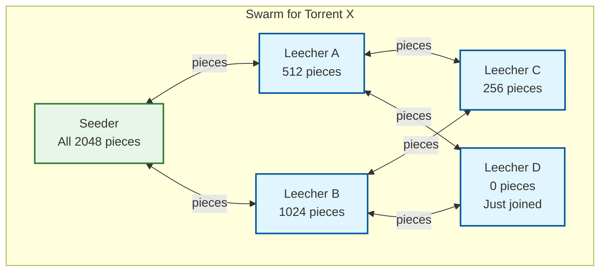
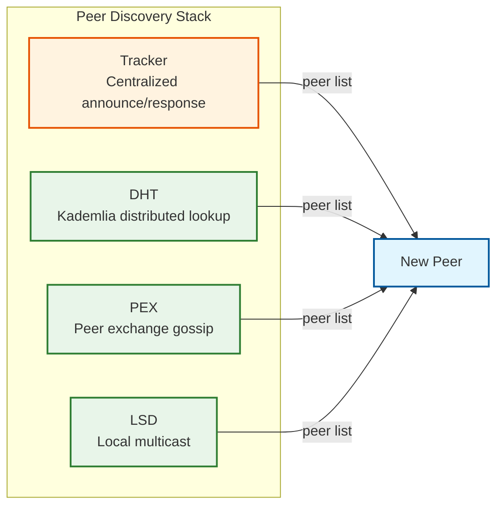

# Interview Guide — P2P File Sharing Network

## Interview Pacing (45 Minutes)

| Phase | Time | Focus | Deliverables |
|---|---|---|---|
| **1. Requirements & Scope** | 5 min | Define what "P2P file sharing" means; clarify scope | Functional requirements, scale parameters |
| **2. High-Level Architecture** | 10 min | Draw the overlay network; explain peer roles, discovery layers | Architecture diagram with tracker, DHT, peers, swarm |
| **3. Core Algorithm Deep Dive** | 12 min | Kademlia DHT lookup, rarest-first, tit-for-tat | Pseudocode or step-by-step walkthrough |
| **4. Data Integrity & Security** | 8 min | Piece hashing, Merkle trees, attack vectors | Verification pipeline, threat mitigations |
| **5. Scalability & Trade-offs** | 7 min | Self-scaling property, DHT scalability, NAT traversal | Capacity math, trade-off analysis |
| **6. Open Discussion** | 3 min | Answer interviewer questions, discuss extensions | Thoughtful responses to edge cases |

---

## Meta-Commentary: What Makes P2P Unique in Interviews

### Why This System Is Different From Every Other System Design Question

Most system design questions involve designing a centralized service: "design a URL shortener," "design a chat system," "design a notification platform." These all follow the same template: clients, load balancer, application servers, database. The P2P file sharing question breaks this template completely.

**There is no server.** The most important insight to convey early is that this system has no central data plane. Every participant is both client and server. This fundamentally changes every subsequent decision:

| Traditional System Design | P2P System Design |
|---|---|
| "How do we scale the server?" | "The system scales itself — more users = more bandwidth" |
| "Where do we store the data?" | "Data is stored across all peers — no central storage" |
| "How do we handle load?" | "Load is inherently distributed — each peer serves others" |
| "How do we ensure availability?" | "Content is available as long as any one peer has it" |
| "How do we authenticate users?" | "No authentication — content is verified by cryptographic hash" |
| "What database do we use?" | "No database — DHT is the distributed data store for discovery" |

### What Interviewers Are Really Testing

| Signal | What They Want to See |
|---|---|
| **Distributed systems thinking** | Can you reason about a system with no central coordinator? |
| **Protocol design** | Can you design a wire protocol, define message types, handle handshakes? |
| **Algorithm depth** | Can you explain Kademlia's XOR routing, rarest-first, tit-for-tat? |
| **Game theory** | Do you understand why tit-for-tat creates a Nash equilibrium? |
| **Security without authority** | Can you secure a system where no one is trusted and there's no central authority? |
| **Emergent behavior** | Do you understand how local decisions create global properties (self-scaling, piece diversity)? |

### The "Aha" Moments to Deliver

1. **"More users = faster downloads"** — This is the opposite of every other system. Say it explicitly and explain why.
2. **"The content is the address"** — Info-hash means you don't need a database mapping names to locations. The hash IS the lookup key.
3. **"Cooperation is the Nash equilibrium"** — Tit-for-tat makes selfish behavior self-defeating. This is a real-world game theory success story.
4. **"Verification without trust"** — You download from strangers but have cryptographic certainty the data is correct. Zero-trust data transfer.

---

## Key Trade-offs to Discuss

| Trade-off | Option A | Option B | Recommended Approach | Why |
|---|---|---|---|---|
| **Tracker vs DHT** | Centralized tracker (fast, reliable) | Distributed DHT (no SPOF, slower) | Hybrid: both | Speed of tracker + resilience of DHT |
| **Piece size** | Small (fine verification, high overhead) | Large (efficient, coarse verification) | 2 MiB + v2 Merkle | Efficiency of large pieces + granularity of Merkle blocks |
| **Reciprocity strictness** | Strict (only upload to uploaders) | Lenient (upload to everyone) | Tit-for-tat + optimistic unchoke | Reward cooperation + bootstrap newcomers |
| **NAT traversal aggressiveness** | UPnP only (simple) | Full stack (UPnP, hole punch, relay) | Full stack with graceful fallback | Maximize connectivity; accept complexity |
| **Encryption** | None (fastest) | Full MSE/PE (obfuscated) | Opportunistic encryption | Protect from ISP throttling without mandating overhead |
| **Piece selection initial strategy** | Rarest-first from start | Random first for bootstrap, then rarest | Random first (4 pieces), then rarest | Bootstrap new peers; prevent cold-start deadlock |
| **Connection count** | Few connections (less overhead) | Many connections (more bandwidth sources) | 50-80 connections | Balance: enough for good bandwidth, manageable overhead |

---

## Trap Questions

### Trap 1: "Why not just use a CDN?"

**What they're testing**: Do you understand the fundamental economic and architectural difference between P2P and CDN?

**Common mistake**: Dismissing CDNs or claiming P2P is always better.

**Strong answer**: CDNs and P2P solve different problems. A CDN costs money proportional to traffic — popular content is expensive to serve. P2P costs decrease with popularity — popular content serves itself. CDNs provide guaranteed performance (SLA) and work for all content types including real-time streaming. P2P performance depends on swarm health (no SLA) and works best for large, popular files. The optimal solution is often hybrid: use web seeds (CDN) to bootstrap initial availability, then let P2P handle scale. CDNs are better for low-latency, ephemeral content. P2P is better for large, popular, long-lived content distribution.

### Trap 2: "How do you handle free-riders?"

**What they're testing**: Understanding of game theory and incentive design.

**Common mistake**: Saying "we detect and ban them" (requires identity, which P2P doesn't have).

**Strong answer**: The tit-for-tat algorithm handles free-riders without requiring detection or punishment. Free-riders don't upload, so they never get unchoked by cooperating peers. They only receive bandwidth during optimistic unchoke slots (1 out of 5 unchoke slots, rotated every 30 seconds). This gives them roughly 20% of the bandwidth a cooperating peer gets — enough to eventually download, but slow enough to incentivize cooperation. In private communities, ratio enforcement (upload/download ratio at least 1.0) can eliminate free-riding entirely, but this requires persistent identity. The key insight: tit-for-tat doesn't eliminate free-riding, it makes it unprofitable. That's sufficient.

### Trap 3: "What happens when the tracker goes down?"

**What they're testing**: Understanding of the multi-layered discovery architecture.

**Common mistake**: Treating the tracker as a single point of failure.

**Strong answer**: Tracker failure triggers fallback through the discovery stack. The DHT provides fully decentralized peer discovery — it runs continuously in parallel, not just as a fallback. PEX allows connected peers to share peer lists with each other, discovering new peers without any centralized component. LSD finds peers on the same local network. For existing connections, tracker failure has zero impact — peers are already connected. For new joiners, DHT discovery adds 2-10 seconds of latency compared to a tracker, but works. This multi-layered approach means the tracker is a convenience, not a requirement. Magnet links (DHT-only discovery) have proven this at scale for years.

### Trap 4: "How do you prevent someone from distributing malicious content?"

**What they're testing**: Understanding that the protocol is content-agnostic and where responsibility lies.

**Common mistake**: Trying to add content filtering to the protocol.

**Strong answer**: The protocol is content-agnostic by design — it doesn't know or care what the content is. This is a feature, not a bug. The protocol guarantees you get exactly the content identified by the info-hash — it cannot be tampered with or substituted. Content moderation happens at the application layer: torrent indexing sites choose what to list, search engines decide what to index, and legal frameworks address specific infringements. The tracker can remove specific info-hashes, but the DHT cannot be censored. This separation of concerns (protocol handles transport integrity, application handles content policy) is architecturally sound and mirrors how TCP/IP doesn't filter content either.

### Trap 5: "How do you guarantee download speed?"

**What they're testing**: Whether you understand that P2P cannot provide SLA guarantees.

**Common mistake**: Claiming you can guarantee download speed.

**Strong answer**: You can't — and that's a fundamental trade-off of P2P. Download speed depends entirely on swarm health: how many peers have the content, their upload bandwidth, their geographic proximity, and their willingness to share. A torrent with 1,000 seeders might download at 100 Mbps; the same file with 1 seeder on a slow connection might download at 500 Kbps. This is why P2P is not suitable for latency-sensitive or SLA-requiring applications. The mitigation is web seeds — HTTP servers that provide a baseline bandwidth guarantee. Web seeds plus P2P gives you the guaranteed minimum of a CDN plus the scalability bonus of P2P.

### Trap 6: "Can two peers behind NAT connect to each other?"

**What they're testing**: Depth of networking knowledge.

**Common mistake**: Saying "no" or giving a superficial answer.

**Strong answer**: It depends on the NAT type. For full cone, restricted cone, and port-restricted cone NATs (about 85% of residential NATs), UDP hole punching achieves 82-95% success. Both peers send UDP packets to each other's NAT-mapped addresses simultaneously — the outbound packet from each side creates a NAT mapping that allows the other's packet through. This requires a rendezvous point (tracker or DHT) to exchange NAT-mapped addresses. TCP hole punching works similarly but with lower success (around 64%) because some NATs drop unexpected TCP SYN packets. For symmetric NATs on both sides (roughly 5-15% of peer pairs), direct connection is impossible — you need a relay through a third peer with a public IP. The key architectural point: NAT traversal success rate determines the effective swarm size, so optimizing this directly impacts download performance.

### Trap 7: "Why does rarest-first work better than sequential?"

**What they're testing**: Understanding of emergent distributed behavior.

**Common mistake**: Only explaining that "rarest pieces are replicated faster" without explaining why sequential is actively harmful.

**Strong answer**: Sequential downloading is catastrophic for P2P dynamics. If all 1,000 leechers download piece 0 first, then piece 1, then piece 2, they all have the same pieces and cannot help each other — everyone needs pieces they don't have. This is the "convoy effect." Rarest-first ensures that different peers download different pieces, maximizing piece diversity. After each peer gets a few pieces, every peer has something unique to offer, enabling tit-for-tat to function. Additionally, rarest-first replicates endangered pieces first (pieces held by few peers), preventing piece extinction. If a rare piece's holder leaves the swarm before anyone copies it, that piece is lost forever. Rarest-first is a distributed replication strategy that happens to also maximize download speed by enabling reciprocity.

---

## Common Mistakes

| Mistake | Why It's Wrong | Correct Approach |
|---|---|---|
| Drawing a client-server architecture | P2P has no server — every node is equal | Draw an overlay network of peers with DHT |
| Using a database for content storage | Content is stored on peer file systems, not centralized | Show distributed storage across peers |
| Ignoring the incentive problem | Without incentives, P2P devolves to free-riding | Explain tit-for-tat and why it creates cooperation |
| Treating DHT as a black box | DHT is the core algorithm — it must be explained | Walk through Kademlia: XOR distance, k-buckets, iterative lookup |
| Forgetting NAT traversal | 80%+ of peers are behind NAT — connectivity is not free | Explain UPnP, hole punching, and relay fallback |
| Assuming reliable delivery | Peers disconnect constantly; pieces can be corrupted | Explain hash verification, piece re-request, churn resilience |
| Designing for mutable content | Torrents are immutable (info-hash changes with any modification) | Explain content-addressing and why immutability enables verification |
| Overcomplicating security | P2P security is hash-based, not identity-based | Focus on piece verification, not user authentication |

---

## Questions to Ask the Interviewer

These questions demonstrate depth of understanding and help scope the design:

| Question | What It Demonstrates | How Answer Affects Design |
|---|---|---|
| "Should we support both tracker-based and trackerless operation?" | Awareness of the discovery spectrum | If trackerless-only: DHT is the only discovery mechanism, must be robust |
| "What's the expected file size range?" | Affects piece size selection and metadata overhead | Large files lead to larger pieces; small files lead to simpler protocol |
| "Is this for a public or private swarm?" | Completely changes the incentive model | Private: ratio enforcement, identity. Public: tit-for-tat, anonymous |
| "Should we support streaming or just download-to-completion?" | Affects piece selection strategy | Streaming: sequential with lookahead buffer. Download: rarest-first |
| "What percentage of peers are expected to be behind NAT?" | Scopes NAT traversal complexity | 80%+ means NAT traversal is critical. Low NAT means simpler connectivity |
| "Are we designing the protocol or the client?" | Scopes the design surface | Protocol: wire format, DHT. Client: UI, storage, scheduling |
| "Should we handle multi-file torrents?" | Adds selective download complexity | Multi-file: per-file Merkle trees, selective piece priorities |

---

## Whiteboard Walkthrough Strategy

### Step 1: Start With the Swarm Diagram

Draw a swarm of 6-8 peers as nodes in a mesh. Label one as "Seeder" (has all pieces) and the rest as "Leechers" (have partial pieces). Draw bidirectional arrows showing piece exchanges. This immediately signals to the interviewer that you understand the decentralized nature of the system.

### Step 2: Layer in Discovery

Show the three discovery mechanisms as separate layers:

### Step 3: Walk Through a Single Piece Download

This is where you demonstrate depth. Walk through:
1. Piece selection (rarest-first)
2. Block requests (16 KiB blocks, pipelined)
3. Block reception and assembly
4. SHA-256 hash verification
5. HAVE announcement to all peers

### Step 4: Explain the Choking Algorithm

Draw a timeline showing the 10-second choking round:
- Regular unchoke: top 4 uploaders
- Optimistic unchoke: 1 random peer, rotated every 30 seconds
- Show how this creates the tit-for-tat dynamic

### Step 5: Address Scale and Resilience

Walk through the self-scaling math: N peers each contributing B upload bandwidth gives N*B aggregate. Show how this inverts the traditional scaling curve. Then discuss piece extinction, NAT traversal rates, and DHT lookup latency.

---

## Extension Topics (If Time Permits)

| Extension | Key Points |
|---|---|
| **BitTorrent v2** | Merkle trees with 16 KiB leaves, per-file piece roots, SHA-256, cross-torrent dedup |
| **WebTorrent** | Browser-based P2P via WebRTC; requires signaling server; same wire protocol |
| **Super-seeding** | Initial seeder strategically sends each piece to exactly one peer for maximum diversity |
| **Content-addressable networking** | Same file has same hash regardless of which torrent it's in (v2 feature) |
| **IPFS comparison** | Content-addressed like BitTorrent but with global dedup, DAG structure, and permanent addressing |
| **Private trackers** | Invite-only, ratio enforcement, user accounts — completely different trust model |
| **Protocol obfuscation** | MSE/PE to avoid ISP throttling; arms race between detection and obfuscation |

---

## Comparison With Related Systems

| Dimension | P2P File Sharing | CDN | Distributed File System | Object Storage |
|---|---|---|---|---|
| **Data plane** | Fully decentralized | Centralized origin + edge caches | Centralized metadata, distributed data | Centralized API, distributed storage |
| **Scaling model** | Self-scaling (demand = supply) | Capacity must be provisioned | Capacity must be provisioned | Capacity must be provisioned |
| **Cost model** | Zero infrastructure cost | Cost proportional to traffic | Cost proportional to storage + ops | Cost proportional to storage + egress |
| **SLA possible** | No | Yes | Yes | Yes |
| **Verification** | Cryptographic (hash per piece) | TLS (trust the server) | Checksums (trust the system) | Checksums (trust the system) |
| **Content mutability** | Immutable (hash-addressed) | Mutable (cache invalidation) | Mutable (consistency protocols) | Mutable (versioning optional) |
| **Discovery** | DHT + tracker | DNS + anycast | Metadata server | API endpoint |
| **Fault domain** | 2 MiB piece | Entire file/origin | Chunk (64-128 MiB) | Object |
| **Best suited for** | Large, popular, long-lived files | All web content, streaming | Enterprise file storage | Cloud-native applications |

---

## Red Flags to Avoid

1. **Never say "we need a load balancer"** — there's no server to balance load across.
2. **Never say "we store files in a database"** — files are stored on peer disks.
3. **Never say "we can guarantee X Mbps"** — P2P has no SLA.
4. **Never say "the tracker is a single point of failure"** — DHT eliminates this.
5. **Never say "we ban malicious peers by IP"** — IPs are shared (NAT) and ephemeral.
6. **Never skip the incentive mechanism** — tit-for-tat is the core innovation, not an afterthought.
7. **Never forget hash verification** — it's the only trust mechanism in the system.
8. **Never design a P2P system as if peers are reliable** — they join and leave at will.
