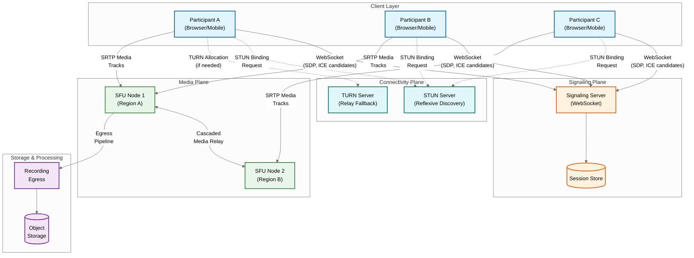
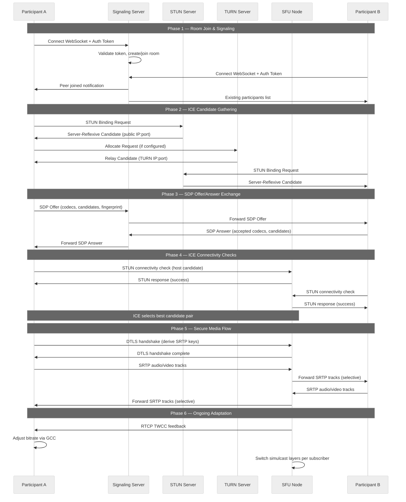

# High-Level Design — WebRTC Infrastructure

## System Architecture

The WebRTC infrastructure consists of three planes: the **signaling plane** (WebSocket-based session management), the **connectivity plane** (STUN/TURN for NAT traversal), and the **media plane** (SFU for packet forwarding). These planes operate independently but coordinate through shared session state.

---

## Call Establishment Flow

The lifecycle of a WebRTC call involves coordinated interaction across all three planes. The sequence below shows a 1:1 call where both participants connect through an SFU.

---

## Media Flow Through SFU

In a group call with N participants, the SFU operates as a selective packet router. Each participant publishes their tracks once, and the SFU forwards copies to each subscriber with per-subscriber quality selection.

**Publisher path:**
1. Client encodes video at multiple simulcast layers (e.g., 720p @ 1.5 Mbps, 360p @ 500 Kbps, 180p @ 150 Kbps)
2. Client encodes audio with Opus codec at 50 Kbps
3. RTP packets are encrypted via SRTP and sent to the SFU over the ICE-selected transport
4. SFU receives packets and stores them in a per-track jitter buffer (reorders out-of-sequence packets)

**Subscriber path:**
1. SFU determines which simulcast layer each subscriber should receive based on:
   - Subscriber's estimated available bandwidth (via TWCC/REMB feedback)
   - Subscriber's requested resolution (e.g., thumbnail vs. main view)
   - Room policy (e.g., active speaker gets high quality, others get low)
2. SFU forwards the selected layer's RTP packets to the subscriber
3. If bandwidth drops, SFU switches to a lower simulcast layer — no packet loss, just lower resolution
4. Subscriber decodes and renders each received track independently

**Key optimization — Last-N:**
For rooms with many participants, the SFU only forwards the top N active speakers' video tracks, dramatically reducing subscriber bandwidth. Audio is always forwarded for all participants (low bandwidth cost). A voice activity detector (VAD) determines active speakers.

---

## Key Architectural Decisions

### Decision 1: SFU Over MCU

| Factor | SFU | MCU |
|---|---|---|
| **CPU cost** | Minimal (packet forwarding only) | High (decode + composite + re-encode per output) |
| **Latency** | 1-5ms forwarding | 50-200ms (encoding pipeline) |
| **Scalability** | Horizontal via cascading | Vertical (limited by encoding capacity) |
| **Client flexibility** | Each subscriber receives individual tracks, can layout locally | Single composite stream, fixed layout |
| **Bandwidth** | Higher downstream (N-1 tracks) | Lower downstream (1 composite) but server bears encoding cost |
| **Simulcast/SVC** | Natural fit (per-subscriber layer selection) | Not applicable |

**Decision:** SFU is the standard for all real-time interactive use cases. MCU is reserved only for specific legacy scenarios (SIP interop) or server-side recording compositing.

### Decision 2: Simulcast Over SVC

| Factor | Simulcast | SVC |
|---|---|---|
| **Codec support** | VP8, H.264, VP9, AV1 | VP9, AV1 only (limited H.264) |
| **Encoder complexity** | Multiple independent encodes | Single layered encode |
| **SFU complexity** | Simple layer switching | Must parse and strip NAL units |
| **Bandwidth efficiency** | ~40% overhead (redundant encoding) | ~15% overhead (shared base layer) |
| **Switching artifacts** | Brief freeze during layer switch (keyframe needed) | Seamless layer dropping |
| **Client support** | Universal | Incomplete (mobile platforms lag) |

**Decision:** Simulcast as the primary approach for broad compatibility. SVC for VP9/AV1-capable endpoints where bandwidth efficiency matters (large rooms).

### Decision 3: WebSocket-Based Signaling

**Rationale:** WebSockets provide full-duplex, low-latency signaling over a persistent connection. Alternatives:
- HTTP long polling: Higher latency, connection overhead per message
- Server-Sent Events: Unidirectional (server → client only)
- gRPC streaming: Better for service-to-service; browser support limited
- Pub/sub messaging: Good for inter-server, overkill for client-server signaling

**Decision:** WebSocket for client-server signaling. Pub/sub message bus for inter-SFU coordination and signaling server clustering.

### Decision 4: Custom Protocol for SFU Cascading

**Rationale:** Using WebRTC between SFU nodes would require ICE negotiation, SDP exchange, and DTLS handshake for each inter-node connection—adding unnecessary complexity and latency. A custom protocol using serialized metadata (e.g., FlatBuffers) over direct UDP/TCP connections allows:
- Supplementing RTP packets with track identifiers and room context
- Eliminating ICE negotiation (servers have known public addresses)
- Lower connection establishment latency (no DTLS handshake needed between trusted servers)
- Simpler topology management (mesh can be preconfigured)

**Decision:** Custom relay protocol for server-to-server media forwarding; standard WebRTC for client-to-server.

---

## Architecture Pattern Checklist

| Pattern | Applied? | Implementation |
|---|---|---|
| **Hub-and-spoke** | Yes | SFU as central hub; clients as spokes with single upstream connection |
| **Cascaded mesh** | Yes | Multi-SFU topology for large rooms and multi-region deployment |
| **Event-driven** | Yes | Signaling via WebSocket events; room state changes broadcast to subscribers |
| **Pub/sub** | Yes | Inter-SFU coordination via message bus; room topic-based state distribution |
| **Circuit breaker** | Yes | TURN fallback when direct/reflexive paths fail; SFU failover on node loss |
| **Sidecar** | Yes | Recording egress as sidecar to SFU (subscribes to tracks without publishing) |
| **Edge deployment** | Yes | STUN/TURN servers at edge PoPs; SFU nodes in regional data centers |
| **Graceful degradation** | Yes | Simulcast layer downgrade; audio-only mode; last-N video limiting |

---

## Component Interaction Summary

| Component | Communicates With | Protocol | Purpose |
|---|---|---|---|
| Client | Signaling Server | WebSocket (WSS) | SDP exchange, ICE candidates, room events |
| Client | STUN Server | STUN over UDP | Reflexive candidate discovery |
| Client | TURN Server | TURN over UDP/TCP/TLS | Relay allocation and media relay |
| Client | SFU Node | SRTP/SRTCP over UDP | Encrypted media track publish/subscribe |
| SFU Node | SFU Node | Custom relay (RTP + metadata) | Cascaded media forwarding |
| SFU Node | Message Bus | Pub/sub | Room state sync, participant routing |
| Signaling Server | Session Store | Key-value reads/writes | Room metadata, participant registry |
| SFU Node | Recording Egress | Internal subscription | Track data for recording pipeline |
