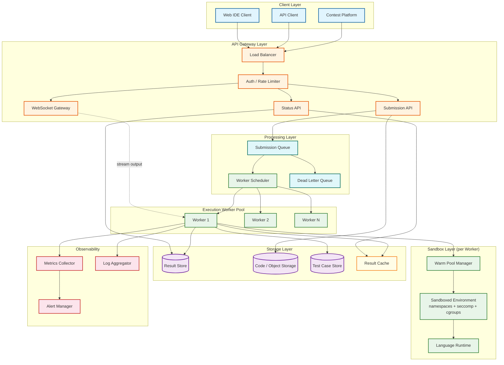
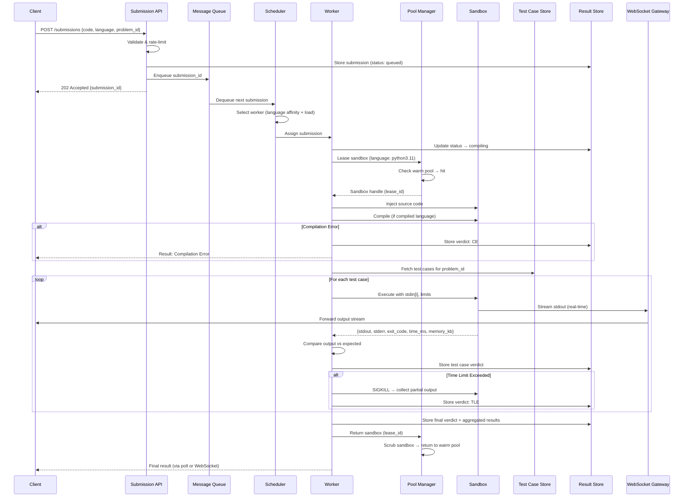

# High-Level Design — Code Execution Sandbox

## 1. System Architecture

---

## 2. Submission Lifecycle

The journey of a code submission from client to verdict follows this flow:

---

## 3. Key Architectural Decisions

### Decision 1: Isolation Technology Selection

| Option | Security | Performance | Operational Complexity | Verdict |
|---|---|---|---|---|
| **Plain Docker** | Low — shared kernel, 340 syscalls exposed | High — near-native | Low | Insufficient for untrusted code |
| **Docker + seccomp + gVisor** | High — user-space kernel intercepts syscalls | Medium — 10-30% I/O overhead | Medium | Good balance for most workloads |
| **Firecracker microVM** | Very High — hardware VM boundary, separate kernel | Medium — 125ms boot, 5MB overhead | High — kernel/rootfs management | Best for adversarial environments |
| **WASM/WASI** | High — no kernel access, capability-based | High — near-native for supported languages | Medium — limited language support | Future option; limited language coverage today |
| **nsjail** | High — namespaces + cgroups + seccomp-BPF + Kafel | High — minimal overhead | Low — single binary, protobuf config | Excellent for competitive programming |

**Selected Approach:** Tiered isolation based on trust level:
- **Tier 1 (Default):** nsjail with namespaces + cgroups v2 + seccomp-BPF — covers 90% of use cases with minimal overhead
- **Tier 2 (High Security):** gVisor (runsc) for untrusted or long-running submissions
- **Tier 3 (Maximum Isolation):** Firecracker microVM for contest environments or enterprise deployments

### Decision 2: Warm Pool Strategy

**Problem:** Creating a fresh sandbox takes 1-3 seconds (namespace setup, filesystem mount, cgroup creation). At 175 submissions/second, this latency is unacceptable.

**Solution:** Pre-warm a pool of ready-to-use sandboxes per language runtime.

| Aspect | Design Choice | Rationale |
|---|---|---|
| Pool sizing | Per-language, based on historical demand | Python pool: 200, C++: 150, Java: 100, etc. |
| Minimum pool size | 10% of peak demand per language | Guarantee warm hits for steady-state traffic |
| Maximum pool size | 150% of peak demand per language | Cap resource consumption during low traffic |
| Scrubbing on return | Full filesystem wipe, PID namespace reset, cgroup reset | Prevent cross-submission data leakage |
| Health checks | Periodic liveness probe (exec a no-op in sandbox) | Detect and replace broken sandboxes |
| Eviction | LRU eviction when total pool exceeds cluster limit | Free memory during low-demand periods |
| Replenishment | Background thread maintains pool at target size | Async creation doesn't block request path |

### Decision 3: Queue Architecture

**Problem:** Submission ingestion rate can spike 10× during contests. Workers process at a fixed rate determined by compute capacity.

**Solution:** Message queue decouples submission acceptance from execution.

| Aspect | Design Choice |
|---|---|
| Queue type | Persistent message queue with at-least-once delivery |
| Partitioning | By language (enables language-affinity worker routing) |
| Priority | Contest submissions get higher priority than practice |
| Visibility timeout | 60 seconds (if worker doesn't ACK, message re-queues) |
| Dead letter queue | After 3 failed attempts, move to DLQ for manual review |
| Ordering | Per-user FIFO within partition (prevent starvation) |
| Backpressure | If queue depth > 10,000, return 503 with retry-after header |

### Decision 4: Test Case Execution Model

| Option | Pros | Cons | Selected |
|---|---|---|---|
| **Sequential in single sandbox** | Simple; reuse compiled binary | Single test failure affects subsequent tests; harder to parallelize | Default |
| **Parallel across sandboxes** | Faster total execution; isolated failures | Higher resource usage; compilation duplicated per sandbox | For contests |
| **Sequential with early termination** | Stop on first failure; save resources | User doesn't see all failing tests | Optional |

---

## 4. Data Flow Summary

### Write Path (Submission → Execution)

1. **Client** sends code via REST API
2. **API Gateway** validates, rate-limits, authenticates
3. **Submission API** stores code in Object Storage, metadata in Result Store, enqueues submission ID
4. **Scheduler** dequeues, selects worker based on language affinity and current load
5. **Worker** leases sandbox from warm pool, injects code, compiles, executes against test cases
6. **Worker** stores per-test-case verdicts and final aggregate verdict in Result Store

### Read Path (Result Retrieval)

1. **Client** polls `GET /submissions/{id}` or listens on WebSocket
2. **Status API** checks Result Cache → Result Store
3. Returns submission status, per-test-case verdicts, execution metrics

### Streaming Path (Real-Time Output)

1. **Client** opens WebSocket connection to WebSocket Gateway
2. **Worker** pipes sandbox stdout/stderr to WebSocket Gateway via internal pub/sub
3. **Gateway** forwards output chunks to client with < 100ms latency
4. Connection closes when execution completes or times out

---

## 5. Architecture Pattern Checklist

| Pattern | Application in This System |
|---|---|
| **Queue-Based Load Leveling** | Message queue absorbs submission spikes; workers consume at steady rate |
| **Competing Consumers** | Multiple workers consume from the same queue; work is distributed |
| **Bulkhead** | Separate worker pools per language prevent one language's issues from affecting others |
| **Circuit Breaker** | If a language runtime consistently fails, stop scheduling to that pool and alert |
| **Sidecar** | Monitoring agent runs alongside worker, collecting metrics and logs |
| **Strangler Fig** | Migrate from Docker-based isolation to gVisor/Firecracker incrementally |
| **Ephemeral Infrastructure** | Sandboxes are created, used once, destroyed—no persistent state |
| **Object Pool** | Warm pool of pre-created sandboxes, leased and returned |
| **Defense in Depth** | Multiple overlapping security layers (namespaces, seccomp, cgroups, read-only FS) |
