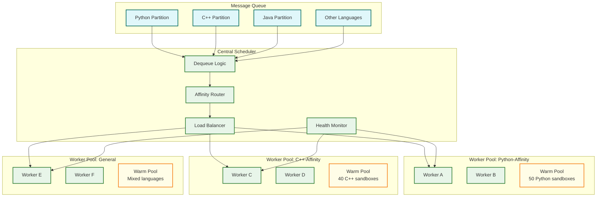

# Deep Dive & Bottlenecks — Code Execution Sandbox

## Deep Dive 1: Sandbox Isolation Layer

### Why This Component Is Critical

The sandbox isolation layer is the **single most security-critical component** in the entire system. A failure here doesn't cause data inconsistency or degraded latency—it potentially gives an attacker arbitrary code execution on the host machine, access to other users' submissions, and a foothold into the platform's infrastructure. Unlike most distributed systems where failures are measured in SLO violations, a sandbox escape is a catastrophic security incident with legal, reputational, and operational consequences.

### Internal Architecture

The isolation layer implements defense-in-depth with five overlapping security boundaries:

```
┌─────────────────────────────────────────────────────┐
│ Layer 5: Network Isolation                          │
│   Empty network namespace — no interfaces, no DNS   │
│ ┌─────────────────────────────────────────────────┐ │
│ │ Layer 4: Syscall Filtering (seccomp-BPF)        │ │
│ │   Allowlist of ~50 syscalls per language         │ │
│ │ ┌─────────────────────────────────────────────┐ │ │
│ │ │ Layer 3: Resource Limits (cgroups v2)        │ │ │
│ │ │   CPU, memory, PID count, disk I/O           │ │ │
│ │ │ ┌─────────────────────────────────────────┐ │ │ │
│ │ │ │ Layer 2: Filesystem Isolation            │ │ │ │
│ │ │ │   Read-only root + tmpfs workspace       │ │ │ │
│ │ │ │ ┌─────────────────────────────────────┐ │ │ │ │
│ │ │ │ │ Layer 1: Process Isolation           │ │ │ │ │
│ │ │ │ │   PID/mount/user/IPC namespaces      │ │ │ │ │
│ │ │ │ │   UID 65534, no capabilities         │ │ │ │ │
│ │ │ │ └─────────────────────────────────────┘ │ │ │ │
│ │ │ └─────────────────────────────────────────┘ │ │ │
│ │ └─────────────────────────────────────────────┘ │ │
│ └─────────────────────────────────────────────────┘ │
└─────────────────────────────────────────────────────┘
```

#### Layer 1: Process Isolation (Linux Namespaces)

| Namespace | What It Isolates | Attack It Prevents |
|---|---|---|
| **PID** | Process visibility | Cannot see or signal other users' processes |
| **Mount** | Filesystem view | Cannot access host filesystem outside explicit mounts |
| **User** | UID/GID mapping | Container root (UID 0) maps to host nobody (UID 65534) |
| **Network** | Network stack | No network interfaces = no exfiltration, no C2, no lateral movement |
| **IPC** | Shared memory, semaphores | Cannot communicate with processes outside namespace |
| **UTS** | Hostname | Cannot discover host identity |
| **Cgroup** | Cgroup visibility | Cannot see or manipulate other cgroups |

**Critical detail:** User namespace is essential because without it, a process running as root inside the container IS root on the host. With user namespace mapping, container UID 0 → host UID 65534 (nobody), so even a root exploit inside the sandbox gains no host privileges.

#### Layer 2: Filesystem Isolation

```
Filesystem Layout Inside Sandbox:
/                       READ-ONLY    (language runtime image — immutable)
├── usr/bin/            READ-ONLY    (compilers, interpreters)
├── usr/lib/            READ-ONLY    (shared libraries)
├── workspace/          READ-WRITE   (tmpfs, 10MB limit — user code lives here)
├── tmp/                READ-WRITE   (tmpfs, 5MB limit — temp files)
└── dev/
    ├── null            Allowed
    ├── zero            Allowed
    ├── urandom         Allowed
    └── (nothing else)

NOT MOUNTED (attack surface reduction):
/proc                   — Prevents reading host info (/proc/1/environ, /proc/self/maps)
/sys                    — Prevents reading hardware info, kernel parameters
/dev/shm               — Prevents shared memory IPC outside namespace
```

**Why /proc is dangerous:** An unrestricted /proc allows reading environment variables of the sandbox orchestrator (`/proc/1/environ`), discovering the host's network configuration (`/proc/net/tcp`), and in some configurations, writing to `/proc/sysrq-trigger` to crash the host. Blocking /proc entirely eliminates this entire attack class.

#### Layer 3: Resource Limits (cgroups v2)

| Resource | Limit | Enforcement Mechanism | What Happens on Violation |
|---|---|---|---|
| **CPU time** | Per-problem (default 2s) | cgroup `cpu.max` + wall-clock timer | SIGKILL after grace period |
| **Memory** | Per-problem (default 256MB) | cgroup `memory.max` | OOM killer invokes SIGKILL |
| **Process count** | 64 | cgroup `pids.max` | `fork()` returns EAGAIN |
| **Disk write** | 10MB | tmpfs size limit | `write()` returns ENOSPC |
| **Open files** | 256 | rlimit `RLIMIT_NOFILE` | `open()` returns EMFILE |
| **Stack size** | 8MB | rlimit `RLIMIT_STACK` | SIGSEGV on overflow |
| **File size** | 10MB | rlimit `RLIMIT_FSIZE` | SIGXFSZ on violation |

**Fork bomb defense in detail:** With `pids.max=64`, a fork bomb like `:(){ :|:& };:` will create 63 child processes (PID 1 is the init process) and then every subsequent `fork()` call returns EAGAIN. The bomb is contained, but 64 processes all spinning consume CPU. The CPU time limit (cgroup `cpu.max`) ensures the entire cgroup is throttled and eventually killed by the wall-clock timer. The combination of PID limit + CPU limit + wall-clock timeout provides triple defense.

#### Layer 4: Syscall Filtering (seccomp-BPF)

```
SECCOMP PROFILE for Python:

DEFAULT_ACTION: KILL_PROCESS

ALLOWED_SYSCALLS (approximately 50):
    // File operations
    read, write, open, close, openat, fstat, lstat, stat
    lseek, mmap, mprotect, munmap, brk

    // Process lifecycle (restricted)
    exit, exit_group
    clone (WITHOUT CLONE_NEWUSER, CLONE_NEWNS, CLONE_NEWPID flags)
    wait4, getpid, getppid

    // Memory
    mmap, munmap, mprotect, mremap, madvise

    // I/O
    read, write, readv, writev, pread64, pwrite64
    dup, dup2, pipe, pipe2
    select, poll, epoll_create, epoll_ctl, epoll_wait

    // Misc safe
    clock_gettime, gettimeofday, nanosleep
    getrandom, rt_sigaction, rt_sigprocmask

BLOCKED (notable dangerous syscalls):
    execve          — Prevent executing arbitrary binaries
    ptrace          — Prevent debugging/tracing other processes
    mount, umount   — Prevent filesystem manipulation
    io_uring_*      — Recent kernel attack surface
    clone3          — Prevent nested namespace creation
    personality     — Prevent disabling ASLR
    socket          — Prevent network access (redundant with netns, defense in depth)
    keyctl          — Prevent kernel keyring access
    bpf             — Prevent BPF program loading
    userfaultfd     — Prevent TOCTOU exploitation
    perf_event_open — Prevent performance counter side-channels
```

**Language-specific profiles matter:** A Python program needs `execve` once (to start the interpreter) but a C program's binary doesn't need it at all. Java needs more memory-related syscalls for JVM heap management. Maintaining per-language seccomp profiles reduces attack surface compared to a one-size-fits-all profile.

#### Layer 5: Network Isolation

The sandbox's network namespace contains **no network interfaces at all**—not even loopback. This means:
- No outbound connections (prevents data exfiltration, C2 communication)
- No DNS resolution (prevents DNS tunneling)
- No listening sockets (prevents reverse shells)
- No loopback (prevents localhost attacks against host services)

**Why not just firewall rules?** Firewall rules (iptables/nftables) operate at the network level and can be complex to configure correctly. An empty network namespace provides **zero network surface** by construction—there is nothing to misconfigure.

### Failure Modes

| Failure | Detection | Recovery |
|---|---|---|
| **Sandbox escape** | Host intrusion detection, anomalous process creation | Immediately quarantine host, rotate all secrets, forensic investigation |
| **OOM kill** | cgroup memory event notification | Verdict: MLE; sandbox scrubbed and returned to pool |
| **Wall-clock timeout** | External timer fires SIGKILL | Verdict: TLE; sandbox scrubbed and returned to pool |
| **Seccomp violation** | SIGKILL with `SECCOMP_RET_KILL_PROCESS` | Verdict: RE; log violation for security analysis |
| **Filesystem full** | `write()` returns ENOSPC | Verdict: RE (output limit exceeded); sandbox scrubbed |
| **Sandbox creation failure** | nsjail returns error | Cold start fallback; if persistent, take worker offline |

---

## Deep Dive 2: Worker Pool & Scheduling

### Why This Component Is Critical

The worker pool determines system throughput, latency, and resource efficiency. Under-provisioning causes queue buildup and violates latency SLOs. Over-provisioning wastes expensive compute resources. The scheduling algorithm must balance language affinity (warm pool hits), load distribution, and fairness across users.

### Internal Architecture



### Scheduling Strategy: Language-Affinity with Overflow

The key insight is that warm pool hits (< 100ms sandbox lease) are 30-60× faster than cold starts (3s sandbox creation). Language affinity routing maximizes warm pool hits:

1. **Partition the queue by language** — Each major language gets its own queue partition
2. **Assign worker pools by language affinity** — Python-affinity workers maintain larger Python warm pools
3. **Overflow to general pool** — When affinity workers are saturated, spill to general-purpose workers
4. **Dynamic rebalancing** — Periodically adjust pool sizes based on demand (every 5 minutes)

### Worker Lifecycle

```
ALGORITHM WorkerLifecycle:

    FUNCTION run():
        register_with_scheduler()
        initialize_warm_pool(affinity_languages)

        LOOP FOREVER:
            // Step 1: Claim a submission from queue
            submission = queue.poll(
                partitions: affinity_languages,    // Prefer affinity languages
                fallback: all_languages,           // Accept any if idle > 5s
                timeout: 30_seconds                // Long-poll
            )

            IF submission IS NULL:
                CONTINUE    // No work available; long-poll again

            // Step 2: Execute submission
            TRY:
                metrics.start_timer("execution")
                execute_submission(submission)
                metrics.stop_timer("execution")
                queue.ack(submission)
            CATCH exception:
                log.error("Execution failed", submission.id, exception)
                queue.nack(submission)     // Return to queue for retry
                IF exception IS SecurityViolation:
                    alert.page("SECURITY: Potential sandbox escape", submission)
                    self.quarantine()      // Take self offline for investigation

            // Step 3: Health check
            IF memory_usage() > 90% OR cpu_load() > 0.95:
                drain_mode()    // Stop accepting new work, finish current
                restart()       // Clean restart to prevent resource leaks
```

### Failure Modes

| Failure | Detection | Impact | Recovery |
|---|---|---|---|
| **Worker crash** | Heartbeat timeout (30s) | In-flight submission lost | Message visibility timeout → auto-retry on another worker |
| **Worker OOM** | Kernel OOM killer | Worker + all in-flight work killed | Auto-restart by orchestrator; messages requeue |
| **Scheduler failure** | Health check from workers | No new submissions dispatched | Workers fall back to direct queue consumption |
| **Queue partition lag** | Consumer lag metric | Specific language queue builds up | Auto-scale workers for that language |
| **Warm pool exhaustion** | Pool size metric = 0 | Cold starts for all submissions (3s latency) | Replenisher creates new sandboxes; alert if sustained |

---

## Deep Dive 3: Resource Limit Enforcement

### Why This Component Is Critical

Every submission is potentially adversarial. Without robust resource enforcement, a single malicious submission can:
- **Fork bomb:** Exhaust process table, crash the host
- **Memory bomb:** Allocate all available RAM, trigger host OOM
- **Disk bomb:** Fill disk, preventing logging and other submissions
- **CPU starvation:** Infinite loop consuming all CPU, starving other sandboxes
- **File descriptor bomb:** Open thousands of files, exhaust kernel fd table

The resource enforcement layer must guarantee that **no submission can consume more than its allocated quota**, regardless of what code it runs.

### Resource Enforcement Matrix

```
┌──────────────────────────────────────────────────────────────────────┐
│                    RESOURCE ENFORCEMENT MATRIX                       │
├─────────────┬──────────────┬───────────────┬─────────────────────────┤
│ Attack      │ Primary      │ Secondary     │ Tertiary                │
│ Vector      │ Defense      │ Defense       │ Defense                 │
├─────────────┼──────────────┼───────────────┼─────────────────────────┤
│ Fork bomb   │ pids.max=64  │ CPU time cap  │ Wall-clock SIGKILL      │
│ Memory bomb │ memory.max   │ OOM SIGKILL   │ Swap disabled           │
│ Disk bomb   │ tmpfs size   │ RLIMIT_FSIZE  │ Read-only root FS       │
│ CPU hog     │ cpu.max      │ Wall-clock    │ SIGKILL after timeout   │
│ FD bomb     │ RLIMIT_NOFILE│ seccomp       │ tmpfs limits open files │
│ Net abuse   │ Empty netns  │ seccomp       │ No DNS resolver         │
│ Infinite    │ Wall-clock   │ CPU time      │ SIGKILL                 │
│ loop        │ timer        │ cgroup limit  │                         │
└─────────────┴──────────────┴───────────────┴─────────────────────────┘
```

### Wall-Clock vs CPU-Clock Enforcement

This distinction is critical and often misunderstood:

- **CPU time** (`cpu.max` in cgroups v2): Measures actual CPU cycles consumed. A `sleep(100)` consumes near-zero CPU time. This catches infinite computation but not infinite I/O-waiting or sleeping.
- **Wall-clock time** (external timer): Measures real elapsed time. Catches everything, including sleep and I/O. This is the last line of defense.

**Why you need both:**
- A submission that does `while(true) {}` hits CPU time limit quickly → TLE verdict
- A submission that does `while(true) { sleep(1); }` consumes almost zero CPU time but runs forever → wall-clock timer catches it
- A submission that does heavy I/O (reading /dev/zero in a loop) consumes moderate CPU but could run indefinitely → wall-clock timer catches it

```
ALGORITHM enforce_time_limits(sandbox, cpu_limit_ms, wall_limit_ms):

    // Set cgroup CPU limit
    sandbox.cgroup.write("cpu.max", "{cpu_limit_ms}000 1000000")  // microseconds per period

    // Start external wall-clock timer
    timer = start_timer(wall_limit_ms + GRACE_PERIOD)

    // Monitor execution
    WHEN sandbox.process_exits:
        timer.cancel()
        cpu_used = sandbox.cgroup.read("cpu.stat").usage_usec / 1000
        RETURN {
            timed_out: false,
            cpu_time_ms: cpu_used,
            wall_time_ms: elapsed()
        }

    WHEN timer.fires:
        // Graceful: SIGTERM first, then SIGKILL
        sandbox.signal(SIGTERM)
        WAIT(500ms)
        IF sandbox.process_still_running:
            sandbox.signal(SIGKILL)  // Force kill

        cpu_used = sandbox.cgroup.read("cpu.stat").usage_usec / 1000
        RETURN {
            timed_out: true,
            timeout_type: cpu_used > cpu_limit_ms ? "CPU" : "WALL",
            cpu_time_ms: cpu_used,
            wall_time_ms: elapsed()
        }
```

### Memory Enforcement Deep Dive

```
ALGORITHM enforce_memory_limit(sandbox, memory_limit_kb):

    // Set hard memory limit via cgroup v2
    sandbox.cgroup.write("memory.max", memory_limit_kb * 1024)

    // Disable swap to prevent swapping instead of OOM
    sandbox.cgroup.write("memory.swap.max", "0")

    // Register for OOM events
    sandbox.cgroup.watch("memory.events", ON_OOM)

    FUNCTION ON_OOM():
        // Kernel OOM killer sends SIGKILL to largest process in cgroup
        // We detect this via:
        // 1. Process exit with signal 9 (SIGKILL)
        // 2. memory.events shows oom_kill count > 0
        oom_count = sandbox.cgroup.read("memory.events").oom_kill
        IF oom_count > 0:
            peak_memory = sandbox.cgroup.read("memory.peak") / 1024
            RETURN MLE_VERDICT(peak_memory_kb=peak_memory)

    // Monitoring: track memory growth for debugging
    PERIODICALLY(every=100ms):
        current = sandbox.cgroup.read("memory.current") / 1024
        metrics.record("sandbox.memory_kb", current, sandbox.id)
```

### Process Count Enforcement (Fork Bomb Prevention)

```
ALGORITHM enforce_pid_limit(sandbox, max_pids):

    // Set cgroup PID limit
    sandbox.cgroup.write("pids.max", max_pids)

    // What happens during a fork bomb:
    // 1. User code calls fork() rapidly
    // 2. After max_pids processes exist in cgroup, fork() returns EAGAIN
    // 3. Existing processes continue running (consuming CPU)
    // 4. CPU time limit eventually triggers SIGKILL to all processes in cgroup
    // 5. Wall-clock timer ensures cleanup even if CPU accounting is delayed

    // Additional protection: seccomp blocks clone3 with CLONE_NEWPID
    // This prevents creating nested PID namespaces that might escape the cgroup PID limit
```

---

## 4. Concurrency Challenges

### Challenge 1: Warm Pool Race Conditions

Multiple workers may simultaneously request sandboxes from the same language pool. Without synchronization, two workers could lease the same sandbox.

```
SOLUTION: Atomic dequeue with CAS (Compare-And-Swap)

FUNCTION lease_from_pool(language):
    LOOP:
        head = pools[language].peek()
        IF head IS NULL:
            RETURN NULL    // Pool empty, cold start needed
        IF pools[language].CAS_DEQUEUE(head):
            RETURN head    // Successfully leased
        // CAS failed — another worker leased this sandbox; retry
```

### Challenge 2: Zombie Process Cleanup

A sandboxed process might fork children that become orphans (parent exits, children continue). These zombies consume PID slots and potentially CPU.

```
SOLUTION: cgroup-level process cleanup

FUNCTION cleanup_sandbox(sandbox):
    // Step 1: Freeze the cgroup (prevent new process creation)
    sandbox.cgroup.write("cgroup.freeze", "1")

    // Step 2: Kill all processes in the cgroup
    sandbox.cgroup.write("cgroup.kill", "1")    // cgroups v2 feature

    // Step 3: Wait for all processes to exit
    WHILE sandbox.cgroup.read("pids.current") > 0:
        WAIT(10ms)
        IF elapsed > 5s:
            log.error("Zombie processes in sandbox", sandbox.id)
            destroy_sandbox(sandbox)    // Nuclear option: destroy entire sandbox
            RETURN

    // Step 4: Unfreeze (for reuse in warm pool)
    sandbox.cgroup.write("cgroup.freeze", "0")
```

### Challenge 3: Output Streaming Under Memory Pressure

A program might produce enormous stdout (e.g., printing in an infinite loop). Without limits, this could exhaust worker memory buffering the output.

```
SOLUTION: Bounded output buffer with truncation

CONSTANT MAX_OUTPUT_SIZE = 64 * 1024    // 64KB per stream

FUNCTION capture_output(sandbox, stream_listener):
    buffer = BoundedBuffer(MAX_OUTPUT_SIZE)
    truncated = false

    WHILE sandbox.is_running:
        chunk = sandbox.read_stdout(timeout=100ms)
        IF chunk IS NOT NULL:
            IF buffer.remaining() >= chunk.length:
                buffer.append(chunk)
                IF stream_listener:
                    stream_listener.send(chunk)
            ELSE:
                truncated = true
                // Stop reading but keep sandbox running (it may still be computing)
                // Discard further output to prevent worker memory pressure

    RETURN OutputResult(data=buffer.contents(), truncated=truncated)
```

---

## 5. Bottleneck Analysis

| Bottleneck | Symptom | Root Cause | Mitigation |
|---|---|---|---|
| **Warm pool exhaustion** | P99 latency spikes from < 1s to > 3s | Submission spike exceeds warm pool for a language | Over-provision warm pool by 50%; auto-scale based on pool hit rate |
| **Queue depth explosion** | Monotonically increasing queue depth | Worker throughput < submission rate during contest | Pre-scale workers before scheduled contests; auto-scale on queue depth > 1,000 |
| **Sandbox scrub latency** | Warm pool return takes > 500ms | Large temporary files created by user code | Cap tmpfs size aggressively (10MB); parallelize scrub operations |
| **Compilation bottleneck** | C++/Rust submissions dominate execution time | Compilation takes 5-10s for template-heavy code | Compilation cache (hash-based); separate compilation workers |
| **Test case fetch latency** | 200-500ms overhead per submission | Test cases read from remote storage | Local test case cache on workers; pre-fetch for popular problems |
| **Result store write contention** | Write latency spikes during contests | Hot partition on problem_id during contest | Write to local buffer, batch-flush every 1s; use write-optimized store |
| **WebSocket connection exhaustion** | New stream connections rejected | 10K+ concurrent streaming users | Horizontal scale WebSocket gateways; connection limit per user |
| **Memory fragmentation on workers** | Worker memory grows over time despite limits | Sandbox creation/destruction causes kernel memory fragmentation | Periodic worker restart (every 4 hours); cgroup memory reclaim |
