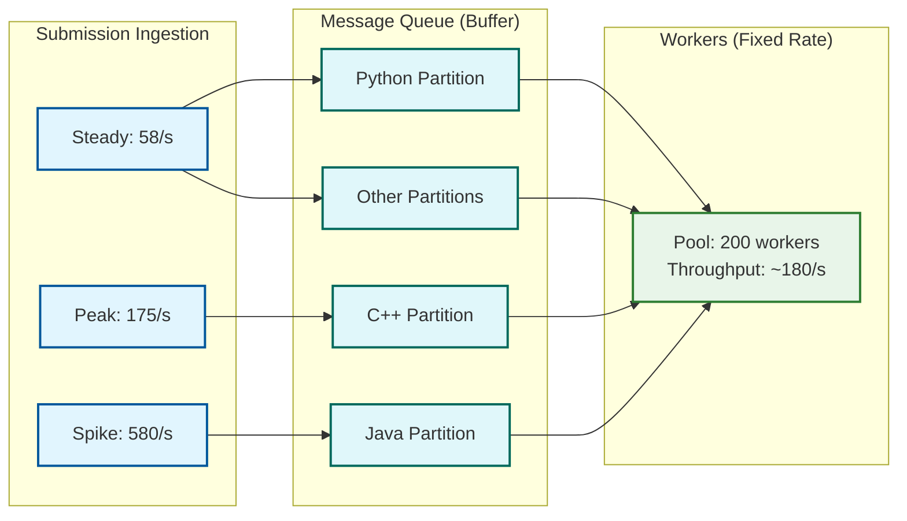
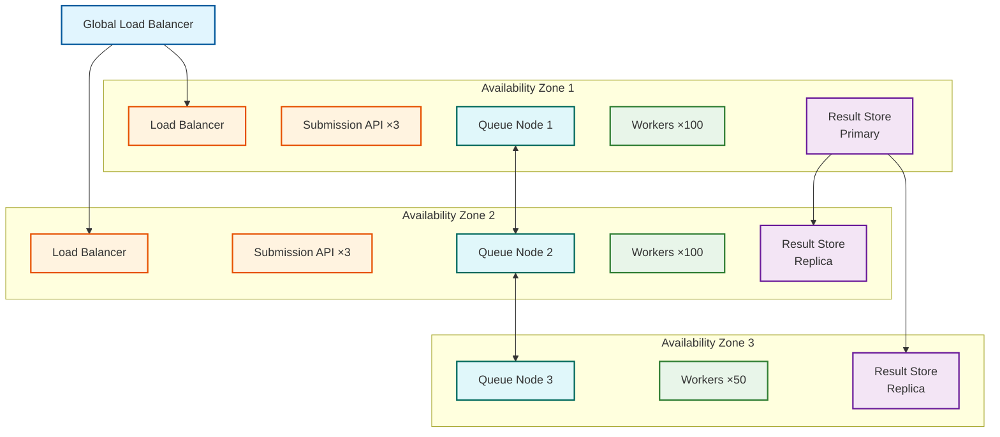

# Scalability & Reliability — Code Execution Sandbox

## 1. Scalability

### 1.1 Worker Pool Auto-Scaling

The execution worker pool is the primary compute bottleneck. Scaling decisions must balance latency SLOs against infrastructure cost, with the added constraint that workers need warm sandboxes to be effective.

#### Scaling Signals

| Signal | Metric | Scale-Up Threshold | Scale-Down Threshold | Rationale |
|---|---|---|---|---|
| **Queue depth** | Messages waiting per language partition | > 500 for 2 minutes | < 50 for 10 minutes | Direct indicator of insufficient capacity |
| **Queue wait time** | P95 time from enqueue to dequeue | > 2s sustained | < 200ms for 15 minutes | SLO-aligned signal |
| **Worker CPU utilization** | Average across pool | > 75% for 5 minutes | < 30% for 15 minutes | Compute saturation indicator |
| **Warm pool hit rate** | Lease hits / total leases | < 80% for 5 minutes | N/A (don't scale down on high hit rate) | Indicates demand exceeds pre-warmed capacity |
| **Cold start rate** | Cold starts / total executions | > 20% for 5 minutes | < 5% for 15 minutes | Users experiencing degraded latency |

#### Auto-Scaling Algorithm

```
ALGORITHM WorkerAutoScaler:

    CONSTANTS:
        SCALE_UP_COOLDOWN   = 2 minutes
        SCALE_DOWN_COOLDOWN = 10 minutes
        MAX_SCALE_STEP      = 20%              // Max workers to add/remove per cycle
        MIN_WORKERS         = 10               // Never go below this
        MAX_WORKERS         = 2000             // Hard ceiling

    FUNCTION evaluate_scaling():
        // Run every 60 seconds

        current_workers = get_active_worker_count()
        queue_depth     = get_total_queue_depth()
        p95_wait        = get_queue_wait_p95()
        avg_cpu         = get_avg_worker_cpu()
        warm_hit_rate   = get_warm_pool_hit_rate()

        // --- Scale-up logic (any trigger is sufficient) ---
        IF queue_depth > 500 OR p95_wait > 2000 OR avg_cpu > 0.75:
            IF time_since_last_scale_up > SCALE_UP_COOLDOWN:
                // Calculate desired workers based on queue drain rate
                avg_execution_time = get_avg_execution_time()
                needed = queue_depth / (1000 / avg_execution_time)
                additional = MIN(needed, current_workers * MAX_SCALE_STEP)
                additional = MAX(additional, 5)    // Add at least 5
                target = MIN(current_workers + additional, MAX_WORKERS)

                scale_to(target)
                log("Scaling UP", current_workers, "→", target,
                    "reason: queue=", queue_depth, "wait=", p95_wait, "cpu=", avg_cpu)

        // --- Scale-down logic (all conditions must be met) ---
        ELSE IF queue_depth < 50 AND p95_wait < 200 AND avg_cpu < 0.30:
            IF time_since_last_scale_down > SCALE_DOWN_COOLDOWN:
                reduction = current_workers * 0.10    // Remove 10% at a time
                target = MAX(current_workers - reduction, MIN_WORKERS)

                // Drain before removal: stop accepting new work, finish current
                mark_for_drain(select_workers(reduction))
                log("Scaling DOWN", current_workers, "→", target)

    FUNCTION scale_to(target_count):
        // New workers need warm sandboxes; stagger startup
        current = get_active_worker_count()
        deficit = target_count - current

        FOR batch IN chunks(deficit, size=10):
            launch_workers(batch)
            // Allow warm pool to populate before next batch
            WAIT(15 seconds)

    FUNCTION mark_for_drain(workers):
        FOR worker IN workers:
            worker.set_draining(true)
            // Worker finishes current submission, then shuts down
            // Warm pool sandboxes are redistributed to remaining workers
```

#### Pre-Scaling for Predictable Events

| Event Type | Pre-Scale Strategy | Lead Time |
|---|---|---|
| **Scheduled contest** | Scale to estimated_participants × 3 submissions/min ÷ throughput_per_worker | 15 minutes before start |
| **Daily peak hours** | Scale based on historical hourly pattern | 30 minutes before predicted ramp |
| **Platform promotion** | Manual scale override based on marketing estimates | 1 hour before campaign |
| **Weekday/weekend pattern** | Automated schedule: weekday = 100%, weekend = 60% | Midnight transition |

---

### 1.2 Warm Pool Sizing Strategy

The warm pool is the critical performance accelerator—a warm lease completes in < 100ms while a cold start takes 1-3 seconds. Pool sizing is a queuing theory problem: maintain enough pre-warmed sandboxes to serve P95 demand without wasting idle resources.

#### Per-Language Pool Sizing

```
ALGORITHM WarmPoolSizer:

    FUNCTION calculate_target(language):
        // Based on recent demand with safety margin

        recent_rate    = get_lease_rate_last_5min(language)     // leases/second
        avg_lease_time = get_avg_lease_duration(language)       // seconds
        scrub_time     = get_avg_scrub_duration(language)       // seconds

        // Little's Law: concurrent leases = arrival_rate × service_time
        steady_state = recent_rate * (avg_lease_time + scrub_time)

        // Add safety margin for bursts
        burst_margin = recent_rate * 10    // 10 seconds of burst buffer
        target = steady_state + burst_margin

        // Clamp to reasonable bounds
        RETURN CLAMP(target, MIN_POOL_SIZE, MAX_POOL_SIZE_PER_LANGUAGE)
```

#### Tiered Language Strategy

| Tier | Languages | Warm Pool Strategy | Pool Size | Cold Start Tolerance |
|---|---|---|---|---|
| **Tier 1 (Hot)** | Python, C++, Java, JavaScript | Always-warm; large pool; priority replenishment | 100-500 per language | < 1% cold starts |
| **Tier 2 (Warm)** | Go, Rust, C#, Ruby, PHP, Kotlin | Moderate pool; replenish on demand | 20-100 per language | < 10% cold starts |
| **Tier 3 (Cold)** | Haskell, Scala, Perl, Lua, 50+ others | No dedicated pool; created on demand | 0-10 per language | 100% cold starts acceptable |

#### Memory Budget Allocation

| Component | Per-Sandbox Memory | Pool Size (Tier 1) | Total Memory |
|---|---|---|---|
| Python 3.11 sandbox (idle) | 80 MB | 300 | 24 GB |
| C++ sandbox (idle) | 40 MB | 200 | 8 GB |
| Java sandbox (idle, JVM pre-loaded) | 200 MB | 150 | 30 GB |
| JavaScript sandbox (idle) | 60 MB | 150 | 9 GB |
| **Total Tier 1** | — | 800 | **71 GB** |
| Tier 2 (all languages) | Varies | 500 total | ~40 GB |
| **Grand Total** | — | 1,300 | **~111 GB** |

---

### 1.3 Multi-Language Runtime Caching

Supporting 60+ languages requires an efficient runtime image management strategy. Each language runtime is packaged as an immutable container image.

#### Image Layer Architecture

```
┌─────────────────────────────────────────────┐
│        Language-Specific Layer               │
│   (compiler, stdlib, language packages)      │
│   Python: 180MB | C++: 250MB | Java: 300MB   │
├─────────────────────────────────────────────┤
│        Common Base Layer                     │
│   (glibc, coreutils, CA certs, timezone)     │
│   Size: 50MB (shared across all languages)   │
├─────────────────────────────────────────────┤
│        Minimal OS Layer                      │
│   (stripped Linux userspace)                 │
│   Size: 20MB (shared across all languages)   │
└─────────────────────────────────────────────┘
```

| Strategy | Description | Benefit |
|---|---|---|
| **Shared base layers** | All language runtimes share OS + common layer | 70MB saved per language (60 languages = 4.2GB total savings) |
| **Copy-on-write filesystem** | Overlay filesystem for writable layers | Sandbox creation doesn't duplicate read-only layers |
| **Local image cache** | Workers cache pulled images on local disk | Avoids registry pull on every cold start |
| **Image pre-pull** | New workers pull all Tier 1 images at startup | First submission doesn't incur pull latency |
| **Version pinning** | Compiler versions pinned and immutable | Reproducible builds; no surprise breakages |
| **Rolling updates** | New image versions deployed to 10% of workers first | Canary detection of bad runtime images |

---

### 1.4 Queue-Based Load Leveling

The message queue is the core shock absorber between unpredictable submission rates and fixed worker capacity.

#### Queue Architecture for Burst Absorption



#### Backpressure Mechanism

| Queue Depth | Response | User Impact |
|---|---|---|
| **0-1,000** | Normal processing | P95 wait < 1s |
| **1,000-5,000** | Trigger auto-scaling; extend estimated wait time in response | P95 wait 1-5s; user sees "high demand" indicator |
| **5,000-10,000** | Throttle low-priority submissions; reduce per-user concurrency | Free-tier users limited to 1 concurrent submission |
| **> 10,000** | Return 503 with Retry-After header for non-contest submissions | Practice submissions temporarily rejected; contest submissions still accepted |

---

### 1.5 Horizontal Scaling of the Submission API

The submission API tier is stateless and scales independently from the worker pool.

| Component | Scaling Strategy | Bottleneck |
|---|---|---|
| **Load balancer** | DNS-based global load balancing + layer-7 regional LBs | Connection limits per instance |
| **Submission API** | Horizontal pod auto-scaling on request rate and CPU | JSON validation and object storage writes |
| **WebSocket Gateway** | Scale on connection count (1 instance per 10K connections) | File descriptor limits, memory per connection |
| **Status API** | Horizontal scaling with result cache in front | Cache miss rate to result store |
| **Rate limiter** | Distributed counter (sliding window per user) | Shared state synchronization |

---

### 1.6 Storage Scaling for Submission History

| Data Type | Growth Rate | Storage Strategy | Retention |
|---|---|---|---|
| **Source code** | 10 GB/day (5M × 2KB) | Object storage with lifecycle policies | 90 days hot → archive |
| **Execution results** | 25 GB/day (5M × 5KB) | Document store with TTL | 90 days, then compact to metadata-only |
| **Test case data** | Static (changes with problem updates) | Distributed cache + object storage | Indefinite |
| **Execution metrics** | 5 GB/day (time-series) | Time-series database with downsampling | 30 days raw → 1 year aggregated |
| **Audit logs** | 2 GB/day | Append-only log storage | 1 year (compliance requirement) |

---

## 2. Reliability & Fault Tolerance

### 2.1 Worker Crash Recovery

Workers are the most failure-prone component—they execute untrusted code and manage complex sandbox lifecycles.

#### Failure Detection & Recovery

```
ALGORITHM WorkerRecovery:

    // Supervisor monitors all workers via heartbeat
    FUNCTION monitor_workers():
        FOR worker IN registered_workers:
            IF time_since_last_heartbeat(worker) > 30 seconds:
                mark_unhealthy(worker)

                // In-flight submissions will be retried via queue visibility timeout
                // No explicit requeue needed — message broker handles this

                IF worker.was_processing_submission:
                    submission = worker.current_submission
                    update_status(submission.id, QUEUED)    // Reset status for retry
                    log.warn("Worker died mid-execution", worker.id, submission.id)

                // Restart the worker process
                TRY:
                    restart_worker(worker.id)
                CATCH:
                    launch_replacement_worker()

    // Worker self-monitoring
    FUNCTION worker_self_check():
        // Run every 10 seconds inside each worker
        IF memory_usage() > WORKER_MEMORY_LIMIT * 0.9:
            enter_drain_mode()
            finish_current_work()
            restart_self()

        IF open_file_descriptors() > FD_LIMIT * 0.8:
            log.warn("FD leak detected", fd_count=open_file_descriptors())
            enter_drain_mode()
            restart_self()
```

#### Poison Message Detection

Some submissions cause workers to crash repeatedly (e.g., triggering a kernel bug via specific syscall sequences). These must be detected and quarantined.

```
ALGORITHM PoisonMessageDetector:

    // Track retry count per submission
    FUNCTION on_message_dequeue(submission_id):
        retry_count = get_retry_count(submission_id)

        IF retry_count >= 3:
            // This submission has crashed 3 workers — quarantine it
            move_to_dead_letter_queue(submission_id)
            store_verdict(submission_id, SE,
                "System Error: submission caused repeated execution failures")
            alert.warn("Poison message quarantined", submission_id)
            RETURN SKIP

        increment_retry_count(submission_id)
        RETURN PROCESS
```

---

### 2.2 Execution Timeout Enforcement

Timeouts must be enforced at multiple levels to prevent runaway executions from consuming worker resources indefinitely.

#### Multi-Level Timeout Architecture

```
┌─────────────────────────────────────────────────────────────────────┐
│ Level 1: CPU Time Limit (cgroups v2 cpu.max)                       │
│   Per test case: problem-defined (e.g., 2000ms)                    │
│   Enforcement: kernel throttles CPU, process runs slowly            │
│   Kill: If CPU time exceeds limit, SIGKILL                         │
├─────────────────────────────────────────────────────────────────────┤
│ Level 2: Wall-Clock Timer (worker-managed)                         │
│   Per test case: CPU limit × 3 (e.g., 6000ms)                     │
│   Enforcement: external timer fires SIGTERM then SIGKILL            │
│   Catches: sleep(), I/O blocking, spin locks                       │
├─────────────────────────────────────────────────────────────────────┤
│ Level 3: Total Submission Timeout (worker-managed)                  │
│   Per submission: 60 seconds (all test cases combined)             │
│   Enforcement: abort remaining test cases, return partial results   │
├─────────────────────────────────────────────────────────────────────┤
│ Level 4: Lease TTL (warm pool manager)                             │
│   Per lease: 120 seconds                                           │
│   Enforcement: force-reclaim sandbox, SIGKILL all processes        │
│   Catches: worker bugs that fail to return lease                    │
├─────────────────────────────────────────────────────────────────────┤
│ Level 5: Worker Watchdog (supervisor)                              │
│   Per worker: heartbeat every 10s, timeout at 30s                   │
│   Enforcement: restart worker, message requeues automatically       │
│   Catches: worker deadlock, host-level issues                      │
└─────────────────────────────────────────────────────────────────────┘
```

---

### 2.3 Single Point of Failure Analysis

| Component | SPOF Risk | Mitigation | Failure Impact Without Mitigation |
|---|---|---|---|
| **Message queue** | High | Multi-node cluster with replication factor ≥ 3; cross-AZ deployment | All submissions lost; complete outage |
| **Scheduler** | Medium | Active-passive with leader election; workers can fall back to direct queue consumption | Submissions delayed; no language-affinity routing |
| **Result store** | Medium | Multi-replica database with automatic failover | Results not persisted; users see "pending" forever |
| **Object storage** | Low | Inherently distributed with built-in redundancy | Source code and test cases unavailable |
| **Worker pool** | Low | Distributed across multiple hosts; auto-scaling replaces failures | Reduced throughput (proportional to failure size) |
| **WebSocket gateway** | Low | Stateless; horizontal scaling; clients reconnect automatically | Output streaming unavailable; poll-based fallback works |
| **Warm pool manager** | Medium | Per-worker local pool manager (no centralized dependency) | Cold starts for all submissions; 3s latency spike |

---

### 2.4 Redundancy Strategy



---

### 2.5 Circuit Breaker on Overloaded Language Runtimes

When a specific language runtime exhibits consistent failures (e.g., a broken compiler image, a kernel incompatibility), the circuit breaker prevents cascading failures.

```
ALGORITHM LanguageCircuitBreaker:

    STATE per language:
        failure_count:    Integer = 0
        success_count:    Integer = 0
        state:            CLOSED | OPEN | HALF_OPEN
        last_failure_at:  Timestamp
        open_until:       Timestamp

    FUNCTION on_execution_result(language, success):
        SWITCH state[language]:
            CASE CLOSED:
                IF success:
                    failure_count[language] = 0
                ELSE:
                    failure_count[language] += 1
                    IF failure_count[language] >= FAILURE_THRESHOLD (e.g., 10):
                        state[language] = OPEN
                        open_until[language] = NOW + OPEN_DURATION (e.g., 60s)
                        alert.warn("Circuit OPEN for language", language)

            CASE OPEN:
                IF NOW > open_until[language]:
                    state[language] = HALF_OPEN
                    // Allow one probe submission
                ELSE:
                    reject_submission(language, "Language temporarily unavailable")

            CASE HALF_OPEN:
                IF success:
                    state[language] = CLOSED
                    failure_count[language] = 0
                    alert.info("Circuit CLOSED for language", language)
                ELSE:
                    state[language] = OPEN
                    open_until[language] = NOW + OPEN_DURATION * 2  // Exponential backoff
                    alert.warn("Circuit OPEN again for language", language)
```

---

### 2.6 Graceful Degradation

When the system is under extreme pressure, degrade non-essential features to preserve core functionality.

| Degradation Level | Trigger | Actions | User Impact |
|---|---|---|---|
| **Level 0: Normal** | All metrics within SLO | Full feature set | None |
| **Level 1: Elevated** | Queue depth > 2,000 OR P95 wait > 3s | Disable output streaming; reduce to poll-only results | No real-time output; results via polling |
| **Level 2: High** | Queue depth > 5,000 OR worker utilization > 90% | Reduce per-user concurrency to 1; disable Tier 3 languages | Slow languages unavailable; sequential submissions only |
| **Level 3: Critical** | Queue depth > 10,000 OR multiple worker crashes | Accept only contest submissions; reject practice | Practice mode offline; contests continue |
| **Level 4: Emergency** | Security incident OR infrastructure failure | Stop accepting new submissions; drain existing queue | Full submission outage; read-only for past results |

#### Degradation Decision Logic

```
ALGORITHM GracefulDegradation:

    FUNCTION evaluate():
        // Run every 30 seconds
        queue_depth    = get_total_queue_depth()
        worker_util    = get_avg_worker_utilization()
        failure_rate   = get_execution_failure_rate()
        security_alert = check_security_alerts()

        IF security_alert:
            set_level(EMERGENCY)
        ELSE IF queue_depth > 10000 OR failure_rate > 0.3:
            set_level(CRITICAL)
        ELSE IF queue_depth > 5000 OR worker_util > 0.9:
            set_level(HIGH)
        ELSE IF queue_depth > 2000:
            set_level(ELEVATED)
        ELSE:
            set_level(NORMAL)

    FUNCTION set_level(new_level):
        IF new_level != current_level:
            current_level = new_level
            apply_degradation_policy(new_level)
            alert.notify("Degradation level changed", new_level)
            // Level transitions are logged and tracked for post-incident review
```

---

## 3. Disaster Recovery

### 3.1 RTO and RPO Targets

| Component | RPO (Recovery Point Objective) | RTO (Recovery Time Objective) | Strategy |
|---|---|---|---|
| **Submission API** | 0 (stateless) | < 5 minutes | Multi-AZ deployment; DNS failover |
| **Message queue** | 0 (replicated) | < 2 minutes | Multi-node cluster with automatic leader election |
| **Result store** | < 1 minute | < 10 minutes | Synchronous replication within region; async cross-region |
| **Worker pool** | N/A (stateless compute) | < 15 minutes | Auto-scaling in new AZ; warm pool rebuild takes time |
| **Warm pool** | N/A (ephemeral) | < 5 minutes (partial), < 15 minutes (full) | Sandboxes re-created from images; Tier 1 languages first |
| **Test case store** | < 1 hour | < 30 minutes | Object storage with cross-region replication |

### 3.2 Multi-Region Worker Pools

For platforms serving a global audience, worker pools can be distributed across regions to reduce latency and provide geographic redundancy.

| Region | Role | Worker Capacity | Warm Pool | Traffic Routing |
|---|---|---|---|---|
| **US-East** | Primary | 500 workers | Full Tier 1 + Tier 2 | Default for Americas |
| **EU-West** | Secondary | 300 workers | Full Tier 1, partial Tier 2 | Default for EMEA |
| **AP-Southeast** | Tertiary | 200 workers | Tier 1 only | Default for APAC |

**Cross-region failover:** If US-East loses > 50% capacity, DNS-based routing shifts traffic to EU-West. Queue messages are region-local, so in-flight submissions are not affected. New submissions route to the healthy region.

### 3.3 Submission Replay from Queue

Because the message queue provides at-least-once delivery with persistent storage, submissions survive most failure scenarios:

| Scenario | Submission Fate | Recovery Mechanism |
|---|---|---|
| **Worker crashes mid-execution** | Message visibility timeout expires → auto-requeue | Automatic; submission retried on another worker |
| **All workers in AZ fail** | Messages accumulate in queue | Workers in other AZs consume; or new workers auto-scale |
| **Queue node failure** | Replicated to other nodes | Automatic failover; no message loss |
| **Complete region failure** | Cross-region queue replication | Failover region consumes messages (higher latency) |
| **Result store failure** | Execution completes but result can't persist | Worker retries write; if store is fully down, verdict cached locally and flushed on recovery |

### 3.4 Recovery Playbook

```
PLAYBOOK: Full Region Failure Recovery

TRIGGER: Region health check fails for > 2 minutes

STEP 1: Confirm failure (< 1 minute)
    - Verify via out-of-band monitoring (different provider)
    - Check if partial (single AZ) or full region

STEP 2: DNS failover (< 2 minutes)
    - Update DNS to route traffic to healthy region(s)
    - TTL is set to 60 seconds for fast propagation

STEP 3: Scale up secondary region (< 10 minutes)
    - Auto-scale worker pool in secondary region to handle combined load
    - Warm pool replenishment runs in parallel (Tier 1 first)

STEP 4: Monitor queue drain (ongoing)
    - Verify queue depth is decreasing
    - Verify latency SLOs are met in secondary region

STEP 5: Communication (< 15 minutes)
    - Post status page update with expected recovery time
    - Notify contest organizers if active contests are affected

STEP 6: Primary region recovery (when available)
    - Gradually shift traffic back (10% → 25% → 50% → 100%)
    - Verify warm pool is fully populated before accepting full traffic
    - Run integration tests against recovered region
```

---

## 4. Capacity Planning

### 4.1 Growth Model

| Time Horizon | Daily Submissions | Peak Workers | Warm Pool Size | Monthly Infra Cost |
|---|---|---|---|---|
| **Current** | 5M | 1,875 | 1,300 sandboxes | Baseline |
| **+6 months** | 8M | 3,000 | 2,100 | +60% |
| **+12 months** | 12M | 4,500 | 3,200 | +140% |
| **+24 months** | 20M | 7,500 | 5,300 | +300% |

### 4.2 Resource Planning Triggers

| Metric | Plan Threshold | Action | Lead Time |
|---|---|---|---|
| **Peak CPU utilization** | > 70% sustained | Add compute capacity | 2 weeks |
| **Warm pool memory** | > 80% of allocated budget | Increase memory allocation OR optimize idle footprint | 1 week |
| **Queue depth P99** | > 5,000 | Investigate bottleneck; add workers | 1 week |
| **Storage utilization** | > 70% | Extend retention policy review; add storage | 2 weeks |
| **Cold start rate** | > 15% for Tier 1 languages | Increase warm pool targets | 3 days |

---

*Previous: [Deep Dive & Bottlenecks](./04-deep-dive-and-bottlenecks.md) · Next: [Security & Compliance](./06-security-and-compliance.md)*
