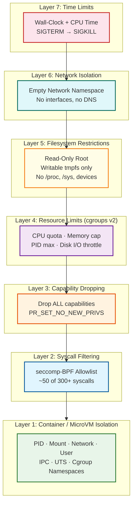
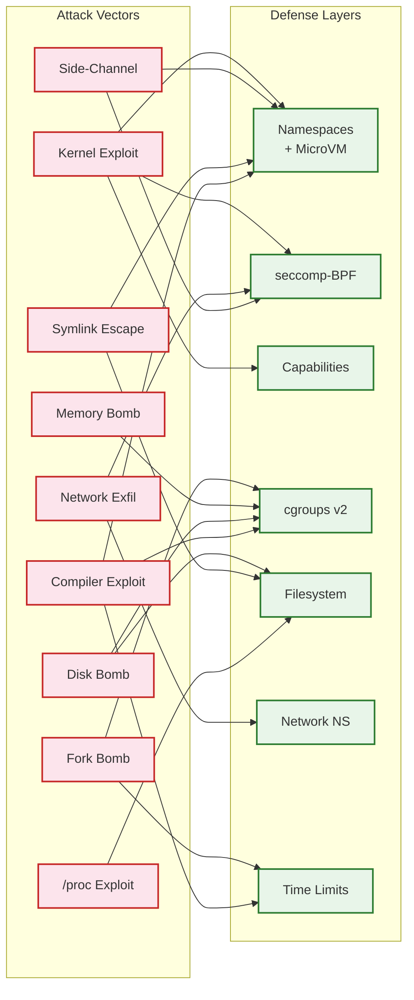

# Security & Compliance — Code Execution Sandbox

Security is the **primary architectural constraint** of a code execution sandbox. Unlike most distributed systems where security is layered on top of a performance-optimized design, a sandbox is fundamentally a security system that happens to need performance. Every design decision—from isolation technology to warm pool strategy to output capture—must first pass the question: "Can this be exploited?"

The core principle is **defense-in-depth**: no single security layer is trusted to be sufficient. Every layer will eventually be breached; security comes from the combination.

---

## 1. Authentication & Authorization

### 1.1 User & API Key Authentication

| Authentication Method | Use Case | Token Lifetime | Validation |
|---|---|---|---|
| **OAuth 2.0 Bearer Token** | Web IDE users, browser-based clients | 1 hour (refresh token: 30 days) | Verify signature + expiry + issuer |
| **API Key** | Programmatic access, CI/CD integrations | Long-lived (rotatable) | Hash lookup in key store + scope validation |
| **Contest Token** | Time-limited contest access | Duration of contest | Token encodes contest_id + user_id + expiry |

### 1.2 Rate Limiting per User Tier

| Tier | Submissions/min | Concurrent Executions | Max Source Size | Max Time Limit | Languages |
|---|---|---|---|---|---|
| **Free** | 10 | 1 | 50 KB | 5s | Tier 1 only (10 languages) |
| **Standard** | 30 | 3 | 100 KB | 10s | Tier 1 + Tier 2 (30 languages) |
| **Premium** | 100 | 10 | 200 KB | 30s | All languages (60+) |
| **Contest** | 60 | 5 | 100 KB | Per-problem | Per-contest configuration |
| **API (Enterprise)** | 500 | 50 | 500 KB | 60s | All languages + custom runtimes |

#### Rate Limiting Implementation

```
ALGORITHM RateLimiter:

    // Sliding window counter using distributed cache
    FUNCTION check_rate_limit(user_id, tier):
        window_key = "rate:" + user_id + ":" + current_minute()
        current_count = cache.increment(window_key)

        IF current_count == 1:
            cache.set_ttl(window_key, 120 seconds)    // 2-minute expiry for safety

        limit = TIER_LIMITS[tier].submissions_per_minute

        IF current_count > limit:
            retry_after = 60 - seconds_into_current_minute()
            RETURN REJECTED(429, retry_after)

        // Also check concurrent execution limit
        active_key = "active:" + user_id
        active_count = cache.get(active_key)
        IF active_count >= TIER_LIMITS[tier].max_concurrent:
            RETURN REJECTED(429, "Too many concurrent executions")

        RETURN ALLOWED
```

---

## 2. Sandbox Security — Defense in Depth

The sandbox employs **seven overlapping security layers**. Each layer is designed to be independently sufficient for its threat class, but the combination provides defense against novel attacks that bypass any single layer.



---

### Layer 1: Container / MicroVM Isolation

The outermost security boundary uses Linux kernel namespaces to create isolated execution environments. Each sandbox runs in a completely separate process tree, filesystem view, network stack, and user ID space.

| Namespace | Isolation Provided | Kernel Mechanism | Attack Prevented |
|---|---|---|---|
| **PID** | Separate process ID space | `CLONE_NEWPID` | Cannot see, signal, or ptrace processes outside sandbox |
| **Mount** | Isolated filesystem tree | `CLONE_NEWNS` | Cannot access host filesystem paths |
| **Network** | Empty network stack | `CLONE_NEWNET` | No network interfaces → no exfiltration, no C2, no reverse shell |
| **User** | Mapped UID/GID | `CLONE_NEWUSER` | Container root (UID 0) → host nobody (UID 65534); root inside sandbox has no host privileges |
| **IPC** | Isolated shared memory / semaphores | `CLONE_NEWIPC` | Cannot communicate with processes outside sandbox via SysV IPC |
| **UTS** | Isolated hostname / domain | `CLONE_NEWUTS` | Cannot discover host identity |
| **Cgroup** | Isolated cgroup hierarchy view | `CLONE_NEWCGROUP` | Cannot see or modify other cgroups |

**MicroVM escalation (optional):** For maximum isolation, the entire sandbox runs inside a lightweight virtual machine (e.g., Firecracker) that provides a **hardware boundary** between the sandbox and the host. Even if user code exploits a kernel vulnerability inside the microVM, it only compromises the microVM's guest kernel—not the host. MicroVM boot time is < 125ms, achieved by skipping BIOS, bootloader, and most kernel initialization.

#### Isolation Technology Comparison

| Feature | Namespaces + seccomp | gVisor (runsc) | Firecracker MicroVM |
|---|---|---|---|
| **Isolation boundary** | Kernel syscall interface | User-space kernel (Sentry) | Hardware VM boundary |
| **Syscall handling** | Host kernel (filtered) | Sentry reimplements ~70% of Linux API | Guest kernel inside VM |
| **Kernel exploit impact** | Host kernel compromised | Only Sentry compromised (Go binary) | Guest kernel compromised; host safe |
| **Performance overhead** | < 5% | 10-30% (I/O-heavy workloads) | 5-10% (virtualization overhead) |
| **Boot time** | < 50ms (namespace creation) | < 100ms (Sentry startup) | < 125ms (Firecracker optimized boot) |
| **Memory overhead** | ~2 MB per sandbox | ~15 MB per sandbox | ~5 MB per microVM |
| **Best for** | Trusted-ish workloads; competitive programming | Moderate trust; general code execution | Zero trust; adversarial environments |

---

### Layer 2: System Call Filtering (seccomp-BPF)

The Linux kernel exposes 300+ system calls, but a typical program needs fewer than 50. Seccomp-BPF installs a Berkeley Packet Filter program that intercepts every syscall and decides: **allow**, **deny with error code**, or **kill the process**.

#### Allowlist Strategy (NOT Blocklist)

**Critical design decision:** The seccomp profile uses an **allowlist** (default-deny) rather than a blocklist (default-allow). This means:
- New syscalls added to the kernel are **blocked by default**
- A zero-day kernel exploit via a new syscall is mitigated even before the vulnerability is publicly known
- The administrator explicitly reviews and permits each syscall

```
SECCOMP PROFILE STRUCTURE:

DEFAULT_ACTION: SCMP_ACT_KILL_PROCESS    // Kill on any non-allowed syscall

// Common syscalls allowed for ALL languages (~40 syscalls)
COMMON_ALLOWLIST:
    // File I/O (core functionality)
    read, write, open, openat, close, fstat, lstat, stat, newfstatat
    lseek, access, faccessat, readlink, readlinkat

    // Memory management
    brk, mmap, munmap, mprotect, mremap, madvise

    // Process lifecycle
    exit, exit_group, wait4, getpid, getppid, gettid
    clone (RESTRICTED: only with CLONE_VM|CLONE_FS|CLONE_FILES|CLONE_SIGHAND|CLONE_THREAD)

    // Signals
    rt_sigaction, rt_sigprocmask, rt_sigreturn, sigaltstack

    // I/O multiplexing
    select, pselect6, poll, ppoll, epoll_create1, epoll_ctl, epoll_wait, epoll_pwait

    // Pipes and duplication
    pipe, pipe2, dup, dup2, dup3

    // Time
    clock_gettime, clock_getres, gettimeofday, nanosleep, clock_nanosleep

    // File descriptor management
    fcntl, ioctl (RESTRICTED to TCGETS, TIOCGWINSZ only)

    // Misc
    getrandom, arch_prctl, set_tid_address, set_robust_list
    futex, get_robust_list, sched_getaffinity, sched_yield
    prlimit64, getrlimit

// Language-specific additions
PYTHON_ADDITIONS:
    execve          // Required once to start interpreter
    getcwd          // Python imports use this
    getdents64      // Directory listing for module imports
    socket          // RESTRICTED: AF_UNIX only (Python multiprocessing)
    connect         // RESTRICTED: AF_UNIX only

JAVA_ADDITIONS:
    mmap (with MAP_ANONYMOUS)     // JVM heap management
    clone3 (with CLONE_THREAD)    // JVM thread creation
    prctl (PR_SET_NAME only)      // JVM thread naming
    sched_setaffinity              // JVM GC thread affinity

C_CPP_PROFILE:
    // Minimal — compiled binaries need fewer syscalls
    // No execve, no socket, no directory operations

// EXPLICITLY BLOCKED (notable dangerous syscalls)
BLOCKED_SYSCALLS:
    mount, umount2              // Filesystem manipulation
    ptrace                      // Process debugging/tracing
    reboot, kexec_load          // System-level operations
    init_module, finit_module   // Kernel module loading
    bpf                         // BPF program loading
    userfaultfd                 // TOCTOU exploitation
    io_uring_setup, io_uring_enter, io_uring_register  // Recent attack surface
    personality                 // Disable ASLR
    keyctl, request_key         // Kernel keyring access
    perf_event_open             // Performance counter side-channels
    process_vm_readv, process_vm_writev  // Cross-process memory access
    socket (AF_INET, AF_INET6)  // Network socket creation
    add_key                     // Kernel keyring manipulation
    lookup_dcookie              // Kernel debugging
    open_by_handle_at           // Bypass path-based access controls
    name_to_handle_at           // Container escape vector
```

---

### Layer 3: Capability Dropping

Linux capabilities divide root privileges into 41 distinct permissions. A process with no capabilities has almost no special privileges, even if running as root.

```
CAPABILITY CONFIGURATION:

// Step 1: Drop ALL capabilities
DROP: ALL (all 41 capabilities removed)

// Step 2: Re-add NONE
// No capabilities are re-added for sandbox execution

// Step 3: Set NO_NEW_PRIVS flag
prctl(PR_SET_NO_NEW_PRIVS, 1)
// This prevents:
// - setuid binaries from gaining privileges
// - execve from granting new capabilities
// - Any privilege escalation via exec

CAPABILITIES THAT WOULD BE DANGEROUS IF RETAINED:
    CAP_SYS_ADMIN      // Mount filesystems, access key management, trace processes
    CAP_SYS_PTRACE      // Trace any process (enables memory reads of other processes)
    CAP_NET_ADMIN       // Configure network interfaces (bypass network isolation)
    CAP_NET_RAW         // Raw socket access (packet sniffing, crafting)
    CAP_SYS_RAWIO       // Direct port/memory I/O (hardware access)
    CAP_SYS_MODULE      // Load kernel modules (arbitrary kernel code execution)
    CAP_DAC_OVERRIDE    // Bypass file permission checks (read any file)
    CAP_SYS_CHROOT      // Chroot into arbitrary directory
    CAP_MKNOD           // Create device nodes (access hardware)
    CAP_SETUID          // Set arbitrary UID (impersonate users)
    CAP_SETGID          // Set arbitrary GID (join groups)
```

---

### Layer 4: Resource Limits via cgroups v2

Cgroups v2 provides kernel-enforced resource quotas that cannot be circumvented from user space. The sandbox is placed in a dedicated cgroup hierarchy with hard limits.

| Resource Controller | Configuration | Limit | Enforcement | On Violation |
|---|---|---|---|---|
| **CPU** | `cpu.max` | `{quota_us} {period_us}` e.g., `2000000 1000000` (2s/s = 2 cores max) | Kernel throttles; wall-clock timer kills | SIGKILL → TLE verdict |
| **Memory** | `memory.max` | 256 MB (default) | Hard limit; no swap (`memory.swap.max = 0`) | OOM killer → SIGKILL → MLE verdict |
| **PID count** | `pids.max` | 64 | `fork()` returns EAGAIN when limit reached | Fork bomb contained; CPU timeout kills eventually |
| **Disk I/O** | `io.max` | `rbps=10485760 wbps=10485760` (10 MB/s read+write) | Kernel throttles I/O; processes sleep on I/O | Slow I/O; wall-clock timeout catches runaway I/O loops |
| **Network** | Network namespace | No interfaces (disabled) | No network stack = no network operations | `socket()` returns error via seccomp (defense in depth) |

#### Fork Bomb Defense in Detail

A fork bomb creates processes exponentially: `f() { f | f & }; f`. Without limits, this exhausts the host process table in seconds.

```
DEFENSE LAYERS AGAINST FORK BOMB:

Layer 1: pids.max = 64
    → After 64 processes exist, fork() returns EAGAIN
    → Bomb is contained but 64 processes spin consuming CPU

Layer 2: cpu.max throttling
    → All 64 processes share the CPU quota
    → With 2s CPU per 1s wall-clock, they collectively get ~30ms each
    → System remains responsive

Layer 3: Wall-clock timeout
    → After problem time limit + grace period, SIGKILL sent to entire cgroup
    → cgroup.kill = 1 ensures ALL 64 processes are killed atomically

Layer 4: cgroup.freeze (belt and suspenders)
    → Before killing, freeze the cgroup to prevent new forks during kill
    → Ensures clean shutdown

RESULT: Fork bomb runs for max ~7s (5s time limit + 2s grace), never exceeds 64
processes, never impacts host or other sandboxes.
```

---

### Layer 5: Filesystem Restrictions

The sandbox filesystem is carefully constructed to provide the minimum necessary access.

```
FILESYSTEM LAYOUT:

/                           READ-ONLY    (overlay mount from runtime image)
├── usr/
│   ├── bin/                READ-ONLY    (compilers: gcc, python3, javac, etc.)
│   ├── lib/                READ-ONLY    (shared libraries: libc, libstdc++, etc.)
│   └── include/            READ-ONLY    (header files for compiled languages)
├── lib/                    READ-ONLY    (system libraries)
├── lib64/                  READ-ONLY    (64-bit system libraries)
├── etc/
│   ├── localtime           READ-ONLY    (timezone for consistent time display)
│   ├── passwd              READ-ONLY    (minimal: only nobody user entry)
│   └── hosts               READ-ONLY    (localhost only — no external hosts)
├── workspace/              READ-WRITE   (tmpfs, 10 MB limit — user code here)
├── tmp/                    READ-WRITE   (tmpfs, 5 MB limit — temp files)
└── dev/
    ├── null                READ-WRITE   (/dev/null — discard writes, empty reads)
    ├── zero                READ-ONLY    (infinite zero bytes — limited by I/O quota)
    ├── urandom             READ-ONLY    (random bytes — needed by many languages)
    └── (NOTHING ELSE)

NOT MOUNTED — EXPLICITLY EXCLUDED:
/proc                       Blocks: /proc/self/environ (env vars), /proc/1/cmdline
                                    /proc/kcore (physical memory), /proc/sysrq-trigger
                                    /proc/net/* (host network info), /proc/self/maps
/sys                        Blocks: hardware enumeration, kernel parameter modification
/dev/shm                    Blocks: shared memory IPC bypass
/dev/sda, /dev/tty, etc.    Blocks: raw disk access, terminal hijacking
/home, /root                Blocks: host user data access
/var, /run                  Blocks: host service sockets, PID files
```

#### Symlink and Hardlink Protections

```
FILESYSTEM SECURITY RULES:

1. Mount namespace: sandbox has its own filesystem view
   → No path traversal can reach host filesystem

2. No symlink following outside sandbox root
   → Protected by mount namespace boundaries
   → Even if user creates symlink to "/etc/shadow", the link resolves within
     the sandbox's own /etc (which contains only minimal entries)

3. No hardlink creation to read-only files
   → Writable tmpfs (/workspace, /tmp) cannot hardlink to read-only paths
   → Different filesystem boundary prevents cross-device links

4. nodev mount option on tmpfs
   → Cannot create device nodes in writable directories
   → mknod() blocked by seccomp (defense in depth)

5. nosuid mount option on tmpfs
   → Cannot create setuid binaries
   → Also blocked by NO_NEW_PRIVS (defense in depth)

6. noexec on /tmp (optional, per language)
   → Prevents execution of files in /tmp
   → /workspace allows exec (needed for compiled binaries)
```

---

### Layer 6: Network Isolation

Network access from a sandbox is **disabled by default**. The sandbox's network namespace contains no interfaces—not even loopback.

```
NETWORK NAMESPACE CONFIGURATION:

DEFAULT (99% of use cases):
    Network namespace: EMPTY
    Interfaces:        NONE (not even lo)
    DNS resolver:      NONE (/etc/resolv.conf is empty)
    iptables rules:    N/A (no network stack to filter)

    RESULT:
    - socket(AF_INET, ...)  → EPERM via seccomp filter
    - socket(AF_INET6, ...) → EPERM via seccomp filter
    - DNS queries           → No resolver configured, fails immediately
    - Raw packets           → No interface to bind to
    - DNS tunneling         → No DNS resolver to query

OPTIONAL ALLOWLIST MODE (for specific problems requiring HTTP):
    Network namespace: PRIVATE (isolated from host)
    Interfaces:        veth pair connected to proxy namespace
    DNS resolver:      Internal resolver with domain allowlist
    Egress proxy:      HTTP-only proxy with URL allowlist
    Firewall:          DENY ALL except proxy destination

    ALLOWLIST EXAMPLE:
        Allowed: api.example-problem.internal:443 (HTTPS only)
        Blocked: Everything else (all IPs, all ports, all protocols)

    RISK MITIGATION:
    - Proxy logs all requests for audit
    - Response size limited to 1 MB
    - Connection timeout: 5 seconds
    - Total network I/O budget: 10 MB per submission
```

**Why network isolation is binary:** Partial network access (e.g., "allow HTTP but block SSH") is nearly impossible to secure in a sandbox. Users can tunnel arbitrary protocols over HTTP, use DNS for data exfiltration, or exploit HTTP libraries for SSRF. The only secure options are "no network" or "strictly proxied with request-level allowlisting."

---

### Layer 7: Time Limits

Time limits serve both as a resource management tool and a security mechanism. A sandbox that runs indefinitely blocks a worker, consumes resources, and could be used for cryptocurrency mining or other resource abuse.

```
TIME LIMIT ENFORCEMENT:

┌─────────────────────────────────────────────────────────────────┐
│                    TIME LIMIT HIERARCHY                         │
│                                                                 │
│  CPU Time (cgroups v2 cpu.max)                                  │
│  └─ Per test case: problem-defined (default 2000ms)             │
│     - Measures actual CPU cycles consumed                       │
│     - sleep(100) costs ~0ms CPU time                            │
│     - while(true){} exhausts quickly                            │
│                                                                 │
│  Wall-Clock Time (external timer)                               │
│  └─ Per test case: CPU limit × 3 + 1000ms grace                │
│     - Measures real elapsed time                                │
│     - Catches: sleep(), blocking I/O, spin loops                │
│     - Enforcement: SIGTERM (500ms grace) → SIGKILL              │
│                                                                 │
│  Total Submission Time (worker-level)                           │
│  └─ All test cases combined: 60 seconds                        │
│     - Prevents 100 test cases × 2s = 200s total runtime        │
│     - Abort remaining test cases; return partial results        │
│                                                                 │
│  Lease TTL (warm pool)                                          │
│  └─ Per sandbox lease: 120 seconds                             │
│     - Safety net if worker fails to return lease                │
│     - Force-kill all processes; reclaim sandbox                  │
└─────────────────────────────────────────────────────────────────┘

WHY BOTH WALL-CLOCK AND CPU TIME:
    while(true) {}           → CPU limit catches (pure computation)
    while(true) { sleep(1) } → Wall-clock catches (zero CPU usage)
    while(true) { read(fd) } → Wall-clock catches (I/O wait)
    fork_bomb()              → PID limit + CPU limit + wall-clock (all three)
```

---

## 3. Threat Model

### 3.1 Attack Vectors and Mitigations

#### Threat 1: Sandbox Escape via Kernel Exploit

| Attribute | Detail |
|---|---|
| **Attack** | User code exploits a kernel vulnerability (e.g., privilege escalation via a bug in a specific syscall) to gain root on the host |
| **Severity** | Critical — complete infrastructure compromise |
| **Likelihood** | Low (requires 0-day or unpatched N-day) |
| **Layer 1 Mitigation** | MicroVM isolation: exploit only compromises guest kernel, not host |
| **Layer 2 Mitigation** | seccomp-BPF allowlist: vulnerable syscall likely not in allowlist; even if it is, seccomp filters can restrict argument values |
| **Layer 3 Mitigation** | Capability dropping: many kernel exploits require CAP_SYS_ADMIN or CAP_NET_ADMIN; dropping all capabilities blocks these |
| **Layer 4 Mitigation** | User namespace: container root has no host privileges; kernel exploit inside user namespace is constrained |
| **Operational Mitigation** | Automated kernel patching within 24 hours of security advisory; host intrusion detection system; immutable host OS with read-only root |

#### Threat 2: Fork Bomb (Exponential Process Creation)

| Attribute | Detail |
|---|---|
| **Attack** | `:(){ :|:& };:` or `while(true) fork()` — exponential process creation |
| **Severity** | High — without limits, crashes the host |
| **Likelihood** | High — trivial to execute, common in CTF and learning environments |
| **Layer 1 Mitigation** | `pids.max = 64` via cgroups v2: `fork()` returns EAGAIN after 64 processes |
| **Layer 2 Mitigation** | CPU time quota: 64 processes share the sandbox's CPU allocation; they collectively slow to a crawl |
| **Layer 3 Mitigation** | Wall-clock timeout: entire sandbox killed after time limit |
| **Layer 4 Mitigation** | `cgroup.kill = 1`: atomically kills all processes in the cgroup during cleanup |
| **Detection** | `pids.current` reaches `pids.max` within first 100ms → log as fork bomb attempt |

#### Threat 3: Memory Bomb (Allocate Until OOM)

| Attribute | Detail |
|---|---|
| **Attack** | `malloc()` in a loop until system runs out of memory, or `mmap()` large anonymous regions |
| **Severity** | High — without limits, triggers host OOM killer which may kill critical processes |
| **Likelihood** | High — common (even unintentional memory leaks cause this) |
| **Layer 1 Mitigation** | `memory.max` via cgroups v2: hard limit on memory consumption |
| **Layer 2 Mitigation** | `memory.swap.max = 0`: no swap allowed; prevents swapping-based slowdown |
| **Layer 3 Mitigation** | OOM killer scoped to cgroup: kernel kills the largest process *within the sandbox only* — host processes are unaffected |
| **Detection** | `memory.events` counter `oom_kill > 0` → verdict: MLE |

#### Threat 4: Disk Bomb (Fill Disk with Output)

| Attribute | Detail |
|---|---|
| **Attack** | Write gigabytes of data to stdout, files, or /tmp — fill host disk, prevent logging |
| **Severity** | Medium — degrades host if tmpfs is backed by main filesystem |
| **Likelihood** | High — trivial (`print("A" * 10**9)`) |
| **Layer 1 Mitigation** | Writable areas use tmpfs with size limits (10MB /workspace, 5MB /tmp) |
| **Layer 2 Mitigation** | `RLIMIT_FSIZE` limits individual file size to 10MB |
| **Layer 3 Mitigation** | Output buffer truncation: stdout/stderr capped at 64KB by the worker |
| **Layer 4 Mitigation** | `io.max` throttles write bandwidth to 10 MB/s |
| **Layer 5 Mitigation** | Read-only root filesystem: only tmpfs areas are writable |
| **Detection** | `write()` returns ENOSPC → verdict: Runtime Error (output limit exceeded) |

#### Threat 5: Network Exfiltration (Steal Test Data, Phone Home)

| Attribute | Detail |
|---|---|
| **Attack** | Connect to external server to exfiltrate test case data, answers, or platform secrets; participate in botnet; mine cryptocurrency via pool |
| **Severity** | High — data theft, reputation damage, legal liability |
| **Likelihood** | Medium — requires network access |
| **Layer 1 Mitigation** | Empty network namespace: no network interfaces exist |
| **Layer 2 Mitigation** | `socket(AF_INET, ...)` blocked by seccomp filter |
| **Layer 3 Mitigation** | No DNS resolver configured: DNS queries fail immediately |
| **Layer 4 Mitigation** | No loopback: cannot even connect to localhost |
| **Detection** | seccomp kills process on blocked socket() → log for security analysis |

#### Threat 6: Timing Side-Channels (Spectre / Meltdown)

| Attribute | Detail |
|---|---|
| **Attack** | Use speculative execution vulnerabilities to read memory of other processes or the kernel |
| **Severity** | High — can leak secrets from other sandboxes |
| **Likelihood** | Low — requires sophisticated exploit code and specific CPU models |
| **Layer 1 Mitigation** | MicroVM isolation: separate address space; speculative execution attacks across VM boundary are extremely difficult |
| **Layer 2 Mitigation** | No shared CPU caches between tenants (microVM provides separate L1/L2 cache context) |
| **Layer 3 Mitigation** | Kernel mitigations enabled: KPTI (kernel page-table isolation), retpolines, SSBD |
| **Layer 4 Mitigation** | `perf_event_open` blocked by seccomp: cannot use performance counters for high-resolution timing |
| **Operational Mitigation** | CPU microcode updates applied regularly; disable SMT (hyperthreading) on worker nodes if required by threat model |

#### Threat 7: Symlink / Hardlink Attacks (Escape Filesystem Jail)

| Attribute | Detail |
|---|---|
| **Attack** | Create symlink from `/workspace/escape` → `/etc/shadow` (or other sensitive host file) and read it |
| **Severity** | High — file read outside sandbox boundary |
| **Likelihood** | Medium — well-known attack pattern against containerized environments |
| **Layer 1 Mitigation** | Mount namespace: sandbox sees only its own filesystem tree; `/etc/shadow` inside sandbox is a minimal file, not the host's |
| **Layer 2 Mitigation** | Cross-device hardlink impossible: writable tmpfs and read-only overlay are different filesystems |
| **Layer 3 Mitigation** | `open_by_handle_at` syscall blocked by seccomp: prevents handle-based file access that bypasses mount namespace |
| **Layer 4 Mitigation** | Overlay filesystem: host files are behind overlay layer and not directly accessible |

#### Threat 8: /proc and /sys Exploitation

| Attribute | Detail |
|---|---|
| **Attack** | Read `/proc/1/environ` (host environment variables with secrets), write to `/proc/sysrq-trigger` (crash host), read `/proc/kcore` (physical memory dump), enumerate processes via `/proc/[pid]/` |
| **Severity** | Critical — host secret exposure, denial of service, information disclosure |
| **Likelihood** | High — trivial if /proc is mounted; very common attack in container breakouts |
| **Layer 1 Mitigation** | `/proc` is NOT mounted inside the sandbox (completely absent from filesystem) |
| **Layer 2 Mitigation** | `/sys` is NOT mounted (no kernel parameter access) |
| **Layer 3 Mitigation** | Even if mounted (e.g., for languages requiring /proc/self), use `hidepid=2` and mask sensitive entries: `/proc/kcore`, `/proc/sysrq-trigger`, `/proc/keys`, `/proc/timer_list`, `/proc/scsi` |
| **Layer 4 Mitigation** | PID namespace isolation: even with /proc, only sandbox processes are visible |

#### Threat 9: Compiler / Runtime Exploits

| Attribute | Detail |
|---|---|
| **Attack** | Exploit a bug in GCC, Clang, JVM, or Python interpreter itself — e.g., a crafted source file that causes the compiler to execute arbitrary code during compilation |
| **Severity** | High — compiler runs with same privileges as execution; could be used for sandbox escape |
| **Likelihood** | Low — compiler bugs that lead to code execution are rare but not unheard of |
| **Layer 1 Mitigation** | Compilation runs inside the same sandbox with the same restrictions — compiler cannot escape |
| **Layer 2 Mitigation** | Separate resource limits for compilation: 512MB memory, 30s timeout (generous for complex code, but bounded) |
| **Layer 3 Mitigation** | Compiler binary is on read-only filesystem: cannot be modified |
| **Layer 4 Mitigation** | Immutable runtime images: compiler version is pinned and verified by hash |
| **Operational Mitigation** | Subscribe to compiler security advisories; update runtime images within 48 hours of critical CVE |

---

### 3.2 Threat Model Summary Matrix



---

## 4. Security Operations

### 4.1 Vulnerability Management

| Activity | Frequency | Scope | Responsible |
|---|---|---|---|
| **Kernel patching** | Within 24 hours of critical CVE | All worker nodes | Platform team |
| **Runtime image updates** | Within 48 hours of compiler/runtime CVE | All language images | Runtime team |
| **seccomp profile audit** | Monthly | All per-language profiles | Security team |
| **Penetration testing** | Quarterly | Sandbox escape attempts, privilege escalation | External security firm |
| **Dependency scanning** | Weekly (automated) | Base images, runtime libraries | CI/CD pipeline |
| **Kernel exploit monitoring** | Continuous | Linux kernel security mailing lists | Security team |

### 4.2 Security Incident Response

```
INCIDENT CLASSIFICATION:

SEV-1 (Sandbox Escape Confirmed):
    → Immediately halt all submissions
    → Quarantine affected worker nodes
    → Rotate all secrets and API keys
    → Forensic investigation: determine blast radius
    → Notify affected users within 24 hours
    → Post-mortem within 72 hours

SEV-2 (Suspicious Activity Detected):
    → Quarantine specific sandbox; continue operations
    → Analyze blocked syscalls, resource violation patterns
    → Determine if attack was successful or blocked
    → Update seccomp profiles if new attack vector identified

SEV-3 (Resource Limit Violation):
    → Log and categorize (accidental vs intentional)
    → Update rate limiting for repeat offenders
    → No operational impact (limits successfully contained the violation)
```

---

## 5. Compliance

### 5.1 Data Handling

| Data Type | Classification | Retention | Encryption | Access Control |
|---|---|---|---|---|
| **User source code** | Confidential (user-owned) | 90 days | Encrypted at rest + in transit | User + authorized staff only |
| **Execution output** | Confidential | 90 days | Encrypted at rest + in transit | User + authorized staff only |
| **Test case data** | Internal (platform-owned) | Indefinite | Encrypted at rest | Platform staff only |
| **Execution metrics** | Internal | 1 year | Not encrypted (no PII) | Operations team |
| **Security audit logs** | Restricted | 1 year minimum | Encrypted at rest, append-only | Security team only |

### 5.2 GDPR Compliance for User Code

| Requirement | Implementation |
|---|---|
| **Right to access** | Users can download all their submissions via API (`GET /v1/users/{id}/submissions`) |
| **Right to erasure** | Deletion API removes source code and output from object store + result store; metadata retained for audit trail (anonymized) |
| **Data portability** | Export all submissions as JSON archive |
| **Lawful basis** | Contract (user agreed to terms of service) |
| **Data minimization** | Execution output truncated to 64KB; source code size limited per tier |
| **Cross-border transfers** | User data processed in same region as user; no cross-region replication of source code |

### 5.3 Audit Trail

| Event | What Is Logged | Retention |
|---|---|---|
| **Submission created** | user_id, timestamp, language, source_code_hash (not content), IP address | 1 year |
| **Execution completed** | submission_id, verdict, resource usage, worker_id | 1 year |
| **Security violation** | submission_id, violation type (seccomp, OOM, timeout), full sandbox state dump | 2 years |
| **Administrative access** | admin_id, action, target resource, timestamp | 2 years |
| **Data deletion request** | user_id, request_timestamp, completion_timestamp, items deleted | 5 years (compliance proof) |

---

*Previous: [Scalability & Reliability](./05-scalability-and-reliability.md) · Next: [Observability](./07-observability.md)*
