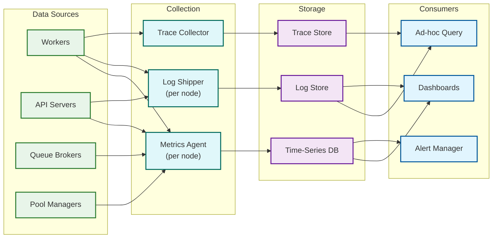

# Observability — Code Execution Sandbox

## 1. Metrics

### 1.1 Core Execution Metrics

| Metric | Type | Labels | Description |
|---|---|---|---|
| `submission.total` | Counter | language, verdict, priority | Total submissions processed |
| `submission.duration_ms` | Histogram | language, verdict | End-to-end latency (submission → final verdict) |
| `execution.cpu_time_ms` | Histogram | language | CPU time consumed per test case |
| `execution.wall_time_ms` | Histogram | language | Wall-clock time per test case |
| `execution.memory_peak_kb` | Histogram | language | Peak RSS memory per test case |
| `compilation.duration_ms` | Histogram | language | Compilation time (compiled languages only) |
| `queue.wait_time_ms` | Histogram | language, priority | Time from enqueue to worker pickup |
| `queue.depth` | Gauge | language | Current messages waiting in queue |

### 1.2 Execution Time Distribution

Track P50, P95, and P99 latencies **per language** to detect language-specific regressions:

| Language | P50 Execution | P95 Execution | P99 Execution | P50 Compilation | Notes |
|---|---|---|---|---|---|
| Python 3.11 | 120ms | 450ms | 1,200ms | N/A | Interpreter startup dominates |
| C++17 (GCC) | 15ms | 80ms | 250ms | 800ms | Fast execution; compilation varies with template depth |
| Java 17 | 200ms | 600ms | 1,500ms | 1,200ms | JVM startup cost; HotSpot warmup |
| JavaScript (Node) | 80ms | 300ms | 900ms | N/A | V8 JIT compilation included in execution |
| Rust | 10ms | 60ms | 200ms | 2,500ms | Very fast execution; slow compilation |
| Go | 25ms | 100ms | 300ms | 500ms | Fast compilation and execution |

### 1.3 Worker & Pool Metrics

| Metric | Type | Labels | Description |
|---|---|---|---|
| `worker.utilization` | Gauge | worker_id | CPU utilization of worker process (0-1) |
| `worker.active_submissions` | Gauge | worker_id | Currently executing submissions on this worker |
| `worker.total_processed` | Counter | worker_id | Lifetime submissions processed |
| `worker.restarts` | Counter | worker_id, reason | Worker restart count (OOM, drain, crash) |
| `warm_pool.size` | Gauge | language | Current sandboxes available in warm pool |
| `warm_pool.target` | Gauge | language | Target pool size from auto-sizer |
| `warm_pool.hit_rate` | Gauge | language | Rolling 5-min warm pool hit ratio |
| `warm_pool.miss_total` | Counter | language | Cold start events (pool miss) |
| `sandbox.creation_ms` | Histogram | language, type (warm/cold) | Sandbox creation or lease time |
| `sandbox.scrub_ms` | Histogram | language | Time to scrub sandbox on return |

### 1.4 Security Metrics

| Metric | Type | Labels | Description |
|---|---|---|---|
| `security.oom_kill_total` | Counter | language | OOM kills triggered by cgroup memory limit |
| `security.timeout_kill_total` | Counter | language, type (cpu/wall) | Timeout kills by type |
| `security.seccomp_violation_total` | Counter | language, syscall | Processes killed by seccomp filter |
| `security.fork_bomb_detected` | Counter | language | `pids.current` hit `pids.max` |
| `security.output_truncated` | Counter | language | Output exceeded 64KB buffer |
| `security.disk_full` | Counter | language | tmpfs write returned ENOSPC |
| `security.circuit_breaker_trips` | Counter | language | Language circuit breaker opened |

### 1.5 Derived Metrics (Calculated)

| Metric | Formula | Alert Threshold |
|---|---|---|
| **Submission success rate** | `1 - (SE verdicts / total submissions)` | < 99.5% |
| **Warm pool hit rate** | `warm_pool.hit / (warm_pool.hit + warm_pool.miss)` | < 80% for Tier 1 |
| **Cold start rate** | `warm_pool.miss / total submissions` | > 20% |
| **OOM rate** | `oom_kill / total executions` | > 5% (may indicate limit misconfiguration) |
| **Timeout rate** | `timeout_kill / total executions` | > 10% (may indicate problem time limits too tight) |
| **Worker crash rate** | `worker.restarts(reason=crash) / total workers` | > 1% per hour |
| **Queue drain rate** | `Δ(queue.depth) over time` | Positive trend for > 5 minutes |

---

## 2. Dashboard Design

### 2.1 Operations Dashboard

```
┌─────────────────────────────────────────────────────────────────────┐
│                   CODE EXECUTION SANDBOX — OPERATIONS               │
├─────────────────────────┬───────────────────────────────────────────┤
│  SUBMISSION RATE        │  VERDICT DISTRIBUTION                    │
│  ┌─────────────────┐    │  ┌─────────────────────────┐             │
│  │ Current: 142/s   │    │  │ AC:  72%  ████████████  │             │
│  │ Peak:    580/s   │    │  │ WA:  15%  ███           │             │
│  │ [sparkline graph]│    │  │ TLE:  5%  █             │             │
│  └─────────────────┘    │  │ RE:   4%  █             │             │
│                         │  │ CE:   3%  █             │             │
│  E2E LATENCY (P95)     │  │ MLE:  1%                │             │
│  ┌─────────────────┐    │  │ SE:  0.1%               │             │
│  │ Python:  1.2s   │    │  └─────────────────────────┘             │
│  │ C++:     1.8s   │    │                                          │
│  │ Java:    2.5s   │    │  QUEUE DEPTH BY LANGUAGE                 │
│  │ [time-series]   │    │  ┌─────────────────────────┐             │
│  └─────────────────┘    │  │ Python: 120  ██         │             │
│                         │  │ C++:     85  █          │             │
│                         │  │ Java:    45  █          │             │
│                         │  │ Other:  200  ███        │             │
│                         │  └─────────────────────────┘             │
├─────────────────────────┼───────────────────────────────────────────┤
│  WORKER POOL            │  WARM POOL                               │
│  ┌─────────────────┐    │  ┌─────────────────────────┐             │
│  │ Active:  185     │    │  │ Total: 1,124 / 1,300    │             │
│  │ Draining: 3      │    │  │ Hit Rate: 94.2%         │             │
│  │ Unhealthy: 0     │    │  │ Cold Starts: 12/min     │             │
│  │ Avg CPU:  62%    │    │  │ Scrub Avg: 45ms         │             │
│  │ [heatmap]        │    │  │ [per-language breakdown] │             │
│  └─────────────────┘    │  └─────────────────────────┘             │
├─────────────────────────┴───────────────────────────────────────────┤
│  DEGRADATION LEVEL: ● NORMAL                                       │
│  SLO BUDGET REMAINING: Acceptance: 98.2% | Latency: 94.5%          │
└─────────────────────────────────────────────────────────────────────┘
```

### 2.2 Security Dashboard

```
┌─────────────────────────────────────────────────────────────────────┐
│                   CODE EXECUTION SANDBOX — SECURITY                 │
├─────────────────────────┬───────────────────────────────────────────┤
│  RESOURCE VIOLATIONS    │  SECCOMP VIOLATIONS                       │
│  (last 24 hours)        │  (last 24 hours)                          │
│  ┌─────────────────┐    │  ┌─────────────────────────┐             │
│  │ OOM Kills:  1,842│    │  │ Total: 234              │             │
│  │ Timeouts:   3,215│    │  │ Top Blocked Syscalls:   │             │
│  │ Fork Bombs:    47│    │  │   socket:      142      │             │
│  │ Disk Full:    156│    │  │   execve:       38      │             │
│  │ FD Exhaust:    12│    │  │   ptrace:       22      │             │
│  │ [trend graph]    │    │  │   mount:        15      │             │
│  └─────────────────┘    │  │   clone3:       17      │             │
│                         │  └─────────────────────────┘             │
├─────────────────────────┼───────────────────────────────────────────┤
│  CIRCUIT BREAKER STATUS │  SECURITY EVENTS                          │
│  ┌─────────────────┐    │  ┌─────────────────────────┐             │
│  │ Python:  CLOSED ●│    │  │ [timeline of events]    │             │
│  │ C++:     CLOSED ●│    │  │ 14:23 Fork bomb (Java)  │             │
│  │ Java:    CLOSED ●│    │  │ 14:15 seccomp: ptrace   │             │
│  │ Go:      CLOSED ●│    │  │ 14:02 OOM spike (C++)   │             │
│  │ Rust:    CLOSED ●│    │  │ 13:58 socket blocked    │             │
│  └─────────────────┘    │  └─────────────────────────┘             │
├─────────────────────────┴───────────────────────────────────────────┤
│  ANOMALY DETECTION                                                  │
│  ┌─────────────────────────────────────────────────────────────┐    │
│  │ ● No anomalies detected in last 24 hours                   │    │
│  │ Last anomaly: 3 days ago — unusual seccomp violation spike  │    │
│  │              from single user (investigated: CTF practice)  │    │
│  └─────────────────────────────────────────────────────────────┘    │
└─────────────────────────────────────────────────────────────────────┘
```

---

## 3. Logging

### 3.1 Submission Lifecycle Log

Every submission generates a structured lifecycle log that captures each state transition:

```
LOG FORMAT (structured JSON):

// Submission received
{
    "ts": "2026-03-10T14:23:01.123Z",
    "level": "INFO",
    "event": "submission.received",
    "submission_id": "sub_abc123",
    "user_id": "usr_xyz789",
    "language": "python3.11",
    "problem_id": "prob_42",
    "source_size_bytes": 1847,
    "priority": 50
}

// Submission queued
{
    "ts": "2026-03-10T14:23:01.135Z",
    "event": "submission.queued",
    "submission_id": "sub_abc123",
    "queue_partition": "python",
    "queue_depth_at_enqueue": 87
}

// Worker assigned
{
    "ts": "2026-03-10T14:23:01.342Z",
    "event": "submission.assigned",
    "submission_id": "sub_abc123",
    "worker_id": "worker-pool-a-17",
    "queue_wait_ms": 207,
    "assignment_reason": "language_affinity"
}

// Sandbox leased
{
    "ts": "2026-03-10T14:23:01.389Z",
    "event": "sandbox.leased",
    "submission_id": "sub_abc123",
    "lease_id": "lease_def456",
    "sandbox_id": "sb_ghi789",
    "lease_type": "warm",
    "lease_duration_ms": 47
}

// Execution started (per test case)
{
    "ts": "2026-03-10T14:23:01.412Z",
    "event": "execution.started",
    "submission_id": "sub_abc123",
    "test_case": 1,
    "time_limit_ms": 2000,
    "memory_limit_kb": 262144
}

// Execution completed (per test case)
{
    "ts": "2026-03-10T14:23:01.534Z",
    "event": "execution.completed",
    "submission_id": "sub_abc123",
    "test_case": 1,
    "verdict": "AC",
    "cpu_time_ms": 23,
    "wall_time_ms": 122,
    "memory_peak_kb": 14208,
    "exit_code": 0,
    "output_size_bytes": 14,
    "output_truncated": false
}

// Final verdict
{
    "ts": "2026-03-10T14:23:02.847Z",
    "event": "submission.completed",
    "submission_id": "sub_abc123",
    "final_verdict": "AC",
    "total_test_cases": 15,
    "passed_test_cases": 15,
    "total_cpu_time_ms": 342,
    "total_wall_time_ms": 1435,
    "peak_memory_kb": 14208,
    "e2e_duration_ms": 1724,
    "queue_wait_ms": 207,
    "sandbox_lease_ms": 47
}

// Sandbox returned
{
    "ts": "2026-03-10T14:23:02.893Z",
    "event": "sandbox.returned",
    "lease_id": "lease_def456",
    "sandbox_id": "sb_ghi789",
    "scrub_duration_ms": 38,
    "returned_to_pool": true
}
```

### 3.2 Resource Usage per Execution

```
{
    "ts": "2026-03-10T14:23:01.534Z",
    "event": "execution.resources",
    "submission_id": "sub_abc123",
    "test_case": 1,
    "cpu_time_ms": 23,
    "wall_time_ms": 122,
    "memory_peak_kb": 14208,
    "memory_limit_kb": 262144,
    "memory_utilization": 0.054,
    "pids_peak": 3,
    "pids_limit": 64,
    "disk_write_bytes": 0,
    "disk_read_bytes": 14336
}
```

### 3.3 Security Event Logging

Security events are logged at elevated severity with additional forensic context:

```
// seccomp violation
{
    "ts": "2026-03-10T14:25:03.456Z",
    "level": "WARN",
    "event": "security.seccomp_violation",
    "submission_id": "sub_mal001",
    "user_id": "usr_suspect42",
    "language": "cpp17",
    "blocked_syscall": "ptrace",
    "syscall_number": 101,
    "action_taken": "KILL_PROCESS"
}

// OOM kill
{
    "ts": "2026-03-10T14:26:12.789Z",
    "level": "WARN",
    "event": "security.oom_kill",
    "submission_id": "sub_mem002",
    "language": "java17",
    "memory_limit_kb": 262144,
    "memory_peak_kb": 262144,
    "oom_kill_count": 1
}

// Fork bomb detected
{
    "ts": "2026-03-10T14:27:45.123Z",
    "level": "WARN",
    "event": "security.fork_bomb",
    "submission_id": "sub_fork003",
    "language": "bash",
    "pids_max": 64,
    "pids_reached_max_in_ms": 45,
    "action_taken": "pid_limit_enforced"
}

// Potential escape attempt
{
    "ts": "2026-03-10T14:30:00.000Z",
    "level": "CRITICAL",
    "event": "security.escape_attempt",
    "submission_id": "sub_escape004",
    "user_id": "usr_attacker01",
    "language": "c17",
    "indicators": [
        "seccomp: mount blocked",
        "seccomp: clone3 with CLONE_NEWUSER blocked",
        "seccomp: open_by_handle_at blocked"
    ],
    "action_taken": "process_killed",
    "worker_quarantined": true,
    "alert_sent": true
}
```

### 3.4 Log Retention and Management

| Log Category | Volume/Day | Hot Storage | Warm Storage | Total Retention |
|---|---|---|---|---|
| **Submission lifecycle** | ~250M events | 7 days | 30 days | 90 days |
| **Resource usage** | ~75M events | 7 days | 30 days | 30 days |
| **Security events** | ~10K events | 30 days | 180 days | 2 years |
| **Worker operational** | ~1M events | 3 days | 14 days | 14 days |
| **Audit trail** | ~5K events | 90 days | 1 year | 5 years |

---

## 4. Distributed Tracing

### 4.1 Submission Lifecycle Trace

Each submission generates a distributed trace spanning multiple services:

```
TRACE: Submission sub_abc123

Root Span: submission.lifecycle (1724ms)
├── api.validate (12ms)
│   ├── auth.verify_token (3ms)
│   ├── rate_limit.check (2ms)
│   └── payload.validate (7ms)
├── storage.store_code (45ms)
│   └── object_store.put (40ms)
├── queue.enqueue (8ms)
│   └── broker.publish (6ms)
├── queue.wait (207ms)                            ← Time in queue
├── scheduler.assign (15ms)
│   ├── affinity.match (5ms)
│   └── load_balance.select (10ms)
├── sandbox.lease (47ms)
│   ├── warm_pool.check (2ms)                     ← Pool hit
│   └── sandbox.prepare (45ms)
├── execution.compile (0ms)                        ← Interpreted language
├── execution.run (1435ms)
│   ├── test_case.1 (122ms)
│   │   ├── sandbox.inject_stdin (3ms)
│   │   ├── sandbox.execute (102ms)
│   │   ├── output.capture (5ms)
│   │   └── verdict.compare (12ms)
│   ├── test_case.2 (98ms)
│   │   └── ... (similar breakdown)
│   ├── ... (test cases 3-14)
│   └── test_case.15 (105ms)
├── result.store (23ms)
│   ├── db.write_verdict (15ms)
│   └── cache.invalidate (8ms)
└── sandbox.return (46ms)
    ├── sandbox.scrub (38ms)
    └── warm_pool.return (8ms)
```

### 4.2 Trace Context Propagation

| Hop | Context Passed | How |
|---|---|---|
| Client → API | `X-Request-Id` | HTTP header |
| API → Queue | `trace_id`, `parent_span_id`, `enqueue_ts` | Message headers |
| Queue → Worker | `trace_id`, `parent_span_id` | Resumed from message headers |
| Worker → Sandbox | `trace_id`, `sandbox_span_id` | Internal context |
| Worker → Result Store | `trace_id`, `submission_id` | Database write includes trace reference |

### 4.3 Sampling Strategy

| Traffic Type | Sampling Rate | Rationale |
|---|---|---|
| **System errors (SE verdict)** | 100% | Every system failure must be investigated |
| **Security events (seccomp, OOM, timeout)** | 100% | Full visibility into security violations |
| **Slow submissions (> 2× P95 latency)** | 100% | Identify latency bottlenecks |
| **Cold start submissions** | 100% | Track cold start impact and frequency |
| **Normal submissions** | 1% | Statistical sampling for baseline performance |
| **Contest submissions** | 10% | Higher visibility during high-stakes events |

### 4.4 Critical Path Analysis

The trace data enables identification of the critical path—the sequence of operations that determines end-to-end latency:

| Path Segment | Typical Duration | % of E2E | Optimization Opportunity |
|---|---|---|---|
| API validation + storage | 57ms | 3% | Validate async; write-behind to object store |
| Queue wait | 207ms (P50) | 12% | Pre-scale workers; language-affinity routing |
| Sandbox lease | 47ms (warm) | 3% | Maintain pool above target; pre-warm on queue growth |
| Test case execution | 1,435ms (15 cases) | 83% | Parallelize across sandboxes (contest mode only) |
| Result storage + return | 69ms | 4% | Batch writes; async cache invalidation |

---

## 5. Alerting

### 5.1 Critical Alerts (Page Immediately)

| Alert | Condition | Runbook |
|---|---|---|
| **Sandbox escape detected** | Any `security.escape_attempt` event with `worker_quarantined = true` | Halt all submissions; quarantine all workers on affected host; forensic investigation |
| **Worker pool exhausted** | `active_workers = 0` for any region for > 30s | Verify auto-scaler; manual worker launch; region failover if needed |
| **Queue depth critical** | `queue.depth > 10,000` sustained > 5 minutes | Check worker health; verify auto-scaling; enable degradation Level 3 |
| **Result store unavailable** | Write failures > 50% for > 2 minutes | Failover to replica; workers buffer results locally until recovery |
| **Mass security violations** | `seccomp_violations > 100/min` from distinct users | Possible exploit circulating; review blocked syscalls; consider halt |

### 5.2 Warning Alerts (Investigate Within 1 Hour)

| Alert | Condition | Runbook |
|---|---|---|
| **Cold start rate increasing** | `cold_start_rate > 20%` for Tier 1 languages, sustained 15 min | Check warm pool replenisher; verify runtime images; increase pool targets |
| **OOM rate spike** | `oom_rate > 10%` for a specific language, sustained 10 min | Check if specific problem has tight limits; verify memory limit config |
| **Language failure rate** | `SE verdict > 5%` for a single language | Check runtime health; inspect recent image updates; circuit breaker may trip |
| **Worker restart rate** | `restarts > 5%` of workers per hour | Investigate root cause (OOM, FD leak, resource exhaustion); check poison messages |
| **Queue wait SLO breach** | `P95 queue wait > 5s` sustained 10 min | Scale workers; check for stuck consumers; verify queue health |
| **Scrub time increasing** | `sandbox.scrub_ms P95 > 500ms` sustained 15 min | Check for large temp files; review tmpfs limits; inspect cleanup logic |

### 5.3 Security Alerts

| Alert | Condition | Response |
|---|---|---|
| **Unusual seccomp pattern** | > 50 seccomp kills from single user in 1 hour | Investigate user; possible probing for allowed syscalls |
| **Repeated fork bombs** | Same user triggers PID limit > 5 times in 1 hour | Auto rate-limit user; flag for security review |
| **Network syscall cluster** | > 20 socket/connect blocks from single user | Investigate for exfiltration attempt pattern |
| **Compilation anomaly** | Compilation producing > 100 MB output or > 30s | Possible compiler exploit attempt; review source |
| **Mount/ptrace attempt** | Any mount or ptrace syscall detected | Likely deliberate escape attempt; flag user and submission |

### 5.4 Runbook Quick Reference

| Scenario | Diagnosis Steps | Resolution |
|---|---|---|
| **Queue depth growing** | 1. Check worker count 2. Check language distribution 3. Check for stuck workers | Scale workers; drain stuck workers; enable backpressure |
| **High cold start rate** | 1. Check pool sizes by language 2. Check demand shift 3. Check replenisher logs | Adjust pool targets; restart replenisher; add node capacity |
| **Worker crash loop** | 1. Check last assigned submission 2. Check dmesg for kernel errors 3. Check worker logs | Move suspicious submission to DLQ; patch kernel if needed; rotate node |
| **Language circuit open** | 1. Check recent image update 2. Test manually 3. Check runtime logs | Roll back image; restart circuit breaker manually; notify users |
| **Latency SLO breach** | 1. Check P95/P99 by trace segment 2. Identify bottleneck | Scale affected component; investigate regression |

---

## 6. Health Checks

### 6.1 Component Health Probes

| Component | Probe Type | Interval | Timeout | Unhealthy After |
|---|---|---|---|---|
| **Submission API** | HTTP `GET /healthz` | 10s | 3s | 3 consecutive failures |
| **Worker** | gRPC heartbeat to scheduler | 10s | 5s | 3 missed heartbeats (30s) |
| **Warm pool** | Lease sandbox and return it | 30s | 10s | 2 consecutive failures |
| **Message queue** | Produce + consume test message | 15s | 5s | 3 consecutive failures |
| **Result store** | Read + write test record | 15s | 5s | 3 consecutive failures |
| **WebSocket gateway** | WebSocket ping/pong | 30s | 10s | 2 consecutive failures |

### 6.2 End-to-End Health Probe

```
ALGORITHM E2EHealthProbe:
    // Runs every 5 minutes from external monitoring

    FUNCTION probe():
        // Submit a known-good program and verify the result
        submission = submit(
            language: "python3.11",
            source: "print(42)",
            expected_output: "42\n",
            timeout: 30_seconds
        )

        result = poll_until_complete(submission.id, timeout=30s)

        checks = [
            result.status == "COMPLETED",
            result.verdict == "AC",
            result.e2e_duration_ms < 5000,
            result.queue_wait_ms < 3000,
            result.sandbox_creation_ms < 1000,
        ]

        IF ALL(checks):
            report_healthy("e2e_probe", duration=result.e2e_duration_ms)
        ELSE:
            report_unhealthy("e2e_probe", failed_checks=checks)
            alert.warn("E2E health check failed", details=result)
```

### 6.3 Observability Infrastructure



---

*Previous: [Security & Compliance](./06-security-and-compliance.md) · Next: [Interview Guide](./08-interview-guide.md)*
