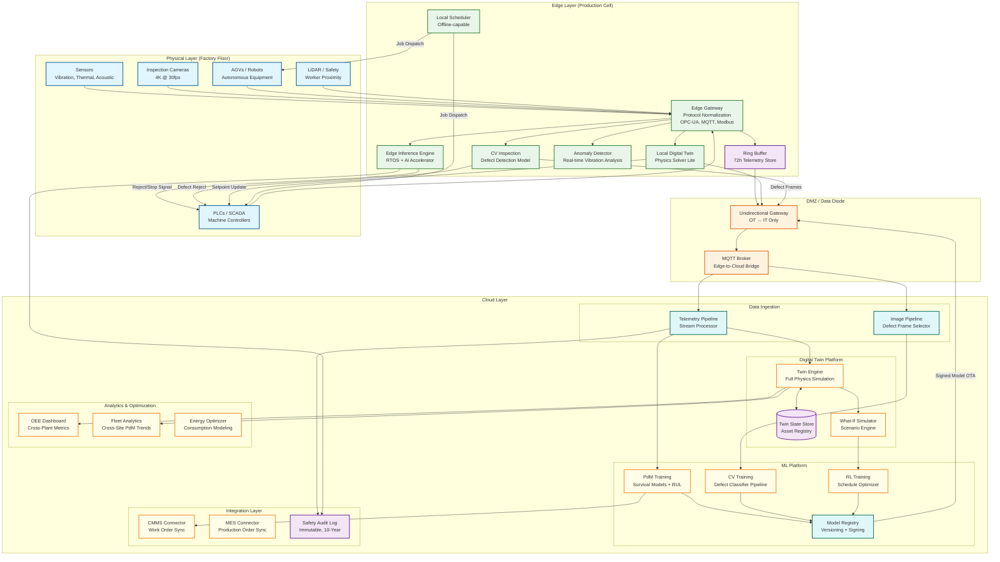
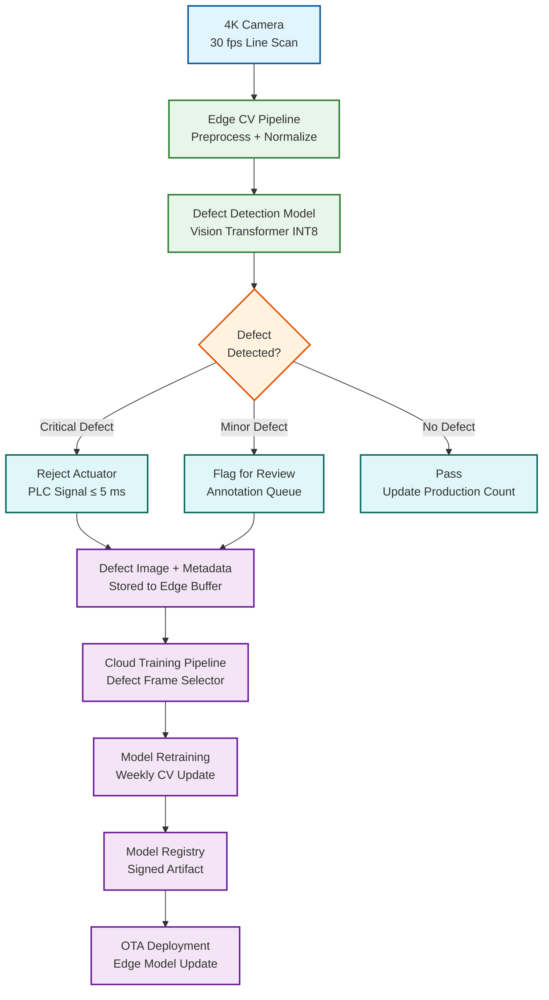

# 13.1 AI-Native Manufacturing Platform — High-Level Design

## System Architecture

---

## Key Design Decisions

### Decision 1: Edge-Fog-Cloud Hierarchy with Physics-Constrained Inference Placement

The platform does not use a uniform compute model. Every ML model is assigned to a specific compute tier based on its latency constraint:

| Tier | Latency Budget | Models | Hardware |
|---|---|---|---|
| **Edge (hard real-time)** | < 10 ms | Defect rejection, emergency stop, worker safety | RTOS + edge AI accelerator (NPU/GPU); hardware watchdog |
| **Fog (soft real-time)** | 100 ms – 2 s | PdM anomaly alerts, local twin sync, robot path planning | Edge server with general-purpose GPU; Linux RT kernel |
| **Cloud (batch/advisory)** | Seconds to minutes | Model training, fleet analytics, cross-plant scheduling, what-if simulation | Scalable GPU clusters; distributed storage |

**Implication:** Model deployment is not a uniform container push. Edge models must be compiled to specific accelerator targets (INT8 quantized, ONNX Runtime or TensorRT), tested against timing budgets on representative hardware, and deployed with rollback capability that preserves the previous model on-device until the new model passes acceptance tests.

### Decision 2: Unidirectional Data Flow from OT to IT (IEC 62443 Enforcement)

Data flows from the factory floor (OT network) to the analytics cloud (IT network) through a DMZ that enforces unidirectional communication for safety-critical segments:

- **OT → IT (allowed):** Sensor telemetry, twin state updates, defect images, audit logs
- **IT → OT (restricted):** Model artifacts (signed, integrity-verified), schedule recommendations (require local validation), twin setpoint suggestions (require PLC-side safety interlock confirmation)
- **IT → OT (blocked):** Direct PLC commands, unsolicited firmware updates, arbitrary network traffic

This is enforced by hardware data diodes in safety-critical segments (SIL-2 and above) and by firewall rules in lower-criticality segments. The model deployment pipeline pushes signed artifacts to a staging area in the DMZ; edge gateways pull from the staging area on their own schedule.

**Implication:** The cloud cannot "push" real-time commands to the factory floor. All closed-loop control runs at the edge. The cloud provides advisory outputs (recommended setpoints, schedule plans) that the edge validates and applies autonomously.

### Decision 3: Digital Twin as the Integration Backbone

Rather than building point-to-point integrations between PdM, CV, scheduling, and control systems, all subsystems communicate through the digital twin state:

- PdM writes health indices to the twin → scheduling reads health indices when planning maintenance windows
- CV writes quality metrics to the twin → the what-if simulator uses quality trends to evaluate process parameter changes
- The scheduler writes planned job sequences to the twin → robot coordination reads the sequence to plan paths
- Energy optimizer reads machine state from the twin → writes energy-optimal setpoint suggestions back to the twin

**Implication:** The twin state store becomes the single source of truth and the primary bottleneck. It must support high-throughput concurrent reads and writes from multiple subsystems, with conflict resolution for simultaneous setpoint suggestions from different optimizers. The twin uses a last-writer-wins strategy with priority tiers: safety overrides (highest) > quality holds > scheduling > energy optimization (lowest).

### Decision 4: Offline-First Edge Architecture

Every edge gateway maintains enough local state and compute capability to operate independently during cloud outages:

- **Local model cache:** All active inference models stored on edge NVMe; no model download needed at inference time
- **72-hour telemetry buffer:** Ring buffer on edge NVMe stores raw sensor data for post-outage upload and forensic analysis
- **Local scheduling fallback:** A constraint solver runs on-edge with the last-known production order list; produces valid (if suboptimal) schedules without cloud input
- **Twin state persistence:** Local twin state checkpointed to disk every 60 seconds; survives edge restart

**Implication:** Reconnection after a cloud outage triggers a delta sync protocol: edge uploads accumulated telemetry, twin state updates, and inference logs; cloud pushes any pending model updates and schedule adjustments. The sync protocol uses vector clocks per asset to detect and resolve conflicts between edge-autonomous decisions and cloud-planned decisions.

### Decision 5: Physics-Informed ML Over Pure Data-Driven Models

Pure data-driven models (e.g., training an LSTM on raw vibration time series to predict failure) require large volumes of run-to-failure data—which is rare in manufacturing (a well-maintained factory may see only 5–10 bearing failures per year per asset type). Physics-informed models combine:

- **Physics priors:** Known degradation models (Paris' law for crack growth, Archard's law for wear) provide the shape of the degradation curve
- **Sensor features:** Spectral features (FFT peaks, envelope analysis, kurtosis) extracted from vibration and acoustic data provide the current health indicator values
- **Digital twin simulation:** The twin generates synthetic run-to-failure trajectories by accelerating degradation in simulation, augmenting the sparse real failure data

**Implication:** The PdM pipeline is not a standard ML training loop. It includes a physics simulation stage (twin generates synthetic failures), a feature engineering stage (domain-specific spectral analysis), and a hybrid model training stage (combining physics priors with learned parameters). The ML engineer must collaborate with domain experts (reliability engineers, tribologists) to define the physics priors correctly.

---

## Data Flow: Sensor Reading to Predictive Maintenance Alert

```mermaid
flowchart LR
    A[Vibration Sensor\n50 kHz Accelerometer] --> B[Edge Gateway\nOPC-UA Ingestion]
    B --> C[Ring Buffer\nRaw Waveform Storage]
    C --> D[Feature Extractor\nFFT + Envelope + Kurtosis]
    D --> E[Anomaly Detector\nStatistical Process Control]
    E -->|Normal| F[Downsample + Forward\nSpectral Summary to Cloud]
    E -->|Anomaly Detected| G[Trigger Detailed Analysis\nFull Waveform Upload]
    F --> H[Cloud PdM Pipeline\n15-min RUL Refresh]
    G --> H
    H --> I[Survival Model\nPhysics-Informed RUL]
    I --> J{RUL < Threshold?}
    J -->|Yes| K[Auto-Generate\nMaintenance Ticket]
    J -->|No| L[Update Health Index\nin Digital Twin]
    K --> M[CMMS Integration\nSchedule + Parts Order]
    L --> N[OEE Dashboard\nAsset Health Heatmap]

    classDef sensor fill:#e1f5fe,stroke:#01579b,stroke-width:2px
    classDef edge fill:#e8f5e9,stroke:#2e7d32,stroke-width:2px
    classDef cloud fill:#f3e5f5,stroke:#6a1b9a,stroke-width:2px
    classDef decision fill:#fff3e0,stroke:#e65100,stroke-width:2px
    classDef output fill:#e0f7fa,stroke:#00695c,stroke-width:2px

    class A sensor
    class B,C,D,E edge
    class F,G,H,I cloud
    class J decision
    class K,L,M,N output
```

---

## Data Flow: Inline Quality Inspection

---

## Component Responsibilities Summary

| Component | Primary Responsibility | Key Interface |
|---|---|---|
| **Edge Gateway** | Protocol normalization (OPC-UA, MQTT, Modbus, EtherCAT → unified schema), sensor ingestion, time alignment (PTP), change-of-value filtering | Sensor bus → internal telemetry stream; dual-NIC OT/IT separation |
| **Edge Inference Engine** | RTOS-hosted model execution for safety-critical decisions; hardware watchdog enforcement; fail-safe state management | Telemetry stream → inference result → PLC actuator command |
| **Edge CV Pipeline** | Image acquisition, preprocessing, defect detection/classification, reject signal generation | Camera GigE Vision → model inference → PLC reject signal |
| **Local Digital Twin** | Lightweight physics solver for per-cell asset state; kinematics, thermal model; checkpoint to disk | Sensor stream → twin state update; twin state → setpoint suggestions |
| **DMZ / Data Diode** | Unidirectional OT→IT data flow enforcement; model artifact staging for IT→OT deployment | Edge buffer → cloud ingestion; model registry → edge staging area |
| **Cloud Telemetry Pipeline** | Stream processing of cloud-forwarded telemetry; time-series storage; feature aggregation for PdM | MQTT bridge → stream processor → time-series database |
| **Cloud Twin Engine** | Full-fidelity physics simulation; what-if scenarios; fleet-wide digital twin management | Telemetry stream + asset registry → full twin state; scenario API |
| **PdM Training Pipeline** | Survival model training; physics-informed feature engineering; synthetic failure generation from twin | Training data store → model training → model registry |
| **CV Training Pipeline** | Defect classifier retraining; active learning from human-annotated edge frames; model versioning | Defect image store → training → model registry → edge OTA |
| **RL Scheduling Engine** | Multi-agent RL training for production scheduling; evaluates in twin simulator before deployment | Twin simulator → RL training → scheduling policy → edge scheduler |
| **Model Registry** | Artifact versioning, signing, integrity verification, canary deployment orchestration | Training pipelines → registry → OTA deployment to edge fleet |
| **Safety Audit Log** | Immutable append-only log of all safety-critical decisions with cryptographic chaining | Edge inference events + PLC commands → append-only log; 10-year retention |
