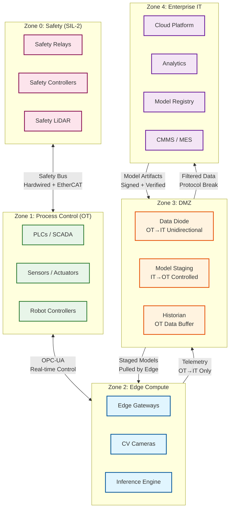

# 13.1 AI-Native Manufacturing Platform — Security & Compliance

## Regulatory Landscape

The AI-native manufacturing platform operates at the intersection of industrial cybersecurity, functional safety, and data protection—three regulatory domains with distinct and sometimes conflicting requirements.

### IEC 62443 — Industrial Automation and Control Systems Security

IEC 62443 is the primary cybersecurity standard for industrial environments. It defines a zone-and-conduit model that segments the network into security zones with controlled communication paths (conduits) between them.

**Platform obligations:**

| Requirement | Implementation |
|---|---|
| Zone segmentation | Factory floor (OT), DMZ, enterprise IT, and cloud are separate security zones; each zone has defined security level (SL-1 to SL-4) |
| Conduit control | All inter-zone communication traverses defined conduits with protocol-specific allow lists; no zone-to-zone routing outside conduits |
| Security levels per zone | OT zone: SL-3 (protection against intentional attack by sophisticated means); DMZ: SL-3; Cloud: SL-2 |
| Component hardening | Edge gateways run minimal OS (stripped Linux or RTOS); no unnecessary services; SSH disabled in production; all ports closed except defined conduit ports |
| Account management | No shared accounts; individual credentials per device and per human operator; machine-to-machine communication uses mutual TLS with per-device certificates |
| Incident response | Automated detection of unauthorized devices on OT network; alert within 30 seconds; automated quarantine of rogue devices |

### IEC 61508 — Functional Safety

IEC 61508 governs safety-critical control systems. The platform's edge inference engine participates in safety functions and must comply with the applicable Safety Integrity Level (SIL).

**SIL assignment for platform components:**

| Component | SIL Level | Rationale |
|---|---|---|
| Worker proximity detection (LiDAR/camera → machine stop) | SIL-2 | Direct worker safety; machine must stop within 50 ms of exclusion zone violation |
| Emergency stop via anomaly detection | SIL-1 | Equipment protection; AI provides early warning but PLC safety function is the primary safeguard |
| Defect rejection actuator | Not safety-rated | Quality function, not safety; failure mode is escaped defect, not personal injury |
| Production scheduling | Not safety-rated | Optimization function; no safety consequence of suboptimal schedule |

**SIL-2 compliance for worker proximity detection:**

```
SIL-2 requirements:
  Probability of dangerous failure per hour (PFH): < 10^-6
  Hardware fault tolerance: 1 (single fault does not cause dangerous failure)
  Systematic capability: SC 2

  Implementation:
    - Dual-channel sensor: LiDAR + camera; both must agree on "zone clear" to enable machine operation
    - Independent processing: two separate inference pipelines on different hardware
    - Voter logic: 2oo2 (both channels must agree on "safe") for machine enable;
                   1oo2 (either channel detects violation) for machine stop
    - Watchdog: Hardware watchdog on each channel; timeout → machine stop (fail-safe)
    - Proof test: Automated daily self-test of sensor paths and actuator response
    - Diagnostic coverage: > 90% (required for SIL-2)
```

### ISO 55000 — Asset Management

The PdM and digital twin components must align with ISO 55000 asset management principles:
- Asset lifecycle tracking from commissioning to decommissioning
- Documented maintenance strategy per asset class (time-based, condition-based, or predictive)
- Performance measurement (OEE, availability, reliability)
- Continuous improvement based on failure mode analysis

### GDPR — Worker Data Protection (EU Jurisdictions)

In EU factories, worker safety monitoring (LiDAR, camera-based proximity detection) may capture personal data:

| Data Type | Classification | Handling |
|---|---|---|
| Worker proximity coordinates | Personal data (location tracking of identifiable workers) | Purpose limitation: used only for safety; retention ≤ 24 hours unless incident |
| Safety camera footage | Personal data if workers identifiable | No facial recognition; silhouette-only processing; footage retained 7 days unless incident |
| Worker badge scan at machine login | Personal data | Used for access control and audit; retained per employment contract |
| Aggregated productivity metrics (per-cell, not per-worker) | Non-personal | Freely used for OEE analytics |

---

## OT/IT Network Security Architecture

### Zone and Conduit Model



### Data Diode Enforcement

For SIL-rated segments (Zone 0, Zone 1), the OT→IT boundary uses a hardware data diode—a physically unidirectional network device that allows data to flow from OT to IT but makes IT→OT communication physically impossible:

```
Data diode properties:
  Direction: OT → IT only (no return path at physical layer)
  Protocol: UDP-based; data diode transmits packets; no TCP handshake possible
  Throughput: 1 Gbps per diode link

  What crosses the diode:
    - Sensor telemetry (structured messages, one-way)
    - Safety audit log entries (one-way)
    - Twin state updates (one-way)
    - CV inspection results and defect images (one-way)

  What cannot cross the diode:
    - Commands from IT to OT (physically blocked)
    - Model artifacts (must use separate controlled conduit)
    - Configuration changes (must use separate controlled conduit)

  Model deployment path (separate from diode):
    - Model artifact uploaded to staging server in DMZ
    - Edge gateway polls staging server on scheduled interval (every 15 min)
    - Gateway verifies artifact signature before download
    - No push mechanism; edge always initiates the pull
```

---

## Model Security and Supply Chain

### Model Artifact Integrity

```
Model signing and verification:
  Signing:
    1. ML pipeline produces model artifact (weights + graph + metadata)
    2. Model hash computed: SHA-256 of complete artifact
    3. Hash signed with platform code-signing key (RSA-4096, stored in HSM)
    4. Signature + model hash stored in model registry alongside artifact

  Verification (at edge deployment):
    1. Edge gateway downloads artifact from DMZ staging server
    2. Computes SHA-256 of downloaded artifact
    3. Verifies signature using platform public key (embedded in gateway firmware)
    4. If verification fails: artifact rejected; alert raised; previous model retained
    5. If verification succeeds: artifact staged for deployment

  Supply chain protection:
    - Training pipeline runs in isolated compute environment (no internet access)
    - Training data access logged; requires dual approval
    - Model artifact is immutable after signing; any modification invalidates signature
    - No model can be deployed to edge without passing through the signing pipeline
```

### Adversarial Attack Surface for ML Models

| Attack Vector | Risk | Mitigation |
|---|---|---|
| Adversarial input to CV model (malicious pattern on part surface that causes misclassification) | Low probability in manufacturing (attacker would need physical access to production line) | Input validation: reject images outside expected intensity/contrast range; anomaly autoencoder detects out-of-distribution inputs |
| Model poisoning via training data manipulation | Compromised training data could train a model that misses specific defect types | Training data provenance tracking; anomaly detection on training loss curves; validation holdout from separate data source |
| Model extraction via edge inference API | Attacker queries edge model to reconstruct weights | Edge inference API is internal only (not exposed to IT network); rate limiting on internal API; no gradient information returned |
| Model evasion via environmental manipulation | Attacker manipulates lighting or camera angle to reduce CV accuracy | Calibration checks: periodic reference part inspection; alert if accuracy on reference parts degrades |

---

## Access Control

### Role-Based Access Matrix

| Role | Can Access | Cannot Access |
|---|---|---|
| Production Operator | Machine status, production counts, quality results for their cell | PdM model internals, raw sensor data, other cells |
| Maintenance Technician | Maintenance tickets, asset health indices, sensor trends for assigned assets | Model training data, scheduling algorithms, other plants |
| Quality Engineer | Inspection results, defect trends, CV model accuracy reports | Raw sensor telemetry, scheduling, PdM model parameters |
| Plant Manager | Plant-wide OEE, quality dashboards, maintenance KPIs | Model weights, raw telemetry, security zone configuration |
| ML Engineer | Model artifacts, training metrics, feature pipelines, model registry | Individual worker data, safety zone configurations |
| OT Security Engineer | Network zone configurations, firewall rules, device inventory, security alerts | Production data, quality results, business metrics |
| Platform Administrator | System configuration, edge gateway management, deployment orchestration | Individual worker data, safety interlock configuration (requires safety engineer) |
| Safety Engineer | Safety interlock configuration, SIL documentation, worker proximity system | ML model training, production scheduling, business analytics |

### Edge Device Authentication

```
Edge gateway authentication:
  Device identity: Per-device X.509 certificate issued during commissioning
  Certificate rotation: Every 90 days via automated renewal through DMZ CA
  Mutual TLS: All edge-to-cloud communication uses mTLS; both sides verify certificates

  PLC-to-gateway authentication:
    OPC-UA: Application-level certificate authentication per OPC-UA specification
    EtherCAT: Network-level isolation (dedicated physical bus); no authentication layer (protocol limitation)
    MQTT: Username/password + TLS; per-device credentials

  Decommissioning:
    Device certificate revoked in CRL within 1 hour of decommission request
    Edge gateway data wiped (secure erase of NVMe) before physical removal
    All model artifacts and cryptographic material destroyed
```

---

## Safety Audit Log Design

```
safety_audit_entry {
  entry_id:        UUID
  timestamp:       uint64              -- nanosecond precision, PTP-synchronized
  prev_entry_hash: bytes[32]           -- SHA-256 chain; tamper-evident

  event_type:      enum               -- EMERGENCY_STOP | DEFECT_REJECT | SETPOINT_CHANGE |
                                       -- SAFETY_ZONE_VIOLATION | MODEL_DEPLOYMENT |
                                       -- MAINTENANCE_ACTION | OPERATOR_OVERRIDE

  source: {
    plant_id:      string
    cell_id:       string
    asset_id:      UUID
    gateway_id:    string
    model_version: string | null
  }

  event_data: {
    trigger:       string              -- what triggered the event
    sensor_values: map<string, float64> -- sensor readings at event time
    action_taken:  string              -- what the system did
    response_time_ms: float64          -- detection-to-action latency
    human_present: boolean | null      -- from proximity detection
  }

  entry_hmac:      bytes               -- HMAC-SHA256; key in edge TPM
}

Retention: 10 years (regulatory requirement for IEC 61508 compliance)
Storage: Edge-local → replicated to cloud (append-only, immutable)
Integrity: Hash chain verified daily; HMAC verified on every read
Access: Read-only for all roles except safety engineer (who can annotate, not modify)
```
