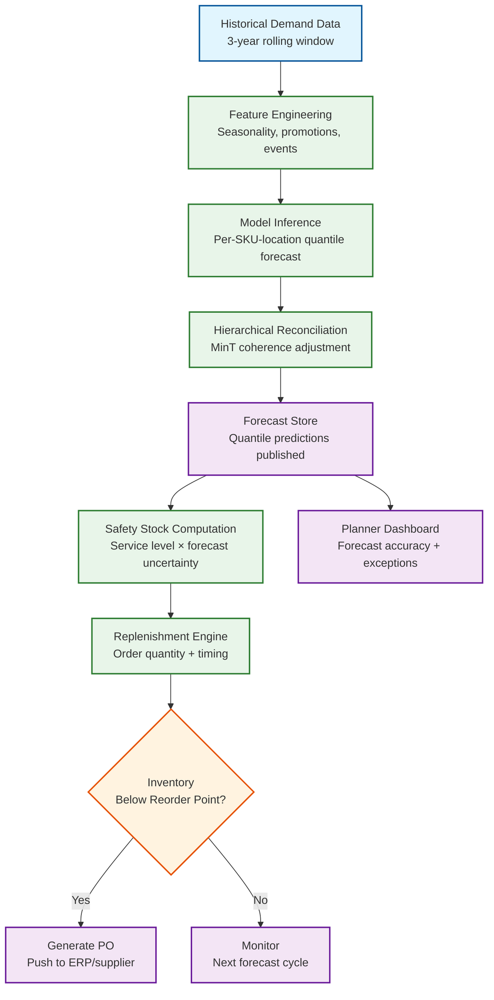

# 13.2 AI-Native Logistics & Supply Chain Platform — High-Level Design

## System Architecture

```mermaid
flowchart TB
    subgraph Sources["Data Sources"]
        GPS[GPS / Cellular Trackers]
        EDI[EDI Messages\n204/214/990]
        AIS[AIS / ADS-B\nOcean & Air]
        IOT[IoT Sensors\nTemp / Humidity / Vibration]
        TEL[Vehicle Telematics\nOBD-II / CAN Bus]
        ERP[ERP / OMS\nOrder Feeds]
    end

    subgraph Gateway["Ingestion & Gateway Layer"]
        IGWY[Telemetry Ingestion Gateway\nProtocol Normalization]
        OGWY[Order API Gateway\nAuth + Rate Limiting]
        CCON[Carrier Connector Hub\n80K+ Carriers]
    end

    subgraph Stream["Stream Processing Layer"]
        SEP[Shipment Event Processor\nEnrichment + Dedup]
        TEP[Telemetry Event Processor\nGeofence + Anomaly Detection]
        CEP[Complex Event Processor\nDisruption Detection]
    end

    subgraph Core["Core Intelligence Services"]
        RTE[Route Optimization Engine\nVRP Solver + Re-optimizer]
        DFS[Demand Forecasting Service\nHierarchical Probabilistic]
        WHO[Warehouse Orchestrator\nAMR + Pick-Path + Slotting]
        FMS[Fleet Management Service\nPredictive Maintenance + Safety]
        LMD[Last-Mile Delivery Optimizer\nDynamic Routing + ETA]
        INV[Inventory Intelligence\nSafety Stock + Replenishment]
    end

    subgraph Visibility["Visibility & Analytics Layer"]
        ETA[ETA Prediction Engine\nML-based Multi-modal]
        VIS[Visibility Service\nUnified Shipment Timeline]
        DIS[Disruption Manager\nClassification + Re-routing]
        SIM[What-If Simulator\nScenario Engine]
    end

    subgraph Data["Data Layer"]
        TSS[(Time-Series Store\nTelemetry & Sensors)]
        SDB[(Shipment DB\nLifecycle Records)]
        GDB[(Graph DB\nSupply Network Topology)]
        FDB[(Forecast Store\nQuantile Predictions)]
        WDT[(Warehouse Digital Twin\nReal-time State)]
        OBJ[(Object Storage\nCold Chain Audit / Archive)]
    end

    subgraph Consumer["Consumer Layer"]
        SHP[Shipper Dashboard]
        DRV[Driver Mobile App]
        CTR[Customer Tracking Page]
        PLN[Planner Workbench]
        API_OUT[Partner APIs]
    end

    GPS & AIS & IOT & TEL --> IGWY
    EDI --> CCON
    ERP --> OGWY

    IGWY --> SEP & TEP
    CCON --> SEP
    OGWY --> RTE & INV

    SEP --> VIS & ETA
    TEP --> CEP & FMS
    CEP --> DIS

    DIS --> RTE
    ETA --> VIS & LMD
    VIS --> SHP & CTR

    RTE --> SDB & DRV
    DFS --> FDB & INV
    WHO --> WDT & DRV
    FMS --> TSS & SHP
    LMD --> DRV & CTR
    INV --> SDB & PLN

    SIM --> PLN

    SEP & TEP --> TSS
    RTE & LMD --> SDB
    DFS --> FDB
    WHO --> WDT
    VIS --> GDB

    SHP & PLN --> OGWY
    API_OUT --> OGWY

    classDef source fill:#e1f5fe,stroke:#01579b,stroke-width:2px
    classDef gateway fill:#fff3e0,stroke:#e65100,stroke-width:2px
    classDef service fill:#e8f5e9,stroke:#2e7d32,stroke-width:2px
    classDef data fill:#f3e5f5,stroke:#6a1b9a,stroke-width:2px
    classDef cache fill:#fffde7,stroke:#f57f17,stroke-width:2px
    classDef queue fill:#e0f7fa,stroke:#00695c,stroke-width:2px
    classDef consumer fill:#fce4ec,stroke:#880e4f,stroke-width:2px

    class GPS,EDI,AIS,IOT,TEL,ERP source
    class IGWY,OGWY,CCON gateway
    class SEP,TEP,CEP,RTE,DFS,WHO,FMS,LMD,INV,ETA,VIS,DIS,SIM service
    class TSS,SDB,GDB,FDB,WDT,OBJ data
    class SHP,DRV,CTR,PLN,API_OUT consumer
```

---

## Key Design Decisions

### Decision 1: Event-Driven Telemetry Pipeline with Per-Shipment Ordering

All telemetry (GPS pings, sensor readings, EDI status updates, carrier API callbacks) flows through a unified event ingestion gateway that normalizes heterogeneous protocols into a canonical shipment event format. Events are partitioned by shipment_id in the stream processing layer, guaranteeing per-shipment causal ordering while allowing parallel processing across millions of concurrent shipments. This design is critical because a GPS ping that arrives before its corresponding "pickup confirmed" EDI message must not cause the ETA model to conclude the shipment is in transit without a confirmed pickup—the per-shipment ordering ensures events are processed in the correct causal sequence even when they arrive out of order from different sources.

**Implication:** The ingestion gateway must handle protocol translation (MQTT for IoT, HTTP for carrier APIs, AS2/SFTP for EDI, AIS NMEA for ocean) and apply per-shipment sequence numbering before routing to the stream processor. Late-arriving events (EDI messages delayed by hours) are replayed against the current shipment state using event sourcing semantics—the shipment timeline is reconstructed, not overwritten.

### Decision 2: Warm-Start Metaheuristic Solver for Route Optimization

The route optimization engine does not re-solve VRP instances from scratch on every change. Instead, it maintains a live solution state per depot and applies incremental perturbation when conditions change: a new order inserts a stop into the cheapest feasible position; a traffic delay shifts subsequent stop ETAs and may trigger stop resequencing; a vehicle breakdown reassigns affected stops to nearby vehicles. Only when cumulative perturbations degrade solution quality below a threshold (measured by total cost increase vs. last full solve) does the engine trigger a full re-optimization. This warm-start approach reduces re-optimization latency from 30 seconds (full solve) to under 5 seconds (incremental perturbation) for 90% of real-time changes.

**Implication:** The solver must maintain an in-memory representation of the current solution that supports efficient insert, remove, and resequence operations on individual routes. This is architecturally distinct from a batch solver that takes input, computes output, and discards state. The warm-start solution state must be checkpointed to durable storage every 60 seconds for crash recovery.

### Decision 3: Probabilistic Forecasting with Coherent Reconciliation

The demand forecasting service generates quantile predictions (P10, P25, P50, P75, P90) rather than single point forecasts. Quantile forecasts propagate uncertainty into downstream inventory decisions: safety stock is set based on the spread between P50 and P95, not on a single expected value plus a static safety factor. However, quantile forecasts generated independently at each level of the product-geography hierarchy are mathematically incoherent (the sum of SKU-level P90 forecasts does not equal the category-level P90 forecast). The platform applies MinT (Minimum Trace) optimal reconciliation to adjust all forecasts simultaneously, minimizing total forecast error subject to the coherence constraint.

**Implication:** Reconciliation is a large-scale matrix operation (10M SKU-location combinations × multiple hierarchy levels) that runs as a post-processing step after individual model inference. It requires a distributed linear algebra framework and is the computational bottleneck in the forecast pipeline—not the individual model inference.

### Decision 4: Warehouse Digital Twin as the Planning Surface

Warehouse orchestration does not plan against an idealized warehouse model; it plans against a continuously updated digital twin that reflects the real-time physical state: AMR positions and battery levels, bin occupancy, conveyor segment status, human picker locations and productivity rates, dock door assignments, and zone temperatures. Every physical state change (AMR completes a task, picker scans a bin, conveyor stops) is reflected in the digital twin within 1 second. The optimization layer (pick-path, slotting, wave planning) queries the digital twin as its input state, not a static configuration file. This ensures that computed plans are physically feasible at the moment they are issued.

**Implication:** The digital twin is a per-warehouse in-memory data structure that receives ~2,000 state updates per second (from AMR position updates alone). It must support concurrent reads (optimization queries) and writes (state updates) without lock contention degrading latency. A CRDT-based state model or actor-based concurrency model is appropriate.

### Decision 5: Multi-Source ETA Prediction with Source-Specific Confidence Weighting

ETA predictions are generated by an ML model that ingests the latest telemetry from all available sources for a shipment and produces a time-to-arrival distribution (not a single point estimate). The model assigns confidence weights to each source based on the transport mode, geography, and historical reliability: GPS pings from a truck are weighted heavily; EDI status updates from a carrier with a history of delayed reporting are down-weighted; AIS pings in congested port areas are weighted lower than in open ocean. The ETA model is retrained weekly using actual delivery timestamps as ground truth labels.

**Implication:** The ETA model must handle missing inputs gracefully (a shipment in rural Africa may have only hourly satellite pings; a shipment in urban Germany has GPS every 10 seconds). The model architecture uses a masked attention mechanism that naturally handles variable-length, irregularly sampled telemetry sequences.

---

## Data Flow: Order to Delivery

```mermaid
flowchart LR
    A[Order Received\nfrom ERP/OMS] --> B[Order Validation\n+ Inventory Check]
    B --> C[Carrier Selection\nRate + SLA + Capacity]
    C --> D[Route Optimization\nVRP Solver assigns stops]
    D --> E[Dispatch\nDriver App receives route]
    E --> F[In-Transit Tracking\nGPS + IoT telemetry stream]
    F --> G{Anomaly\nDetected?}
    G -->|Yes| H[Disruption Manager\nClassify + Re-route]
    H --> D
    G -->|No| I[ETA Update\nML prediction refreshed]
    I --> J[Customer Notification\nProactive status + live map]
    J --> K[Delivery\nProof-of-delivery capture]
    K --> L[Post-Delivery\nCarrier scorecard update]

    classDef input fill:#e1f5fe,stroke:#01579b,stroke-width:2px
    classDef process fill:#e8f5e9,stroke:#2e7d32,stroke-width:2px
    classDef decision fill:#fff3e0,stroke:#e65100,stroke-width:2px
    classDef output fill:#f3e5f5,stroke:#6a1b9a,stroke-width:2px

    class A,B input
    class C,D,E,F,H,I process
    class G decision
    class J,K,L output
```

---

## Data Flow: Demand Forecast to Replenishment

---

## Component Responsibilities Summary

| Component | Primary Responsibility | Key Interface |
|---|---|---|
| **Telemetry Ingestion Gateway** | Protocol normalization (MQTT, HTTP, AS2, AIS NMEA), rate limiting, per-shipment partitioning | Produces canonical events to stream processing layer |
| **Shipment Event Processor** | Event enrichment (carrier name, route context), deduplication, sequence correction | Reads from ingestion queue; writes to shipment DB and visibility service |
| **Route Optimization Engine** | VRP solving with warm-start incremental re-optimization; route assignment to vehicles | gRPC API; maintains in-memory solution state per depot |
| **Demand Forecasting Service** | Probabilistic forecast generation and hierarchical reconciliation | Batch pipeline; publishes to forecast store; consumed by inventory service |
| **Warehouse Orchestrator** | AMR task assignment, pick-path optimization, wave planning, slotting optimization | Real-time API; reads/writes digital twin; commands AMR fleet controller |
| **Fleet Management Service** | Telematics aggregation, predictive maintenance scheduling, driver safety scoring | Ingests from telematics stream; writes maintenance alerts and driver reports |
| **Last-Mile Delivery Optimizer** | Dynamic routing for delivery drivers; real-time ETA; proof-of-delivery processing | Mobile app API; 60-second re-optimization cycle; customer tracking feed |
| **ETA Prediction Engine** | ML-based time-to-arrival estimation with confidence intervals | Consumes telemetry events; publishes ETA updates to visibility service |
| **Visibility Service** | Unified shipment timeline assembly; tracking page data serving | Read API for dashboards, tracking pages, and partner APIs |
| **Disruption Manager** | Anomaly classification, disruption severity scoring, re-routing recommendation | Triggered by complex event processor; feeds re-routing to route engine |
| **Inventory Intelligence** | Safety stock computation, replenishment recommendation, dead stock detection | Consumes forecasts; writes replenishment orders to ERP integration |
| **What-If Simulator** | Scenario simulation for planners (disruptions, demand spikes, network changes) | Interactive API; reads supply network graph; returns simulated outcomes |
