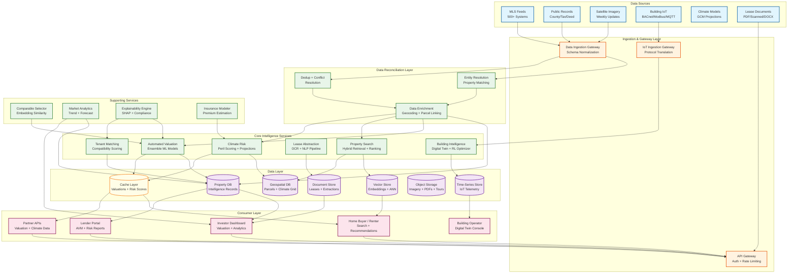
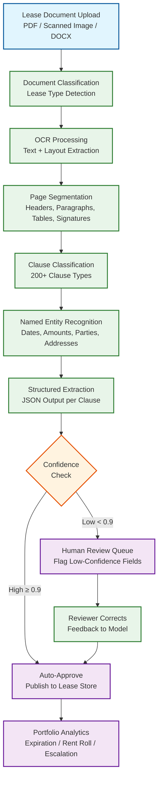

# 13.4 AI-Native Real Estate & PropTech Platform — High-Level Design

## System Architecture

---

## Key Design Decisions

### Decision 1: Entity Resolution as a First-Class Reconciliation Layer

All property data flows through a dedicated entity resolution layer before reaching any intelligence service. A single physical property may appear as different records across MLS feeds (using MLS-specific IDs), county tax rolls (using assessor parcel numbers), deed records (using legal descriptions), and building sensor systems (using building management system IDs). The entity resolution layer maintains a canonical property graph where each node is a unique physical property and edges link to all known external identifiers. Resolution uses a combination of address parsing and normalization (handling abbreviations, unit numbering schemes, directional prefixes), geospatial proximity matching (records within 10m of each other are candidate matches), and learned entity matching models trained on manually verified match/non-match pairs.

**Implication:** Every downstream service (AVM, search, climate risk) operates on canonical property IDs, not source-specific IDs. When a new MLS listing arrives, the ingestion pipeline first resolves it to a canonical property (or creates a new one), then enriches the property record with the new data. This prevents duplicate properties in search results and ensures that a property's valuation incorporates data from all sources, not just the source that happened to be queried. The entity resolution model must be retrained monthly as new address formats, subdivision plats, and county recording practices emerge.

### Decision 2: Spatial-Aware Model Architecture for Property Valuation

The AVM uses an ensemble of three model families that capture different aspects of property value: (1) a gradient-boosted tree model trained on property-level features (square footage, bedrooms, bathrooms, lot size, year built, renovation history, condition scores from listing photos) that captures intrinsic property value; (2) a spatial autoregressive model that captures neighborhood effects and spatial autocorrelation (properties near high-value properties tend to be higher-value, beyond what property-level features explain); and (3) a temporal model that captures market trend momentum at the census-tract level. The ensemble weights are learned per-geography because the relative importance of intrinsic vs. spatial vs. temporal factors varies by market (dense urban markets are more spatially correlated; rural markets are more driven by intrinsic features).

**Implication:** The spatial model requires a pre-computed spatial weight matrix defining neighbor relationships among properties. For 140M properties, a naive full spatial weight matrix is infeasible. The platform uses a K-nearest-neighbor spatial weight matrix (K=15) stored as a sparse matrix, with neighbor distances pre-computed using a geospatial index. This matrix must be recomputed when new properties are added (new construction) or spatial relationships change (new highway, school district rezoning). The recomputation runs as an incremental update (only affected neighborhoods) rather than a full rebuild.

### Decision 3: Two-Tier Building IoT Architecture with Safety Priority

Building IoT data flows through two separate paths based on criticality. Safety-critical sensors (smoke, CO, CO2, fire, flood) use a dedicated low-latency path that bypasses the general ingestion pipeline: sensor → edge gateway → local safety controller → actuation, with a maximum latency budget of 100ms. The safety controller runs on dedicated hardware at the building edge and can actuate emergency responses (ventilation override, sprinkler activation, elevator recall) without any dependency on cloud connectivity. Non-safety sensors (temperature, humidity, occupancy, energy meters) flow through the standard IoT ingestion pipeline to the cloud-hosted digital twin, where the reinforcement learning optimizer processes them on 5-minute cycles for HVAC and energy optimization.

**Implication:** The building edge gateway must maintain a local copy of safety rules and actuation logic that continues operating even during complete network partition from the cloud. The cloud-hosted digital twin receives safety events asynchronously (for logging and analytics) but never sits in the critical path for safety actuation. This split architecture means that the safety path is simple, deterministic, and testable (no ML in the loop), while the optimization path can use complex RL models that are acceptable to fail or degrade gracefully.

### Decision 4: Hybrid Retrieval Architecture for Property Search

Property search combines four retrieval modalities into a single ranked result: (1) geospatial filtering using H3 hexagonal grid indexing at resolution 9 (~175m hexagons) for location-based queries; (2) structured attribute filtering (price range, bedrooms, property type) using inverted indices; (3) semantic search using sentence-transformer embeddings of listing descriptions for natural language queries ("cozy craftsman with a big yard near parks"); and (4) visual similarity search using CNN-extracted embeddings of listing photos for "find homes that look like this" queries. The retrieval pipeline uses a two-stage architecture: stage 1 generates candidate sets from each modality independently (top 500 per modality), then stage 2 applies a learned-to-rank model that fuses candidates into a single ranked list personalized to the user's search history and implicit preferences.

**Implication:** Each modality maintains its own index optimized for its retrieval type (H3 grid for geo, inverted index for attributes, HNSW graph for embeddings). The fusion stage must be latency-bounded (≤ 20ms) because it runs on every query after candidate retrieval. The learn-to-rank model is a lightweight gradient-boosted model (not a deep neural network) trained on click-through data, query-listing-click triples, and listing quality scores. Personalization features (user's past searches, saved homes, price sensitivity) are fetched from a user profile cache with ≤ 2ms latency.

### Decision 5: Pre-Computed Climate Risk Scores with On-Demand Scenario Analysis

Climate risk scoring operates in two modes: (1) pre-computed scores for all 150M parcels across a standard set of scenarios (SSP2-4.5, SSP5-8.5) and time horizons (2030, 2050, 2080), refreshed annually when new downscaled climate model outputs become available; and (2) on-demand scenario analysis for custom queries (e.g., "what if sea level rises 1.5m by 2060 and this building adds flood barriers?"). Pre-computed scores are served from a cache with ≤5ms latency. On-demand analysis runs against the climate grid data with building-specific vulnerability adjustments and takes up to 5 seconds per property.

**Implication:** The annual pre-computation is a massive batch job (150M parcels × 6 perils × multiple scenarios) that takes ~21 hours parallelized across 200 workers. This job runs in a dedicated compute pool and its output is atomically swapped into the serving cache. The on-demand mode allows investors and insurers to model custom scenarios (different emission pathways, building-level mitigation measures) that are not in the pre-computed set. The platform must version climate model inputs so that risk scores are traceable to specific GCM outputs and downscaling methodologies for audit purposes.

---

## Data Flow: MLS Listing to Searchable Property

```mermaid
flowchart LR
    A[MLS Feed Update\nNew/Modified Listing] --> B[Schema Normalization\nMap to Canonical Fields]
    B --> C[Entity Resolution\nMatch to Canonical Property]
    C --> D{New Property\nor Update?}
    D -->|New| E[Create Property Record\nAssign Canonical ID]
    D -->|Update| F[Merge Updates\nConflict Resolution]
    E & F --> G[Data Enrichment\nGeocode + Parcel Link + School District]
    G --> H[Feature Extraction\nPhoto CV + Text Embedding]
    H --> I[Index Updates\nGeo + Text + Visual + Attribute]
    I --> J[AVM Trigger\nRecompute Valuation]
    J --> K[Search Ready\nListing Queryable in ≤ 15 min]

    classDef input fill:#e1f5fe,stroke:#01579b,stroke-width:2px
    classDef process fill:#e8f5e9,stroke:#2e7d32,stroke-width:2px
    classDef decision fill:#fff3e0,stroke:#e65100,stroke-width:2px
    classDef output fill:#f3e5f5,stroke:#6a1b9a,stroke-width:2px

    class A input
    class B,C,G,H,I,J process
    class D decision
    class E,F,K output
```

---

## Data Flow: Lease Document to Structured Intelligence

---

## Component Responsibilities Summary

| Component | Primary Responsibility | Key Interface |
|---|---|---|
| **Data Ingestion Gateway** | MLS feed polling (500+ feeds), public records ingestion, satellite imagery download; schema normalization across heterogeneous sources | Produces canonical property events to reconciliation layer |
| **Entity Resolution Service** | Match incoming records to canonical properties using address normalization, geospatial proximity, and learned matching models | Reads from ingestion queue; writes to property graph; exposes resolution API |
| **Automated Valuation Engine** | Ensemble model inference (GBT + spatial + temporal); comparable selection via embedding similarity; confidence interval computation; bias detection | gRPC API for on-demand; batch pipeline for nightly refresh; writes to property DB and cache |
| **Building Intelligence Service** | IoT telemetry aggregation; digital twin state management; RL-based HVAC optimization; predictive maintenance scheduling; occupancy analytics | Ingests from IoT gateway; reads/writes digital twin state; commands building actuators |
| **Tenant Matching Service** | Credit risk scoring; income verification; compatibility scoring; Fair Housing compliance checking; adverse action reason generation | REST API; reads applicant data + property features; writes screening decisions with audit trail |
| **Lease Abstraction Pipeline** | OCR, layout analysis, clause classification, entity extraction; human-in-the-loop review orchestration; model retraining from corrections | Batch pipeline; reads lease documents from object storage; writes structured extractions to document store |
| **Property Search Service** | Hybrid retrieval (geo + text + visual + attribute); personalized ranking; natural language query understanding | REST API; reads from search indices and vector store; serves consumer and API clients |
| **Climate Risk Service** | Per-parcel risk scoring across 6 perils; scenario analysis; TCFD report generation; climate-adjusted valuation | Pre-computed batch scoring + on-demand API; reads climate grid data; writes scores to cache and geospatial DB |
| **Comparable Selector** | Embedding-based comparable property identification and ranking; adjustment factor computation | Called by AVM; reads property embeddings from vector store; returns ranked comparable set |
| **Market Analytics Service** | Neighborhood trend computation; price index construction; forward-looking market forecasts | Batch pipeline; reads transaction history; publishes market indices; serves dashboards |
| **Explainability Engine** | SHAP value computation; feature importance ranking; regulatory compliance reports; adverse action reason generation | Called by AVM and tenant matching; reads model internals; writes explainability reports |
| **Insurance Modeling Service** | Premium estimation from climate risk + building characteristics; mitigation impact modeling | Reads climate scores and property attributes; writes premium estimates; serves what-if API |
