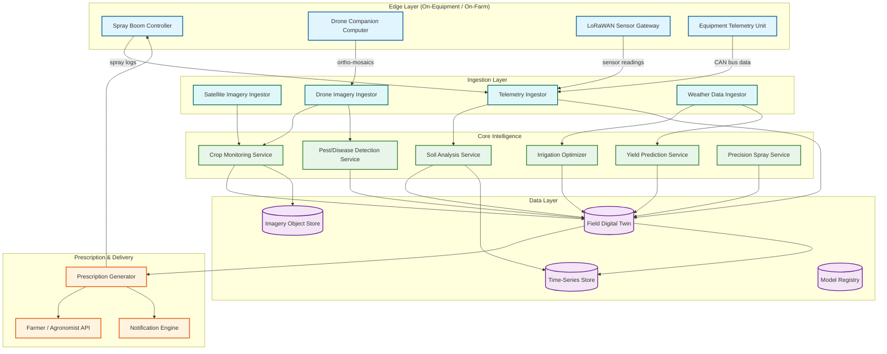
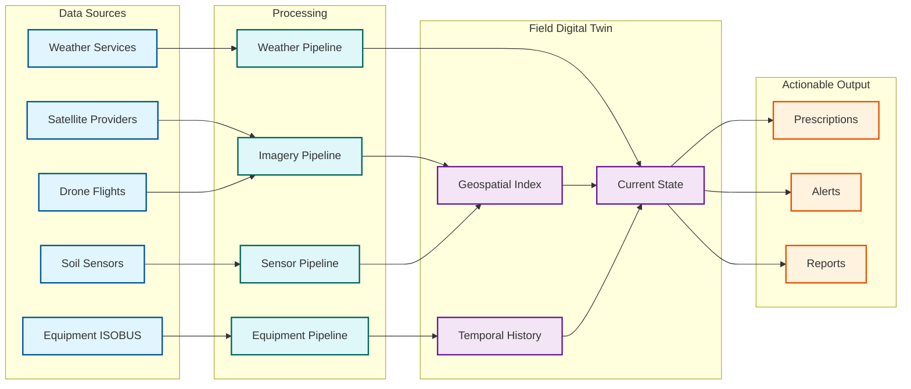

# 13.5 AI-Native Agriculture & Precision Farming Platform — High-Level Design

## System Architecture

The platform follows an edge-cloud hybrid architecture organized into six primary subsystems, each responsible for a distinct agricultural intelligence domain, connected through a shared field digital twin that serves as the unified geospatial state representation.

---

## Subsystem Responsibilities

### 1. Satellite Imagery Pipeline

Ingests raw satellite imagery from multiple providers (free Sentinel-2 at 10m resolution, commercial providers at 3m), applies atmospheric correction (converting top-of-atmosphere reflectance to surface reflectance), performs cloud masking (identifying and excluding cloud-contaminated pixels), computes vegetation indices (NDVI, NDRE, SAVI, EVI), and generates field-level health maps with anomaly detection. The pipeline runs on a schedule aligned with satellite revisit cycles (every 5 days for Sentinel-2, daily for commercial) and publishes processed products to the imagery object store and anomaly events to the crop monitoring service.

### 2. Drone Analytics Engine

Receives high-resolution imagery uploads from drone companion computers, performs ortho-mosaic stitching (aligning hundreds of overlapping images into a single georeferenced composite), generates digital surface models (DSM) for crop height estimation, runs plant-level detection models for stand counting and canopy coverage, and feeds results into the pest/disease detection service and field digital twin. Processing is compute-intensive (GPU-accelerated photogrammetry) and is handled by auto-scaling worker pools.

### 3. Precision Spray Controller (Edge)

The most latency-critical subsystem. Runs entirely on edge hardware mounted on the spray boom—typically an embedded GPU (e.g., Jetson-class) or FPGA connected to 8–24 cameras and 24–48 PWM solenoid nozzle controllers. The controller captures images at 30 FPS, runs a quantized object detection model (weed/crop/soil classification) in < 8 ms, maps detections to nozzle positions using calibrated camera-to-nozzle geometry, and actuates solenoid valves within the 15 ms total latency budget. The controller operates fully autonomously—no cloud dependency—and uploads spray logs (nozzle actuation records with GPS coordinates) when connectivity is available.

### 4. Soil Intelligence Service

Aggregates data from LoRaWAN/NB-IoT soil sensors (moisture, temperature, pH, macronutrients), applies sensor calibration corrections (compensating for drift over the sensor's 5-year lifespan), fuses point measurements with satellite-derived soil moisture estimates and historical yield maps to produce high-resolution soil variability maps, and generates variable-rate application (VRA) prescription maps for seeding, fertilization, and liming. The service maintains per-sensor calibration models that are updated whenever ground-truth soil samples are submitted.

### 5. Yield Prediction Service

Runs a hybrid prediction pipeline: (1) a physics-based crop growth simulation component that models photosynthesis, water uptake, nitrogen dynamics, and phenological development as a function of weather, soil, and management inputs; (2) an ML component that corrects simulation bias using historical satellite observations and yield data. The hybrid output is a probabilistic yield distribution per field (or per management zone) updated weekly through the growing season. As the season progresses and more observations accumulate, prediction uncertainty narrows—early-season predictions have wide confidence intervals, harvest-time predictions converge to ±5%.

### 6. Irrigation Optimizer

Computes optimal irrigation schedules by combining: Penman-Monteith reference evapotranspiration (ET₀) from weather data, crop-specific coefficients (Kc) that vary by growth stage, soil water balance models driven by real-time moisture sensor data, and 10-day weather forecasts for precipitation and temperature. The optimizer generates zone-level schedules for center-pivot systems (scheduling water application per pivot sector) and field-level schedules for drip systems, with automated control via IoT-connected irrigation controllers. Supports deficit irrigation strategies that intentionally apply less water than crop demand during stress-tolerant growth stages to optimize water use efficiency.

---

## Data Flow Architecture

### Primary Data Flows

### Edge-to-Cloud Synchronization

The platform uses a tiered synchronization strategy:

| Data Type | Edge Behavior | Sync Strategy | Conflict Resolution |
|---|---|---|---|
| Spray decisions | Made entirely on-edge; no cloud dependency | Upload spray logs post-session; batch compress | Cloud is append-only; no conflicts |
| Sensor readings | Buffered on LoRaWAN gateway | Confirmed uplinks; retry on failure; batch upload every 15 min | Last-writer-wins with sensor timestamp |
| Prescription maps | Cached on edge from last cloud sync | Pull new prescriptions when connectivity available; use cached version if offline | Cloud prescription always authoritative; edge never modifies |
| Equipment telemetry | Buffered on equipment controller | Store-and-forward; upload when in range of farm WiFi or cellular | Append-only; deduplicated by equipment ID + timestamp |
| Drone imagery | Processed on drone companion for immediate results | Full-resolution upload when drone returns to base (WiFi) | Cloud reprocesses with full pipeline; edge results are preliminary |

---

## Key Design Decisions

### Decision 1: Edge-First Spray Control vs. Cloud-Assisted

**Choice:** Fully autonomous edge spray control with no cloud dependency during spraying operations.

**Rationale:** The 12–15 ms latency budget for camera-to-nozzle actuation makes cloud round-trips physically impossible (even the fastest cellular round-trip exceeds 50 ms). Additionally, spraying often occurs in areas with no cellular coverage. The edge controller must contain the complete inference pipeline: image capture, preprocessing, model inference, nozzle mapping, and valve actuation. Cloud's role is limited to model training, model deployment (OTA updates during off-hours), and post-session analytics on spray logs.

**Trade-off:** Edge models are smaller (quantized to INT8, ~200 MB) and less accurate than cloud models. The platform compensates by using conservative spray thresholds on edge (spray when weed confidence > 60%) and using cloud analytics on spray logs to identify systematic misclassifications that inform the next model update.

### Decision 2: LoRaWAN vs. Cellular for Soil Sensors

**Choice:** LoRaWAN for soil sensor networks with cellular backhaul at gateways.

**Rationale:** Soil sensors must operate for 5+ years on a single battery, report from locations with no cellular coverage, and be deployed at densities of 1 sensor per 10 acres (500+ sensors on a 5,000-acre farm). LoRaWAN provides 10+ km range per gateway, consumes < 50 mW during transmission (enabling 5-year battery life on a coin cell), and supports up to 500 devices per gateway. Cellular (NB-IoT) has better QoS but higher power consumption (reducing battery life to 2–3 years) and requires per-device SIM provisioning.

**Trade-off:** LoRaWAN has limited bandwidth (~250 bytes per uplink) and no guaranteed latency. The platform batches sensor readings (4 readings per uplink, transmitted every 15 minutes) and uses confirmed uplinks for critical alerts (e.g., frost detection) to ensure delivery.

### Decision 3: Hybrid Yield Prediction (Physics + ML) vs. Pure ML

**Choice:** Hybrid approach that runs a simplified crop growth simulation and uses ML to correct simulation residuals.

**Rationale:** Pure ML models trained on historical yield data struggle with out-of-distribution scenarios (unprecedented drought, new crop varieties, novel management practices) because they have no mechanistic understanding of plant biology. Physics-based crop simulation models (like DSSAT and APSIM) encode biological knowledge but are poorly calibrated for individual fields. The hybrid approach uses the physics model to provide a biologically grounded baseline prediction and the ML model to learn field-specific corrections from historical data. This improves prediction accuracy by 20–33% compared to either approach alone and maintains reasonable accuracy even in novel weather conditions.

**Trade-off:** The hybrid approach is computationally expensive (~500 ms per prediction unit for simulation vs. ~50 ms for pure ML). The platform mitigates this by running full simulation only on a 10% sample of prediction units and interpolating for the remainder using spatial kriging.

### Decision 4: Field Digital Twin as Central State vs. Per-Service Data Stores

**Choice:** A shared field digital twin that serves as the canonical, continuously updated representation of each field, accessible by all services.

**Rationale:** Agricultural decisions require cross-domain context: irrigation scheduling needs soil moisture (soil service), crop growth stage (crop monitoring), weather forecast (weather service), and upcoming field operations (equipment service). Without a shared state, each service must independently integrate data from other services, leading to inconsistent field representations and duplicated data fusion logic. The field digital twin provides a single, consistent view of each field's current state, indexed geospatially (H3 hexagons at resolution 10, ~15 m²) and temporally (versioned snapshots at daily granularity).

**Trade-off:** The shared twin creates a potential single point of failure and a consistency bottleneck. The platform uses eventually consistent replication (services write to the twin asynchronously; readers tolerate up to 5-minute staleness) and partitions the twin by geographic region to distribute load.

---

## Technology Strategy

| Component | Approach |
|---|---|
| Edge inference | Quantized INT8 models on embedded GPU (Jetson-class) or FPGA; ONNX Runtime for portability |
| Satellite processing | Distributed raster processing on auto-scaling GPU workers; Cloud-Optimized GeoTIFF (COG) for efficient partial reads |
| Drone photogrammetry | GPU-accelerated structure-from-motion (SfM) on dedicated worker pools |
| Sensor ingestion | LoRaWAN network server with MQTT bridge to cloud message broker |
| Time-series storage | Columnar time-series database optimized for sensor data with automatic downsampling |
| Geospatial indexing | H3 hexagonal grid (resolution 10) for field digital twin; PostGIS for vector data |
| Model training | Distributed training on GPU clusters; experiment tracking with versioned datasets |
| Prescription delivery | ISOBUS task controller format for equipment; GeoJSON for mobile apps |
| Weather data | Gridded forecast ingestion (GRIB2 format); on-farm station integration via MQTT |
| API layer | GraphQL for flexible field queries; REST for equipment and sensor integration |
