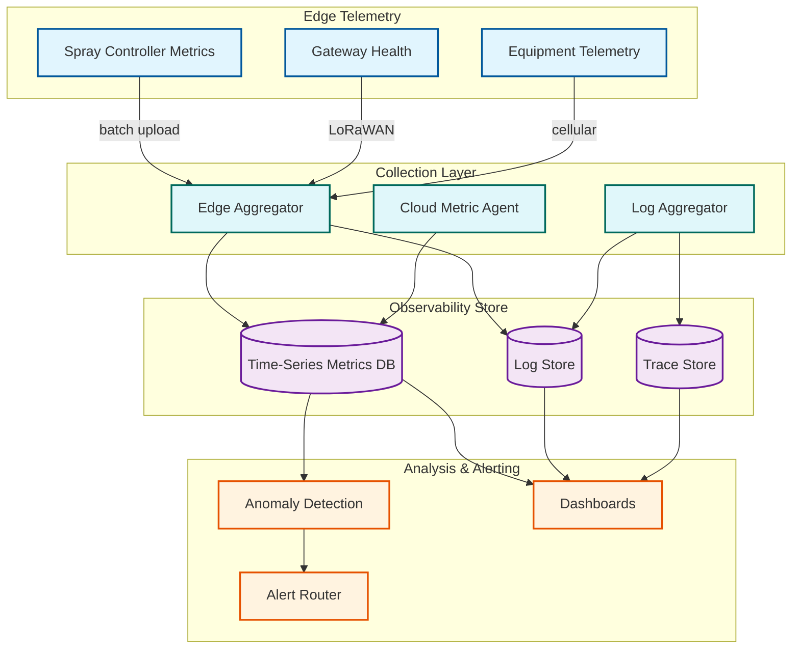

# 13.5 AI-Native Agriculture & Precision Farming Platform — Observability

## Observability Challenges in Precision Agriculture

Agricultural platforms face observability challenges distinct from typical cloud applications: edge devices operate in disconnected environments where telemetry is intermittent, the ground truth for ML models (actual yield) is only available once per year at harvest, sensor networks span thousands of acres with limited power budgets, and the business impact of observability gaps (missed anomalies, stale prescriptions) is measured in crop loss rather than request errors.

---

## Key Metrics Framework

### Tier 1: Business-Critical Metrics (Real-Time Dashboards)

| Metric | Definition | Target | Alert Threshold |
|---|---|---|---|
| **Spray accuracy** | Weed detection true positive rate (validated by post-spray drone survey) | > 95% | < 90% triggers model review |
| **Crop damage rate** | False positive rate (crop classified as weed and sprayed) | < 2% | > 3% triggers immediate spray suspension |
| **Herbicide savings** | Actual herbicide used vs. broadcast equivalent | > 50% | < 40% triggers prescription review |
| **Imagery freshness** | Age of most recent cloud-free satellite observation per field | < 10 days | > 15 days triggers drone dispatch recommendation |
| **Sensor health rate** | Percentage of sensors reporting within expected interval | > 98% | < 95% triggers maintenance alert |
| **Yield prediction accuracy** | MAPE of P50 prediction vs. actual yield (measured post-harvest) | < 8% | > 12% triggers model retraining |
| **Irrigation efficiency** | Water applied vs. crop water demand (ETc) | 0.85–1.15 ratio | < 0.75 (under-irrigation) or > 1.3 (over-irrigation) |
| **Prescription timeliness** | Time from anomaly detection to prescription delivery | < 24 hours | > 48 hours triggers pipeline investigation |

### Tier 2: Operational Metrics (Hourly Monitoring)

| Metric | Definition | Target |
|---|---|---|
| Satellite processing lag | Time from tile availability to processed product | < 4 hours |
| Drone processing queue depth | Number of pending ortho-mosaic jobs | < 500 |
| Sensor ingestion lag | Time from sensor reading to database write | < 5 minutes |
| Edge fleet connectivity | Percentage of active rigs that have synced within 24 hours | > 90% |
| Model deployment coverage | Percentage of active rigs running latest model version | > 95% within 7 days of release |
| API response time (p95) | Farmer-facing API latency | < 500 ms |
| Prescription generation time | End-to-end prescription build time | < 15 minutes |

### Tier 3: System Health Metrics (Daily Review)

| Metric | Definition | Target |
|---|---|---|
| LoRaWAN gateway uptime | Per-gateway availability | > 99% |
| Edge SSD health | Remaining write endurance on spray controller SSDs | > 20% life remaining |
| Camera calibration drift | Deviation from reference homography matrix | < 2 pixel RMS error |
| Satellite cloud cover rate | Percentage of imagery lost to cloud contamination | Informational (no target, weather-dependent) |
| Model training data freshness | Age of most recent training data in model pipeline | < 30 days |
| Data export queue | Pending farmer data portability requests | < 10 outstanding |

---

## Observability Architecture



---

## Edge Observability

### Spray Controller Monitoring

Edge spray controllers generate observability data that cannot be streamed in real time (due to bandwidth constraints). The platform uses a tiered reporting strategy:

```
Real-time (via LoRaWAN, 100 bytes):
  - Heartbeat: alive, operating, GPS position
  - Critical alerts: hardware fault, model validation failure, safety interlock triggered
  - Frequency: every 60 seconds during operation

Session summary (uploaded post-session, ~10 KB):
  - Acres covered, spray time, herbicide savings %
  - Weed detection count by species category
  - Nozzle activation map (per-nozzle duty cycle %)
  - Camera health (frames processed, inference latency p50/p99)
  - GPU temperature profile (max, mean)
  - Edge model version and validation score

Detailed diagnostics (uploaded during WiFi window, ~100 MB):
  - Per-frame inference latency histogram
  - Sample images with detection overlays (1 per acre, for QA)
  - Nozzle solenoid response time measurements
  - Full spray log for cloud-side accuracy analysis
```

### Spray Accuracy Validation Pipeline

Ground truth for spray accuracy is not available in real time—it requires post-spray validation:

```
FUNCTION validate_spray_accuracy(field_id, spray_session_id):
    // Step 1: Schedule post-spray drone survey (24–48 hours after spray)
    drone_survey = schedule_survey(field_id, delay=48h, type="weed_count")

    // Step 2: Compare pre-spray and post-spray weed density
    pre_spray_density = get_weed_density(field_id, before=spray_session.started_at)
    post_spray_density = drone_survey.weed_density

    // Step 3: Compute kill rate
    kill_rate = 1 - (post_spray_density / pre_spray_density)
    // Expected: > 92% for well-targeted spray

    // Step 4: Identify spray misses (weeds that survived)
    surviving_weeds = drone_survey.weed_locations
    spray_log = get_spray_log(spray_session_id)

    FOR EACH weed IN surviving_weeds:
        nozzle_event = find_nearest_nozzle_event(spray_log, weed.location)
        IF nozzle_event IS NULL:
            // Weed was in a zone that was never sprayed → detection miss
            classify(weed, "false_negative")
        ELIF nozzle_event.action == "spray_off":
            // Nozzle was explicitly deactivated → classification error
            classify(weed, "classification_error")
        ELSE:
            // Nozzle sprayed but weed survived → application issue (rate, coverage)
            classify(weed, "application_failure")

    // Step 5: Aggregate and report
    RETURN {
        kill_rate, false_negative_rate, classification_error_rate,
        application_failure_rate, sample_images
    }
```

### Sensor Network Health Monitoring

```
Per-sensor health metrics (computed at ingestion):
  - Reading interval deviation: expected 15 min; alert if > 30 min gap
  - Battery voltage trend: linear regression on 30-day voltage readings
  - Signal quality: RSSI and SNR per uplink; alert if degrading
  - Calibration drift score: deviation from neighbor consensus
  - Reading quality flags: out-of-range values, stuck readings

Fleet-level dashboards:
  - Map view: sensor locations colored by health status
    (green = healthy, yellow = degraded, red = offline, gray = low battery)
  - Heatmap: signal quality across farm (identifies LoRaWAN coverage gaps)
  - Trend: percentage of sensors in each health category over time
  - Maintenance queue: sensors ranked by urgency (battery replacement,
    calibration needed, physically damaged)

Alert rules:
  - Sensor offline > 4 hours (expected max gap = 15 min × 4 retries = 1 hour)
  - Battery voltage < 2.8V (nominal: 3.3V; critical: 2.5V)
  - Cluster offline: > 3 sensors in same zone offline → gateway issue
  - Drift alert: sensor reading diverges > 2σ from zone neighbors for > 24 hours
```

---

## ML Model Observability

### Spray Model Performance Tracking

```
Metrics tracked per model version per crop/stage combination:

Detection metrics (from edge inference logs):
  - Inference latency: p50, p95, p99 (must stay < 8 ms)
  - Detection count per acre (weed density indicator)
  - Confidence distribution: histogram of confidence scores
    (a shift toward lower confidence indicates model degradation)
  - Classification breakdown: % broadleaf, % grass, % crop, % bare_soil

Accuracy metrics (from post-spray validation):
  - True positive rate (weed detected and sprayed)
  - False positive rate (crop sprayed as weed)
  - False negative rate (weed missed)
  - Species-level accuracy (some weed species harder to detect)

Data drift detection:
  - Monitor input image statistics (brightness, contrast, color distribution)
  - Compare current day's image stats to training data distribution
  - Alert if KL divergence > threshold (indicates lighting conditions,
    crop stage, or weed species mix has shifted beyond training distribution)

Model degradation triggers:
  - False positive rate > 3% for 3 consecutive fields → suspend model, rollback
  - Inference latency p99 > 10 ms → investigate hardware thermal throttling
  - Confidence histogram shift > 0.15 from baseline → schedule model update
```

### Yield Prediction Accuracy Tracking

```
Yield prediction accuracy can only be fully measured after harvest,
creating a unique delayed-feedback observability challenge:

In-season (leading indicators):
  - Prediction stability: how much does P50 change week-over-week?
    Large swings indicate model uncertainty (high sensitivity to new data)
  - Satellite feature alignment: is NDVI trajectory tracking the expected
    growth curve? Divergence suggests model inputs are abnormal
  - Confidence width trend: should narrow through season
    (if width stops narrowing after V6 stage, something is wrong)
  - Peer comparison: prediction for field A vs. neighboring fields B, C
    with similar conditions. Outlier predictions flagged for review

Post-harvest (ground truth):
  - Yield monitor data provides per-field actual yield
  - Compute: MAE, MAPE, bias, quantile calibration
  - Per-zone analysis: which management zones had largest prediction errors?
  - Attribution: was the error due to weather forecast error, soil model error,
    satellite feature error, or model bias?

Annual model report card:
  - Overall accuracy across all managed fields
  - Accuracy by crop type, by region, by farm size
  - Comparison to county-level USDA estimates (benchmark)
  - Accuracy in extreme weather years vs. normal years
  - Recommendations for model improvement priorities
```

---

## Operational Dashboards

### Farm Operator Dashboard

```
Single-farm view showing:

Field status grid:
  - Each field as a card showing: crop type, growth stage, latest NDVI,
    active alerts, days since last observation
  - Color coding: green (healthy), yellow (attention needed),
    red (action required), gray (fallow/not planted)

Spray operations:
  - Today's spray plan: fields scheduled, product, rate
  - Active rig location and progress (if connected)
  - Season-to-date herbicide savings ($ and gallons)

Irrigation status:
  - Current soil moisture vs. target by field
  - Next scheduled irrigation (date, amount, duration)
  - Season water budget usage (applied vs. allocated)

Weather overlay:
  - 10-day forecast with agricultural annotations
    (spray window: yes/no based on wind + temperature,
     frost risk indicator, GDD accumulation rate)
```

### Platform Operations Dashboard

```
Fleet-wide view for platform engineering team:

Processing pipeline health:
  - Satellite tiles: queued → processing → completed (pipeline gauge)
  - Drone jobs: submitted → processing → delivered (queue depth + latency)
  - Sensor ingestion: messages/sec, consumer lag, error rate

Edge fleet status:
  - Active spray rigs: count, geographic distribution
  - Model version distribution: pie chart of rigs by model version
  - Connectivity: % of rigs synced in last 24h
  - Hardware alerts: camera failures, GPU thermal, SSD wear

Seasonal capacity:
  - Current compute utilization vs. auto-scale thresholds
  - Storage growth rate and capacity projections
  - Cost per acre trend (platform unit economics)
```

---

## Alerting Strategy

### Alert Routing

| Severity | Examples | Notification Channel | Response Time |
|---|---|---|---|
| **P1 — Critical** | Spray controller safety fault; crop damage rate > 5%; edge fleet model corruption | SMS + phone call to on-call engineer; automatic spray suspension | < 15 minutes |
| **P2 — High** | Satellite pipeline stalled > 4 hours; sensor cluster offline; yield model divergence | Push notification + team chat | < 2 hours |
| **P3 — Medium** | Drone processing queue > 500; single sensor offline; model version rollout behind schedule | Team chat | < 8 hours |
| **P4 — Low** | Storage capacity > 80%; battery replacement needed for 10+ sensors; minor calibration drift | Daily digest email | Next business day |

### Alert Deduplication and Suppression

```
Agricultural-specific alert rules:
  - Weather suppression: suppress satellite freshness alerts during periods
    of persistent cloud cover (no imagery available to process)
  - Seasonal suppression: suppress irrigation alerts during dormant season
  - Connectivity windowing: suppress edge sync alerts during known
    low-connectivity periods (remote fields with 4-hour sync windows)
  - Cluster correlation: if 10 sensors on same gateway go offline simultaneously,
    generate 1 gateway alert instead of 10 sensor alerts
  - Spray accuracy feedback: delay spray accuracy alerts until
    post-spray validation data is available (not real-time estimable)
```
