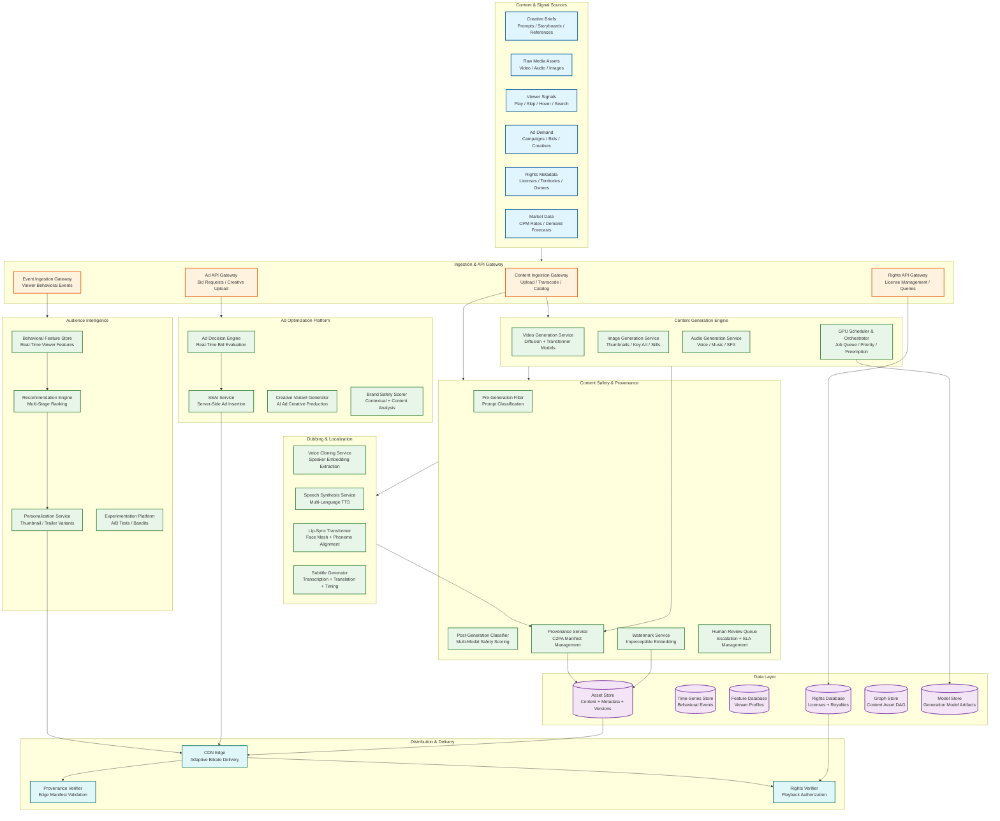

# 13.6 AI-Native Media & Entertainment Platform — High-Level Design

## System Architecture



---

## Data Flow Architecture

### Flow 1: Content Generation Pipeline

```
Creative Brief → Pre-Generation Safety Filter → GPU Scheduler
  → Model Selection (video / image / audio) → Generation Execution
  → Post-Generation Safety Classification → Provenance Manifest Creation
  → Watermark Embedding → Asset Store Registration → Content Asset Graph Update
```

The generation pipeline is request-driven for interactive sessions (creator submits a prompt and waits) and event-driven for batch campaigns (a campaign trigger enqueues thousands of generation jobs). The GPU scheduler mediates between these two demand patterns by maintaining separate queues with priority preemption: interactive jobs can preempt batch jobs at checkpoint boundaries, ensuring batch work is not lost but interactive latency is preserved.

### Flow 2: Dubbing and Localization Pipeline

```
Source Content → Audio Extraction → Speaker Diarization → Voice Embedding
  → Per-Language Pipeline (parallel across 40+ languages):
    → Script Translation + Cultural Adaptation
    → Emotion-Tagged Speech Synthesis (using cloned voice)
    → Lip-Sync Video Transformation (face mesh + phoneme alignment)
    → Timing Verification + Quality Scoring
  → Multi-Language Asset Registration → Provenance Chain Update → Rights Attribution
```

Dubbing is compute-intensive and embarrassingly parallel across languages: each language track is independent after script translation. The platform exploits this by launching all 40+ language tracks simultaneously, bounded only by GPU cluster capacity. The voice cloning step is shared across languages (extract speaker embedding once, synthesize in each language using that embedding).

### Flow 3: Audience Intelligence and Personalization

```
Viewer Interaction → Event Ingestion (Kafka-equivalent stream)
  → Feature Computation (sliding window aggregations)
  → Feature Store Update (in-memory with persistent backing)
  → Page Load Request → Candidate Retrieval (ANN index)
  → Multi-Stage Ranking (recall → filtering → scoring → re-ranking)
  → Variant Selection (contextual bandit for thumbnails)
  → Personalized Response Assembly
```

The personalization pipeline has two time horizons: a batch path (daily model retraining on full behavioral history) and a real-time path (streaming feature updates that alter ranking within 30 seconds of viewer interaction). Both paths feed the same serving layer, which merges batch model scores with real-time feature adjustments.

### Flow 4: Ad Decision and Insertion

```
Stream Playback → Ad Break Signal → Ad Decision Request
  → Viewer Feature Lookup → Contextual Content Analysis
  → Parallel Bid Requests to Demand Partners (50ms timeout)
  → Bid Evaluation + Brand Safety Scoring
  → Creative Variant Selection → Pod Construction (2-4 ads)
  → SSAI Manifest Generation → Manifest Stitched into Stream
  → Impression Tracking → Revenue Attribution
```

Ad insertion is the most latency-sensitive pipeline: the ad decision must complete and the manifest must be stitched before the viewer's playback buffer reaches the ad break position. This creates a hard deadline (typically 200ms from ad break signal to manifest delivery) that bounds the complexity of all upstream decisions.

### Flow 5: Provenance and Rights Verification

```
Content Request → CDN Edge → Provenance Manifest Cache Check
  → If cached: verify manifest signature (ECDSA, ~1ms)
  → If not cached: fetch manifest from Provenance Service
  → Rights Database Query (territory + time + platform check)
  → If authorized: serve content with manifest attached
  → If unauthorized: return rights-blocked response

Content Transformation → Provenance Service:
  → Fetch current manifest → Append transformation record
  → Sign updated manifest (hardware security module)
  → Store updated manifest → Return manifest hash
```

---

## Key Design Decisions

### Decision 1: Multi-Model Orchestration vs. Unified Model

**Choice: Multi-model orchestration with specialized models per content type.**

A single unified model that handles video, image, and audio generation would simplify the architecture but would be inferior at each individual task compared to specialized models. Video diffusion models have fundamentally different architectures (temporal attention, motion modules) than image diffusion models (spatial attention only), and audio generation uses waveform-based architectures entirely different from visual generation.

The multi-model approach requires a routing layer (the GPU Scheduler) that directs jobs to the appropriate model pipeline, but it enables independent scaling (scale up video GPUs during a video campaign without affecting image generation capacity) and independent model upgrades (swap in a new video model without touching the image pipeline).

### Decision 2: Server-Side vs. Client-Side Ad Insertion

**Choice: Server-side ad insertion (SSAI) for primary delivery.**

Client-side ad insertion (CSAI) sends separate ad content URLs to the player, which creates a visible seam (buffering between content and ad), is blocked by ad blockers (30%+ of desktop viewers), and leaks ad targeting signals to the client. SSAI stitches ads into the content manifest at the server level, creating a seamless stream that is indistinguishable from content to ad blockers and client-side inspection.

The trade-off is that SSAI requires per-viewer manifest generation at the CDN edge (10M concurrent streams × unique manifest per viewer), which is computationally expensive but avoids the ~30% ad blocker revenue loss that CSAI would incur.

### Decision 3: Pre-Generation vs. Post-Generation Safety

**Choice: Both, with different strictness levels.**

Pre-generation prompt filtering catches obviously prohibited requests before consuming GPU resources (e.g., explicit violence prompts). But generative models can produce harmful content from innocuous prompts (a "birthday party" prompt might generate an image with unintended nudity if the model has biased training data). Post-generation multi-modal classification catches these emergent violations.

Running both stages appears redundant but serves different purposes: pre-generation saves GPU cost (reject 5–10% of prompts before spending $0.10–1.00 on generation), while post-generation catches the 0.1–0.5% of completed generations that pass pre-filtering but violate safety policies.

### Decision 4: Centralized vs. Edge-Distributed Provenance Verification

**Choice: Edge-cached provenance with centralized authority.**

Provenance verification at the CDN edge (checking C2PA manifest signatures before content delivery) adds latency to every content request. Centralizing verification would create a bottleneck at 10M concurrent streams. Edge distribution with manifest caching achieves both: manifests are cached at edge nodes with a TTL equal to the content cache TTL, and signature verification uses pre-distributed public keys that require no central authority contact during verification.

The centralized Provenance Service remains the authority for manifest creation and updates (when content is transformed), but verification is fully distributed.

### Decision 5: Synchronous vs. Asynchronous Dubbing Pipeline

**Choice: Asynchronous pipeline with synchronous quality gates.**

Dubbing a feature film involves sequential stages (transcription → translation → synthesis → lip-sync → QA) but each stage for each language is independent. The pipeline is modeled as a DAG of asynchronous tasks, where each task writes its output to the asset store and triggers downstream tasks via the event bus. Quality gates (e.g., lip-sync alignment score must exceed threshold) are synchronous checkpoints within each language track—a failing quality gate blocks that language's downstream stages without affecting other languages.

---

## Cross-Cutting Concerns

### GPU Resource Management

GPU compute is the most expensive and constrained resource. The platform treats GPUs as a managed resource pool with:
- **Heterogeneous pools:** High-memory GPUs (80 GB) for video generation, standard GPUs (40 GB) for image and audio, inference-optimized GPUs for serving safety classifiers
- **Priority classes:** Interactive (creator waiting, highest priority), Realtime (ad creative, dubbing with deadline), Batch (campaign generation, model training, lowest priority)
- **Preemption with checkpointing:** Long-running video generations checkpoint every 10 seconds; if preempted by a higher-priority job, they resume from the last checkpoint when capacity is available
- **Spot instance integration:** Batch jobs tolerate spot instance interruption (checkpoint-resume); interactive and realtime jobs run on reserved instances

### Event Bus Architecture

All subsystems communicate through an event bus (partitioned, ordered stream) rather than direct service-to-service calls for asynchronous workflows. Key event types:
- `content.generated` — triggers safety classification, provenance creation, watermarking
- `content.safety_approved` — triggers asset store registration, thumbnail variant generation
- `content.dubbed` — triggers per-language provenance update, rights attribution
- `viewer.interaction` — triggers feature store update, recommendation refresh
- `ad.impression` — triggers revenue attribution, frequency capping update
- `rights.updated` — triggers CDN cache invalidation for affected content

### Multi-Region Deployment

Content generation runs in GPU-dense regions (3–4 regions globally). Personalization and ad serving run in all CDN edge regions (30+ PoPs). The behavioral feature store is replicated to all serving regions with eventual consistency (30-second lag acceptable for personalization). Rights and provenance are replicated with strong consistency (stale rights could serve unlicensed content).
