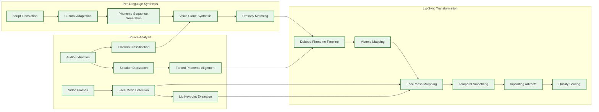

# 13.6 AI-Native Media & Entertainment Platform — Deep Dives & Bottlenecks

## Deep Dive 1: GPU Orchestration for Multi-Model Content Generation

### The Scheduling Challenge

The content generation platform serves workloads spanning four orders of magnitude in compute time and resource requirements:

| Workload | Duration | GPUs | Memory | Preemptible? |
|---|---|---|---|---|
| Thumbnail generation | 200 ms – 3 s | 1 | 16 GB | No (too short to checkpoint) |
| Audio synthesis | 2 – 10 s | 1 | 24 GB | No |
| Short video clip (≤15s) | 15 – 45 s | 4 | 64 GB | At 10s checkpoints |
| Long video (15–60s) | 1 – 5 min | 8 | 160 GB | At 10s checkpoints |
| Feature film dubbing (lip-sync) | 2 – 8 hours | 16–32 | 320 GB | At scene boundaries |
| Batch campaign (10K images) | 30 – 90 min | 50–200 | Mixed | Yes |

A single scheduling policy cannot optimize for all workloads. The production system uses a **multi-tier scheduling architecture**:

**Tier 1 — Interactive Queue (SLO: response in seconds)**
- Thumbnails and short audio go through a fast-path scheduler that maintains a warm pool of loaded models. Models stay resident in GPU memory between requests (no load/unload overhead). The scheduler routes requests to the GPU with the correct model already loaded, treating it like a GPU-aware load balancer.

**Tier 2 — Realtime Queue (SLO: completion within minutes)**
- Video generation and dubbing jobs go through a capacity-aware scheduler that performs bin-packing: fitting multiple jobs onto a GPU cluster while respecting memory constraints and anti-affinity rules (two video generation jobs on the same GPU fight for memory bandwidth).

**Tier 3 — Batch Queue (SLO: completion within hours)**
- Campaign generation and bulk dubbing run on cost-optimized capacity (spot instances, off-peak reserved). These jobs checkpoint frequently (every 10 seconds for video, every scene boundary for dubbing) so they can be preempted by Tier 1/2 work and resumed later.

### The Model Loading Bottleneck

Loading a video generation model from object storage into GPU memory takes 30–90 seconds (10–50 GB model weights). For interactive workloads, this is unacceptable—the total generation time would be dominated by model loading.

**Solution: Model-affinity scheduling with warm pools.**

The scheduler maintains a registry of which models are loaded on which GPUs. When an interactive generation request arrives:
1. Check if the requested model is already loaded on any GPU with available capacity → route to that GPU (0 ms load time)
2. If not, check if any GPU has the model in its local cache (on-disk, not in GPU memory) → load from local cache (5–10s)
3. If not, load from object storage (30–90s) but only for batch jobs; interactive jobs are rejected with a "model cold" error that triggers pre-warming

The pre-warming daemon monitors generation request patterns and speculatively loads popular models onto idle GPUs. During business hours (when interactive requests peak), the top 5 models are kept warm across 80% of the interactive GPU pool. During off-peak hours, warm pools shrink and batch work reclaims the capacity.

### Bottleneck: GPU Memory Fragmentation

After hours of mixed workloads, GPU memory becomes fragmented: a GPU with 80 GB total memory might have 30 GB free but in non-contiguous blocks, unable to serve a job requiring 24 GB contiguous allocation. Unlike CPU memory, GPU memory typically lacks virtual memory paging.

**Mitigation:**
- **Periodic compaction**: During low-load periods (typically 2–4 AM), the scheduler quiesces one GPU at a time, checkpoints all running jobs, clears GPU memory, and restarts jobs with defragmented allocation
- **Memory pool pre-allocation**: Each model type pre-allocates fixed-size memory pools (model weights pool, intermediate activations pool, output buffer pool) to reduce fragmentation from variable-size allocations
- **Right-sizing**: The scheduler tracks actual peak memory usage per model version and adjusts allocation sizes based on observed (not theoretical) requirements, reclaiming over-provisioned memory

---

## Deep Dive 2: Lip-Sync Dubbing Pipeline

### The Perception Challenge

Human audio-visual speech perception relies on the McGurk effect—the brain fuses what it hears with what it sees. When the fusion fails, the result ranges from "something feels off" (mild mismatch) to uncanny valley revulsion (severe mismatch). The tolerance varies by phoneme type:

| Phoneme Category | Examples | Visual Salience | Sync Tolerance |
|---|---|---|---|
| Bilabial | /p/, /b/, /m/ | Very high (lips close) | ±20 ms |
| Labiodental | /f/, /v/ | High (teeth on lip) | ±30 ms |
| Open vowels | /a/, /o/ | Medium (jaw opening) | ±60 ms |
| Closed consonants | /k/, /g/, /t/ | Low (internal articulation) | ±80 ms |
| Nasal continuants | /n/, /ŋ/ | Very low | ±100 ms |

The dubbing pipeline must achieve phoneme-class-specific alignment, not just global audio-visual sync.

### Pipeline Architecture



### The Cross-Language Timing Problem

Different languages have fundamentally different speaking rates and syllable structures:

| Language | Avg Syllable Rate | Avg Information Rate | Timing Challenge |
|---|---|---|---|
| Japanese | 7.84 syl/s | ~0.49 bits/syl | Fast syllable rate, low information density → needs more time for same meaning |
| Spanish | 7.82 syl/s | ~0.63 bits/syl | Similar speed to Japanese, more information per syllable |
| English | 6.19 syl/s | ~1.08 bits/syl | Slower but higher information density |
| Mandarin | 5.18 syl/s | ~0.94 bits/syl | Tonal language adds pitch dimension |
| German | 5.97 syl/s | ~0.90 bits/syl | Compound words create long phoneme sequences |

A 5-second English dialogue might require 6.5 seconds in Japanese (more syllables for the same meaning) or 4.2 seconds in Mandarin (fewer, more information-dense syllables). The lip-sync pipeline must handle three scenarios:

1. **Dubbed audio shorter than source**: Pad with natural pauses, extend hold positions on neutral mouth shapes
2. **Dubbed audio longer than source**: Compress pauses, increase speaking rate (up to 1.3× before naturalness degrades), or extend the visual segment (acceptable for cuts but not for continuous shots)
3. **Audio matches but phoneme alignment differs**: This is the common case—the mouth must make different shapes at different times while the overall duration is similar

### Bottleneck: Multi-Speaker Scenes

When multiple speakers appear simultaneously (conversation scenes, group discussions), the pipeline must:
- Track each speaker's face independently across frames (face tracking with ID persistence)
- Handle occlusions (Speaker A's face partially blocked by Speaker B's head)
- Apply lip-sync transformations to each speaker with different dubbed audio timelines
- Maintain consistent skin tone and lighting across modified and unmodified face regions

The compute cost scales linearly with the number of visible speakers per frame. A 2-speaker dialogue costs 2× the lip-sync compute; an 8-person meeting scene costs 8×. The scheduler must estimate per-scene speaker count from the source video to accurately predict job duration.

### Quality Assurance Pipeline

Every dubbed language track passes through automated QA before human review:
1. **Sync score**: Measure audio-visual alignment at bilabial phonemes (must score ≥ 0.85)
2. **Voice similarity**: Compare synthesized voice to original speaker's voice embedding (cosine similarity ≥ 0.92)
3. **Emotion match**: Classify emotion in synthesized speech and compare to source (accuracy ≥ 85%)
4. **Artifact detection**: Scan for visual artifacts at face mesh boundaries (seam detection, color discontinuity)
5. **Naturalness MOS**: Automated MOS prediction model (must score ≥ 3.8 / 5.0)

Tracks that fail any threshold are re-synthesized with adjusted parameters (slower speaking rate, different prosody emphasis) before escalation to human review.

---

## Deep Dive 3: Real-Time Ad Decision Engine

### The Latency Budget

Ad decisions must complete within 200 ms to avoid viewer-perceptible playback interruption. The budget breaks down as:

```
Total budget: 200 ms
├─ Viewer feature lookup:           10 ms (in-memory feature store)
├─ Content context analysis:        15 ms (pre-computed, cached)
├─ Bid request fan-out:             80 ms (parallel to 5 demand partners, 100 ms timeout)
├─ Bid evaluation + safety:         20 ms
├─ Creative variant selection:      15 ms
├─ Pod construction optimization:   20 ms
├─ SSAI manifest generation:        25 ms
└─ Network overhead:                15 ms
    Total:                         200 ms
```

### The Yield vs. Retention Trade-off

Maximizing ad revenue (yield) per session conflicts with viewer retention:

| Ad Load | Avg CPM | Ads/Hour | Revenue/Hour | Session Length | Total Revenue |
|---|---|---|---|---|---|
| Light (2 breaks × 2 ads) | $12 | 4 | $0.048 | 3.2 hours | $0.154 |
| Medium (3 breaks × 3 ads) | $10 | 9 | $0.090 | 2.5 hours | $0.225 |
| Heavy (4 breaks × 4 ads) | $8 | 16 | $0.128 | 1.5 hours | $0.192 |

The medium load maximizes total revenue despite lower per-hour yield, because viewers watch longer. The ad decision engine must optimize over the full session, not individual ad breaks. This requires:

1. **Session-level ad load planning**: At session start, compute the optimal total ad load for this viewer based on their historical tolerance (some viewers tolerate higher ad loads, others abandon quickly)
2. **Dynamic budget allocation**: Distribute the session's ad budget across breaks, front-loading higher-CPM opportunities while reserving capacity for later breaks if the viewer stays
3. **Real-time adaptation**: If mid-session engagement drops (viewer starts skipping content), reduce ad load in subsequent breaks to extend the session

### Bottleneck: Demand Partner Latency

The ad decision fans out bid requests to 5 demand partners in parallel with a 100 ms hard timeout. In practice:
- Partners respond in 30–70 ms under normal load
- During peak hours (prime time), partner latency increases to 80–120 ms
- A single slow partner blocks the decision if waited for sequentially

**Mitigation: Speculative bidding with timeout escalation.**
- Send bid requests to all 5 partners simultaneously
- Set a 60 ms "early close" threshold: if 3+ partners respond by 60 ms, proceed with those bids (the remaining 2 partners' late responses are discarded)
- Only wait the full 100 ms if fewer than 3 partners respond by 60 ms
- Track per-partner latency percentiles and pre-emptively exclude partners whose p95 exceeds 90 ms during peak hours

### AI-Generated Creative Variants

Traditional ad serving selects from a fixed set of pre-produced creatives. The AI-native platform generates creative variants per viewer segment:
- **Dynamic text overlay**: Modify ad copy based on viewer locale, interests, and content context
- **Background adaptation**: Generate background scenes that match the content's visual style (a sports ad during sports content uses a stadium background)
- **Personalized product shots**: Generate product images in context relevant to the viewer (a car ad shows the car in the viewer's likely environment based on locale)

Creative variants are generated in batch (weekly refresh) and cached, not generated in real-time. The ad decision engine selects from pre-generated variants, keeping the selection within the 15 ms budget.

---

## Deep Dive 4: Personalization and Behavioral Feature Store

### Feature Store Architecture

The feature store serves two timescales:

**Real-time features (30-second freshness):**
- Updated on every viewer interaction event
- Stored in-memory across a sharded cluster
- Write path: Event → Stream processor → Feature computation → In-memory update + WAL
- Read path: Personalization API → Feature store shard (by viewer_id hash) → Feature vector response

**Batch features (daily freshness):**
- Computed daily from full behavioral history
- Stored in columnar store, cached in-memory for active viewers
- Include: lifetime value, churn probability, genre diversity, social influence

### The Cold-Start Problem

New viewers have no behavioral history—the feature store returns zero vectors. The personalization engine handles cold start through a cascade:

1. **Session-level signals (available after 30 seconds)**: First content clicked, time spent on landing page, device type, time of day → lightweight model predicts initial preferences
2. **Demographic priors (available at registration)**: Age bucket, locale, language preference → population-level genre affinities as starting features
3. **Exploration boost**: New viewers receive higher exploration rate in thumbnail bandits (30% explore vs. 10% for established viewers) to rapidly learn preferences
4. **Transfer learning**: If viewer authenticates across devices, merge behavioral histories instantly

### Bottleneck: Feature Store Hot Partitions

Popular content releases cause millions of viewers to interact with the same content simultaneously. If viewer features are partitioned by viewer_id (uniform distribution), the write load is uniform. But if any feature computation requires content-level aggregation (e.g., "what % of similar viewers liked this content"), the content becomes a hot partition.

**Mitigation:**
- Content-level features are pre-computed in batch and served from a separate cache (not computed on the viewer feature store's hot path)
- Real-time content popularity is approximated using a probabilistic counter (HyperLogLog for unique viewer count, Count-Min Sketch for interaction counts) that distributes writes across multiple counter shards
- The personalization model is designed to use per-viewer features (no content-level features on the hot path); content features are injected during batch model retraining only

### Multi-Armed Bandit for Thumbnail Selection

Each title has 8–12 thumbnail variants. The platform runs a contextual bandit to select the best variant per viewer. The bandit must balance:
- **Exploitation**: Show the variant with the highest predicted click-through rate for this viewer
- **Exploration**: Show under-tested variants to gather data and improve predictions

The production system uses Thompson Sampling with contextual features:
- Each variant maintains a Beta distribution posterior (alpha = clicks, beta = impressions − clicks)
- Viewer features (genre affinity, visual preference embedding) modulate the posterior via a learned context weight
- On each impression, sample from each variant's posterior and select the highest sample

**Key design choice:** The bandit resets its posteriors every 7 days to adapt to temporal shifts (a thumbnail that worked last month may not work this month as viewer fatigue sets in). Historical data is down-weighted with exponential decay (half-life = 3 days) rather than hard-cutoff reset.

---

## Critical Bottleneck Summary

| Bottleneck | Impact | Mitigation |
|---|---|---|
| GPU model loading latency (30–90s) | Interactive generation blocked | Model-affinity scheduling + warm pools + speculative pre-warming |
| GPU memory fragmentation | Jobs fail despite sufficient total memory | Periodic compaction + fixed-size memory pools + right-sizing |
| Cross-language timing mismatch | Dubbed audio doesn't fit source video timing | Speaking rate adjustment + pause compression + segment extension for cuts |
| Multi-speaker lip-sync compute | Linear cost scaling with speaker count | Per-scene speaker estimation + parallel per-speaker processing + quality-tiered processing (background speakers get lighter lip-sync) |
| Demand partner latency during peak | Ad decisions exceed 200ms budget | Speculative bidding with early close + partner pre-exclusion + latency hedging |
| Feature store hot partitions on content release | Feature reads spike, increasing latency | Pre-computed content features + probabilistic counters + content-level feature isolation |
| Provenance manifest chain growth | Manifest verification latency grows with chain length | Manifest compaction (merge transformation records) + edge caching + parallel signature verification |
| Safety classifier false negatives on novel content | Policy-violating content reaches production | Multi-model ensemble + adversarial testing + human-in-the-loop for high-visibility |
