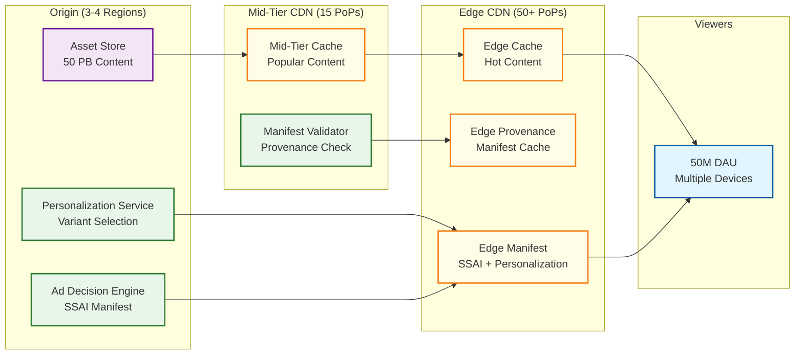

# 13.6 AI-Native Media & Entertainment Platform — Scalability & Reliability

## Scalability Architecture

### GPU Cluster Scaling

The platform operates a globally distributed GPU cluster across 3–4 GPU-dense regions, with each region hosting 2,500–3,000 GPUs across multiple accelerator generations.

**Horizontal scaling strategy:**

| Workload | Scaling Unit | Trigger | Scale-Up Time | Scale-Down Time |
|---|---|---|---|---|
| Interactive generation | GPU pod (8 GPUs + shared memory) | Queue depth > 50 for > 30s | 2–5 min (warm pool expansion) | 15 min (cool-down, model unload) |
| Batch generation | Spot instance fleet | Batch queue > 10,000 jobs | 5–10 min (spot market acquisition) | Immediate (spot preemption acceptable) |
| Dubbing pipeline | Language-parallel GPU allocation | Dubbing job submission | Pre-allocated per job | On job completion |
| Safety classification | Inference GPU pool | Classification queue latency > 500ms | 1–2 min (model already cached) | 10 min |
| Ad creative generation | Batch cycle (weekly) | Campaign submission deadline | Pre-scheduled scaling | After generation cycle |

**Vertical scaling limitations:**
- Individual GPU memory caps generation resolution and duration (80 GB GPU supports ~30s 1080p video; 160 GB supports ~60s 4K)
- Multi-GPU generation requires model parallelism, which introduces communication overhead that reduces throughput by 15–30% per additional GPU
- Cost-performance sweet spot: 4 GPUs for standard video, 8 GPUs for premium 4K content; beyond 8 GPUs the communication overhead exceeds the parallelism benefit

### Content Delivery Scaling

**Edge architecture for personalized content:**

**Personalization at CDN edge:**
- Thumbnail variant selection runs at the edge (pre-computed variant scores cached per viewer segment, not per individual viewer)
- Ad manifest generation runs at the mid-tier CDN (requires demand partner integration)
- Content segments are cached at the edge; SSAI manifests point edge-cached viewers to the right segments (content segment + ad segments interleaved)

**Peak traffic handling (live events, premieres):**
- Pre-warm edge caches 2 hours before scheduled premieres
- Personalization falls back to segment-level (rather than individual-level) during peak to reduce compute
- Ad decision batching: aggregate ad requests from the same content break across viewers and issue a single bid request per segment, then distribute winning bids across individual viewers

### Feature Store Scaling

The behavioral feature store must serve 50M daily active viewers with 30-second feature freshness.

**Sharding strategy:**
- Viewer features partitioned by consistent hash on viewer_id across 256 shards
- Each shard fits in memory: 50M viewers / 256 shards × 1.6 KB per viewer = ~312 MB per shard
- Read replicas per shard (3× replication) for read-heavy personalization workload
- Write path goes through a single leader per shard; feature computation is idempotent so replayed events produce the same result

**Cross-region replication:**
- Feature store replicated to all serving regions with async replication (30-second lag acceptable)
- On viewer region failover, the viewer may see slightly stale personalization for ≤30 seconds before features catch up

### Ad Platform Scaling

**33,000 ad decisions/second at peak:**
- Ad decision engine is stateless—scales horizontally by adding decision nodes
- Each node handles ~1,000 decisions/sec (bound by bid request fan-out latency)
- Peak requires 33 decision nodes + 50% headroom = ~50 nodes
- Viewer feature lookup is served from local feature store replicas (co-located)
- Demand partner connections maintained via persistent connection pools (avoid TCP handshake per bid request)

**Impression tracking scaling:**
- 120M impressions/hour = 33,333 impressions/sec
- Impression events written to a partitioned stream (by ad campaign) for real-time revenue dashboards
- Deduplication: impression ID (hash of stream_id + break_position + ad_id) stored in a Bloom filter per 1-hour window to reject duplicate tracking pixels

---

## Reliability Architecture

### Generation Pipeline Reliability

**GPU failure handling:**
- GPU hardware failures: 2–5% annual failure rate per GPU → in a 10,000 GPU cluster, expect 1–2 failures per day
- Detection: GPU health monitoring via memory ECC error counters, thermal sensors, and heartbeat checks (every 5 seconds)
- Recovery: checkpoint-based resume on a different GPU; last checkpoint is ≤10 seconds old, so at most 10 seconds of compute is lost
- Bit-flip protection: GPU ECC memory corrects single-bit errors; double-bit errors trigger immediate checkpoint and migration

**Model serving reliability:**
- Primary model replicas: 3 per model across different GPU nodes
- Model version rollback: previous model version is kept warm on standby GPUs; if the new model produces safety violations above threshold (>1%), automatic rollback within 60 seconds
- Graceful degradation: if the video generation model is unavailable, the platform can still serve image generation, audio synthesis, and dubbing (independent model pipelines)

### Personalization Reliability

**Feature store failure modes:**

| Failure | Impact | Recovery |
|---|---|---|
| Single shard leader failure | 1/256 viewers lose real-time feature updates | Follower promoted to leader within 10s; stale features served during gap |
| Feature computation pipeline lag | Features > 30s stale | Personalization continues with stale features; alert triggers pipeline investigation |
| Full feature store outage | No personalized recommendations | Fallback to popularity-based ranking (pre-computed hourly); no individual personalization |
| Cross-region replication lag > 60s | Remote regions serve stale features | Local region computation takes over; slightly increased compute load |

**Fallback cascade:**
1. Real-time features available → full personalization
2. Real-time features stale (>30s) → batch features + segment-level real-time signals
3. Batch features available, no real-time → personalization from daily model only
4. No features available → popularity-based ranking with editorial overrides

### Ad Insertion Reliability

**Revenue impact of failures:**
- Missed ad decision = missed revenue (~$0.01–0.05 per missed impression)
- At 33,000 decisions/sec, a 1-minute outage costs ~$20K–100K in lost revenue
- False insertion (wrong ad, wrong viewer) = advertiser refund + trust damage

**Reliability measures:**
- Ad decision service: active-active across 3 availability zones, no single point of failure
- If primary demand partners timeout, serve from a pre-fetched "backup pod" (lower-CPM house ads or sponsor defaults)
- If SSAI manifest generation fails, serve content without ads (viewer experience preserved; revenue lost but not viewer trust)
- Impression deduplication: exactly-once guarantee for billing-critical impression tracking using idempotent write with impression ID

### Rights Verification Reliability

**Fail-closed design:**
- Rights verification failure → block playback (rather than serve potentially unlicensed content)
- Rights database replication: synchronous replication across 3 nodes; read from any node, write to leader
- Edge caching: rights decisions cached at CDN edge for 5 minutes (TTL); cache miss triggers origin query
- Circuit breaker: if rights service is unavailable for >30 seconds, cached decisions continue serving; new content (not in cache) returns "temporarily unavailable"

### Content Safety Reliability

**Safety pipeline must never fail silently:**
- Pre-generation filter: if unavailable, generation requests queue (not bypassed)
- Post-generation classifier: if unavailable, generated content enters "pending_safety" state (not published)
- Human review queue: if review SLA is breached (>15 min for high-visibility), escalation to on-call safety lead + automated hold on publication

**False negative handling:**
- Post-publication safety re-scan: all published content is re-scanned every 24 hours with the latest classifier version
- If re-scan detects a violation missed by the original classification, automated unpublishing + rights holder notification + incident report

---

## Disaster Recovery

### Recovery Time Objectives

| Component | RTO | RPO | Strategy |
|---|---|---|---|
| Content generation pipeline | 30 min | 10 s (last checkpoint) | Failover to secondary GPU region; resume from checkpoints |
| Personalization API | 5 min | 30 s (feature staleness) | Active-active multi-region; automatic failover |
| Ad decision engine | 2 min | 0 (stateless) | Active-active; backup pod serving during failover |
| Rights database | 15 min | 0 (synchronous replication) | Promote read replica; cached decisions bridge the gap |
| Provenance service | 1 hour | 0 (manifest immutability) | Manifests are immutable and replicated; service recovery from backup |
| Feature store | 10 min | 30 s | Rebuild from WAL on new cluster; stale features during rebuild |
| Content asset store | 4 hours | 0 (cross-region replication) | Failover to secondary region; CDN edge serves cached content |
| Safety pipeline | 15 min | 0 (queue persists) | Failover to secondary; queued content waits for safety check |

### Multi-Region Failover

**Active-active regions (personalization, ad serving):**
- 3 active regions, each handling ~33% of traffic
- On region failure, remaining 2 regions absorb the load (each handles ~50%)
- Requires 50% headroom in normal operation (cost trade-off for reliability)

**Active-passive regions (content generation):**
- Primary GPU region handles all interactive generation
- Secondary GPU region handles batch work in normal operation, absorbs interactive overflow on primary failure
- Generation capacity degrades by ~40% during single-region failure (batch work paused, interactive prioritized)

### Data Durability

**Content assets:** Cross-region replication with 11-nines durability; versioned storage prevents accidental deletion
**Provenance manifests:** Immutable, append-only storage with geographic redundancy; manifests are never deleted (regulatory requirement)
**Behavioral events:** Write-ahead log with cross-AZ replication; events are durable within 100ms of ingestion
**Rights database:** Synchronous replication (zero RPO); point-in-time recovery for last 30 days

---

## Capacity Planning

### Growth Projections

| Metric | Current | +1 Year | +3 Years | Scaling Strategy |
|---|---|---|---|---|
| Daily generation jobs | 50K | 200K | 1M | GPU cluster expansion + model efficiency improvements (2× efficiency per GPU generation) |
| Daily active viewers | 50M | 80M | 150M | Feature store sharding (256 → 1024 shards) + edge CDN expansion |
| Concurrent ad streams | 10M | 20M | 50M | Ad decision engine horizontal scaling + edge ad decision caching |
| Content assets | 500M | 1.5B | 5B | Storage tiering (hot/warm/cold) + metadata index sharding |
| Languages dubbed per title | 40 | 60 | 100 | Dubbing pipeline parallelism + model improvement (faster synthesis) |
| GPU cluster size | 10K | 20K | 40K | Multi-region GPU expansion + spot instance optimization |

### Cost Optimization

**GPU cost is 60–70% of total infrastructure cost.** Key optimization levers:
- **Model distillation**: Smaller, faster models for lower-priority generation (thumbnails, draft previews) reduce GPU-seconds by 60% with 90% of quality
- **Speculative decoding**: Use small draft model to propose tokens, large model to verify—2× throughput with same quality
- **Batch scheduling**: Route non-urgent work to off-peak hours (30% lower spot prices at 2–6 AM)
- **Result caching**: Cache common generation patterns (e.g., "sunset background, 1080p" → reuse previous generation with slight variation instead of full regeneration)
- **Mixed precision**: FP8 inference where model quality is preserved (saves 2× GPU memory, enabling larger batch sizes)
