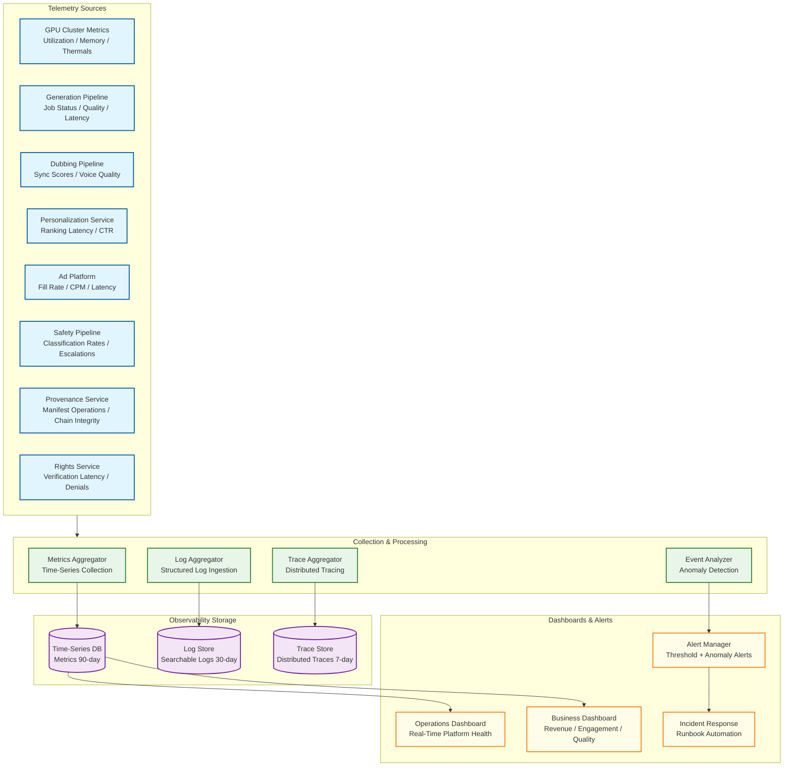

# 13.6 AI-Native Media & Entertainment Platform — Observability

## Observability Architecture

---

## GPU Cluster Metrics

### Hardware Health

| Metric | Description | Alert Threshold | Frequency |
|---|---|---|---|
| `gpu.utilization_pct` | GPU compute utilization per device | < 30% (underutilized) or > 95% (saturated) | 5 s |
| `gpu.memory_used_bytes` | GPU memory consumption | > 90% capacity | 5 s |
| `gpu.memory_fragmentation_ratio` | Free memory / largest contiguous free block | > 2.0 (significant fragmentation) | 30 s |
| `gpu.temperature_celsius` | GPU core temperature | > 85°C (thermal throttling imminent) | 10 s |
| `gpu.ecc_errors_total` | Correctable ECC memory errors (cumulative) | > 100 errors in 1 hour (degrading memory) | 60 s |
| `gpu.power_draw_watts` | Current power consumption | > 95% TDP (power throttling) | 10 s |
| `gpu.pcie_bandwidth_utilization` | PCIe bus utilization for model loading | > 90% during model swap (bottleneck) | 5 s |

### Cluster Scheduling

| Metric | Description | Alert Threshold | Frequency |
|---|---|---|---|
| `scheduler.interactive_queue_depth` | Pending interactive generation jobs | > 50 for > 30 s | 5 s |
| `scheduler.interactive_wait_p99_ms` | Wait time before job starts (interactive) | > 10,000 ms | 30 s |
| `scheduler.batch_queue_depth` | Pending batch generation jobs | > 50,000 (capacity planning trigger) | 60 s |
| `scheduler.preemption_rate_per_min` | Batch jobs preempted by interactive jobs | > 20/min (too much churn) | 60 s |
| `scheduler.spot_interruption_rate` | Spot instance preemptions per hour | > 5% of spot fleet | 300 s |
| `scheduler.model_cache_hit_rate` | % of jobs routed to GPU with model pre-loaded | < 80% (warm pool insufficient) | 60 s |
| `scheduler.gpu_idle_pct` | GPUs with 0% utilization | > 20% during peak hours (wasteful) | 60 s |

---

## Content Generation Metrics

### Quality and Performance

| Metric | Description | Alert Threshold | Frequency |
|---|---|---|---|
| `generation.latency_p95_ms` | End-to-end generation time by content type | Video > 60,000 ms; Image > 5,000 ms | Per job |
| `generation.quality_score_avg` | Automated quality score (FID, CLIP) | < 0.7 for images; < 0.6 for video | Per job |
| `generation.safety_block_rate` | % of generations blocked by safety pipeline | > 15% (model producing too much unsafe content) | Hourly |
| `generation.safety_escalation_rate` | % of generations escalated to human review | > 5% (classifier uncertainty too high) | Hourly |
| `generation.retry_rate` | % of generations retried due to quality issues | > 10% (model performance degradation) | Hourly |
| `generation.checkpoint_size_mb` | Average checkpoint size for resumable jobs | > 5,000 MB (storage cost concern) | Per checkpoint |
| `generation.cost_per_asset_usd` | GPU compute cost per generated asset | Trending upward > 10% week-over-week | Daily |

### Model Performance

| Metric | Description | Alert Threshold | Frequency |
|---|---|---|---|
| `model.inference_latency_p99_ms` | Per-model inference time | > 2× baseline (model degradation) | Per inference |
| `model.tokens_per_second` | Generation throughput per GPU | < 80% of benchmark throughput | 60 s |
| `model.memory_peak_mb` | Peak GPU memory during inference | > 95% of allocated memory | Per job |
| `model.load_time_ms` | Time to load model into GPU memory | > 90,000 ms (cold start issue) | Per model load |
| `model.version_distribution` | % of traffic per model version | Old version > 5% after 48h rollout | Hourly |

---

## Dubbing Pipeline Metrics

| Metric | Description | Alert Threshold | Frequency |
|---|---|---|---|
| `dubbing.lip_sync_score` | Audio-visual alignment quality per language | < 0.85 (perceptual mismatch) | Per segment |
| `dubbing.voice_similarity_mos` | Cloned voice similarity to original | < 0.92 (voice quality issue) | Per segment |
| `dubbing.emotion_match_pct` | Emotion preservation accuracy | < 85% | Per segment |
| `dubbing.naturalness_mos` | Predicted MOS for synthesized speech | < 3.8 / 5.0 | Per segment |
| `dubbing.qa_pass_rate` | % of language tracks passing automated QA | < 90% (systemic quality issue) | Per job |
| `dubbing.human_review_escalation_rate` | % of tracks requiring human review | > 20% (model quality regression) | Daily |
| `dubbing.throughput_seconds_per_minute` | Processing time per minute of content | > 10 seconds/minute (pipeline slowing) | Per job |
| `dubbing.language_failure_rate` | Per-language synthesis failure rate | > 5% for any language | Daily |

---

## Personalization Metrics

### Service Performance

| Metric | Description | Alert Threshold | Frequency |
|---|---|---|---|
| `personalization.api_latency_p99_ms` | End-to-end personalization response time | > 100 ms | 10 s |
| `personalization.feature_freshness_p95_s` | Age of most recent feature update | > 60 s (feature store lag) | 30 s |
| `personalization.fallback_rate` | % of requests served by fallback (popularity-based) | > 1% (feature store or model issue) | 60 s |
| `personalization.cache_hit_rate` | Feature store cache hit rate | < 95% (cache sizing issue) | 30 s |
| `personalization.model_scoring_latency_ms` | Time to score candidates for a viewer | > 50 ms (model too complex) | Per request |

### Business Impact

| Metric | Description | Alert Threshold | Frequency |
|---|---|---|---|
| `personalization.ctr_overall` | Click-through rate on personalized recommendations | Drop > 5% day-over-day | Hourly |
| `personalization.thumbnail_bandit_regret` | Bandit regret vs. oracle (best variant always) | > 15% regret (explore too much) | Daily |
| `personalization.cold_start_ctr` | CTR for viewers with < 10 interactions | < 50% of established viewer CTR | Daily |
| `personalization.diversity_score` | Diversity of recommendations per viewer session | < 0.3 (filter bubble) | Daily |
| `personalization.session_length_impact` | Session length difference: personalized vs. control | Not statistically significant (personalization broken) | Weekly |

---

## Ad Platform Metrics

### Revenue and Performance

| Metric | Description | Alert Threshold | Frequency |
|---|---|---|---|
| `ads.fill_rate` | % of ad opportunities filled with paid ads | < 85% (demand shortage or targeting too narrow) | 5 min |
| `ads.effective_cpm` | Effective CPM across all impressions | Drop > 10% hour-over-hour | Hourly |
| `ads.decision_latency_p99_ms` | Ad decision + SSAI time | > 200 ms | 10 s |
| `ads.demand_partner_latency_p95_ms` | Per-partner bid response time | > 90 ms (partner degradation) | 30 s |
| `ads.demand_partner_timeout_rate` | Per-partner bid timeout rate | > 10% (exclude partner) | 5 min |
| `ads.creative_variant_ctr` | CTR per AI-generated creative variant | Variant CTR < 50% of campaign average (bad variant) | Daily |
| `ads.viewer_ad_load_minutes` | Ad minutes per content hour per viewer | > 12 min/hour (viewer fatigue risk) | Hourly |
| `ads.session_abandon_after_ad` | % of viewers who leave after an ad break | > 5% per break (ad load too heavy) | Hourly |

### Brand Safety

| Metric | Description | Alert Threshold | Frequency |
|---|---|---|---|
| `safety.brand_safety_violation_rate` | Ads served adjacent to unsafe content | > 0 (zero tolerance for high-sensitivity) | Real-time |
| `safety.competitive_separation_violation` | Competitor ads served adjacent | > 0 | Real-time |
| `safety.frequency_cap_violation` | Same ad shown beyond cap | > 0.1% | Hourly |

---

## Provenance and Rights Metrics

| Metric | Description | Alert Threshold | Frequency |
|---|---|---|---|
| `provenance.manifest_append_latency_p99_ms` | Time to append claim to manifest | > 50 ms | Per operation |
| `provenance.chain_verification_latency_ms` | Full manifest chain verification time | > 200 ms (chain too long) | Per verification |
| `provenance.chain_break_count` | Manifests with broken signature chains | > 0 (compliance violation) | Real-time |
| `provenance.watermark_detection_rate` | % of platform content with detectable watermark | < 99.5% (watermark embedding failure) | Daily |
| `rights.verification_latency_p99_ms` | Playback rights check time | > 30 ms | 10 s |
| `rights.denial_rate` | % of playback requests denied by rights check | > 1% (rights data issue or geo-fencing problem) | Hourly |
| `rights.expiration_warning_count` | Rights expiring within 7 days | > 100 (upcoming content availability gap) | Daily |
| `rights.royalty_computation_lag_hours` | Delay in royalty calculation from impressions | > 24 hours | Daily |

---

## Content Safety Metrics

| Metric | Description | Alert Threshold | Frequency |
|---|---|---|---|
| `safety.pre_filter_block_rate` | % of prompts blocked before generation | > 20% (overly strict) or < 2% (too permissive) | Hourly |
| `safety.post_classifier_block_rate` | % of generated content blocked post-generation | > 5% (model quality issue) | Hourly |
| `safety.false_negative_estimated_rate` | Estimated policy violations reaching production | > 0.1% (classifier inadequate) | Daily |
| `safety.human_review_sla_compliance` | % of escalations reviewed within SLA (15 min) | < 95% (staffing issue) | Hourly |
| `safety.re_scan_catch_rate` | New violations found in 24h re-scan | > 0.5% (classifier needs retraining) | Daily |
| `safety.classifier_agreement_rate` | Agreement between multiple safety classifiers | < 90% (model divergence, review needed) | Daily |

---

## Alerting Strategy

### Severity Levels

| Level | Criteria | Response Time | Notification |
|---|---|---|---|
| **P0 — Critical** | Revenue loss > $10K/hour, rights violation, safety failure reaching production | Immediate (< 5 min) | Page on-call + incident bridge + executive notification |
| **P1 — High** | Generation pipeline degraded, ad fill rate drop > 15%, provenance chain break | < 15 min | Page on-call + Slack alert |
| **P2 — Medium** | Personalization fallback active, dubbing quality below threshold, feature store lag | < 1 hour | Slack alert + ticket auto-created |
| **P3 — Low** | GPU utilization anomaly, model cache hit rate drop, batch queue growth | < 4 hours | Ticket auto-created |

### Anomaly Detection

Beyond static thresholds, the observability system runs anomaly detection on key business metrics:
- **Revenue anomaly**: Ad revenue deviates > 2 standard deviations from the same hour/day-of-week historical pattern
- **Quality anomaly**: Generation quality scores trend downward across 3 consecutive hours (early signal of model degradation)
- **Engagement anomaly**: Viewer session length drops > 10% compared to 7-day rolling average (may indicate personalization or content quality issue)
- **Cost anomaly**: GPU cost per generated asset increases > 20% without corresponding quality improvement (efficiency regression)

---

## Key Dashboards

### Operations Dashboard (Real-Time)
- GPU cluster health heat map (utilization, temperature, memory by node)
- Generation pipeline status (queue depths, active jobs, error rates by model)
- Safety pipeline throughput and escalation funnel
- Ad platform fill rate and revenue run rate
- Provenance chain integrity status

### Business Dashboard (Hourly/Daily)
- Content generation volume and cost trends
- Dubbing pipeline throughput and quality by language
- Personalization impact (CTR lift vs. control, session length impact)
- Ad revenue by segment, format, and demand partner
- Rights utilization (% of licensed content being monetized)

### Creator Dashboard (Per-Creator)
- Generation history and quality trends
- Asset performance (views, engagement, revenue if monetized)
- Safety compliance record
- Provenance trail for all created assets
