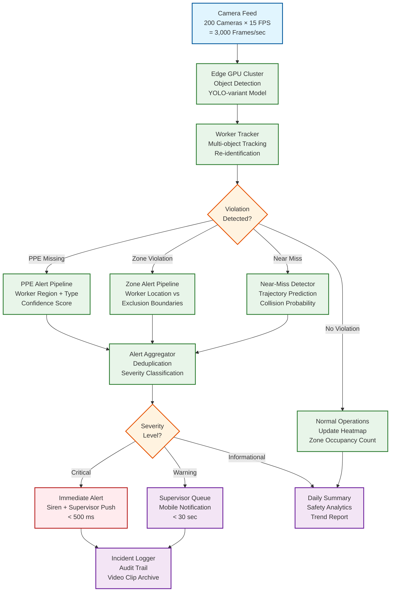

# 13.7 AI-Native Construction & Engineering Platform — High-Level Design

## System Architecture

```mermaid
flowchart TB
    subgraph Sources["Data Sources"]
        CAM[360° Site Cameras\nProgress Capture]
        SAF[Safety Cameras\nFixed + PTZ]
        DRN[Drones\nLiDAR + RGB]
        IOT[IoT Sensors\nEquipment + Environmental]
        BIM[BIM Authoring Tools\nIFC / Revit Models]
        MKT[Market Data\nMaterial Prices + Labor Indices]
        WX[Weather Services\nForecasts + Historical]
        ERP[ERP / Procurement\nOrders + Invoices]
    end

    subgraph Edge["Edge Computing Layer"]
        SFE[Safety CV Engine\nReal-time Inference]
        VBF[Video Buffer\nKeyframe Extraction]
        IMG[Image Collector\nCapture Scheduling]
        SNS[Sensor Aggregator\nIoT Protocol Translation]
    end

    subgraph Gateway["Ingestion & Gateway Layer"]
        IGW[Image Ingestion Gateway\nBatch Upload + Streaming]
        BGW[BIM Gateway\nIFC Parser + Validator]
        DGW[Data Integration Gateway\nERP + Market + Weather]
        AGW[Alert Gateway\nSafety Event Router]
    end

    subgraph Stream["Stream Processing Layer"]
        IPP[Image Processing Pipeline\nPhotogrammetry + Registration]
        PCP[Point Cloud Processor\nFusion + Decimation]
        EVP[Event Processor\nSafety Alerts + IoT Events]
        CHP[Change Processor\nBIM Diff + Impact Analysis]
    end

    subgraph Core["Core Intelligence Services"]
        BIE[BIM Intelligence Engine\nClash Detection + Constructability]
        CEE[Cost Estimation Engine\nProbabilistic Models]
        PTE[Progress Tracking Engine\n4D BIM Comparison]
        SME[Safety Monitoring Engine\nIncident Prediction + Analytics]
        ROE[Resource Optimization Engine\nScheduling + Allocation]
        RPE[Risk Prediction Engine\nDelay Forecasting]
    end

    subgraph Analytics["Analytics & Coordination Layer"]
        DTW[Digital Twin Service\nSite State Management]
        EVM[Earned Value Manager\nCPI / SPI Calculation]
        SCM[Subcontractor Manager\nPerformance Scoring]
        QIM[Quality Inspection Manager\nDefect Detection]
        DOC[Document Manager\nRFI + Submittals]
    end

    subgraph Data["Data Layer"]
        OBS[(Object Store\nImagery + Point Clouds)]
        BDB[(BIM Database\nModel Elements + Versions)]
        TSD[(Time-Series Store\nIoT + Progress Telemetry)]
        CDB[(Cost Database\nEstimates + Actuals)]
        SDB[(Schedule Database\nCPM + EVM Data)]
        AUD[(Audit Store\nSafety + Compliance Logs)]
    end

    subgraph Consumer["Consumer Layer"]
        PMD[Project Manager Dashboard\nSchedule + Risk + Cost]
        SFD[Safety Dashboard\nAlerts + Analytics]
        FLD[Field App\nMobile Progress + Inspection]
        STK[Stakeholder Portal\nReports + Digital Twin Viewer]
        API[External API\nIntegration Partners]
    end

    CAM --> IMG
    SAF --> SFE & VBF
    DRN --> IMG
    IOT --> SNS
    BIM --> BGW
    MKT & WX --> DGW
    ERP --> DGW

    SFE --> AGW
    VBF --> IGW
    IMG --> IGW
    SNS --> DGW

    IGW --> IPP
    BGW --> CHP
    DGW --> EVP
    AGW --> EVP

    IPP --> PCP
    PCP --> PTE & DTW
    CHP --> BIE & CEE
    EVP --> SME & RPE

    BIE --> BDB & PMD
    CEE --> CDB & PMD
    PTE --> DTW & EVM
    SME --> AUD & SFD
    ROE --> SDB & PMD
    RPE --> SDB & PMD

    DTW --> OBS & STK
    EVM --> SDB & PMD
    SCM --> SDB
    QIM --> FLD
    DOC --> PMD

    IPP --> OBS
    PCP --> OBS
    EVP --> TSD
    SME --> AUD
    ROE --> AUD

    FLD --> IGW
    API --> DGW

    classDef source fill:#e1f5fe,stroke:#01579b,stroke-width:2px
    classDef edge fill:#fff8e1,stroke:#f57f17,stroke-width:2px
    classDef gateway fill:#fff3e0,stroke:#e65100,stroke-width:2px
    classDef service fill:#e8f5e9,stroke:#2e7d32,stroke-width:2px
    classDef data fill:#f3e5f5,stroke:#6a1b9a,stroke-width:2px
    classDef consumer fill:#fce4ec,stroke:#880e4f,stroke-width:2px

    class CAM,SAF,DRN,IOT,BIM,MKT,WX,ERP source
    class SFE,VBF,IMG,SNS edge
    class IGW,BGW,DGW,AGW gateway
    class IPP,PCP,EVP,CHP,BIE,CEE,PTE,SME,ROE,RPE service
    class OBS,BDB,TSD,CDB,SDB,AUD data
    class PMD,SFD,FLD,STK,API,DTW,EVM,SCM,QIM,DOC consumer
```

---

## Key Design Decisions

### Decision 1: Edge-Cloud Hybrid Architecture with Safety-First Processing

The platform enforces a strict processing hierarchy: safety-critical computer vision runs entirely on edge compute co-located at the construction site, while analytics-heavy workloads (progress tracking, cost estimation, risk prediction) run in the cloud. Safety camera feeds never leave the site as raw video—edge GPUs perform real-time object detection and tracking, and only structured alert events (worker ID region, violation type, confidence score, bounding box coordinates, 5-second clip) are transmitted to the cloud. This design is driven by three constraints: (1) latency—a 500 ms safety alert SLO cannot tolerate cloud round-trip times of 100–300 ms plus inference time; (2) bandwidth—200 cameras at 15 FPS generating ~3 Gbps of raw video cannot be economically backhauled to the cloud; (3) resilience—safety monitoring must continue during internet outages, which occur frequently on construction sites.

**Implication:** Each site requires a ruggedized edge compute cluster with 20–25 GPUs for safety inference, 10 TB of local storage for buffering, and a UPS with 4-hour battery backup. The edge cluster runs a lightweight container orchestrator with automatic model updates pulled during low-activity periods (overnight). The cloud receives structured events only, reducing bandwidth to ~10 Mbps per site while preserving the analytics value. When connectivity is lost, the edge buffers up to 24 hours of events and forwards them on reconnection, with safety alerts continuing to fire locally via site-level notification systems (sirens, supervisor mobile alerts via local Wi-Fi).

### Decision 2: Asynchronous Progress Tracking with Daily Batch Photogrammetry

Progress tracking operates on a daily batch cycle rather than real-time processing, despite the availability of continuous camera feeds. This counterintuitive decision is driven by the nature of construction progress: meaningful changes (a wall framed, conduit installed, concrete poured) occur over hours to days, not seconds. Processing every 30-second capture in real-time would consume 20x more GPU compute while providing negligible incremental insight—a steel beam does not become "more installed" between two 30-second frames. The system captures continuously for coverage but processes in daily batches: end-of-day images are selected (best quality per zone per floor), photogrammetry reconstructs the 3D scene, and BIM comparison identifies changes since the previous day.

**Implication:** The image ingestion gateway buffers raw 360-degree captures in edge storage during the day and initiates batch upload to cloud object storage starting at the end of the work shift. The photogrammetry pipeline processes the upload queue overnight using spot/preemptible GPU instances (60–70% cost reduction). Progress results are available by 6 AM for morning planning meetings. The exception is the "rapid assessment" mode triggered after significant events (concrete pour completion, structural inspection) where on-demand processing of a targeted zone's imagery runs within 1 hour.

### Decision 3: BIM-Centric Data Model with IFC as the Canonical Schema

All platform data is organized around BIM elements as the primary key. Progress observations, cost line items, schedule activities, safety zones, quality inspections, and risk factors are all linked to IFC element GUIDs (GlobalId). This BIM-centric data model enables cross-domain queries that are impossible in siloed systems: "Show me all structural columns on Floor 12 that are behind schedule, over budget, and have unresolved clash issues with the MEP design." The IFC schema (ISO 16739-1) serves as the canonical data model because it is the industry standard for open BIM data exchange, supports the full building lifecycle (design → construction → operations), and provides a rich type system (IfcWall, IfcBeam, IfcDuct, etc.) that enables domain-specific analytics.

**Implication:** The BIM gateway must parse IFC files (STEP physical file format) and populate a graph database where nodes represent IFC elements and edges represent spatial, containment, and dependency relationships. Model updates are processed as diffs: the parser identifies added, modified, and deleted elements by comparing GUID sets, and propagates changes to all dependent services (clash detection, cost estimation, schedule linking). The graph database supports spatial queries (all elements within 2 meters of a given point) and topological queries (all elements connected to a given system) that power progress tracking and clash detection.

### Decision 4: Probabilistic Cost Estimation with Continuous BIM-Linked Updates

The cost estimation engine replaces single-point estimates with probability distributions. For each BIM element, the system retrieves historical cost data for similar elements (matched by type, material, size, location, and project complexity) from the historical project database, fits a distribution (typically log-normal for construction costs), and adjusts using current market conditions (material price indices, labor availability indices). The project-level cost estimate is the convolution of 500,000+ element-level distributions, computed via Monte Carlo simulation. When a design change modifies BIM elements, only the affected elements' cost distributions are recomputed, and the project total is updated incrementally.

**Implication:** The cost database maintains element-level cost distributions, not just point estimates. The Monte Carlo engine uses importance sampling for efficiency: instead of uniform random sampling, it oversamples from the tails of high-variance elements (structural steel, specialty MEP equipment) that dominate the project cost uncertainty. The system produces cost reports with confidence intervals (P10, P50, P90) rather than single numbers, forcing project teams to reason about cost risk rather than treating the estimate as deterministic.

### Decision 5: Multi-Source Point Cloud Fusion for the Digital Twin

The site digital twin is not a single point cloud but a fused representation from multiple capture sources: 360-degree cameras (dense coverage, moderate accuracy), LiDAR scanners (high accuracy, sparse coverage), drone surveys (exterior + roof coverage, periodic), and even mobile phone captures from field workers. Each source has different coordinate systems, accuracy profiles, and capture frequencies. The fusion pipeline registers all sources to the BIM coordinate system using a hierarchical registration process: (1) coarse alignment using GPS/known reference points, (2) fine alignment using Iterative Closest Point (ICP) against the BIM model geometry, (3) multi-source fusion with per-point confidence weighting based on source accuracy.

**Implication:** The point cloud processing pipeline must handle heterogeneous data formats (E57, LAS, PLY, proprietary camera formats), perform coordinate transforms between local site coordinates, GPS coordinates, and BIM project coordinates, and manage the computational cost of ICP registration on point clouds with 100M+ points. The fusion engine maintains a "confidence mesh" that tracks which regions of the site have high-confidence data (recently scanned, multiple sources) versus low-confidence (old data, single source, high occlusion), guiding capture planning to prioritize under-surveyed areas.

---

## Data Flow: Daily Progress Tracking Cycle

```mermaid
flowchart LR
    A[360° Camera Capture\n50 cameras × 1,200 images\n= 60K images/site/day] --> B[Edge Image Buffer\nQuality Filtering\nBest-per-zone Selection]
    B --> C[Batch Upload\nEnd-of-shift Transfer\nto Object Storage]
    C --> D[Photogrammetry Pipeline\nSfM + MVS Reconstruction\nGPU-accelerated]
    D --> E[Point Cloud Registration\nICP Alignment to BIM\nCoordinate System]
    E --> F{Element Matching\nBIM Geometry vs\nPoint Cloud Comparison}
    F -->|Match Found| G[Status Update\nNot Started → In Progress\nor In Progress → Complete]
    F -->|No Match| H[Gap Analysis\nMissing Element\nOr Occlusion?]
    G --> I[EVM Calculation\nEarned Value Update\nCPI / SPI Refresh]
    H --> I
    I --> J[Progress Report\nPer-floor Dashboard\nDeviation Alerts]

    classDef input fill:#e1f5fe,stroke:#01579b,stroke-width:2px
    classDef process fill:#e8f5e9,stroke:#2e7d32,stroke-width:2px
    classDef decision fill:#fff3e0,stroke:#e65100,stroke-width:2px
    classDef output fill:#f3e5f5,stroke:#6a1b9a,stroke-width:2px

    class A input
    class B,C,D,E,G,H process
    class F decision
    class I,J output
```

---

## Data Flow: Real-Time Safety Monitoring

---

## Component Responsibilities Summary

| Component | Primary Responsibility | Key Interface |
|---|---|---|
| **Safety CV Engine (Edge)** | Real-time object detection, PPE compliance checking, exclusion zone monitoring, near-miss trajectory prediction on site camera feeds | Processes 3,000 frames/sec per site; emits structured safety events to alert gateway |
| **Image Ingestion Gateway** | Receives 360-degree captures, drone imagery, and mobile uploads; validates metadata; routes to processing pipeline | Handles 60K images/site/day batch upload; supports streaming for urgent assessments |
| **BIM Gateway** | Parses IFC/Revit files, extracts element hierarchy, computes model diffs, validates schema compliance | Ingests models up to 2M elements; publishes change events to dependent services |
| **Image Processing Pipeline** | Structure-from-Motion photogrammetry, multi-view stereo reconstruction, image quality assessment | GPU-accelerated; processes 60K images per site into dense point clouds |
| **Point Cloud Processor** | Multi-source point cloud fusion, ICP registration to BIM coordinates, decimation, temporal differencing | Handles 50 GB point clouds; outputs BIM-registered point cloud with confidence weights |
| **BIM Intelligence Engine** | Automated clash detection, constructability analysis, code compliance checking, change impact propagation | Spatial indexing on 500K+ elements; ML-based clash relevance filtering |
| **Cost Estimation Engine** | Probabilistic cost modeling, BIM quantity extraction, Monte Carlo simulation, market-adjusted pricing | Element-level cost distributions; 10,000-scenario simulation in <5 minutes |
| **Progress Tracking Engine** | BIM-to-reality comparison, element completion detection, percentage calculation, deviation alerting | Compares daily point clouds against BIM; updates element-level status |
| **Safety Monitoring Engine** | Safety analytics, incident trend analysis, leading indicator computation, zone risk scoring | Aggregates edge alerts; computes site-wide safety metrics and predictions |
| **Resource Optimization Engine** | Crew scheduling, equipment allocation, material delivery optimization, spatial deconfliction | Constraint-based solver; optimizes across 50+ trades with fatigue and certification constraints |
| **Risk Prediction Engine** | Activity-level delay probability scoring, critical path impact analysis, weather integration, subcontractor risk modeling | ML models trained on 50K+ projects; daily risk score updates |
| **Digital Twin Service** | Maintains 4D site model, temporal versioning, deviation heat maps, virtual walkthrough generation | Fuses multi-source point clouds; daily snapshots with BIM overlay |
| **Earned Value Manager** | CPI/SPI calculation, EAC/ETC forecasting, variance analysis, performance trend reporting | Reads progress data + cost actuals; publishes EVM metrics to dashboards |
| **Subcontractor Manager** | Performance scoring across productivity/quality/safety/schedule dimensions, historical tracking, qualification scoring | Objective data from progress tracking + safety + schedule; scores updated daily |
