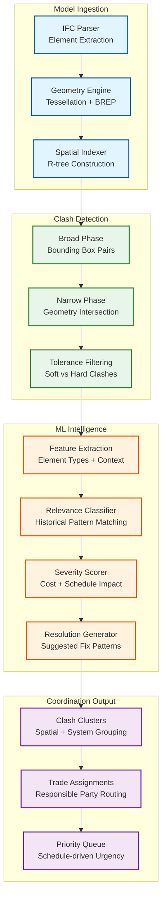
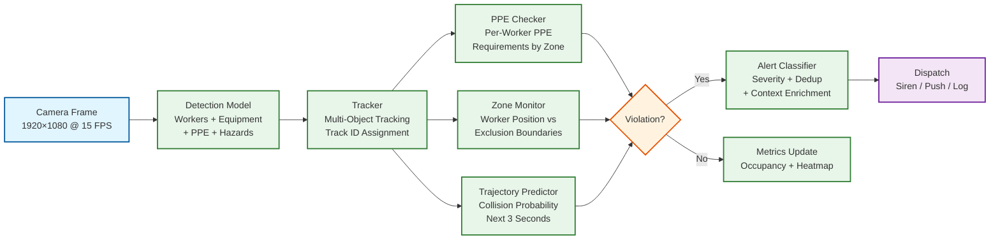

# 13.7 AI-Native Construction & Engineering Platform — Deep Dives & Bottlenecks

## Deep Dive 1: BIM Clash Detection at Scale — From Geometric Noise to Actionable Coordination

### The Problem

A full BIM model for a large commercial building contains 500,000–2,000,000 elements across structural, architectural, mechanical, electrical, plumbing, and fire protection disciplines. Naive pairwise clash detection (every element against every other) requires O(n²) geometry intersection tests—500K elements yield 125 billion pairs, which is computationally infeasible. Even with spatial filtering, a typical full-model clash report produces 20,000–80,000 raw clashes, of which 85–95% are irrelevant (acceptable tolerances, construction sequence will resolve them, or standard design patterns that are known to be buildable). The engineering challenge is not finding clashes—it is finding the 500–2,000 clashes that actually matter.

### Architecture



### Bottleneck: Spatial Index Construction for Large Models

Building an R-tree for 2M elements with complex 3D geometry requires tessellating each element's B-rep geometry into a triangulated mesh (for accurate bounding box computation), inserting into the spatial index with bulk-loading (STR algorithm for optimal tree structure), and maintaining the index incrementally as model updates arrive. The tessellation step is the bottleneck: complex curved geometry (HVAC duct bends, pipe elbows, structural connections) can produce 10,000+ triangles per element, and 2M elements yield 20 billion triangles that must be processed before any clash detection can begin. The production system uses level-of-detail tessellation: simple elements (rectangular walls, straight pipes) use low-poly representations (10–50 triangles), while complex geometry gets progressively refined only during narrow-phase intersection testing. This reduces the initial tessellation from 20B to ~200M triangles, cutting index construction time from 45 minutes to 3 minutes.

### Bottleneck: ML Relevance Filtering Cold Start

The relevance classifier requires training data—clashes that were labeled as "relevant" or "irrelevant" by human coordinators. A new firm adopting the platform has no historical labels. The cold-start strategy uses transfer learning: a base model trained on 10,000+ projects across the platform provides a general relevance classifier that achieves 70% accuracy out of the box. As coordinators label clashes on their projects (by resolving, accepting, or dismissing them), the model fine-tunes using online learning, reaching 85% accuracy within 3 months and 92% within a year. The key insight is that clash relevance is highly firm-specific: some firms accept duct-beam clashes within 50 mm tolerance, while others require 100 mm clearance for maintenance access. The model must learn these firm-specific standards from coordinator behavior.

---

## Deep Dive 2: Progress Tracking — Bridging the Visual-Geometric Gap

### The Problem

Comparing daily site imagery against a BIM model seems straightforward in concept but is enormously challenging in practice. The BIM model represents the *designed* building in an idealized clean state. The construction site is a chaotic environment where: (1) elements are partially installed (a wall is framed but not drywalled), (2) temporary works (scaffolding, formwork, shoring) occlude permanent elements, (3) construction debris and materials on the floor obstruct camera views, (4) lighting varies dramatically between floors and time of day, (5) elements look different during construction than in the final state (exposed rebar before concrete pour, bare studs before drywall), and (6) the as-built position may differ from the design by centimeters to tens of centimeters. A progress tracking system that only recognizes "finished" elements misses the entire construction process; one that tries to detect every intermediate state faces a combinatorial explosion of possible configurations.

### Architecture

The progress tracking pipeline uses a three-stage approach:

**Stage 1: Geometric Reconstruction.** Structure-from-Motion (SfM) algorithms estimate camera positions from 360-degree image sequences, followed by Multi-View Stereo (MVS) to produce dense point clouds. This stage is entirely classical computer vision—no ML models required—and produces a 3D point cloud with ~1 cm point spacing from images captured at 2-meter intervals along walking paths.

**Stage 2: Registration and Segmentation.** The reconstructed point cloud is aligned to the BIM coordinate system using ICP (Iterative Closest Point) against known reference geometry (structural columns, floor slabs, elevator shafts). After registration, each point is associated with the nearest BIM element using the spatial index. Points that do not match any BIM element are classified as temporary works, debris, or out-of-tolerance installations.

**Stage 3: Status Inference.** For each BIM element, the system analyzes the associated point cloud segment to determine completion status. This stage uses both geometric features (surface coverage percentage, shape similarity to design geometry) and visual features (material appearance from RGB colors, texture patterns indicating specific construction stages). A multi-class classifier trained on labeled examples determines the element's status: not started, rough-in, in-progress, substantially complete, or deficient.

### Bottleneck: Photogrammetry at Scale

Processing 60,000 images per site per day through SfM+MVS is computationally expensive. SfM feature extraction and matching is O(n²) on image count—60,000 images yield 1.8 billion potential image pairs. The production system uses a hierarchical approach: images are grouped by floor and zone (using camera location metadata), SfM is run independently per zone (~200 images each), and zone-level point clouds are stitched using known reference points. This reduces the matching problem from O(n²) on 60,000 to O(n²) on 200 × 300 zones, an 200x speedup. The MVS densification step uses GPU-accelerated stereo matching, processing ~200 images in 2 minutes on a modern GPU, making the 300-zone pipeline feasible within the 4-hour SLO using 4 GPU workers per site.

### Bottleneck: Handling Construction Stages vs. Design State

A concrete column in the BIM model is a clean rectangular prism. During construction, it progresses through: (1) rebar cage (steel grid, no concrete), (2) formwork placed (plywood box around rebar), (3) concrete poured (wet surface, formwork still in place), (4) formwork stripped (rough concrete surface, form tie holes visible), (5) patched and finished (smooth surface). The system must recognize all five stages as partial completion of the same element. The production model is trained on a taxonomy of 150+ construction stage types across 20 element categories, with examples from 50,000+ projects. For each BIM element type, the model outputs a stage classification and maps it to a completion percentage (rebar cage = 30%, formwork = 50%, concrete poured = 70%, stripped = 85%, finished = 100%). This construction-stage-aware progress detection is the primary differentiator from naive geometric comparison.

---

## Deep Dive 3: Safety CV Pipeline — From Frame to Life-Saving Alert in 500ms

### The Problem

Construction sites are the most visually complex environments for computer vision: cluttered backgrounds with heavy machinery, scaffolding, temporary structures, and piles of material; workers in similar-looking safety gear (distinguishing a worker with a hard hat from one with a similar-colored hoodie); extreme lighting variations from direct sunlight to deep shadows within the same frame; dust, rain, and vibration affecting image quality; and cameras mounted at oblique angles on temporary structures that shift as construction progresses. The system must detect PPE compliance, zone violations, and near-miss events with ≥95% accuracy while maintaining <500 ms latency for critical alerts—and must do so on edge hardware that operates in 40°C heat with intermittent power.

### Architecture



### Latency Budget Breakdown

```
Total budget: 500 ms

Frame acquisition:              10 ms   (camera capture + decode)
Object detection (batch of 4):  80 ms   (edge GPU inference)
Multi-object tracking:          15 ms   (Kalman filter update + association)
PPE classification:             25 ms   (per-worker crop classification)
Zone boundary check:             5 ms   (point-in-polygon per worker)
Trajectory prediction:          20 ms   (linear + Kalman extrapolation)
Alert deduplication:            10 ms   (track ID + time window check)
Context enrichment:             15 ms   (zone name, nearest BIM element)
Alert dispatch (local):         20 ms   (siren trigger + supervisor push)
─────────────────────────────────────
Total:                         200 ms   (well within 500 ms budget)
Margin for degraded conditions: 300 ms  (dust, vibration, thermal throttling)
```

### Bottleneck: False Positive Management

A construction site with 200 cameras and 2,000 workers generating 1,000 raw PPE alerts per hour would overwhelm safety supervisors with alert fatigue, causing them to ignore all alerts—including genuine life-threatening violations. The production system uses a multi-layer deduplication and filtering strategy:

1. **Temporal deduplication:** Same track ID, same violation type, within a 5-minute window → single alert. Reduces 1,000 to ~200 unique alerts/hour.
2. **Confidence thresholding:** Alerts below 0.85 confidence are logged but not dispatched to supervisors. Reduces false positives by ~40%.
3. **Contextual filtering:** Workers in designated break areas may remove hard hats; PPE requirements vary by zone (ground floor vs. elevated work). Zone-aware rules eliminate contextually inappropriate alerts.
4. **Temporal persistence:** Require violation to persist for ≥3 consecutive frames (200 ms) before alerting, filtering transient misdetections from single-frame noise.

After all filtering stages, the system dispatches ~50 unique, high-confidence, contextually relevant alerts per hour per site—a manageable workload for 2–3 safety supervisors.

### Bottleneck: Edge Model Updates Without Downtime

Safety CV models must be updated periodically (new PPE types, site-specific calibration, model accuracy improvements) without interrupting the real-time inference pipeline. The edge cluster uses a blue-green deployment strategy: the new model is loaded onto a standby GPU while the primary GPU continues inference; once the standby model passes a validation suite (10 test images with known ground truth, accuracy ≥ threshold), traffic is switched atomically. Rollback occurs automatically if the new model's live accuracy drops below the previous model's baseline within the first hour. Model updates are scheduled during the overnight low-activity window (10 PM – 6 AM) when camera feeds show empty sites and alert volume is near zero.

---

## Deep Dive 4: Probabilistic Cost Estimation — From BIM Quantities to Confidence Intervals

### The Problem

Traditional cost estimation produces a single number: "This building will cost $50 million." This false precision hides enormous uncertainty—the actual cost could range from $42M to $65M depending on material price movements, labor productivity variations, design changes, and unforeseen conditions. More dangerously, single-point estimates create anchoring bias: once stakeholders see "$50M," they treat it as a commitment rather than an estimate, and the 30% of projects that exceed budget are treated as failures rather than statistical expectations.

### Architecture

The cost estimation engine operates at three levels:

**Level 1: Quantity Extraction.** The BIM gateway parses the IFC model and extracts quantities for every element: concrete volume (m³), steel weight (kg), duct length (m), fixture count (ea), etc. This is deterministic—given a specific model version, quantities are exact. The challenge is mapping BIM quantities to cost items: a single IfcWall may require drywall, framing, insulation, taping, painting, and baseboard—each a separate cost item with independent unit rates.

**Level 2: Unit Rate Distribution Fitting.** For each cost item, the system queries the historical database for similar items (same CSI MasterFormat code, similar size/specification, similar project type, same geographic region). Instead of returning a single unit rate, it fits a distribution—typically log-normal, as construction costs are bounded below (you cannot build for free) and have a long right tail (complex conditions can make costs much higher than typical). The distribution parameters are adjusted for current market conditions using material price indices (steel, concrete, lumber) and labor rate indices (by trade, by region).

**Level 3: Monte Carlo Simulation.** The project cost is the sum of 500K+ element costs, each drawn from its respective distribution. Because element costs are not independent (if steel prices rise, all steel elements are affected; if a project is in a tight labor market, all labor costs increase), the simulation uses a correlated sampling approach: cost drivers (material prices, labor rates, productivity factors) are sampled first from their joint distribution, and then element costs are computed conditional on those drivers. This captures the "everything goes wrong at once" tail risk that independent sampling misses.

### Bottleneck: Historical Database Coverage

The cost database must contain enough historical data to fit reliable distributions for each cost item. Common items (concrete foundations, standard drywall) have thousands of data points; rare items (specialized cleanroom HVAC, blast-resistant glazing) may have fewer than 20. For sparse items, the system uses hierarchical Bayesian estimation: the item's distribution is informed by the broader category distribution (e.g., "specialty glazing" distribution anchors the "blast-resistant glazing" estimate), with the item-specific data pulling the estimate toward observed values as more data accumulates. This prevents overfitting to a few data points while still leveraging item-specific information when available.

### Bottleneck: Change Order Cascading

When a design change modifies one element, the cost impact often cascades: enlarging a mechanical room increases concrete quantities, requires longer duct runs, adds additional lighting fixtures, may require a larger electrical panel, and affects the structural design if the room is on an upper floor. The cost estimation engine must trace these dependencies through the BIM model's relationship graph and recompute costs for all affected elements, not just the directly changed elements. The production system uses a "change impact radius" computed by traversing the BIM relationship graph (containment, connection, adjacency) up to 3 levels from the changed element, recomputing costs for all elements within the radius. This typically expands a single-element change to 50–200 affected elements—a manageable recomputation that completes within the 5-minute SLO.

---

## Deep Dive 5: Resource Optimization — The Spatial-Temporal Scheduling Problem

### The Problem

Construction scheduling is not just a precedence-constrained project scheduling problem (which is NP-hard itself). It adds spatial constraints that do not exist in manufacturing or software: two crews cannot work in the same 3×3 meter area simultaneously (safety regulation), a tower crane can serve only one lifting operation at a time (shared resource), material deliveries must be staged on specific floors with limited laydown area (spatial capacity), and certain trades produce noise, dust, or vibration that prevents adjacent trades from working (environmental interference). The combinatorial explosion of temporal precedence × spatial constraints × resource availability × weather windows makes exact solutions infeasible for real projects with 50,000 activities.

### Solution Approach

The production system uses a two-tier optimization:

**Tier 1: Strategic schedule (weekly).** A simplified MIP model with activity-level granularity (not task-level) optimizes the overall project sequence. Activities are aggregated by floor/zone/trade, reducing 50,000 tasks to ~2,000 activity groups. The MIP finds the optimal trade sequence per zone, crane allocation plan, and major material delivery windows. This strategic schedule is recomputed weekly as actual progress updates the model.

**Tier 2: Tactical assignments (daily).** Given the strategic schedule's weekly targets, a constraint propagation solver assigns specific crews to specific zones for each day. This solver handles the fine-grained spatial constraints (crew sizes, zone occupancy limits, equipment sharing, environmental interference) that are too detailed for the weekly MIP. The tactical solver runs each evening for the following day's assignments, with a re-solve triggered if significant disruptions occur (weather cancellation, equipment breakdown, crew no-show).

### Bottleneck: Equipment Sharing Across Zones

A tower crane shared among multiple floors creates a bottleneck that dominates the critical path of many high-rise projects. The crane can perform ~15 lifts per hour, but each lift has setup time (rigging, signaling, load preparation) that varies by material type and crew experience. The optimization must sequence lifts to minimize crane idle time while respecting the material delivery schedule (just-in-time: materials arrive at the staging area within 30 minutes of their scheduled lift). The production system models the crane as a single-server queue with priority-based scheduling: structural steel lifts (critical path) get highest priority; facade panel lifts (schedule-driven) get medium priority; general material lifts get lowest priority. The solver pre-assigns lift windows to each zone and trade, publishing the schedule so crews can prepare materials in advance.
