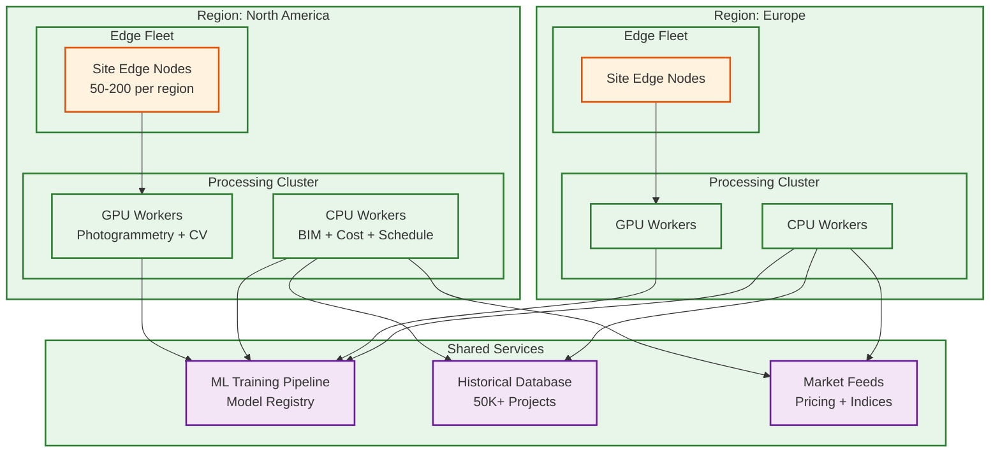

# 13.7 AI-Native Construction & Engineering Platform — Scalability & Reliability

## Multi-Site Scaling Strategy

### Challenge: 500+ Concurrent Sites with Heterogeneous Workloads

Construction sites vary enormously in scale: a residential renovation generates 1,000 images/day with a 50K-element BIM model; a hospital campus generates 200,000 images/day with a 2M-element model. The platform must scale across 500+ sites that range from 10x to 1x the baseline resource requirement, with workload patterns that are highly time-zone dependent (all sites in a region peak simultaneously during morning planning hours) and seasonal (construction activity drops 40% in winter in northern climates).

### Architecture: Site-Affinity Partitioning with Burst Scaling



Each site's data is partitioned by `site_id` across all storage layers, ensuring data locality and enabling site-level isolation for security and compliance. Processing workloads use site-affinity scheduling: a site's photogrammetry batch is assigned to the same GPU worker pool across days, maintaining cached intermediate results (camera calibration parameters, spatial index, reference point clouds) that reduce processing time by 30–40% compared to cold-start processing on a random worker.

Burst scaling handles the daily processing wave: when 200 sites in the same time zone upload their end-of-shift imagery simultaneously (typically 5–7 PM local time), the GPU worker pool scales from baseline (50 GPUs) to peak (200 GPUs) using preemptible instances. The scheduler prioritizes sites with critical-path activities (identified by the risk prediction engine) and sites approaching milestone deadlines, processing lower-priority sites during off-peak hours (overnight).

### Storage Tiering for Petabyte-Scale Imagery

```
Hot tier (SSD-backed object store):
  - Current day's captures (awaiting processing): ~45 TB
  - Last 7 days processed point clouds: ~50 TB
  - Active BIM models (all versions): ~5 TB
  - Safety alert clips (30 days): ~750 TB
  Total hot: ~850 TB

Warm tier (HDD-backed object store):
  - 30-day image archive: ~1.35 PB
  - 90-day point cloud archive: ~600 TB
  - Historical progress snapshots: ~200 TB
  Total warm: ~2.15 PB

Cold tier (archival storage):
  - Project lifetime imagery (regulatory retention): varies
  - Completed project archives: ~5 PB cumulative
  - Compliance audit trails: ~5 TB
  Total cold: ~5 PB+

Lifecycle policy:
  - Images: hot (7 days) → warm (30 days) → cold (project completion + 7 years)
  - Point clouds: hot (7 days) → warm (90 days) → cold (project completion + 3 years)
  - Safety clips: hot (30 days) → cold (project completion + 10 years for litigation)
  - BIM models: hot (active project) → cold (project completion + 15 years)
```

---

## Edge Compute Resilience

### Autonomous Operation During Connectivity Loss

Construction sites experience frequent connectivity disruptions: fiber cuts during excavation, cellular congestion in urban areas, weather-related outages, and simply poor coverage in remote locations. The edge compute layer must maintain full safety monitoring capability and buffer progress data during outages lasting up to 24 hours.

**Safety monitoring (zero-interruption):** The safety CV pipeline runs entirely on edge hardware with no cloud dependency. All model weights, zone configurations, and alert rules are cached locally. Safety alerts fire via local mechanisms: site-level siren systems connected via hardwired relay, supervisor mobile alerts via local Wi-Fi mesh network, and LED warning signs at zone boundaries controlled by the edge cluster. The edge stores up to 48 hours of safety events in local storage, forwarding to the cloud when connectivity resumes with causal ordering preserved by monotonic event IDs and GPS-synchronized timestamps.

**Progress data buffering:** 360-degree captures continue to local storage (10 TB per edge node) during outages. The edge runs a lightweight "quick-scan" progress assessment using pre-cached BIM geometry, providing approximate progress updates to the site team via the local field app. Full photogrammetry processing defers to cloud restore. Upload priority on reconnection: safety events first, then progress imagery by floor priority (critical path floors first).

**Configuration synchronization:** Edge nodes pull configuration updates (zone boundaries, PPE requirements, model updates) during a daily sync window. If the sync fails, the previous configuration remains active with a "stale configuration" flag visible to the site safety officer. Configuration changes never take effect without successful validation on the edge (test images produce expected results).

### Edge Hardware Fault Tolerance

```
Standard edge cluster per site:
  - 4 edge compute nodes (each with 6 inference GPUs)
  - Redundancy: N+1 (3 nodes handle full load; 1 standby)
  - Local storage: 10 TB NVMe per node (40 TB total)
  - UPS: 4-hour battery backup per node
  - Network: dual uplinks (primary fiber/cable + cellular failover)
  - Environmental: IP65-rated enclosures, -20°C to 50°C operating range

Failure modes and recovery:
  - Single GPU failure: workload redistributed to remaining GPUs on same node
  - Full node failure: standby node activated; camera feeds rebalanced in <60 seconds
  - Storage failure: RAID-10 on each node; degraded operation continues
  - Power failure: UPS provides 4 hours; graceful shutdown saves state to persistent storage
  - Total edge failure: safety monitoring degrades to camera recording only (NVR fallback);
    processing defers entirely to cloud on connectivity restore
```

---

## Processing Pipeline Scalability

### Photogrammetry Pipeline: GPU Compute Scaling

The photogrammetry pipeline is the largest compute consumer, requiring 10,000 GPU-hours per day across 500 sites. The pipeline is embarrassingly parallel at the zone level: each zone's 200 images are processed independently, enabling linear scaling with GPU count.

```
Scaling model:
  Base load: 500 sites × 300 zones/site × 2 min/zone = 300,000 zone-minutes/day
  = 5,000 GPU-hours/day at 1x throughput
  With SfM overhead (feature matching, bundle adjustment): 2x multiplier
  Total: 10,000 GPU-hours/day

  Baseline GPU pool: 50 GPUs (running 20h/day = 1,000 GPU-hours)
  Peak burst pool: 200 GPUs (preemptible/spot, 4-hour evening burst)
  Burst capacity: 200 × 4h = 800 GPU-hours per burst window
  Remaining: overnight processing on baseline pool

  Cost optimization:
    Baseline (reserved instances): ~60% of compute cost
    Burst (preemptible instances): ~30% of compute cost (70% discount)
    On-demand fallback: ~10% for SLO-critical catch-up
```

### BIM Processing: Memory-Bound Scaling

BIM clash detection is memory-bound rather than compute-bound: a 2M-element model with spatial index requires ~16 GB of RAM for the R-tree plus ~32 GB for tessellated geometry. The processing is I/O intensive during model parsing (reading multi-GB IFC files) and compute-intensive during geometry intersection. Each BIM processing worker is provisioned with 64 GB RAM and 16 CPU cores. Workers are statefully assigned to projects: the same worker handles all model updates for a given project, maintaining the spatial index in memory across incremental updates (avoiding the 3-minute index rebuild on every update).

```
Scaling model:
  500 projects × average 5 model updates/week = 2,500 updates/week
  Incremental update processing: ~30 seconds per update
  Full model re-clash: ~10 minutes per model, 500 times/month
  Total: 2,500 × 0.5 min + 500 × 10 min = 6,250 minutes/week ≈ 104 hours/week

  Baseline workers: 10 (easily handles steady state)
  Peak: month-end coordination deadlines may spike to 50 concurrent updates
  Auto-scale to 25 workers during coordination weeks
```

### Cost Estimation: Compute-Bound Monte Carlo

Monte Carlo simulation with 10,000 scenarios across 500K elements is CPU-intensive but highly parallelizable. Each scenario is independent: sample cost drivers from joint distribution, compute element costs, sum to project total. The 10,000 scenarios are distributed across 100 workers (100 scenarios each), completing in ~2 seconds per worker for a total wall-clock time of ~3 minutes including overhead.

```
Scaling model:
  Per estimate: 100 workers × 2 seconds = 200 worker-seconds
  Daily estimates across all projects: ~200 (design changes + scheduled refreshes)
  Daily compute: 200 × 200 seconds = 40,000 worker-seconds ≈ 11 worker-hours
  Minimal baseline of 5 workers handles all steady-state estimates
  Burst to 100 workers for individual estimate computation
```

---

## Reliability Engineering

### Failure Domain Isolation

The platform operates across three failure domains with independent reliability targets:

| Domain | Components | Availability Target | Failure Impact |
|---|---|---|---|
| **Safety-critical (edge)** | Safety CV, alert dispatch, zone monitoring | 99.99% | Life safety risk; unacceptable for any duration |
| **Operational (cloud)** | Progress tracking, scheduling, digital twin | 99.9% | Project management degraded; catch-up possible |
| **Analytical (cloud)** | Cost estimation, risk prediction, analytics | 99.5% | Decision support delayed; no immediate project impact |

Each domain has independent infrastructure: safety-critical components run on dedicated edge hardware with no shared dependencies on cloud services. Operational services run on a dedicated cloud cluster with auto-scaling and multi-zone deployment. Analytical services run on shared infrastructure with lower priority and graceful degradation.

### Data Durability and Recovery

```
Imagery (regulatory requirement):
  - Primary: object store with cross-region replication (RPO: 0)
  - Edge buffer: local NVMe with 48-hour retention (survives cloud outage)
  - Archive: cold storage with 7-year retention minimum
  - Recovery: edge re-upload from local buffer if cloud write fails

BIM models (intellectual property):
  - Primary: versioned storage with per-element change tracking
  - Backup: daily snapshots to separate region
  - Recovery: model version history enables rollback to any point

Safety audit trail (legal requirement):
  - Primary: append-only log with cryptographic chaining
  - Replication: synchronous write to two regions
  - Tamper detection: hash chain verified daily; alert on any inconsistency
  - Retention: project lifetime + 10 years (litigation statute of limitations)

Progress data:
  - Primary: time-series database with daily snapshots
  - Backup: weekly full backup + daily incrementals
  - Recovery: rebuild from imagery (reprocess) if database fails
```

### Graceful Degradation Hierarchy

When resources are constrained or components fail, the platform degrades in a predictable priority order:

```
Priority 1 (never degrade): Safety monitoring, safety alerts
Priority 2 (degrade last): Progress tracking, schedule updates
Priority 3 (degrade early): Cost re-estimation, risk score refresh
Priority 4 (degrade first): Analytics dashboards, report generation, digital twin rendering

Example degradation scenario — cloud processing overload:
  1. Suspend report generation and analytics queries
  2. Reduce risk score refresh from 15-min to hourly
  3. Delay cost re-estimation to overnight batch
  4. Continue progress tracking at full throughput (SLO-critical)
  5. Safety monitoring unaffected (edge-only)
```

---

## Capacity Planning and Growth

### Horizontal Scaling Triggers

| Metric | Scale-Up Trigger | Scale-Down Trigger | Scaling Unit |
|---|---|---|---|
| GPU queue depth (photogrammetry) | > 500 zones queued | < 100 zones queued | +/- 10 GPU instances |
| BIM worker memory utilization | > 80% across pool | < 40% across pool | +/- 2 BIM workers |
| Image ingestion queue lag | > 2 hours behind | < 30 minutes behind | +/- 5 ingestion workers |
| Safety event processing lag | > 5 seconds | < 1 second | +/- 3 event processors |
| API response latency p99 | > 2 seconds | < 500 ms | +/- 2 API servers |

### Per-Site Resource Provisioning

```
Small site (residential, < 50K sq ft):
  Edge: 1 compute node, 2 GPUs, 2 cameras
  Cloud: shared worker pool allocation

Medium site (commercial, 50K-500K sq ft):
  Edge: 2 compute nodes, 8 GPUs, 50 cameras
  Cloud: dedicated BIM worker, shared GPU pool

Large site (hospital/airport, > 500K sq ft):
  Edge: 4 compute nodes, 24 GPUs, 200 cameras
  Cloud: dedicated BIM worker, dedicated GPU allocation, priority queue

Mega-project (data center campus, infrastructure):
  Edge: 8 compute nodes, 48 GPUs, 500 cameras + drones
  Cloud: dedicated cluster, priority processing, 24/7 support
```
