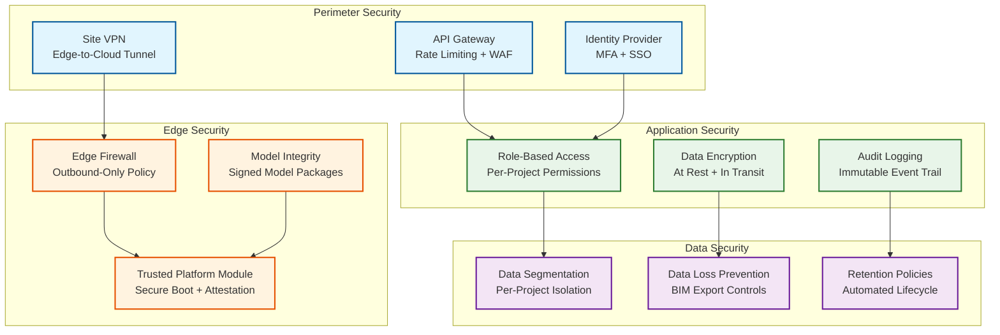

# 13.7 AI-Native Construction & Engineering Platform — Security & Compliance

## Threat Model

### Construction-Specific Attack Surfaces

Construction platforms face unique security challenges beyond typical enterprise software:

| Threat Vector | Attack Scenario | Impact |
|---|---|---|
| **BIM model theft** | Competitor or adversary extracts proprietary building designs, structural details, or security system layouts | Intellectual property loss; national security risk for government/defense projects |
| **Cost data exfiltration** | Subcontractor pricing, bid strategies, or internal cost estimates leaked to competitors | Competitive disadvantage; bid manipulation; contract disputes |
| **Safety system tampering** | Attacker disables safety alerts or modifies exclusion zones, creating unmonitored hazard areas | Worker injury or death; criminal liability; regulatory penalties |
| **Progress data manipulation** | Falsified progress reports to trigger milestone payments for incomplete work | Financial fraud; project delays when actual status is discovered |
| **Edge device compromise** | Physical access to site-deployed edge nodes enables malware installation or data extraction | Lateral movement to cloud systems; safety monitoring disruption; data theft |
| **Drone hijacking** | Unauthorized control of survey drones; interception of aerial imagery | Physical damage from drone crash; site surveillance for theft planning |
| **Supply chain attack** | Compromised CV model update deploys poisoned weights that degrade safety detection accuracy | Gradual increase in undetected safety violations; difficult to detect |

---

## Security Architecture

### Multi-Layer Defense



### Edge Device Security

Edge compute nodes are physically accessible on construction sites—a unique security challenge compared to data-center-deployed infrastructure. The security model assumes physical compromise is possible and implements defense-in-depth:

**Secure boot chain:** Each edge node uses a Trusted Platform Module (TPM) to verify the boot sequence from firmware through operating system to application containers. If any component fails attestation (indicating tampering), the node refuses to boot and alerts the cloud management plane.

**Encrypted storage:** All local data (safety clips, buffered imagery, cached BIM models) is encrypted with keys stored in the TPM. Physical disk removal yields only encrypted data. Keys are rotated weekly during the cloud sync window.

**Network isolation:** Edge nodes communicate only with the cloud management plane via an encrypted VPN tunnel. No inbound connections are accepted. The firewall policy is outbound-only with allowlisted destinations. Camera feeds are received on a physically separate network interface connected to the site's camera VLAN.

**Model integrity verification:** CV model updates are cryptographically signed by the training pipeline. The edge node verifies the signature against a trusted public key embedded in the TPM before loading any model. This prevents supply chain attacks where a compromised update mechanism could deploy poisoned model weights.

**Anti-tamper monitoring:** Chassis intrusion sensors, GPS location monitoring (alert if node moves from registered site location), and heartbeat monitoring (alert if node goes silent for >15 minutes during active hours) provide physical security telemetry.

---

## Access Control

### Role-Based Permission Matrix

| Role | BIM Models | Cost Data | Safety Data | Progress Data | Schedule | Admin |
|---|---|---|---|---|---|---|
| **Project Owner** | View + Export | View All | View + Configure | View All | View + Edit | Full |
| **General Contractor PM** | View + Edit | View (own scope) | View + Configure | View + Edit | View + Edit | Project-level |
| **Subcontractor Lead** | View (own discipline) | View (own trades) | View (own zones) | View (own scope) | View (own activities) | None |
| **Safety Officer** | View (structural) | None | Full Access | View | None | Safety config |
| **Site Engineer** | View + Edit | View (budget vs actual) | View | View + Edit | View + Edit | None |
| **Owner's Representative** | View + Export | View All | View (summary) | View All | View | Audit access |
| **Inspector** | View (relevant scope) | None | View (inspection areas) | View (inspection items) | None | None |
| **Field Worker (mobile)** | View (assigned area) | None | View (own alerts) | Update (own tasks) | None | None |

### BIM Intellectual Property Protection

BIM models are high-value intellectual property. The platform implements granular access controls:

**Per-element permissions:** Structural engineers see full structural details but only reference geometry for MEP systems. MEP subcontractors see their discipline's elements plus adjacent structural elements (for clash coordination) but not architectural finishes or cost data. This is enforced at the query layer—the BIM database returns only elements authorized for the requesting user's role and project assignment.

**Export controls:** BIM model exports (IFC, DWG, PDF) are watermarked with the requesting user's identity and a timestamp. Exports of full models require project owner approval. Partial exports (single discipline or floor) are allowed within role permissions but logged for audit. Defense/government projects use enhanced controls: no export without explicit owner authorization per instance, and exported files are encrypted with time-limited decryption keys.

**View-only rendering:** For stakeholders who need to visualize the model but should not receive the underlying geometry data, the platform provides a server-side rendering mode. The BIM geometry is rendered on the server, and only rasterized images (not 3D geometry) are transmitted to the client. This prevents geometry extraction from the client application.

---

## Compliance Framework

### Construction-Specific Regulations

| Regulation | Scope | Platform Compliance Measure |
|---|---|---|
| **OSHA 29 CFR 1926** | Construction safety standards (US) | Automated safety monitoring; incident documentation; exposure tracking; required training verification |
| **ISO 19650** | BIM information management standard | Model federation rules; information exchange protocols; security-minded approach per ISO 19650-5 |
| **GDPR / Local Privacy Laws** | Worker data protection | No facial recognition for productivity; anonymized safety analytics; data minimization for worker tracking |
| **Building Code Compliance** | Local building codes and standards | BIM code checking for accessible route compliance, fire egress, structural clearances |
| **Environmental Regulations** | Construction environmental impact | Noise monitoring, dust level tracking, stormwater compliance via IoT sensors |
| **Records Retention** | Construction document retention requirements | Automated lifecycle policies: project documents retained 7–15 years per jurisdiction |
| **Prevailing Wage / Labor Laws** | Labor compliance on public projects | Work hour tracking (aggregate, not individual); overtime alerts; certified payroll support |

### Worker Privacy Protection

Construction worker privacy is a critical ethical and legal concern. The platform enforces strict privacy boundaries:

**No facial recognition:** The safety CV system detects workers as bounding boxes with PPE attributes. Worker tracking uses multi-object tracking (MOT) with appearance-based re-identification that operates on clothing color, height, and body shape—not facial features. Track IDs are session-local and reset daily; there is no persistent worker identity linked to CV detections.

**Aggregate productivity only:** The platform tracks zone-level productivity (work installed per zone per day) rather than individual worker productivity. Subcontractor performance scoring uses crew-level metrics (crew of 5 installed 100 linear meters of duct today) not individual metrics. This satisfies operational needs while respecting worker dignity and labor law.

**Data minimization:** Safety video clips are retained for 30 days (for incident investigation) and then auto-deleted unless flagged for a specific incident report. Raw video feeds are never stored; only keyframes and alert clips are persisted. IoT sensor data is aggregated to 15-minute intervals after 7 days, destroying per-second granularity.

**Consent and transparency:** Workers are notified that safety monitoring cameras are active via clearly visible signage at site entry points. The system's capabilities (PPE detection, zone monitoring) and limitations (no facial recognition, no individual tracking) are disclosed in the project safety plan distributed to all workers.

---

## Data Governance

### Data Classification

| Classification | Examples | Encryption | Access | Retention |
|---|---|---|---|---|
| **Confidential** | BIM models, cost estimates, bid data, subcontractor pricing | AES-256 at rest; TLS 1.3 in transit | Named individuals with need-to-know | Project + 15 years |
| **Restricted** | Safety incident details, worker tracking data, inspection reports | AES-256 at rest; TLS 1.3 in transit | Role-based per project | Project + 10 years |
| **Internal** | Progress reports, schedule updates, meeting minutes | AES-256 at rest; TLS 1.3 in transit | Project team members | Project + 7 years |
| **Public** | Project milestone announcements, environmental monitoring summaries | TLS 1.3 in transit | Stakeholder portal access | Project + 3 years |

### Audit Trail Requirements

All security-relevant events generate immutable audit records:

```
AuditRecord:
  record_id:           string          # unique, monotonically increasing
  timestamp:           datetime        # GPS-synchronized
  actor:               string          # user ID or system service ID
  action:              string          # e.g., "BIM_EXPORT", "SAFETY_ZONE_MODIFY"
  resource:            string          # affected resource ID
  project_id:          string
  site_id:             string
  details:             map[string, any] # action-specific metadata
  ip_address:          string
  device_fingerprint:  string
  result:              enum[SUCCESS, DENIED, ERROR]
  previous_hash:       string          # hash chain for tamper detection

Critical audited actions:
  - BIM model upload, download, or export
  - Cost estimate creation, modification, or sharing
  - Safety zone creation, modification, or deletion
  - Safety alert acknowledgment or dismissal
  - User permission changes
  - Edge device configuration updates
  - CV model deployments
  - Schedule baseline changes
  - Progress data manual overrides
```

### Incident Response

**Safety system compromise:** If the safety monitoring system is suspected of compromise (model poisoning, alert suppression), the platform initiates an immediate failover to the previous known-good model version on all affected edge nodes, notifies site safety officers to increase manual inspections, and generates a compliance incident report. All safety events during the suspected compromise window are flagged for manual review.

**Data breach response:** The platform implements automated data breach detection (unusual export volumes, access from anomalous locations, bulk data queries) with automated response: suspect session termination, temporary account lockdown, and incident ticket generation. For BIM model theft, the watermarking system enables forensic tracing of any leaked model back to the exporting user.
