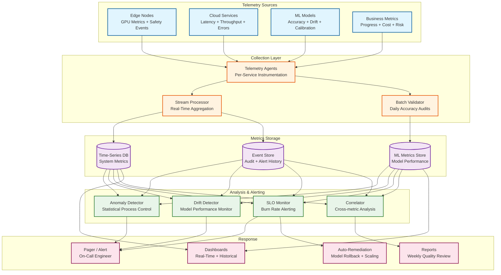

# 13.7 AI-Native Construction & Engineering Platform — Observability

## Observability Philosophy

Construction AI platforms have a unique observability challenge: the system's outputs (progress reports, safety alerts, cost estimates, risk scores) directly influence physical-world decisions (crew deployment, material orders, safety interventions) that cannot be easily rolled back. A false progress report showing 90% completion on a floor that is actually 60% complete can trigger premature follow-on trade mobilization, wasting hundreds of thousands of dollars in idle labor. Observability must therefore monitor not just system health but *output quality*—the accuracy and calibration of AI-generated insights compared to ground truth.

---

## Key Metrics Framework

### Tier 1: Safety Monitoring Metrics (Real-Time)

| Metric | Description | Target | Alert Threshold |
|---|---|---|---|
| `safety.alert_latency_p99` | Time from frame capture to alert dispatch | ≤ 500 ms | > 750 ms |
| `safety.detection_accuracy` | PPE detection accuracy vs. manual audit | ≥ 95% | < 90% |
| `safety.false_positive_rate` | Alerts dismissed as false positive within 5 min | ≤ 10% | > 20% |
| `safety.camera_coverage_pct` | Percentage of monitored zones with active feeds | ≥ 98% | < 90% |
| `safety.edge_gpu_utilization` | Edge GPU compute utilization | 40-80% | > 90% or < 20% |
| `safety.edge_node_health` | Edge nodes reporting healthy heartbeat | 100% (N+1) | Any node down |
| `safety.alert_response_time_p50` | Time from alert to supervisor acknowledgment | ≤ 5 min | > 15 min |
| `safety.model_drift_score` | Statistical drift in detection distribution vs. baseline | ≤ 0.05 KL divergence | > 0.1 |

### Tier 2: Progress Tracking Metrics (Daily)

| Metric | Description | Target | Alert Threshold |
|---|---|---|---|
| `progress.processing_latency_p95` | Time from capture upload to progress report | ≤ 4 h | > 6 h |
| `progress.element_detection_rate` | Elements correctly identified vs. ground truth audit | ≥ 90% | < 85% |
| `progress.point_cloud_registration_error` | RMS registration error against BIM coordinates | ≤ 2 cm | > 5 cm |
| `progress.capture_coverage_pct` | Percentage of planned zones captured today | ≥ 95% | < 80% |
| `progress.occlusion_rate` | Elements marked as occluded (unable to assess) | ≤ 15% | > 25% |
| `progress.temporal_consistency` | Elements with status regression vs. previous day | ≤ 2% | > 5% |
| `progress.earned_value_freshness` | Age of EVM calculations | ≤ 24 h | > 48 h |
| `progress.photogrammetry_success_rate` | Zone reconstructions succeeding without manual intervention | ≥ 98% | < 95% |

### Tier 3: BIM Intelligence Metrics (Per-Update)

| Metric | Description | Target | Alert Threshold |
|---|---|---|---|
| `bim.parse_success_rate` | IFC models parsed without errors | ≥ 99% | < 95% |
| `bim.clash_detection_latency_p99` | Incremental clash detection time | ≤ 30 s | > 60 s |
| `bim.relevance_filter_precision` | ML-classified relevant clashes confirmed by coordinator | ≥ 85% | < 75% |
| `bim.relevance_filter_recall` | Relevant clashes not missed by ML filter | ≥ 95% | < 90% |
| `bim.model_element_count` | Elements in active model (capacity monitoring) | ≤ 2M | > 1.5M (warning) |
| `bim.spatial_index_build_time` | R-tree construction time | ≤ 3 min | > 5 min |
| `bim.version_diff_accuracy` | Model diff correctly identifies changed elements | ≥ 99% | < 97% |

### Tier 4: Cost Estimation Metrics (Per-Estimate)

| Metric | Description | Target | Alert Threshold |
|---|---|---|---|
| `cost.estimate_generation_time_p95` | Time to produce full probabilistic estimate | ≤ 5 min | > 10 min |
| `cost.historical_coverage_pct` | Cost items with ≥20 historical data points | ≥ 80% | < 60% |
| `cost.confidence_interval_width` | P90/P10 ratio (narrower = more confident) | ≤ 1.5 at CD stage | > 2.0 |
| `cost.estimate_vs_actual_error` | Completed projects: estimate deviation from actual | ≤ ±10% at DD | > ±15% |
| `cost.market_data_freshness` | Age of material price and labor index feeds | ≤ 24 h | > 72 h |
| `cost.monte_carlo_convergence` | Coefficient of variation of P50 across runs | ≤ 0.5% | > 2% |

### Tier 5: Risk Prediction Metrics (Daily)

| Metric | Description | Target | Alert Threshold |
|---|---|---|---|
| `risk.model_auc` | Area under ROC curve for delay prediction | ≥ 0.80 | < 0.70 |
| `risk.calibration_error` | Mean calibration error (predicted prob vs. observed frequency) | ≤ 0.05 | > 0.10 |
| `risk.prediction_lead_time` | Average days between first alert and actual delay | ≥ 14 days | < 7 days |
| `risk.false_alarm_rate` | Activities flagged high-risk that completed on time | ≤ 20% | > 30% |
| `risk.feature_freshness` | Age of input features (weather, supply chain, subcontractor) | ≤ 24 h | > 72 h |
| `risk.critical_path_coverage` | Critical path activities with risk scores | 100% | < 95% |

---

## Observability Architecture



---

## ML Model Monitoring

### Safety CV Model Drift Detection

The safety CV model's accuracy is continuously monitored using a "shadow audit" pipeline:

**Real-time drift detection:** The distribution of detection classes, confidence scores, and bounding box sizes is tracked per camera per hour. Statistical process control (SPC) charts flag when distributions shift beyond control limits—indicating either a model problem (degraded accuracy) or an environmental change (new construction phase with different visual characteristics). A Kolmogorov-Smirnov test compares the current day's detection distribution against the 30-day baseline, with a threshold of 0.05 significance level.

**Weekly accuracy audit:** A random sample of 500 frames per site is sent to human annotators for ground truth labeling. The model's predictions on these frames are compared to human labels, producing per-class precision/recall metrics. This catches gradual accuracy drift that statistical distribution tests might miss (e.g., the model maintains the same detection rate but increasingly confuses hard hats with white helmets from a new subcontractor).

**Automatic remediation:** If accuracy drops below 90% for any safety-critical class (hard hat, harness, exclusion zone), the system automatically rolls back to the previous model version on affected edge nodes and generates an incident ticket for the ML engineering team. The rollback happens within 15 minutes of drift detection, minimizing the window of degraded safety monitoring.

### Progress Tracking Accuracy Validation

Progress tracking accuracy is validated through a weekly "ground truth walk":

1. A trained surveyor performs a manual assessment of 50 randomly selected elements per site, recording their actual completion status.
2. The surveyor's assessments are compared against the system's automated progress detection for the same elements on the same day.
3. Discrepancies are categorized: false positive (system says complete, actually incomplete), false negative (system says not started, actually in progress), and staging error (system detects wrong construction stage).
4. Category-level accuracy metrics are computed and trended over time.

If false negative rate exceeds 15% (system missing installed work), the photogrammetry pipeline parameters are reviewed—typically indicating registration drift or insufficient camera coverage in specific zones. If false positive rate exceeds 10% (system claiming progress that does not exist), the element matching model is retrained with the new ground truth labels.

### Cost Estimation Calibration

Cost estimate accuracy is validated at project milestones by comparing the estimate at each stage against the actual cost:

```
Calibration pipeline:
  1. At project completion, record actual cost per CSI division
  2. Compare against the estimate produced at each design stage:
     - Conceptual estimate vs. actual → expected ±25%
     - Schematic estimate vs. actual → expected ±15%
     - Design Development estimate vs. actual → expected ±10%
     - Construction Documents estimate vs. actual → expected ±5%
  3. Compute calibration metrics:
     - Bias: average (estimate - actual) / actual → should be near 0%
     - Sharpness: average width of 80% confidence interval
     - Coverage: % of actuals falling within 80% CI → should be ~80%
  4. If bias > 5% or coverage < 70%, retrain cost models with new project data
  5. Feed actual costs back into historical database for future estimates
```

---

## Dashboard Design

### Project Manager Dashboard (Primary)

```
┌─────────────────────────────────────────────────────────────────┐
│ Project: Metro Hospital Phase 2          Status: On Track  ▲   │
│ Updated: 2026-03-10 06:00               Day 247 of 540        │
├──────────────────────┬──────────────────────────────────────────┤
│  PROGRESS            │  COST                                   │
│  Planned: 45.8%      │  Budget:     $142.5M                    │
│  Actual:  43.2%      │  EAC (P50):  $148.2M                    │
│  SPI: 0.94           │  CPI: 0.96                              │
│  ▼ 2.6% behind       │  ▼ $5.7M over (P50)                    │
│                      │  P10: $139.8M  P90: $162.1M             │
├──────────────────────┼──────────────────────────────────────────┤
│  SAFETY (Today)      │  TOP RISKS                              │
│  Alerts: 47          │  1. MEP rough-in Floor 8 (P=72%)        │
│  Critical: 2         │  2. Curtain wall delivery (P=65%)       │
│  PPE compliance: 94% │  3. Fire protection Floor 5-7 (P=58%)   │
│  Near-misses: 3      │  4. Elevator install (P=45%)            │
│  Trend: Improving ▲  │                                         │
├──────────────────────┼──────────────────────────────────────────┤
│  SCHEDULE            │  SYSTEM HEALTH                          │
│  Critical path:      │  Safety CV: ● Healthy (99.99%)          │
│   Floor 8 structure  │  Progress:  ● Healthy (processed 6AM)   │
│   3 days behind      │  BIM:       ● Healthy (last clash 2h)   │
│  Float consumed: 62% │  Edge nodes: ● 4/4 online               │
│  Recovery options: 2 │  Data sync:  ● Current (lag < 5 min)    │
└──────────────────────┴──────────────────────────────────────────┘
```

### Safety Operations Dashboard

```
┌─────────────────────────────────────────────────────────────────┐
│  LIVE SAFETY MONITOR          Site: Metro Hospital Phase 2     │
├──────────────────────────────────────────────────────────────────┤
│  ACTIVE ALERTS (2 Critical)                                    │
│  🔴 Floor 12 East - Worker without harness near leading edge   │
│     Camera: CAM-12E-04  |  Time: 14:23:07  |  Conf: 0.97     │
│  🔴 Basement B2 - Unauthorized entry to confined space         │
│     Camera: CAM-B2-02   |  Time: 14:22:45  |  Conf: 0.93     │
│  🟡 Floor 5 West - Hard hat removed in active zone             │
│     Camera: CAM-05W-07  |  Time: 14:21:30  |  Conf: 0.91     │
├──────────────────────────────────────────────────────────────────┤
│  ZONE OCCUPANCY (Real-time)                                    │
│  Floor 12: ████████░░ 42/50 workers  ⚠ Near capacity          │
│  Floor 11: ██████░░░░ 31/50 workers                            │
│  Floor 10: ████░░░░░░ 22/50 workers                            │
│  Basement: ██░░░░░░░░ 8/30 workers                             │
├──────────────────────────────────────────────────────────────────┤
│  7-DAY TREND                                                   │
│  PPE compliance:  91% → 92% → 90% → 93% → 94% → 94% → 94%  │
│  Near-misses/day:  5  →  3  →  4  →  2  →  3  →  3  →  2    │
│  Avg response time: 4.2 min → 3.8 min → 3.5 min (improving)  │
│  Model accuracy:   96.2% (last weekly audit)                   │
└──────────────────────────────────────────────────────────────────┘
```

---

## Alerting Strategy

### Alert Routing by Severity and Type

| Alert Category | Severity | Notification Channel | Response SLO | Escalation |
|---|---|---|---|---|
| Safety — life threat | Critical | Siren + supervisor push + safety officer | Immediate (<1 min) | Auto-escalate to site manager at 3 min |
| Safety — PPE violation | Warning | Supervisor mobile notification | < 5 min | Escalate to safety officer at 15 min |
| Edge node failure | Critical | On-call platform engineer | < 15 min | Escalate to engineering lead at 30 min |
| Progress SLO breach | Warning | Project manager notification | < 2 h | Escalate to platform ops at 4 h |
| CV model drift detected | Warning | ML engineering team channel | < 4 h | Auto-rollback if accuracy < 90% |
| BIM processing failure | Warning | BIM coordinator notification | < 1 h | Escalate to platform ops at 2 h |
| Cost data feed stale | Info | Cost estimator notification | < 24 h | Escalate at 72 h |
| Risk model AUC drop | Warning | Data science team channel | < 8 h | Manual retrain trigger |

### Alert Fatigue Prevention

Construction generates high event volumes. The alerting system prevents fatigue through:

1. **Deduplication:** Same metric, same resource, same severity → single alert with incrementing counter. Re-alert only on severity change or after 4-hour cool-down.
2. **Correlation:** Multiple metrics degrading simultaneously (e.g., progress processing slow + GPU utilization high + queue depth growing) → single correlated incident, not three independent alerts.
3. **Business hours awareness:** Non-critical alerts are batched and delivered at shift start (6 AM) rather than interrupting overnight. Critical safety and infrastructure alerts fire immediately regardless of time.
4. **Trend-based alerting:** Rather than alerting on every threshold crossing, use burn-rate alerting: alert when the error budget consumption rate predicts SLO violation within 4 hours at current trajectory.
