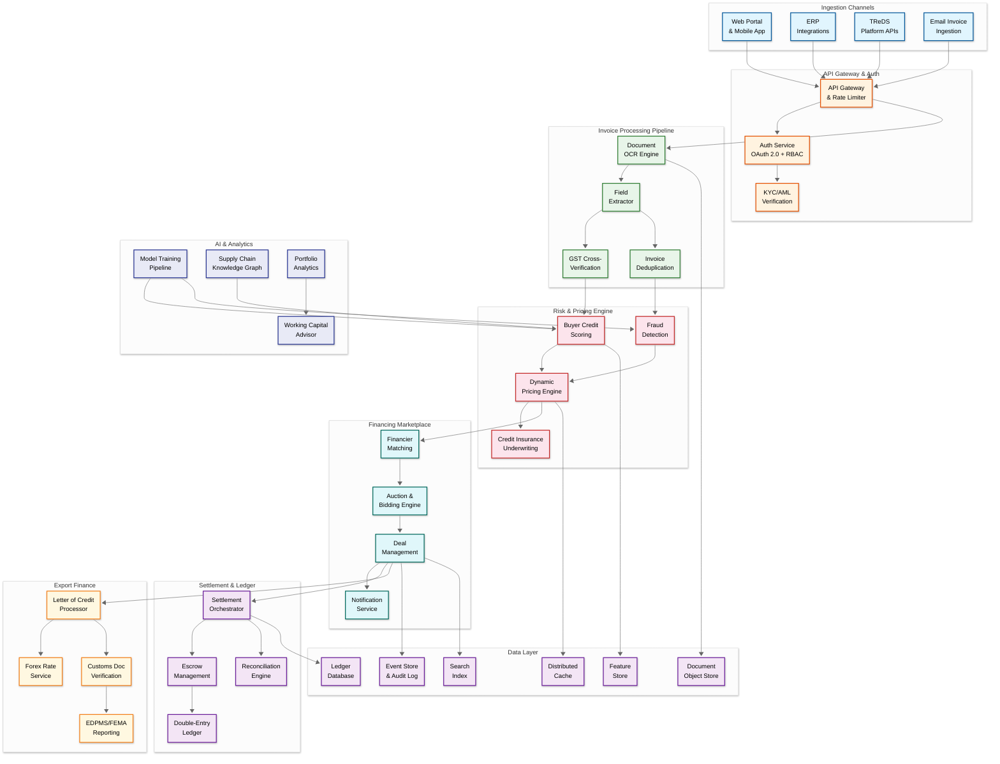
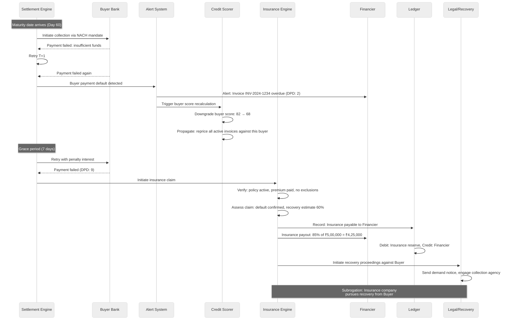

# 14.10 AI-Native Trade Finance & Invoice Factoring Platform — High-Level Design

## Architecture Overview

The platform follows a CQRS event-sourced architecture where the write path (invoice submission, deal creation, settlement execution) flows through a command pipeline with strict consistency guarantees, while the read path (portfolio dashboards, analytics, financier matching) operates on eventually consistent materialized views optimized for query performance. The system is organized into three processing tiers: (1) a **real-time tier** for invoice verification, pricing, and financier matching requiring sub-second latency, (2) a **transactional tier** for settlement orchestration and ledger operations requiring ACID guarantees, and (3) a **batch tier** for credit model retraining, regulatory reporting, and portfolio analytics.

---

## Component Descriptions

### API Gateway & Auth

| Component | Responsibility | Key Details |
|---|---|---|
| **API Gateway** | Routes requests, enforces rate limits, handles versioning; provides unified API surface for web, mobile, ERP integrations, and TReDS platform connectivity | Rate limiting per tenant: 100 RPS for MSMEs, 1,000 RPS for anchor corporates, 5,000 RPS for financier APIs; request/response logging for audit |
| **Auth Service** | OAuth 2.0 + OpenID Connect for authentication; RBAC with attribute-based overlays for authorization; multi-factor authentication for high-value operations | Role hierarchy: MSME_user → MSME_admin → Financier_analyst → Financier_admin → Platform_ops → Platform_admin; maker-checker enforcement for deals > ₹1 crore |
| **KYC/AML Verification** | Automated KYC for onboarding (PAN, GSTIN, bank account verification, director identification); ongoing AML monitoring with sanctions screening | Video KYC integration; PAN-GSTIN cross-validation; bank account penny-drop verification; CKYC registry integration; sanctions screening against OFAC, EU, UN, and domestic lists |

### Invoice Processing Pipeline

| Component | Responsibility | Key Details |
|---|---|---|
| **Document OCR Engine** | Extracts text and structure from invoice documents (PDF, images, scans); identifies document type (invoice, purchase order, delivery challan, credit note) | Transformer-based document understanding model; handles multi-page invoices; table extraction for line items; confidence scores per extracted field; supports 12+ Indian languages on invoices |
| **Field Extractor** | Maps OCR output to structured invoice schema: invoice number, date, GSTIN (seller/buyer), HSN codes, line items with quantities and amounts, tax breakdown (CGST/SGST/IGST), total amount, payment terms | Rule-based extraction with ML fallback; handles diverse invoice formats (no standard template across MSMEs); validates internal consistency (line items sum to total, tax calculations correct) |
| **GST Cross-Verification** | Validates invoice against GSTN filings: matches invoice in seller's GSTR-1 and buyer's GSTR-2B; verifies GSTIN validity and return filing status | GSTN API integration with retry and caching; handles API rate limits; flags invoices not found in GST filings; checks for cancelled/suspended GSTINs; verifies e-invoice IRN for invoices above threshold |
| **Invoice Deduplication** | Detects duplicate invoices: exact match (same invoice number + seller + buyer), near-duplicate (same parties, similar amount and date), and cross-platform deduplication via industry registries | Bloom filter for fast exact-match; LSH (Locality-Sensitive Hashing) for near-duplicate detection; integration with CRILC (Central Repository of Information on Large Credits) and TReDS registries for cross-platform checks |

### Risk & Pricing Engine

| Component | Responsibility | Key Details |
|---|---|---|
| **Buyer Credit Scoring** | Computes real-time creditworthiness scores for invoice buyers using 200+ features: financial ratios, payment history, GST filing patterns, legal cases, industry benchmarks, macroeconomic indicators | Gradient-boosted ensemble model; daily score refresh for active buyers; explainable scoring with SHAP values; separate models for large corporates vs. SME buyers; industry-specific benchmarking |
| **Fraud Detection** | Multi-layer fraud detection: document-level (tampered invoices), entity-level (fictitious buyers/suppliers), relationship-level (circular trading), and behavioral-level (unusual patterns) | Graph neural network for relationship-based fraud; velocity checks (invoice volume spikes); amount pattern analysis (round numbers, threshold-gaming); real-time + batch detection modes |
| **Dynamic Pricing Engine** | Calculates discount rate per invoice considering: buyer risk, invoice tenor, amount, industry, platform liquidity, financier appetite, concentration risk, and market benchmark rates | Multi-factor pricing model; real-time liquidity adjustment; concentration risk premium; seasonal adjustments; pricing bands (floor and ceiling rates) per buyer rating tier; audit trail for every rate computation |
| **Credit Insurance Underwriting** | AI-driven premium computation for trade credit insurance; portfolio-level exposure monitoring; automated claim processing on verified buyer defaults | Expected loss model: PD (probability of default) × LGD (loss given default) × EAD (exposure at default); correlation adjustments for portfolio concentration; reinsurance treaty compliance; claims processing with documentation verification |

### Financing Marketplace

| Component | Responsibility | Key Details |
|---|---|---|
| **Financier Matching** | Matches invoices to eligible financiers based on investment criteria: buyer rating, industry, tenor, ticket size, geographic preference, portfolio capacity | Real-time matching against financier preference matrices; priority routing for anchor program invoices; load balancing across financiers to prevent concentration; SLA-based matching (auto-match within 2 seconds for pre-approved programs) |
| **Auction & Bidding Engine** | Manages competitive bidding for invoice discounting: sealed-bid auctions for individual invoices, bulk auctions for invoice pools, and reverse auctions where financiers compete on rate | Configurable auction types; bid validity windows; minimum bid increments; anti-collusion measures; real-time bid status updates via WebSocket; support for partial bids |
| **Deal Management** | Manages the lifecycle of financing deals: creation, approval, disbursement tracking, maturity monitoring, settlement, and closure; handles deal amendments and early settlements | Deal state machine: Draft → Pending_Approval → Approved → Disbursed → Matured → Settled → Closed; amendment workflows for date extensions and partial prepayments; bulk deal operations for supply chain finance programs |
| **Notification Service** | Multi-channel notifications: email, SMS, push notifications, and webhook callbacks; event-driven alerts for deal status changes, payment reminders, bid updates, and compliance alerts | Configurable notification preferences per user; batched notifications to prevent alert fatigue; priority escalation for urgent events (buyer default, settlement failure); template management for regulatory communications |

### Settlement & Ledger

| Component | Responsibility | Key Details |
|---|---|---|
| **Settlement Orchestrator** | Executes multi-party settlement as a saga: supplier disbursement → escrow management → buyer collection → fee deduction → financier payout; handles compensation actions for failures | Saga-based orchestration with idempotent steps; automated retry with exponential backoff; manual override for stuck settlements; settlement window management (T+0 for disbursement, T+1 for collection reconciliation) |
| **Escrow Management** | Manages escrow accounts for fund flows: holds buyer payments until distribution, manages supplier advance disbursements, handles interest accrual on escrow balances | Virtual escrow accounts per deal; real-time balance tracking; automated sweep from collection account to distribution accounts; interest calculation and allocation; regulatory compliance for escrow operations |
| **Double-Entry Ledger** | Immutable financial ledger recording every monetary event as balanced debit-credit entries; serves as the authoritative source of truth for all financial positions | Append-only ledger with cryptographic chaining; double-entry validation (every debit has a corresponding credit); multi-currency support with conversion rate recording; sub-ledger accounts per participant; real-time balance computation |
| **Reconciliation Engine** | Automated reconciliation between internal ledger and external bank statements; identifies and resolves discrepancies; generates exception reports for manual resolution | Daily automated reconciliation; pattern matching for partial payments; automatic tolerance matching (within ₹1 for rounding); exception queue with SLA tracking; month-end and quarter-end close support |

---

## Data Flows

### Flow 1: Invoice Upload to Financing — Happy Path

```mermaid
---
config:
  theme: neutral
  look: neo
---
sequenceDiagram
    participant MSME as MSME Supplier
    participant GW as API Gateway
    participant OCR as OCR Engine
    participant GST as GST Verifier
    participant FRAUD as Fraud Detector
    participant CREDIT as Credit Scorer
    participant PRICE as Pricing Engine
    participant MATCH as Financier Matcher
    participant FIN as Financier
    participant SETTLE as Settlement
    participant LEDGER as Ledger

    MSME ->> GW: Upload invoice PDF
    GW ->> OCR: Extract invoice fields
    OCR ->> OCR: Document understanding model
    OCR -->> GW: Extracted: INV-2024-1234, ₹5,00,000, Buyer XYZ Corp, 60-day tenor

    GW ->> GST: Cross-verify against GSTR-1/2B
    GST ->> GST: Match invoice in buyer's GSTR-2B
    GST -->> GW: Verified: GST match confirmed, IRN valid

    GW ->> FRAUD: Check for fraud signals
    FRAUD ->> FRAUD: Dedup check + velocity check + pattern analysis
    FRAUD -->> GW: Clean: no fraud indicators (score 0.02)

    GW ->> CREDIT: Score buyer XYZ Corp
    CREDIT -->> GW: Score: 82/100 (AA rating), DPD: 3.2 days avg

    GW ->> PRICE: Calculate discount rate
    PRICE ->> PRICE: Base rate 9.5% + risk premium 0.8% + liquidity adj -0.3%
    PRICE -->> GW: Rate: 10.0% annualized → ₹8,219 discount for 60 days

    GW ->> MATCH: Find eligible financiers
    MATCH -->> GW: 12 financiers matched

    GW -->> MSME: Invoice verified, rate 10.0%, awaiting financier acceptance

    MATCH ->> FIN: Notify: New invoice available at 10.0%
    FIN ->> MATCH: Accept deal at 10.0%

    MATCH ->> SETTLE: Initiate settlement
    SETTLE ->> LEDGER: Record deal: Supplier receivable ₹5,00,000
    SETTLE ->> SETTLE: Disburse ₹4,91,781 to MSME (₹5L - ₹8,219 discount)
    SETTLE ->> LEDGER: Debit: Escrow, Credit: MSME bank account

    SETTLE -->> MSME: ₹4,91,781 disbursed to your bank account
    SETTLE -->> FIN: Deal confirmed, maturity: 60 days

    Note over SETTLE,LEDGER: On maturity day (Day 60):
    SETTLE ->> SETTLE: Collect ₹5,00,000 from Buyer XYZ via mandate
    SETTLE ->> LEDGER: Debit: Buyer, Credit: Escrow
    SETTLE ->> SETTLE: Distribute: ₹4,91,781 principal + ₹8,219 return to Financier
    SETTLE ->> LEDGER: Debit: Escrow, Credit: Financier
    SETTLE ->> LEDGER: Platform fee ₹2,500 recorded
```

### Flow 2: Buyer Default and Credit Insurance Claim

---

## Key Design Decisions

| Decision | Choice | Rationale | Trade-offs |
|---|---|---|---|
| **Ledger architecture** | Event-sourced, append-only double-entry ledger, NOT a mutable balance table | Financial regulations require complete audit trail; event sourcing enables point-in-time reconstruction for audits; append-only prevents accidental or malicious modification of historical records | Higher storage cost (all events retained); balance queries require aggregation or materialized views; eventual consistency for balance reads |
| **Settlement model** | Saga-based orchestration with escrow, NOT distributed transactions across banks | Banks don't support distributed transactions; saga allows compensation actions for partial failures; escrow provides fund isolation between parties | Increased latency (saga steps are sequential); escrow management adds operational complexity; requires careful idempotency design |
| **Pricing model** | Real-time dynamic pricing with AI, NOT fixed rate schedules | Market conditions change daily; dynamic pricing attracts more financiers (competitive rates); per-invoice pricing reflects actual risk more accurately than tier-based flat rates | Pricing volatility can confuse MSMEs; requires sophisticated ML infrastructure; must explain rate changes to regulators |
| **Invoice verification** | Multi-layer verification (OCR + GST + dedup + fraud), NOT trust-based acceptance | Trade finance fraud is adversarial—fraudsters actively try to game the system; multi-layer defense provides defense-in-depth; GST cross-verification leverages government data as ground truth | Higher processing latency per invoice; GSTN API reliability becomes a dependency; false positives delay legitimate invoices |
| **Credit scoring approach** | Graph-based buyer scoring using supply chain network data, NOT isolated per-entity scoring | Buyer's payment behavior across all suppliers is more predictive than any single supplier's experience; graph captures contagion risk (if a buyer defaults on one supplier, others are at risk) | Graph computation is expensive; requires critical mass of data; cold-start problem for new buyers with no platform history |
| **Data model** | CQRS with event sourcing for write path, materialized views for reads | Write path needs strong consistency and audit trail; read path needs fast queries for dashboards and matching; separating concerns allows independent optimization | Increased system complexity; eventual consistency between write and read models; requires careful event schema evolution |
| **Cross-border settlement** | Integrated multi-currency with forward hedging, NOT separate export finance system | MSMEs need a single platform for domestic and export financing; integrated currency management reduces hedging costs; unified risk model across domestic and export invoices | Currency risk management is complex; FEMA compliance adds regulatory burden; requires real-time forex rate feeds |
| **Fraud detection timing** | Pre-pricing fraud check (block before financier sees the invoice), NOT post-funding detection | Detecting fraud after funding means the money is already gone; pre-pricing detection prevents the fraudulent invoice from entering the marketplace entirely | Adds latency to the invoice processing pipeline; false positives delay good invoices; sophisticated fraudsters may circumvent pre-checks |
