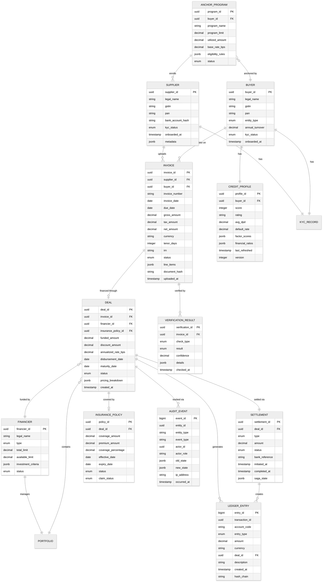

# 14.10 AI-Native Trade Finance & Invoice Factoring Platform — Low-Level Design

## Data Model

### Entity-Relationship Diagram



### Key Schema Details

**Invoice Status Lifecycle:**
`DRAFT` → `UPLOADED` → `OCR_COMPLETE` → `GST_VERIFIED` → `FRAUD_CLEARED` → `PRICED` → `MATCHED` → `DEAL_CREATED` → `FUNDED` → `MATURED` → `SETTLED` → `CLOSED`

**Deal Status Lifecycle:**
`PENDING_APPROVAL` → `APPROVED` → `DISBURSEMENT_INITIATED` → `DISBURSED` → `ACTIVE` → `MATURITY_APPROACHING` → `MATURED` → `COLLECTION_INITIATED` → `COLLECTED` → `SETTLED` → `CLOSED`

**Ledger Account Structure:**
```
ASSETS
├── ESCROW_HOLDING           (funds held in escrow)
├── RECEIVABLES_FUNDED       (outstanding funded invoices)
├── INSURANCE_RECEIVABLE     (claims pending from insurer)
└── PLATFORM_FEE_RECEIVABLE  (fees due from participants)

LIABILITIES
├── SUPPLIER_PAYABLE         (disbursement pending to supplier)
├── FINANCIER_PAYABLE        (returns pending to financier)
├── BUYER_COLLECTION         (amounts due from buyers)
└── INSURANCE_RESERVE        (premium pool for claims)

REVENUE
├── PLATFORM_FEE             (transaction fees earned)
├── INSURANCE_PREMIUM        (premiums collected)
└── LATE_PAYMENT_PENALTY     (penalties on overdue invoices)
```

---

## API Design

### Invoice Management APIs

```
POST   /api/v1/invoices
  Request:  { document: <file>, supplier_id, buyer_gstin, metadata }
  Response: { invoice_id, status: "UPLOADED", estimated_processing_time_seconds }
  Notes:    Accepts multipart form data; triggers async OCR pipeline; returns immediately

GET    /api/v1/invoices/{invoice_id}
  Response: { invoice_id, status, extracted_fields, verification_results, pricing, deal_info }
  Notes:    Includes all verification results and current pricing if available

GET    /api/v1/invoices?supplier_id=X&status=Y&date_from=Z&page=1&limit=50
  Response: { invoices: [...], pagination: { total, page, limit } }
  Notes:    Filterable by status, date range, buyer, amount range

POST   /api/v1/invoices/batch
  Request:  { documents: [<files>], supplier_id }
  Response: { batch_id, invoice_count, status: "PROCESSING" }
  Notes:    Batch upload for ERP integrations; async processing with webhook callback
```

### Deal and Pricing APIs

```
GET    /api/v1/invoices/{invoice_id}/pricing
  Response: { base_rate_bps, risk_premium_bps, liquidity_adj_bps, final_rate_bps,
              discount_amount, net_disbursement, pricing_factors: [...], valid_until }
  Notes:    Pricing valid for 15 minutes; includes factor-level breakdown

POST   /api/v1/deals
  Request:  { invoice_id, financier_id, accepted_rate_bps, insurance_opt_in }
  Response: { deal_id, status: "PENDING_APPROVAL", estimated_disbursement_time }
  Notes:    Creates a deal; triggers approval workflow for high-value deals

GET    /api/v1/deals/{deal_id}
  Response: { deal_id, invoice, financier, rate, amounts, status, settlement_info, timeline }

POST   /api/v1/deals/{deal_id}/approve
  Request:  { approver_id, approval_notes }
  Response: { deal_id, status: "APPROVED", disbursement_eta }
  Notes:    Maker-checker: different user from deal creator must approve

PATCH  /api/v1/deals/{deal_id}/early-settle
  Request:  { settlement_date, reason }
  Response: { revised_discount, revised_net_amount, confirmation_required }
  Notes:    Recalculates pricing for early settlement
```

### Financier APIs

```
GET    /api/v1/marketplace/available
  Response: { invoices: [{ invoice_id, buyer_info, amount, tenor, rate, risk_score }], filters_applied }
  Notes:    Financier-facing view; filtered by their investment criteria; anonymized buyer info until deal

POST   /api/v1/bids
  Request:  { invoice_id, bid_rate_bps, bid_amount, validity_minutes }
  Response: { bid_id, status: "ACTIVE", position_in_auction }
  Notes:    Competitive bid; may be partial (fund a portion of the invoice)

GET    /api/v1/portfolio
  Response: { total_deployed, total_limit, utilization_pct, exposure_by_buyer: [...],
              exposure_by_industry: [...], dpd_distribution: {...}, yield_metrics: {...} }
  Notes:    Real-time portfolio analytics for the financier

POST   /api/v1/portfolio/alerts
  Request:  { alert_type, threshold, notification_channel }
  Response: { alert_id, status: "ACTIVE" }
  Notes:    Configurable alerts: concentration breach, DPD threshold, portfolio yield drop
```

### Settlement APIs

```
GET    /api/v1/settlements?deal_id=X&status=Y&date_range=Z
  Response: { settlements: [...], summary: { total_amount, count, pending_count } }

GET    /api/v1/ledger/balance?account_code=X&as_of=YYYY-MM-DD
  Response: { account_code, balance, currency, as_of_timestamp }
  Notes:    Point-in-time balance reconstruction from event-sourced ledger

GET    /api/v1/ledger/statement?account_code=X&from=DATE&to=DATE
  Response: { entries: [{ entry_id, type, amount, description, timestamp }], opening_balance, closing_balance }

POST   /api/v1/reconciliation/trigger
  Request:  { date, account_codes: [...] }
  Response: { reconciliation_id, status: "IN_PROGRESS" }
  Notes:    Triggers reconciliation between internal ledger and bank statements
```

---

## Core Algorithms

### Algorithm 1: Dynamic Invoice Pricing

```
FUNCTION CalculateInvoicePrice(invoice, buyer_credit, market_state):
    // Step 1: Base rate from risk-free benchmark
    base_rate = market_state.benchmark_rate  // e.g., repo rate or T-bill rate

    // Step 2: Credit risk premium based on buyer score
    buyer_score = buyer_credit.score  // 0-100
    buyer_rating = MapScoreToRating(buyer_score)
    // Rating-to-spread mapping (in basis points)
    credit_spreads = { AAA: 50, AA: 100, A: 200, BBB: 350, BB: 600, B: 1000 }
    credit_premium = credit_spreads[buyer_rating]

    // Step 3: Invoice-specific adjustments
    tenor_adj = 0
    IF invoice.tenor_days > 90:
        tenor_adj = (invoice.tenor_days - 90) * 0.5  // 0.5 bps per day beyond 90

    amount_adj = 0
    IF invoice.amount > 50_00_000:  // Large invoice premium
        amount_adj = -20  // discount for large tickets (lower unit cost)
    IF invoice.amount < 1_00_000:
        amount_adj = 30  // small ticket surcharge

    // Step 4: Relationship and history adjustments
    pair_history = GetSupplierBuyerHistory(invoice.supplier_id, invoice.buyer_id)
    IF pair_history.transaction_count > 20 AND pair_history.on_time_rate > 0.95:
        history_discount = -30  // proven relationship discount
    ELSE IF pair_history.transaction_count == 0:
        first_time_premium = 50  // new relationship risk
    ELSE:
        history_discount = 0

    // Step 5: Concentration risk adjustment
    financier_exposure = GetFinancierExposure(buyer_id)
    IF financier_exposure.buyer_concentration > 0.15:
        concentration_premium = (financier_exposure.buyer_concentration - 0.15) * 500
    ELSE:
        concentration_premium = 0

    // Step 6: Market liquidity adjustment
    platform_liquidity = market_state.available_capital / market_state.pending_invoices
    IF platform_liquidity > 2.0:   // excess liquidity
        liquidity_adj = -30
    ELIF platform_liquidity < 0.8:  // liquidity crunch
        liquidity_adj = 50
    ELSE:
        liquidity_adj = 0

    // Step 7: Seasonal adjustment
    IF IsQuarterEnd(invoice.invoice_date):
        seasonal_adj = 25  // quarter-end liquidity premium
    ELSE:
        seasonal_adj = 0

    // Compute final rate
    total_rate_bps = base_rate + credit_premium + tenor_adj + amount_adj
                     + history_discount + concentration_premium
                     + liquidity_adj + seasonal_adj

    // Apply floor and ceiling
    floor_rate = market_state.benchmark_rate + 30   // minimum spread
    ceiling_rate = 2500  // 25% annualized maximum
    total_rate_bps = CLAMP(total_rate_bps, floor_rate, ceiling_rate)

    // Calculate discount amount
    discount_amount = invoice.amount * total_rate_bps / 10000 * invoice.tenor_days / 365
    net_disbursement = invoice.amount - discount_amount

    RETURN PricingResult(
        annualized_rate_bps = total_rate_bps,
        discount_amount = discount_amount,
        net_disbursement = net_disbursement,
        factor_breakdown = {
            base_rate, credit_premium, tenor_adj, amount_adj,
            history_discount, concentration_premium, liquidity_adj, seasonal_adj
        },
        valid_until = NOW() + 15_MINUTES
    )
```

### Algorithm 2: Fraud Detection — Circular Trading Detection

```
FUNCTION DetectCircularTrading(invoice, supply_chain_graph):
    // Build directed graph of recent invoicing relationships
    // Edge: A → B means A has invoiced B in the last 180 days

    seller = invoice.supplier_id
    buyer = invoice.buyer_id

    // Check if buyer has any path back to seller (cycle detection)
    // This would indicate circular trading: A invoices B, B invoices C, C invoices A

    // BFS from buyer to see if we can reach seller
    visited = SET()
    queue = QUEUE()
    queue.ENQUEUE({node: buyer, path: [seller, buyer], depth: 0})

    MAX_DEPTH = 5  // circular chains rarely exceed 5 hops

    WHILE queue IS NOT EMPTY:
        current = queue.DEQUEUE()

        IF current.depth >= MAX_DEPTH:
            CONTINUE

        // Get all entities that current.node has invoiced
        outgoing_invoices = supply_chain_graph.GetOutgoingEdges(current.node)

        FOR EACH target IN outgoing_invoices:
            IF target == seller:
                // Found a cycle!
                cycle_path = current.path + [target]
                cycle_volume = ComputeCycleVolume(cycle_path)

                RETURN FraudAlert(
                    type = "CIRCULAR_TRADING",
                    severity = ClassifySeverity(cycle_path, cycle_volume),
                    entities = cycle_path,
                    evidence = {
                        cycle_length = LEN(cycle_path),
                        cycle_volume = cycle_volume,
                        timing_correlation = ComputeTimingCorrelation(cycle_path),
                        amount_similarity = ComputeAmountSimilarity(cycle_path),
                        entity_relationship = CheckCorporateRelationships(cycle_path)
                    }
                )

            IF target NOT IN visited:
                visited.ADD(target)
                queue.ENQUEUE({
                    node: target,
                    path: current.path + [target],
                    depth: current.depth + 1
                })

    // Additional checks even without cycle detection
    anomalies = []

    // Check for velocity anomalies
    recent_volume = GetRecentInvoiceVolume(seller, buyer, 30_DAYS)
    historical_avg = GetHistoricalAvgVolume(seller, buyer)
    IF recent_volume > historical_avg * 3:
        anomalies.APPEND(VelocityAnomaly(recent_volume, historical_avg))

    // Check for amount pattern anomalies
    IF IsRoundNumber(invoice.amount) AND invoice.amount > 10_00_000:
        anomalies.APPEND(RoundNumberAnomaly(invoice.amount))

    // Check for related-party indicators
    IF SharesDirectors(seller, buyer) OR SharesAddress(seller, buyer):
        anomalies.APPEND(RelatedPartyIndicator(seller, buyer))

    RETURN FraudCheckResult(
        is_circular = FALSE,
        anomalies = anomalies,
        risk_score = ComputeAggregateRiskScore(anomalies)
    )
```

### Algorithm 3: Settlement Saga Orchestration

```
FUNCTION ExecuteSettlementSaga(deal):
    saga = CreateSaga(deal.deal_id)

    // Step 1: Reserve funds in financier's limit
    saga.AddStep(
        name = "RESERVE_LIMIT",
        execute = FUNCTION():
            result = FinancierService.ReserveFunds(deal.financier_id, deal.funded_amount)
            IF result.success:
                saga.SetState("limit_reservation_id", result.reservation_id)
            RETURN result
        ,
        compensate = FUNCTION():
            FinancierService.ReleaseReservation(saga.GetState("limit_reservation_id"))
    )

    // Step 2: Create escrow allocation
    saga.AddStep(
        name = "CREATE_ESCROW",
        execute = FUNCTION():
            escrow = EscrowService.Allocate(
                deal_id = deal.deal_id,
                amount = deal.funded_amount,
                parties = [deal.supplier_id, deal.financier_id]
            )
            saga.SetState("escrow_id", escrow.escrow_id)
            RETURN escrow
        ,
        compensate = FUNCTION():
            EscrowService.Release(saga.GetState("escrow_id"))
    )

    // Step 3: Record lien on invoice
    saga.AddStep(
        name = "RECORD_LIEN",
        execute = FUNCTION():
            lien = LienService.CreateLien(
                invoice_id = deal.invoice_id,
                lien_holder = deal.financier_id,
                amount = deal.funded_amount
            )
            saga.SetState("lien_id", lien.lien_id)
            RETURN lien
        ,
        compensate = FUNCTION():
            LienService.ReleaseLien(saga.GetState("lien_id"))
    )

    // Step 4: Initiate disbursement to supplier
    saga.AddStep(
        name = "DISBURSE_TO_SUPPLIER",
        execute = FUNCTION():
            net_amount = deal.funded_amount - deal.discount_amount - deal.platform_fee
            transfer = PaymentService.InitiateTransfer(
                from_account = saga.GetState("escrow_id"),
                to_account = deal.supplier_bank_account,
                amount = net_amount,
                reference = deal.deal_id,
                idempotency_key = "DISBURSE-" + deal.deal_id
            )
            saga.SetState("disbursement_ref", transfer.reference)
            RETURN transfer
        ,
        compensate = FUNCTION():
            // Disbursement reversal requires manual intervention
            // Flag for operations team
            AlertService.RaiseHighPriority(
                type = "DISBURSEMENT_REVERSAL_NEEDED",
                deal_id = deal.deal_id,
                reference = saga.GetState("disbursement_ref")
            )
    )

    // Step 5: Record ledger entries
    saga.AddStep(
        name = "RECORD_LEDGER",
        execute = FUNCTION():
            entries = [
                LedgerEntry(debit="RECEIVABLES_FUNDED", credit="ESCROW_HOLDING", amount=deal.funded_amount),
                LedgerEntry(debit="ESCROW_HOLDING", credit="SUPPLIER_PAYABLE", amount=net_amount),
                LedgerEntry(debit="ESCROW_HOLDING", credit="PLATFORM_FEE", amount=deal.platform_fee),
                LedgerEntry(debit="ESCROW_HOLDING", credit="FINANCIER_RETURN_ACCRUAL", amount=deal.discount_amount - deal.platform_fee)
            ]
            LedgerService.RecordBatch(entries, transaction_id=deal.deal_id)
        ,
        compensate = FUNCTION():
            // Ledger entries are immutable; record reversal entries
            LedgerService.RecordReversal(transaction_id=deal.deal_id)
    )

    // Step 6: Set up buyer collection mandate for maturity date
    saga.AddStep(
        name = "SETUP_COLLECTION",
        execute = FUNCTION():
            mandate = CollectionService.ScheduleCollection(
                buyer_id = deal.buyer_id,
                amount = deal.invoice_amount,
                collection_date = deal.maturity_date,
                mandate_type = "NACH",
                deal_id = deal.deal_id
            )
            saga.SetState("mandate_id", mandate.mandate_id)
            RETURN mandate
        ,
        compensate = FUNCTION():
            CollectionService.CancelMandate(saga.GetState("mandate_id"))
    )

    // Execute the saga
    result = saga.Execute()

    IF result.status == "COMPLETED":
        DealService.UpdateStatus(deal.deal_id, "DISBURSED")
        NotificationService.Notify(deal.supplier_id, "Funds disbursed: ₹" + net_amount)
        NotificationService.Notify(deal.financier_id, "Deal funded: " + deal.deal_id)
    ELSE IF result.status == "COMPENSATING":
        // Some step failed; compensation is running
        DealService.UpdateStatus(deal.deal_id, "SETTLEMENT_FAILED")
        AlertService.RaiseHighPriority("SETTLEMENT_SAGA_FAILED", deal.deal_id, result.failed_step)
    ELSE IF result.status == "COMPENSATION_FAILED":
        // Critical: compensation itself failed
        DealService.UpdateStatus(deal.deal_id, "REQUIRES_MANUAL_INTERVENTION")
        AlertService.RaiseCritical("COMPENSATION_FAILED", deal.deal_id, result.details)

    RETURN result
```

### Algorithm 4: Buyer Credit Scoring Model

```
FUNCTION ComputeBuyerCreditScore(buyer_id):
    // Collect features from multiple data sources
    features = {}

    // 1. Platform payment history (most predictive for existing buyers)
    payment_history = GetPlatformPaymentHistory(buyer_id)
    features.avg_dpd = payment_history.average_days_past_due
    features.on_time_rate = payment_history.on_time_payment_rate
    features.total_invoices_settled = payment_history.total_settled
    features.dpd_trend = payment_history.dpd_trend_last_6_months  // improving or worsening
    features.max_dpd_last_12m = payment_history.max_dpd_last_12_months

    // 2. GST filing behavior (proxy for business health)
    gst_data = GetGSTFilingData(buyer_id)
    features.gst_filing_regularity = gst_data.on_time_filing_rate
    features.gst_turnover_trend = gst_data.quarterly_turnover_trend
    features.gst_itc_ratio = gst_data.input_tax_credit_ratio  // proxy for margins

    // 3. Financial statement analysis (annual)
    financials = GetFinancialStatements(buyer_id)
    features.current_ratio = financials.current_assets / financials.current_liabilities
    features.debt_equity = financials.total_debt / financials.equity
    features.interest_coverage = financials.ebitda / financials.interest_expense
    features.receivable_days = financials.receivables / financials.revenue * 365
    features.payable_days = financials.payables / financials.cogs * 365

    // 4. External credit bureau data
    bureau_data = GetCreditBureauData(buyer_id)
    features.bureau_score = bureau_data.commercial_score
    features.active_credit_facilities = bureau_data.facility_count
    features.total_outstanding = bureau_data.total_outstanding
    features.suit_filed_amount = bureau_data.legal_suit_amount

    // 5. Industry and macro context
    industry = GetIndustryData(buyer_id.industry_code)
    features.industry_avg_dpd = industry.average_dpd
    features.industry_default_rate = industry.default_rate
    features.industry_cycle_position = industry.cycle_indicator  // expansion/contraction

    // 6. Supply chain network features
    network = GetSupplyChainNetworkFeatures(buyer_id)
    features.supplier_count = network.active_supplier_count
    features.supplier_diversification = network.supplier_herfindahl_index
    features.payment_consistency_across_suppliers = network.cross_supplier_dpd_variance

    // Run through gradient-boosted ensemble model
    raw_score = CreditModel.Predict(features)  // outputs probability of default (PD)

    // Convert PD to score (0-100 scale, higher is better)
    score = ROUND((1 - raw_score) * 100)

    // Map to rating
    rating = CASE
        WHEN score >= 90 THEN "AAA"
        WHEN score >= 80 THEN "AA"
        WHEN score >= 70 THEN "A"
        WHEN score >= 60 THEN "BBB"
        WHEN score >= 50 THEN "BB"
        WHEN score >= 40 THEN "B"
        ELSE "NR"  // Not Rated / High Risk

    // Generate explainability report
    shap_values = CreditModel.ExplainPrediction(features)
    top_factors = GetTopContributingFactors(shap_values, top_n=5)

    RETURN CreditScore(
        buyer_id = buyer_id,
        score = score,
        rating = rating,
        probability_of_default = raw_score,
        factor_contributions = top_factors,
        features_used = features,
        model_version = CreditModel.version,
        computed_at = NOW(),
        valid_until = NOW() + 24_HOURS
    )
```

---

## Index Design

| Table | Index | Type | Purpose |
|---|---|---|---|
| `invoice` | `(supplier_id, status, uploaded_at)` | B-tree composite | Supplier's invoice dashboard: filter by status, sort by date |
| `invoice` | `(buyer_id, due_date)` | B-tree composite | Settlement engine: find invoices maturing on a given date per buyer |
| `invoice` | `(document_hash)` | Hash unique | Duplicate detection: fast exact-match dedup by document hash |
| `invoice` | `(irn)` | B-tree unique | GST cross-reference: lookup by e-invoice reference number |
| `deal` | `(financier_id, status, maturity_date)` | B-tree composite | Portfolio view: active deals by financier sorted by maturity |
| `deal` | `(buyer_id, status)` | B-tree composite | Concentration analysis: all active deals against a buyer |
| `deal` | `(maturity_date, status)` | B-tree composite | Settlement scheduler: find deals maturing on a given date |
| `ledger_entry` | `(account_code, created_at)` | B-tree composite | Account statement: entries for an account in time order |
| `ledger_entry` | `(deal_id)` | B-tree | Deal audit: all ledger movements for a specific deal |
| `credit_profile` | `(buyer_id, version)` | B-tree composite | Credit history: versioned scores for trend analysis |
| `audit_event` | `(entity_id, entity_type, occurred_at)` | B-tree composite | Audit trail: all events for a specific entity in time order |
| `settlement` | `(status, initiated_at)` | B-tree composite | Operations dashboard: pending settlements by age |

---

## Partitioning Strategy

| Table | Partition Key | Strategy | Rationale |
|---|---|---|---|
| `invoice` | `uploaded_at` (monthly) | Range partitioning | Time-based queries dominate; old invoices are rarely accessed; enables efficient partition pruning and archival |
| `deal` | `maturity_date` (monthly) | Range partitioning | Settlement engine queries by maturity date; completed deals can be archived by partition |
| `ledger_entry` | `created_at` (monthly) | Range partitioning | Append-only writes benefit from time-based partitioning; balance queries scan recent partitions; regulatory retention managed at partition level |
| `audit_event` | `occurred_at` (monthly) | Range partitioning | Massive write volume; audit queries almost always specify time ranges; cold partitions moved to cheaper storage |
| `credit_profile` | `buyer_id` (hash, 64 shards) | Hash partitioning | Uniform distribution across shards; per-buyer lookups hit single shard; supports parallel batch refresh |
