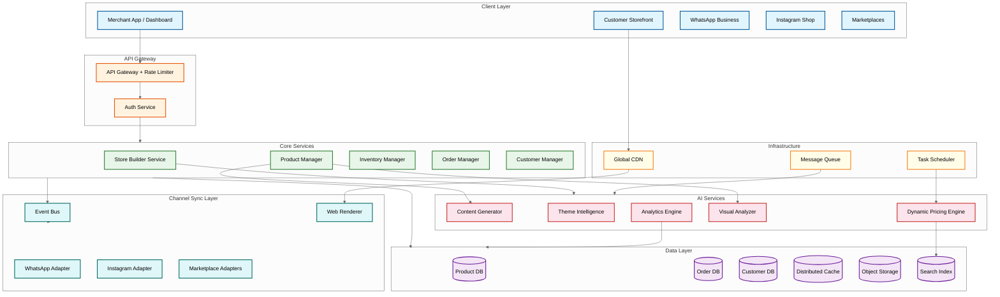
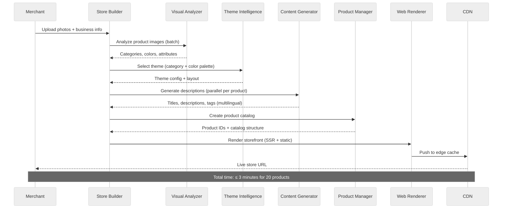

# 14.11 AI-Native Digital Storefront Builder for SMEs — High-Level Design

## System Architecture



---

## Core Data Flow: Store Creation



---

## Key Architectural Decisions

### Decision 1: Headless Commerce with Channel Projection vs. Monolithic Multi-Channel

**Choice:** Headless architecture with a channel projection engine.

**Rationale:** Each sales channel (website, WhatsApp, Instagram, marketplaces) has fundamentally different data schemas, UI paradigms, and API contracts. A monolithic approach would require the product model to be the union of all channel requirements—creating a bloated, lowest-common-denominator data model. The headless approach maintains a rich canonical product model and projects it into channel-specific representations through dedicated adapters.

**Trade-offs:**
- **Pro:** Adding a new channel requires only a new adapter, not modifying the core product model
- **Pro:** Channel-specific optimizations (WhatsApp-optimized descriptions vs. SEO-optimized web descriptions) can diverge without conflict
- **Con:** Projection logic introduces complexity and potential consistency issues between channels
- **Con:** Debugging "why does my product look different on Instagram vs. my website" requires understanding the projection pipeline

---

### Decision 2: Event-Sourced Catalog Sync vs. Polling-Based Sync

**Choice:** Event-sourced synchronization with channel-specific event consumers.

**Rationale:** Product mutations (price changes, stock updates, description edits) must propagate to 5+ channels with different latency requirements. Polling-based sync creates unnecessary load during quiet periods and misses changes during polling intervals. Event sourcing ensures every mutation is captured, ordered, and delivered to each channel adapter exactly once.

**Trade-offs:**
- **Pro:** Near-real-time sync (≤ 30s for inventory, ≤ 5 min for catalog)
- **Pro:** Natural audit trail—every product change is a durable event
- **Pro:** Channel adapters process at their own pace; slow channels don't block fast ones
- **Con:** Event ordering across distributed services requires careful design (per-product event streams)
- **Con:** Eventual consistency means brief windows where channels show different data

---

### Decision 3: AI Content Generation — Synchronous vs. Asynchronous Pipeline

**Choice:** Hybrid. Synchronous during store creation (merchant is waiting); asynchronous for bulk operations and regeneration.

**Rationale:** During the initial store creation flow, the merchant expects to see product descriptions within the creation experience. Latency budget: 8 seconds per product. For bulk catalog imports (100+ products) or background regeneration, asynchronous processing via a task queue is appropriate.

**Trade-offs:**
- **Pro:** Responsive store creation experience keeps merchant engagement
- **Pro:** Async bulk processing avoids GPU contention during peak creation hours
- **Con:** Synchronous path requires reserved GPU capacity or low-latency inference endpoints
- **Con:** Content quality may need a "draft → review → publish" workflow for sync-generated content

---

### Decision 4: Multi-Tenant Storage — Database-per-Tenant vs. Shared Database with Tenant Isolation

**Choice:** Shared database with row-level tenant isolation (tenant_id on every table) for transactional data; tenant-prefixed object storage for images and assets.

**Rationale:** With 3 million active stores, database-per-tenant is operationally infeasible (3M database instances). Shared databases with tenant_id partitioning is the standard for SaaS platforms at this scale. The tenant_id is enforced at the application layer via middleware and at the database layer via row-level security policies.

**Trade-offs:**
- **Pro:** Operational simplicity; single schema migration affects all tenants
- **Pro:** Efficient resource utilization; small tenants share resources
- **Con:** Noisy neighbor risk—a viral store's traffic spike can impact co-located stores
- **Con:** Tenant data isolation must be enforced rigorously; a bug could leak data across tenants

**Mitigation:** Large stores (top 0.1% by traffic) are automatically migrated to dedicated database shards.

---

### Decision 5: Storefront Rendering — SSR vs. Static Generation vs. Edge Rendering

**Choice:** Static generation with incremental regeneration (ISR pattern). Edge-cached with CDN invalidation on product updates.

**Rationale:** 3 million storefronts cannot all be server-rendered on every request—the compute cost would be prohibitive. Static generation pre-renders storefront pages and serves them from CDN. When a product changes, only the affected pages are regenerated (incremental). Cart/checkout pages use client-side rendering for dynamic state.

**Trade-offs:**
- **Pro:** Sub-200ms TTFB for all storefront pages via CDN edge
- **Pro:** Eliminates origin server load for read-heavy storefront traffic
- **Pro:** SEO-optimal—fully rendered HTML served to crawlers
- **Con:** Product updates have a propagation delay (30s–5min) to CDN edge
- **Con:** Dynamic personalization (recommended products, user-specific pricing) requires client-side hydration

---

### Decision 6: Payment Gateway — Single Provider vs. Multi-Gateway Orchestration

**Choice:** Multi-gateway orchestration with intelligent routing.

**Rationale:** No single payment gateway offers optimal rates across all payment methods in India. UPI is cheapest via gateway A, credit cards via gateway B, and international payments via gateway C. Multi-gateway routing optimizes for lowest transaction cost per payment method while providing failover redundancy.

**Trade-offs:**
- **Pro:** 15–30% reduction in payment processing costs through optimal routing
- **Pro:** Redundancy—if one gateway has an outage, traffic routes to backup
- **Con:** Reconciliation complexity increases with each additional gateway
- **Con:** PCI compliance scope expands with each gateway integration

---

## Component Interaction Patterns

### Pattern 1: Product Update Propagation

```
Merchant edits product → Product Manager validates and persists
  → Emits ProductUpdated event to Event Bus
  → Web Renderer picks up event → regenerates static pages → invalidates CDN
  → WhatsApp Adapter picks up event → transforms to WhatsApp catalog format → calls WhatsApp Business API
  → Instagram Adapter picks up event → transforms to Instagram product format → calls Graph API
  → Marketplace Adapters pick up event → transform per marketplace → call respective APIs
  → Search Index Adapter picks up event → updates search index for product discovery
```

### Pattern 2: Inventory Reservation During Checkout

```
Customer adds to cart → Inventory Manager creates soft reservation (TTL: 15 min)
  → Available stock reduced for this channel
  → If customer completes payment → reservation converted to hard deduction
  → If reservation expires → stock returned to available pool
  → Stock change event emitted → all channels updated within 30 seconds
```

### Pattern 3: Dynamic Pricing Cycle

```
Scheduler triggers pricing cycle (every 4 hours)
  → Competitor scraper fetches prices for monitored products
  → Demand analyzer computes elasticity from recent click/conversion data
  → Pricing engine evaluates rules per product:
      - Competitor undercut by > 10%? → suggest lower price
      - Demand spike detected? → suggest higher price within margin ceiling
      - Below margin floor? → flag for merchant review
  → Suggestions persisted → merchant notified via dashboard/WhatsApp
  → Merchant accepts → price update flows through standard product update pipeline
```
