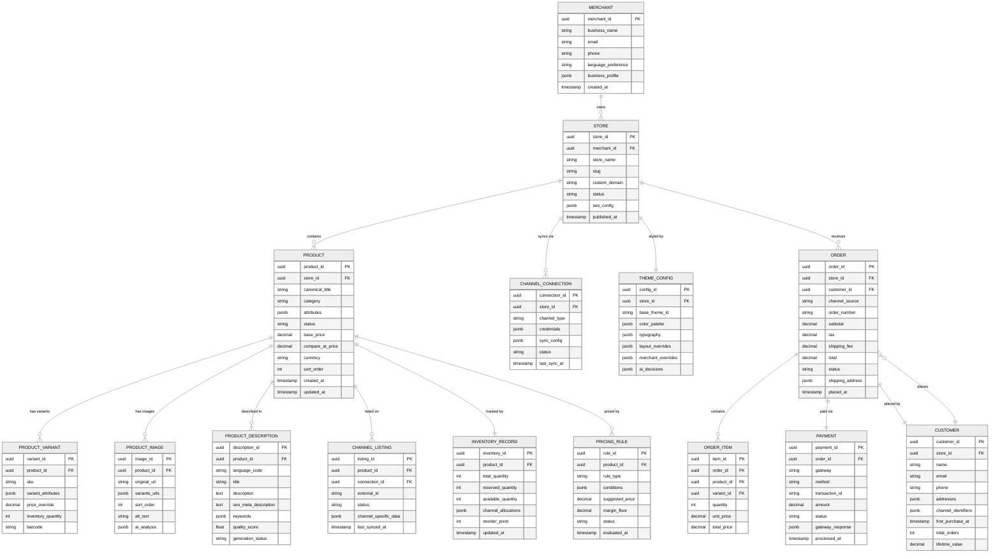

# 14.11 AI-Native Digital Storefront Builder for SMEs — Low-Level Design

## Data Model

### Entity-Relationship Diagram



---

## API Design

### Store Creation API

```
POST /api/v1/stores

Request:
{
  "business_name": "Priya's Boutique",
  "category": "fashion_apparel",
  "description": "Handcrafted ethnic wear for women",
  "language": "hi",
  "target_languages": ["en", "ta", "te"],
  "products": [
    {
      "images": ["upload://img_001.jpg", "upload://img_002.jpg"],
      "price": 1299,
      "name": "Silk Kurta",              // optional; AI generates if absent
      "attributes": {                     // optional; AI extracts from images
        "color": "red",
        "size": ["S", "M", "L", "XL"]
      }
    }
  ]
}

Response:
{
  "store_id": "st_abc123",
  "status": "generating",
  "progress": {
    "images_analyzed": 0,
    "descriptions_generated": 0,
    "theme_selected": false,
    "storefront_rendered": false,
    "estimated_completion_seconds": 150
  },
  "progress_ws": "wss://api.example.com/ws/store/st_abc123/progress"
}
```

### Product Management APIs

```
GET    /api/v1/stores/{store_id}/products
POST   /api/v1/stores/{store_id}/products
PUT    /api/v1/stores/{store_id}/products/{product_id}
DELETE /api/v1/stores/{store_id}/products/{product_id}

// Bulk operations
POST   /api/v1/stores/{store_id}/products/bulk
PUT    /api/v1/stores/{store_id}/products/bulk-update

// AI content operations
POST   /api/v1/stores/{store_id}/products/{product_id}/regenerate-description
POST   /api/v1/stores/{store_id}/products/{product_id}/suggest-price
```

### Product Update Request

```
PUT /api/v1/stores/{store_id}/products/{product_id}

Request:
{
  "price": 1499,
  "inventory_quantity": 25,
  "sync_channels": true          // trigger immediate multi-channel sync
}

Response:
{
  "product_id": "prod_xyz",
  "updated_fields": ["price", "inventory_quantity"],
  "sync_status": {
    "website": "completed",
    "whatsapp": "pending",
    "instagram": "pending"
  },
  "pricing_impact": {
    "previous_price": 1299,
    "new_price": 1499,
    "margin_change": "+3.2%",
    "competitor_comparison": "12% above average"
  }
}
```

### Inventory API

```
GET  /api/v1/stores/{store_id}/inventory
PUT  /api/v1/stores/{store_id}/inventory/{product_id}

// Reservation (internal, used by checkout)
POST /api/v1/stores/{store_id}/inventory/{product_id}/reserve
DELETE /api/v1/stores/{store_id}/inventory/{product_id}/reserve/{reservation_id}
```

### Order API

```
GET  /api/v1/stores/{store_id}/orders
GET  /api/v1/stores/{store_id}/orders/{order_id}
PUT  /api/v1/stores/{store_id}/orders/{order_id}/status

// Webhook for channel-originated orders
POST /api/v1/webhooks/orders/{channel_type}
```

### Multi-Channel Sync API

```
GET  /api/v1/stores/{store_id}/channels
POST /api/v1/stores/{store_id}/channels/{channel_type}/connect
POST /api/v1/stores/{store_id}/channels/{channel_type}/sync   // manual trigger
GET  /api/v1/stores/{store_id}/channels/{channel_type}/status  // sync health

Response (status):
{
  "channel": "whatsapp",
  "connection_status": "active",
  "last_sync": "2026-03-10T14:30:00Z",
  "products_synced": 48,
  "products_failed": 2,
  "failed_reasons": [
    {"product_id": "prod_a1", "reason": "description exceeds 5000 chars"},
    {"product_id": "prod_b2", "reason": "image aspect ratio not supported"}
  ],
  "next_scheduled_sync": "2026-03-10T15:00:00Z"
}
```

---

## Core Algorithms

### Algorithm 1: AI Store Generation Pipeline

```
FUNCTION generateStore(merchantInput):
    // Phase 1: Image Analysis (parallel per image)
    imageAnalyses = PARALLEL_MAP(merchantInput.images, analyzeImage)
    // Each analysis returns: detected_objects, colors, style, category_confidence

    // Phase 2: Aggregate Store Intelligence
    dominantCategory = voteMajority(imageAnalyses.map(a => a.category))
    colorPalette = extractDominantColors(imageAnalyses)
    styleProfile = classifyAesthetic(imageAnalyses)  // modern, traditional, minimalist, vibrant

    // Phase 3: Theme Selection
    candidateThemes = queryThemeIndex(dominantCategory, styleProfile)
    selectedTheme = rankThemes(candidateThemes, colorPalette, merchantInput.description)
    customizedTheme = applyColorPalette(selectedTheme, colorPalette)

    // Phase 4: Content Generation (parallel per product)
    products = PARALLEL_MAP(merchantInput.products, FUNCTION(product):
        attributes = mergeAttributes(product.userAttributes, imageAnalyses[product])
        descriptions = PARALLEL_MAP(merchantInput.target_languages, FUNCTION(lang):
            desc = generateDescription(attributes, lang, styleProfile)
            score = evaluateQuality(desc, lang)
            IF score < QUALITY_THRESHOLD:
                desc = regenerateWithFeedback(desc, score.issues, lang)
            RETURN {language: lang, description: desc, score: score}
        )
        seoTags = generateSEOTags(attributes, descriptions[merchantInput.language])
        RETURN productRecord(product, attributes, descriptions, seoTags)
    )

    // Phase 5: Storefront Assembly
    storeConfig = assembleStore(customizedTheme, products, merchantInput)
    renderedPages = renderStorefront(storeConfig)

    // Phase 6: Publish
    publishToCDN(renderedPages)
    storeURL = assignDomain(merchantInput.businessName)

    RETURN {storeURL, storeConfig, products}
```

### Algorithm 2: Multi-Channel Sync with Conflict Resolution

```
FUNCTION syncProductToChannel(productEvent, channel):
    product = fetchCanonicalProduct(productEvent.productId)
    channelConfig = fetchChannelConfig(product.storeId, channel)

    // Step 1: Transform to channel schema
    channelProduct = projectToChannel(product, channel)
    // projectToChannel handles:
    //   - Description truncation (WhatsApp: 5000 chars, Instagram: 2200 chars)
    //   - Image format conversion and cropping per channel requirements
    //   - Category mapping (canonical → channel taxonomy)
    //   - Attribute mapping (channel-required fields)

    // Step 2: Validate channel constraints
    violations = validateChannelConstraints(channelProduct, channel)
    IF violations.isNotEmpty():
        FOR violation IN violations:
            IF violation.autoFixable:
                channelProduct = autoFix(channelProduct, violation)
                // e.g., truncate description, resize image, map to nearest category
            ELSE:
                logSyncFailure(product, channel, violation)
                notifyMerchant(product, channel, violation)
                RETURN FAILURE

    // Step 3: Check for external modifications (drift detection)
    existingListing = fetchChannelListing(product.id, channel)
    IF existingListing AND existingListing.lastModifiedExternally > product.updatedAt:
        // Channel listing was modified outside our platform (e.g., merchant edited on Instagram directly)
        conflict = detectConflict(existingListing, channelProduct)
        resolution = resolveConflict(conflict, channelConfig.conflictPolicy)
        // Policies: PLATFORM_WINS, CHANNEL_WINS, MERCHANT_DECIDES
        IF resolution == MERCHANT_DECIDES:
            queueForMerchantReview(conflict)
            RETURN PENDING
        channelProduct = applyResolution(channelProduct, resolution)

    // Step 4: Push to channel API with retry
    result = retryWithBackoff(
        FUNCTION(): channelAPI.upsertProduct(channelProduct),
        maxRetries: 3,
        backoffBase: 2 seconds,
        retryOn: [RATE_LIMIT, TIMEOUT, SERVER_ERROR]
    )

    // Step 5: Record sync state
    updateChannelListing(product.id, channel, result)
    emitSyncCompletedEvent(product.id, channel, result)
    RETURN result
```

### Algorithm 3: Dynamic Pricing Recommendation

```
FUNCTION evaluatePricing(product, merchantConfig):
    // Input signals
    competitorPrices = fetchCompetitorPrices(product.category, product.attributes)
    demandSignals = fetchDemandSignals(product.id)
    // demandSignals: {searchVolume, clickRate, cartRate, conversionRate, trendDirection}
    costData = fetchProductCost(product.id)  // merchant-provided COGS
    marginFloor = merchantConfig.minMarginPercent OR DEFAULT_MARGIN_FLOOR

    // Step 1: Competitive positioning
    competitorMedian = median(competitorPrices)
    competitorP25 = percentile(competitorPrices, 25)  // budget positioning
    competitorP75 = percentile(competitorPrices, 75)  // premium positioning

    // Step 2: Demand-based adjustment
    demandMultiplier = 1.0
    IF demandSignals.trendDirection == RISING AND demandSignals.conversionRate > THRESHOLD_HIGH:
        demandMultiplier = 1.05 + (demandSignals.searchVolumeGrowth * 0.1)  // up to 15% premium
        demandMultiplier = MIN(demandMultiplier, 1.15)  // cap at 15%
    ELSE IF demandSignals.trendDirection == FALLING AND demandSignals.cartRate < THRESHOLD_LOW:
        demandMultiplier = 0.95 - (demandSignals.searchVolumeDecline * 0.05)  // up to 10% discount
        demandMultiplier = MAX(demandMultiplier, 0.90)  // floor at 10%

    // Step 3: Calculate candidate price
    basePrice = competitorMedian * demandMultiplier

    // Step 4: Apply margin floor
    minPrice = costData.unitCost * (1 + marginFloor / 100)
    candidatePrice = MAX(basePrice, minPrice)

    // Step 5: Apply seasonal adjustments
    seasonalFactor = getSeasonalFactor(product.category, currentDate())
    // e.g., ethnic wear 1.2x during Diwali, 0.9x post-festival clearance
    candidatePrice = candidatePrice * seasonalFactor

    // Step 6: Price rounding (psychological pricing)
    finalPrice = roundToPsychological(candidatePrice)
    // 1247 → 1249, 2013 → 1999, 503 → 499

    // Step 7: Generate recommendation
    RETURN {
        suggestedPrice: finalPrice,
        currentPrice: product.basePrice,
        changePercent: (finalPrice - product.basePrice) / product.basePrice * 100,
        competitorContext: {
            median: competitorMedian, count: competitorPrices.length,
            yourPosition: percentileOf(finalPrice, competitorPrices)
        },
        marginAnalysis: {
            estimatedMargin: (finalPrice - costData.unitCost) / finalPrice * 100,
            marginFloor: marginFloor
        },
        demandContext: {
            trend: demandSignals.trendDirection,
            multiplierApplied: demandMultiplier
        },
        confidence: calculateConfidence(competitorPrices.length, demandSignals.dataPoints),
        expiresAt: now() + 4 hours
    }
```

### Algorithm 4: Inventory Reservation and Reconciliation

```
FUNCTION reserveInventory(productId, variantId, quantity, channelSource, sessionId):
    // Atomic operation using optimistic locking
    WHILE retries < MAX_RETRIES:
        inventory = fetchInventory(productId, variantId)
        channelBuffer = inventory.channelAllocations[channelSource].safetyBuffer

        effectiveAvailable = inventory.available_quantity - channelBuffer

        IF effectiveAvailable < quantity:
            RETURN {success: false, available: effectiveAvailable, reason: "INSUFFICIENT_STOCK"}

        reservation = {
            id: generateId(),
            productId: productId,
            variantId: variantId,
            quantity: quantity,
            channel: channelSource,
            sessionId: sessionId,
            expiresAt: now() + RESERVATION_TTL,  // 15 minutes
            status: "ACTIVE"
        }

        // Optimistic lock via version check
        updated = updateInventoryAtomic(
            productId, variantId,
            expectedVersion: inventory.version,
            newReserved: inventory.reserved_quantity + quantity,
            newAvailable: inventory.available_quantity - quantity
        )

        IF updated:
            persistReservation(reservation)
            emitEvent("InventoryReserved", {productId, quantity, channel: channelSource})
            scheduleReservationExpiry(reservation.id, RESERVATION_TTL)
            RETURN {success: true, reservationId: reservation.id, expiresAt: reservation.expiresAt}
        ELSE:
            retries++  // version conflict, retry

    RETURN {success: false, reason: "CONTENTION_EXCEEDED"}


FUNCTION confirmReservation(reservationId, orderId):
    reservation = fetchReservation(reservationId)
    IF reservation.status != "ACTIVE":
        RETURN {success: false, reason: "RESERVATION_" + reservation.status}
    IF reservation.expiresAt < now():
        RETURN {success: false, reason: "RESERVATION_EXPIRED"}

    // Convert reservation to confirmed deduction
    updateReservation(reservationId, status: "CONFIRMED", orderId: orderId)
    updateInventory(reservation.productId, reservation.variantId,
        reservedDelta: -reservation.quantity)
    // Note: available_quantity stays reduced; total_quantity decremented

    emitEvent("InventoryConfirmed", {productId: reservation.productId, quantity: reservation.quantity})
    RETURN {success: true}


FUNCTION expireReservation(reservationId):
    reservation = fetchReservation(reservationId)
    IF reservation.status != "ACTIVE":
        RETURN  // already confirmed or expired

    updateReservation(reservationId, status: "EXPIRED")
    updateInventory(reservation.productId, reservation.variantId,
        reservedDelta: -reservation.quantity,
        availableDelta: +reservation.quantity)

    emitEvent("InventoryReleased", {productId: reservation.productId, quantity: reservation.quantity})
```

---

## Internal Service Contracts

### Content Generator ↔ Product Manager

```
// Content Generator consumes from queue: "content.generation.requests"
Message Schema:
{
  "requestId": "req_123",
  "productId": "prod_xyz",
  "imageUrls": ["https://..."],
  "merchantLanguage": "hi",
  "targetLanguages": ["hi", "en", "ta"],
  "productAttributes": {"color": "red", "material": "silk"},
  "merchantDescription": "Handmade silk kurta",
  "storeCategory": "fashion_apparel",
  "priority": "high"  // high = sync store creation, low = bulk/regeneration
}

// Content Generator publishes to queue: "content.generation.results"
Response Schema:
{
  "requestId": "req_123",
  "productId": "prod_xyz",
  "descriptions": [
    {
      "language": "hi",
      "title": "हैंडमेड सिल्क कुर्ता – लाल रंग",
      "description": "...(300-500 chars)...",
      "seoMetaDescription": "...(155 chars)...",
      "keywords": ["silk kurta", "handmade kurta", "red kurta"],
      "qualityScore": 0.91
    }
  ],
  "suggestedCategory": "women_ethnic_wear",
  "suggestedTags": ["silk", "kurta", "handmade", "ethnic", "festive"]
}
```

### Channel Adapter Contract (Interface)

```
INTERFACE ChannelAdapter:
    FUNCTION connect(storeId, credentials) → ConnectionResult
    FUNCTION disconnect(connectionId) → Result
    FUNCTION pushProduct(channelProduct) → PushResult
    FUNCTION updateInventory(productId, quantity) → UpdateResult
    FUNCTION removeProduct(productId) → RemoveResult
    FUNCTION fetchExternalState(productId) → ExternalProductState
    FUNCTION handleWebhook(payload) → WebhookResult
    FUNCTION getChannelConstraints() → ChannelConstraints
    // ChannelConstraints: {maxDescriptionLength, supportedImageFormats,
    //                      maxImages, requiredFields, categoryTaxonomy,
    //                      apiRateLimit, batchSupport}
```
