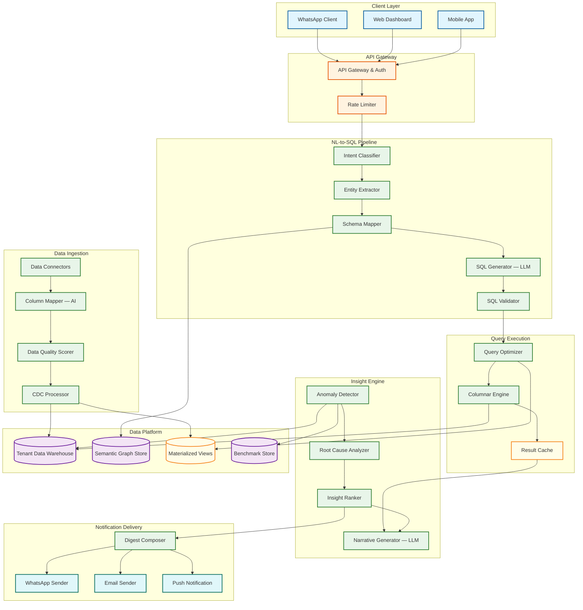
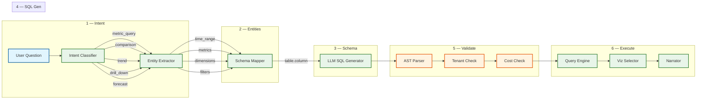
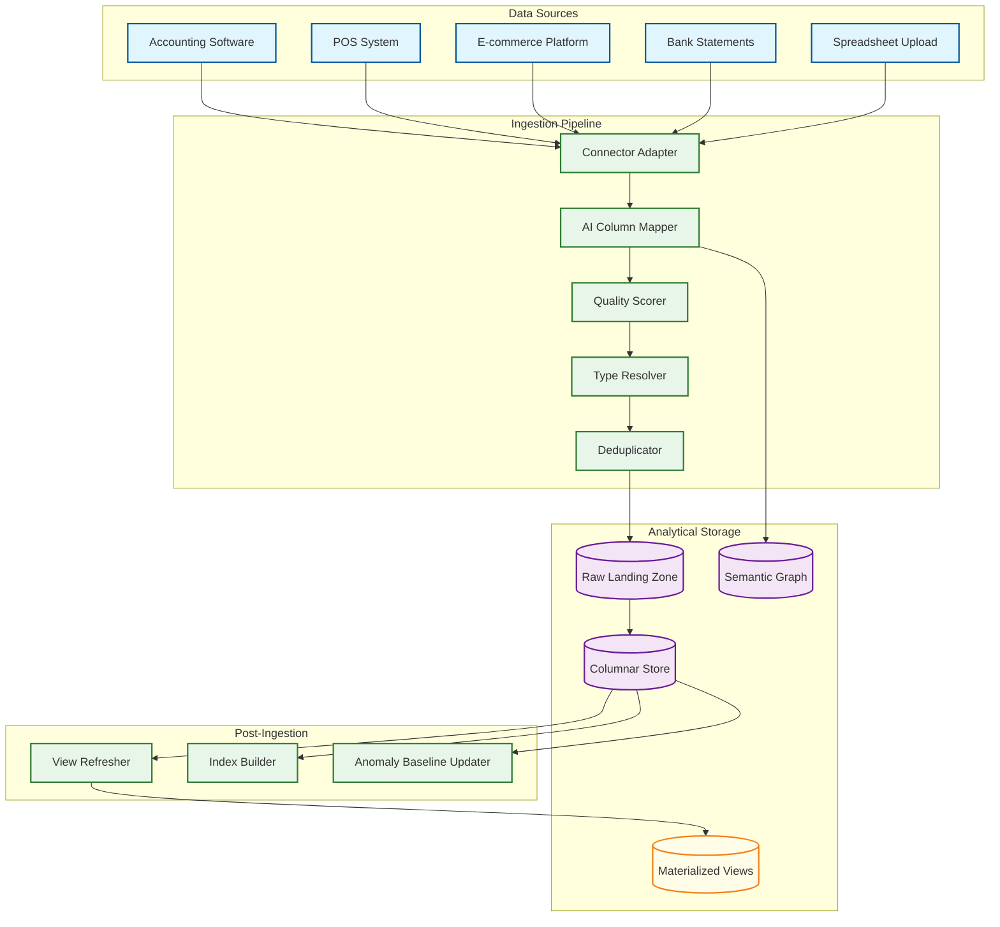
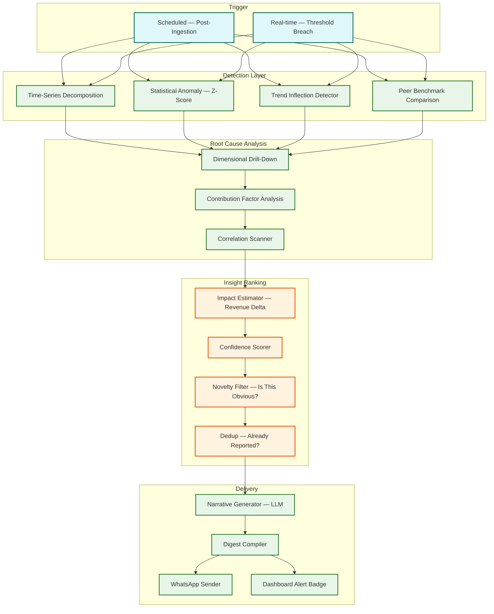

# 14.13 AI-Native MSME Business Intelligence Dashboard — High-Level Design

## System Architecture

---

## NL-to-SQL Pipeline Architecture

The natural language query pipeline is the system's most critical path. Every user question flows through six stages, each designed to incrementally transform ambiguous human language into a precise, safe, and efficient SQL query.

### Stage Details

| Stage | Function | Latency Budget | Failure Mode |
|---|---|---|---|
| **Intent Classification** | Categorize query into type (metric lookup, comparison, trend, drill-down, forecast, goal-check) to determine downstream SQL patterns | 50 ms | Default to metric_query; log for retraining |
| **Entity Extraction** | Extract structured entities: time ranges ("last month"), metrics ("revenue"), dimensions ("by city"), filters ("only online orders") | 100 ms | Clarification prompt for ambiguous entities |
| **Schema Mapping** | Map extracted business entities to physical schema via semantic graph (e.g., "revenue" → `orders.total_amount`, "city" → `customers.city`) | 80 ms | Suggest closest matches if exact mapping fails |
| **SQL Generation** | LLM generates SQL using mapped schema, intent-specific templates, and few-shot examples from the tenant's query history | 800 ms | Retry with simplified prompt; escalate to template fallback |
| **Validation** | Parse SQL AST; verify tenant isolation predicate exists; check no DDL/DML; estimate query cost; verify referenced tables/columns are in allowed list | 50 ms | Reject query; log as potential safety issue |
| **Execution + Narration** | Execute validated SQL with timeout; format results; select visualization; generate narrative explanation | 1500 ms | Timeout → suggest query refinement; partial results if row limit hit |

---

## Data Ingestion Architecture

### Connector Design

Each data source connector implements a standard interface:

- **Schema discovery** — introspect the source to enumerate available tables/entities
- **Initial snapshot** — full data extraction for first-time onboarding
- **Incremental sync** — CDC-based or timestamp-watermark-based delta extraction
- **Health check** — periodic validation that credentials are valid and source is reachable
- **Schema drift detection** — compare current source schema against last-known schema; alert on breaking changes

The AI column mapper runs during initial snapshot and on schema drift events. It uses a fine-tuned classification model that maps source column names to a standardized business ontology (500+ business concepts across accounting, retail, services, and manufacturing domains).

---

## Auto-Insight Generation Pipeline

---

## Key Design Decisions

### Decision 1: Tenant-Scoped Semantic Graph vs. Global Schema Mapping

**Choice:** Tenant-scoped semantic graphs with a shared base ontology.

**Rationale:** MSMEs use wildly different data schemas even within the same industry. A Tally user's schema looks nothing like a Zoho Books user's schema, and even two Tally users may have different custom fields. A global schema mapping would require constant maintenance and would fail for edge cases. Instead, each tenant gets their own semantic graph initialized from a shared base ontology (the 500+ business concepts) and customized during onboarding. The trade-off is higher storage (50 KB × 2M tenants = 100 GB for semantic graphs) and per-tenant LLM context (each NL-to-SQL call includes the tenant's semantic graph as context), but this delivers dramatically higher query accuracy because the LLM operates on the tenant's actual column names and relationships, not a generic abstraction.

### Decision 2: Pre-Aggregated Materialized Views vs. Raw Query Execution

**Choice:** Hybrid—materialized views for common patterns, raw execution for ad-hoc queries.

**Rationale:** 80% of MSME analytics queries fall into predictable patterns: daily revenue, weekly sales by category, monthly expense trends, top 10 products. Pre-computing these into materialized views (refreshed on data ingestion) reduces query latency from 2-5 seconds (scanning raw data) to 100-200 ms (reading pre-aggregated results). The remaining 20% are ad-hoc queries that cannot be pre-computed ("show me customers who bought product X but not product Y in the last 90 days"). These run against the columnar store with a 10-second timeout. The materialized view refresh is incremental (only recompute affected partitions when new data arrives), costing ~100 MB of additional storage per tenant but saving 80% of compute for the most common queries.

### Decision 3: LLM-per-Query vs. Template-Based SQL Generation

**Choice:** LLM-per-query with template fallback for high-frequency patterns.

**Rationale:** Template-based SQL generation (mapping query patterns to parameterized SQL templates) is faster (10 ms vs. 800 ms) and more predictable but covers only a fixed set of query patterns. When a user asks something outside the template library ("show me the correlation between weather and ice cream sales"), the template system fails completely. The LLM approach handles arbitrary questions but at higher latency and cost. The hybrid uses a template cache for the top 50 query patterns (covering ~60% of queries) with LLM fallback for the remainder. Templates are auto-discovered from query logs: when the same query structure appears >100 times across tenants, it is promoted to a template.

### Decision 4: Per-Tenant Database vs. Shared Multi-Tenant Warehouse

**Choice:** Shared warehouse with tenant partitioning and row-level security.

**Rationale:** Per-tenant databases provide the strongest isolation but are operationally expensive at 2M tenants (2M database instances to manage, patch, back up, and monitor). A shared warehouse with data partitioned by `tenant_id` and enforced via row-level security policies provides comparable isolation at 1/50th the operational cost. The risk—a misconfigured query leaking cross-tenant data—is mitigated by the defense-in-depth approach: the SQL validator injects tenant predicates, the database enforces row-level security independently, and audit logs flag any query that returns data for multiple tenants.

### Decision 5: Differential Privacy for Benchmarks vs. Simple Aggregation

**Choice:** Differential privacy with ε ≤ 1.0 for all benchmark computations.

**Rationale:** Simple aggregation (average revenue of restaurants in Mumbai) risks exposing individual tenant data when cohort sizes are small. If a cohort has only 3 restaurants and one is a clear outlier, the aggregate reveals information about that tenant. Differential privacy adds calibrated noise to all aggregate statistics, providing a mathematical guarantee that no individual tenant's data can be inferred from the benchmark—even by an adversary with access to all other tenants' data. The ε ≤ 1.0 budget ensures strong privacy at the cost of slightly noisier benchmarks (±5-8% for cohorts of 50+, ±15-20% for cohorts near the minimum of 50). This trade-off is acceptable because benchmarks are directional ("you're above average") not precise.
