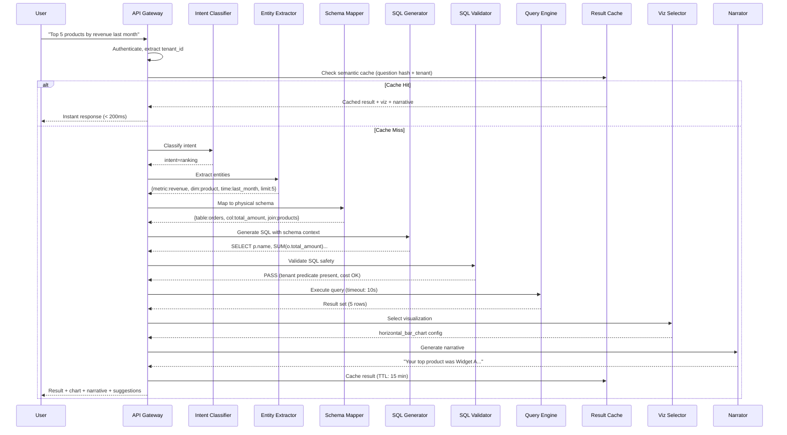
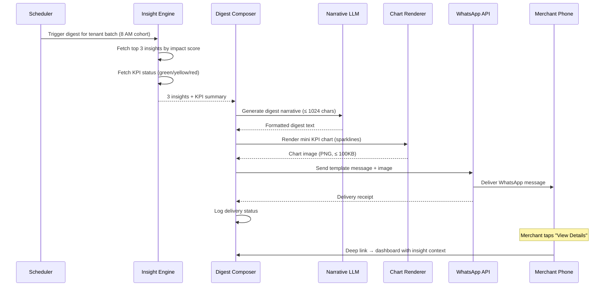

# 14.13 AI-Native MSME Business Intelligence Dashboard — Low-Level Design

## Data Models

### Tenant Configuration

```
Tenant {
    tenant_id          UUID        PRIMARY KEY
    business_name      VARCHAR(255)
    industry_vertical  VARCHAR(100)   -- "restaurant", "retail_fashion", "manufacturing"
    geography          VARCHAR(100)
    revenue_band       ENUM           -- "micro", "small", "medium"
    business_age_months INT
    plan_tier          ENUM           -- "free", "starter", "growth", "pro"
    digest_config      JSONB          -- WhatsApp schedule, focus areas, language
    created_at         TIMESTAMP
    updated_at         TIMESTAMP
}
```

### Semantic Graph Schema

```
SemanticNode {
    node_id            UUID        PRIMARY KEY
    tenant_id          UUID        FOREIGN KEY → Tenant
    node_type          ENUM           -- "table", "column", "metric", "dimension", "relationship"
    physical_name      VARCHAR(255)   -- actual column/table name in warehouse
    business_name      VARCHAR(255)   -- human-readable name ("Monthly Revenue")
    business_aliases   TEXT[]         -- ["sales", "income", "turnover"]
    data_type          VARCHAR(50)    -- "currency", "count", "percentage", "date", "text"
    aggregation_default ENUM          -- "sum", "avg", "count", "max", "min", "none"
    description        TEXT           -- LLM-generated description of what this field represents
    confidence_score   FLOAT          -- AI mapping confidence (0.0–1.0)
    confirmed_by_user  BOOLEAN        -- merchant has verified this mapping
    version            INT
    created_at         TIMESTAMP
}

SemanticRelationship {
    relationship_id    UUID        PRIMARY KEY
    tenant_id          UUID        FOREIGN KEY → Tenant
    source_node_id     UUID        FOREIGN KEY → SemanticNode
    target_node_id     UUID        FOREIGN KEY → SemanticNode
    relationship_type  ENUM           -- "joins_on", "derived_from", "aggregates_to", "parent_of"
    join_condition     TEXT           -- "orders.customer_id = customers.id"
    cardinality        ENUM           -- "one_to_one", "one_to_many", "many_to_many"
    confidence_score   FLOAT
}
```

### Query Session Model

```
QuerySession {
    session_id         UUID        PRIMARY KEY
    tenant_id          UUID        FOREIGN KEY → Tenant
    user_id            UUID
    session_name       VARCHAR(255)   -- "Monday Review", auto-generated or user-set
    context_window     JSONB[]        -- last 10 query-response pairs for follow-up context
    created_at         TIMESTAMP
    last_active_at     TIMESTAMP
    expires_at         TIMESTAMP      -- session_created + 7 days
}

QueryLog {
    query_id           UUID        PRIMARY KEY
    session_id         UUID        FOREIGN KEY → QuerySession
    tenant_id          UUID        FOREIGN KEY → Tenant
    natural_language    TEXT           -- original user question
    intent             VARCHAR(50)    -- classified intent
    extracted_entities JSONB          -- {time_range, metrics, dimensions, filters}
    generated_sql      TEXT           -- SQL produced by LLM
    validated          BOOLEAN        -- passed safety validation
    validation_errors  TEXT[]         -- if validation failed
    execution_time_ms  INT
    row_count          INT
    result_hash        VARCHAR(64)    -- for cache dedup
    visualization_type VARCHAR(50)    -- "line_chart", "bar_chart", "table", etc.
    narrative          TEXT           -- generated explanation
    user_feedback      ENUM           -- "helpful", "wrong_data", "wrong_chart", "unclear", NULL
    created_at         TIMESTAMP
}
```

### Insight Model

```
Insight {
    insight_id         UUID        PRIMARY KEY
    tenant_id          UUID        FOREIGN KEY → Tenant
    detection_type     ENUM           -- "anomaly", "trend_change", "benchmark_deviation", "goal_risk"
    kpi_name           VARCHAR(255)   -- "daily_revenue", "avg_order_value"
    observed_value     FLOAT
    expected_value     FLOAT
    deviation_pct      FLOAT          -- percentage deviation from expected
    direction          ENUM           -- "above", "below"
    root_cause         JSONB          -- {dimension: "product_category", segment: "electronics", contribution_pct: 0.45}
    impact_estimate    FLOAT          -- estimated revenue impact in local currency
    confidence         FLOAT          -- 0.0–1.0
    novelty_score      FLOAT          -- 0.0–1.0 (1.0 = never seen before)
    narrative          TEXT           -- LLM-generated explanation
    delivered_via      TEXT[]         -- ["whatsapp", "dashboard"]
    user_reaction      ENUM           -- "useful", "not_useful", NULL
    suppressed         BOOLEAN        -- filtered by novelty/dedup
    created_at         TIMESTAMP
}
```

### Benchmark Model

```
BenchmarkCohort {
    cohort_id          UUID        PRIMARY KEY
    industry_vertical  VARCHAR(100)
    geography          VARCHAR(100)
    revenue_band       ENUM
    tenant_count       INT            -- must be ≥ 50 for publication
    computed_at        TIMESTAMP
}

BenchmarkMetric {
    metric_id          UUID        PRIMARY KEY
    cohort_id          UUID        FOREIGN KEY → BenchmarkCohort
    kpi_name           VARCHAR(255)
    p25                FLOAT          -- 25th percentile (with DP noise)
    p50                FLOAT          -- median
    p75                FLOAT          -- 75th percentile
    p90                FLOAT          -- 90th percentile
    mean               FLOAT          -- mean (with DP noise)
    noise_budget_used  FLOAT          -- ε consumed for this metric
    computed_at        TIMESTAMP
}
```

---

## API Contracts

### NL Query API

```
POST /api/v1/query

Request:
{
    "question": "What were my top 5 products by revenue last month?",
    "session_id": "uuid-optional",          // for conversational context
    "language": "en",                        // ISO 639-1
    "preferred_viz": "auto"                  // "auto", "table", "bar_chart", etc.
}

Response:
{
    "query_id": "uuid",
    "session_id": "uuid",
    "intent": "metric_query",
    "sql_generated": "SELECT ... (shown only in debug mode)",
    "result": {
        "columns": ["product_name", "revenue"],
        "rows": [["Widget A", 145000], ["Widget B", 128000], ...],
        "row_count": 5
    },
    "visualization": {
        "type": "horizontal_bar_chart",
        "config": { "x_axis": "revenue", "y_axis": "product_name", "sort": "desc" }
    },
    "narrative": "Your top product last month was Widget A, generating ₹1,45,000 in revenue — 18% more than the second-best Widget B. Together, your top 5 products account for 62% of total revenue.",
    "follow_up_suggestions": [
        "How does this compare to the previous month?",
        "Show me the trend for Widget A over the last 6 months",
        "Which customers buy Widget A the most?"
    ],
    "confidence": 0.94,
    "execution_time_ms": 1850
}
```

### Insight Feed API

```
GET /api/v1/insights?since=2026-03-09T00:00:00Z&limit=10

Response:
{
    "insights": [
        {
            "insight_id": "uuid",
            "type": "anomaly",
            "severity": "high",
            "title": "Tuesday Revenue Drop",
            "narrative": "Revenue on Tuesday March 9 was ₹24,000, which is 23% below the expected ₹31,200 for a typical Tuesday. The primary driver was a 45% drop in electronics category sales, specifically products supplied by Vendor X who had delayed shipments.",
            "impact_estimate": 7200,
            "kpi": "daily_revenue",
            "root_cause": {
                "dimension": "product_category",
                "segment": "electronics",
                "contribution_pct": 0.68,
                "secondary": { "dimension": "supplier", "segment": "Vendor X" }
            },
            "suggested_actions": [
                "Contact Vendor X about shipment delays",
                "Consider backup supplier for top electronics products"
            ],
            "created_at": "2026-03-10T06:30:00Z"
        }
    ],
    "total": 3
}
```

### Data Source Connector API

```
POST /api/v1/connectors

Request:
{
    "source_type": "tally",
    "credentials": { "encrypted_payload": "..." },
    "sync_schedule": "every_15_minutes"
}

Response:
{
    "connector_id": "uuid",
    "status": "schema_discovery",
    "discovered_tables": 12,
    "estimated_rows": 245000,
    "column_mappings": [
        {
            "source_column": "vch_amt",
            "suggested_mapping": "transaction_amount",
            "confidence": 0.92,
            "alternatives": ["invoice_amount", "payment_amount"]
        }
    ],
    "requires_confirmation": true
}
```

### Benchmark API

```
GET /api/v1/benchmarks?kpi=monthly_revenue

Response:
{
    "cohort": {
        "industry": "retail_fashion",
        "geography": "mumbai",
        "revenue_band": "small",
        "tenant_count": 127
    },
    "your_value": 485000,
    "percentile": 72,
    "benchmarks": {
        "p25": 210000,
        "p50": 380000,
        "p75": 520000,
        "p90": 780000
    },
    "trend": {
        "your_growth_3m": 0.12,
        "cohort_avg_growth_3m": 0.08,
        "outperforming": true
    }
}
```

---

## NL-to-SQL Algorithm Detail

### Step 1: Intent Classification

A lightweight classification model (fine-tuned on 50K labeled MSME queries) categorizes the question:

```
INTENT_TYPES:
    metric_query    → "What is my revenue?"        → SELECT with aggregation
    comparison      → "Compare sales across stores" → SELECT with GROUP BY
    trend           → "Show revenue trend"          → SELECT with time-series ordering
    drill_down      → "Break that down by region"   → Add GROUP BY to previous query
    forecast        → "Predict next month's sales"  → Time-series forecasting model
    goal_check      → "Am I on track for my target?" → Compare actual vs. goal
    ranking         → "Top 10 customers"            → SELECT with ORDER BY LIMIT
```

### Step 2: Entity Extraction

Extract structured entities from the classified question:

```
Input: "What were my top 5 products by revenue last month?"

Extracted:
{
    "intent": "ranking",
    "metric": "revenue",
    "dimension": "product",
    "time_range": {"type": "relative", "period": "month", "offset": -1},
    "limit": 5,
    "sort_direction": "desc",
    "filters": []
}
```

### Step 3: Schema Mapping via Semantic Graph

Map extracted business entities to physical schema:

```
PSEUDOCODE: schema_mapping(entities, semantic_graph)
    FOR EACH entity IN entities.metrics:
        candidates = semantic_graph.search(entity.name, type="metric")
        IF candidates.best.confidence >= 0.8:
            entity.physical = candidates.best.physical_name
            entity.aggregation = candidates.best.aggregation_default
        ELSE:
            RETURN clarification_prompt(entity, candidates.top_3)

    FOR EACH entity IN entities.dimensions:
        candidates = semantic_graph.search(entity.name, type="dimension")
        entity.physical = candidates.best.physical_name

    // Resolve join path between referenced tables
    tables = UNIQUE(all mapped physical tables)
    join_path = semantic_graph.shortest_join_path(tables)

    RETURN mapped_entities, join_path
```

### Step 4: SQL Generation

The LLM receives a structured prompt with the tenant's schema context:

```
PROMPT TEMPLATE:
    Given the following database schema for tenant:
    {semantic_graph.to_schema_description()}

    Generate a SQL query for:
    Intent: {intent}
    Entities: {mapped_entities}
    Join path: {join_path}
    Time range: {resolved_time_range}

    Rules:
    - MUST include WHERE tenant_id = '{tenant_id}'
    - SELECT and aggregate queries only (no INSERT/UPDATE/DELETE/DDL)
    - Use aliases for readability
    - Limit results to {limit} rows maximum
    - Use the exact column names from the schema

    Previous queries in session (for context):
    {session_context.last_3_queries}
```

### Step 5: SQL Validation (Safety Gate)

```
PSEUDOCODE: validate_sql(sql, tenant_id, allowed_schema)
    ast = parse_sql_to_ast(sql)

    // Check 1: No DDL or DML
    ASSERT ast.type IN ["SELECT"]

    // Check 2: Tenant isolation
    ASSERT contains_predicate(ast, "tenant_id = '{tenant_id}'")

    // Check 3: Only allowed tables/columns
    referenced = extract_tables_and_columns(ast)
    FOR EACH ref IN referenced:
        ASSERT ref IN allowed_schema[tenant_id]

    // Check 4: No subqueries accessing system tables
    ASSERT no_system_table_references(ast)

    // Check 5: Query cost estimation
    estimated_cost = query_planner.estimate(sql)
    ASSERT estimated_cost <= tenant.query_budget

    // Check 6: Row limit enforcement
    IF NOT has_limit_clause(ast):
        sql = inject_limit(sql, max_rows=10000)

    RETURN validated_sql
```

---

## Visualization Selection Algorithm

```
PSEUDOCODE: select_visualization(intent, result_schema, row_count)
    IF intent == "trend" AND has_time_column(result_schema):
        IF metric_count == 1:
            RETURN "line_chart"
        ELSE:
            RETURN "multi_line_chart"

    IF intent == "comparison":
        IF dimension_count == 1 AND metric_count == 1:
            IF row_count <= 7:
                RETURN "horizontal_bar_chart"
            ELSE:
                RETURN "vertical_bar_chart"
        IF dimension_count == 2:
            RETURN "grouped_bar_chart"

    IF intent == "ranking":
        RETURN "horizontal_bar_chart"  // sorted, with value labels

    IF intent == "metric_query" AND row_count == 1:
        RETURN "big_number_card"       // single KPI display

    IF has_geographic_dimension(result_schema):
        RETURN "choropleth_map"

    // Fallback for complex or ambiguous results
    IF row_count <= 20:
        RETURN "table"
    ELSE:
        RETURN "table_with_pagination"
```

---

## Anomaly Detection Algorithm

```
PSEUDOCODE: detect_anomalies(tenant_id, kpi_name, new_value, timestamp)
    history = load_kpi_history(tenant_id, kpi_name, lookback=90_days)

    // Phase 1: Seasonality decomposition
    decomposed = prophet_decompose(history)
    expected = decomposed.trend[timestamp] + decomposed.seasonal[timestamp]
    residual = new_value - expected

    // Phase 2: Statistical significance
    residual_std = std(decomposed.residuals)
    z_score = residual / residual_std

    IF abs(z_score) < 2.0:
        RETURN null  // within normal variance

    // Phase 3: Root cause attribution
    dimensions = get_tracked_dimensions(tenant_id, kpi_name)
    root_causes = []
    FOR EACH dim IN dimensions:
        segments = break_down_by(tenant_id, kpi_name, dim, timestamp)
        FOR EACH segment IN segments:
            segment_z = compute_z_score(segment)
            IF abs(segment_z) > abs(z_score):  // segment deviates more than aggregate
                root_causes.append({
                    dimension: dim,
                    segment: segment.name,
                    contribution: segment.deviation / total_deviation
                })

    root_causes.sort_by(contribution, DESC)

    // Phase 4: Impact estimation
    impact = abs(new_value - expected) * extrapolation_factor(kpi_name)

    RETURN Insight(
        type="anomaly",
        deviation_pct=(new_value - expected) / expected,
        root_cause=root_causes[0],
        impact_estimate=impact,
        confidence=min(1.0, abs(z_score) / 4.0)
    )
```

---

## Sequence Diagram: End-to-End NL Query



---

## Sequence Diagram: WhatsApp Digest Delivery


