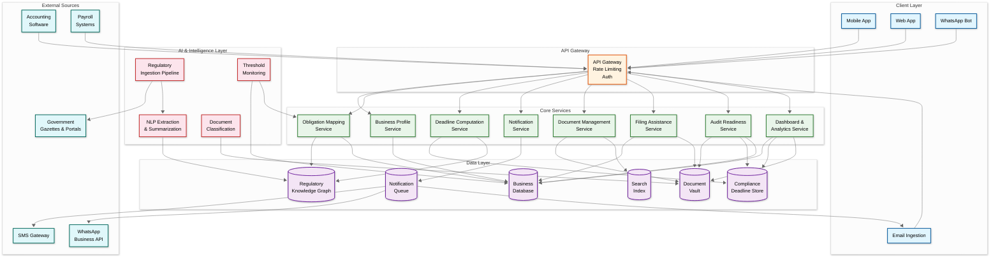
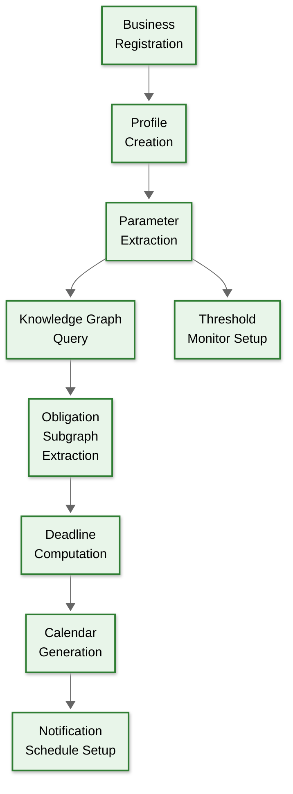
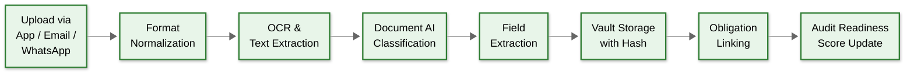

# 14.14 AI-Native Regulatory & Compliance Assistant for MSMEs — High-Level Design

## System Context

The regulatory compliance assistant sits at the intersection of three data flows: (1) regulatory content flowing in from government sources, (2) business data flowing in from MSME users and their integrated systems, and (3) compliance actions flowing out as notifications, pre-filled forms, and audit packs. The AI layer transforms raw regulatory text into personalized, actionable compliance obligations.

---

## High-Level Architecture

---

## Core Data Flows

### Flow 1: Regulatory Change Ingestion

```mermaid
---
config:
  theme: neutral
  look: neo
---
flowchart LR
    A[Government\nSource] --> B[Crawler /\nFeed Reader]
    B --> C[Document\nParser]
    C --> D[Change\nDetector]
    D --> E[NLP Obligation\nExtractor]
    E --> F[Impact\nAnalyzer]
    F --> G[Knowledge\nGraph Update]
    G --> H[Affected\nBusiness Finder]
    H --> I[Notification\nDispatch]

    classDef process fill:#e8f5e9,stroke:#2e7d32,stroke-width:2px
    classDef external fill:#e0f7fa,stroke:#00695c,stroke-width:2px
    classDef data fill:#f3e5f5,stroke:#6a1b9a,stroke-width:2px

    class A external
    class B,C,D,E,F,H,I process
    class G data
```

**Steps:**
1. **Crawl/Ingest**: Scheduled crawlers fetch new documents from government gazette RSS feeds, ministry portals, and legislative databases. Frequency: hourly for high-priority sources (GST Council, MCA), daily for others.
2. **Parse**: Extract text from PDFs (including scanned documents via OCR), HTML pages, and structured feeds. Normalize into a common document format with metadata (source, date, jurisdiction, category).
3. **Detect Changes**: Compare new documents against the existing corpus. For amendments, compute a semantic diff highlighting what changed (new sections, modified thresholds, deleted provisions).
4. **Extract Obligations**: NLP pipeline identifies obligation-bearing sentences ("Every registered person shall furnish..."), extracts entities (who, what, when, penalty), and maps to the regulatory knowledge graph's ontology.
5. **Analyze Impact**: Query the business database to find all businesses whose profiles match the new obligation's applicability criteria (jurisdiction, industry, size, activity).
6. **Notify**: Generate plain-language summaries and dispatch to affected businesses via their preferred channels.

### Flow 2: Business Onboarding and Obligation Mapping

**Steps:**
1. **Register**: Business owner provides GST number, PAN, business type, employee count, turnover, locations, and industry. System auto-fetches additional data from MCA/GST portal APIs where available.
2. **Extract Parameters**: Derive compliance-relevant parameters: jurisdiction set (states of operation), size classification (micro/small/medium), industry codes, applicable acts.
3. **Query Knowledge Graph**: Traverse the regulatory knowledge graph with business parameters to identify all applicable regulations and their specific obligations.
4. **Compute Deadlines**: For each obligation, compute the next N deadlines based on business parameters, jurisdiction rules, and calendar adjustments.
5. **Schedule Notifications**: Set up staged reminders for each deadline based on preparation complexity and penalty severity.

### Flow 3: Document Upload and Classification

---

## Key Design Decisions

### Decision 1: Graph Database for Regulatory Knowledge vs. Relational Database

**Choice:** Graph database for the regulatory knowledge graph; relational database for business profiles and transactional data.

**Rationale:** Regulations are inherently graph-structured: acts contain sections, sections are amended by notifications, obligations derive from sections with applicability criteria that reference business parameters. Queries like "find all obligations applicable to a manufacturing MSME with 25 employees in Maharashtra" require multi-hop traversal (industry → applicable acts → active sections → current obligations → jurisdiction filter). Graph databases express these queries naturally and perform them in O(traversal) time rather than the O(join) time of relational databases. However, business profiles, notification logs, and filing records are transactional and tabular—relational databases handle these better with ACID guarantees.

### Decision 2: Event-Driven Obligation Recomputation vs. Batch Recomputation

**Choice:** Event-driven recomputation triggered by business parameter changes and regulatory updates.

**Rationale:** Batch recomputation (nightly recalculation of all obligations for all businesses) is simpler but wasteful—99% of obligations don't change on any given day. Event-driven recomputation triggers only when a relevant event occurs: a business hires a new employee (potential threshold crossing), a regulation is amended (affected obligations change), or a government extends a deadline (calendar adjustment). This reduces compute by 100× while ensuring obligations are always current. The trade-off is eventual consistency: after a regulatory change is ingested, there's a propagation delay (target: ≤ 5 minutes) before all affected businesses see updated obligations.

### Decision 3: Content-Addressed Document Storage vs. Path-Based Storage

**Choice:** Content-addressed storage where each document is identified by its cryptographic hash (SHA-256).

**Rationale:** Compliance documents have legal significance—a filing receipt must be provably unmodified years after upload. Content-addressed storage provides inherent tamper evidence: any modification changes the hash, making tampering detectable without additional infrastructure. It also provides natural deduplication (the same challan uploaded twice is stored once) and enables integrity verification at any time by recomputing the hash. The trade-off is that documents are immutable—corrections require uploading a new version rather than editing in place. This is actually desirable for compliance documents, where the audit trail of versions (original filing → amended filing → revised filing) is itself compliance-relevant.

### Decision 4: Hierarchical Jurisdiction Model vs. Flat Jurisdiction Tags

**Choice:** Hierarchical three-level model: Central → State → Municipal.

**Rationale:** Indian regulations cascade hierarchically: central acts define the framework, states may adopt with modifications or create state-specific regulations, and municipalities add local requirements (trade licenses, shop establishment registrations). A flat tag model (business tagged with "Maharashtra" and "India") loses the hierarchical relationship and cannot represent that a state amendment overrides a central provision for businesses in that state, or that a municipal requirement applies in addition to the state-level requirements. The hierarchical model enables proper obligation resolution: start with central obligations, overlay state-specific modifications (which may relax or tighten central requirements), then add municipal obligations. When regulations conflict (rare but possible), the system applies the most restrictive standard and flags the conflict for human review.

### Decision 5: Multi-Channel Notification with Per-Deadline Priority Classification

**Choice:** Deadline-severity-based notification strategy rather than uniform reminders for all obligations.

**Rationale:** Not all deadlines are equal. Missing a GST filing by one day incurs a ₹50/day penalty. Missing PF remittance by one day incurs 12% annual interest. Missing a license renewal might mean operating without a license (criminal offense). The notification system classifies deadlines into severity tiers: Critical (criminal penalty or business shutdown risk → 90/60/30/15/7/3/1-day reminders with escalation), High (financial penalty > ₹10,000/month → 60/30/7/1-day reminders), Medium (financial penalty < ₹10,000 → 30/7/1-day reminders), Low (informational with no penalty → 7/1-day reminders). This prevents notification fatigue from treating a minor informational filing the same as a license renewal with criminal consequences.

---

## Component Responsibility Matrix

| Component | Responsibilities | Key Dependencies |
|---|---|---|
| **Business Profile Service** | Business registration, parameter management, threshold tracking, accountant invitation | Business DB, Obligation Mapping Service |
| **Obligation Mapping Service** | Derive applicable obligations from business parameters, recompute on parameter or regulatory change | Regulatory Knowledge Graph, Business DB |
| **Deadline Computation Service** | Calculate personalized deadlines, handle holiday adjustments, government extensions, dependency ordering | Compliance Deadline Store, Knowledge Graph |
| **Notification Service** | Multi-channel delivery (WhatsApp, SMS, email, push), staged reminders, escalation, acknowledgment tracking | Notification Queue, SMS Gateway, WhatsApp API |
| **Document Management Service** | Upload ingestion, OCR, classification, vault storage, search indexing, tamper-evidence verification | Document Vault, Search Index, Document AI |
| **Filing Assistance Service** | Form pre-fill, validation, filing-ready document generation, government portal integration | Business DB, Document Vault, external filing APIs |
| **Audit Readiness Service** | Gap analysis, readiness scoring, audit pack generation, compliance risk assessment | Document Vault, Deadline Store, Business DB |
| **Dashboard & Analytics Service** | Compliance health score, upcoming deadlines, overdue items, regulatory change feed, role-based views | All data stores (read-only CQRS query path) |
| **Regulatory Ingestion Pipeline** | Source crawling, document parsing, change detection, NLP extraction, knowledge graph update | Government sources, NLP models, Knowledge Graph |
| **Threshold Monitoring** | Watch business parameters against regulatory thresholds, trigger obligation map updates | Business DB, Obligation Mapping Service |
