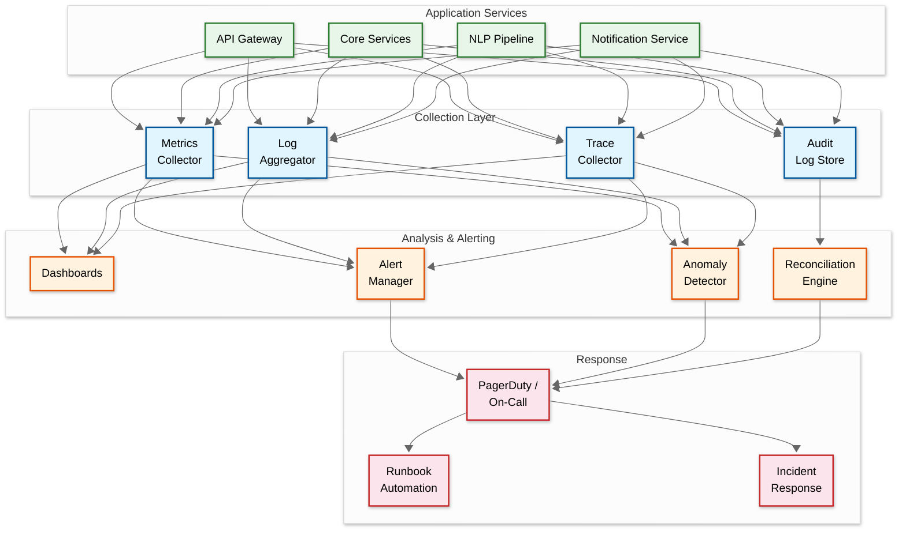

# 14.14 AI-Native Regulatory & Compliance Assistant for MSMEs — Observability

## Observability Philosophy

The regulatory compliance assistant has a unique observability requirement: the system's failures are not immediately visible to users (a missed notification doesn't show an error—it simply doesn't appear), but the consequences are severe (financial penalties). Traditional observability focuses on detecting system failures; this system must also detect *absence of expected behavior*—the notification that should have been sent but wasn't, the regulation that was published but not ingested, the deadline that was computed incorrectly.

---

## Key Metrics Framework

### Business-Critical Metrics (Golden Signals)

| Metric | Type | Description | Alert Threshold |
|---|---|---|---|
| `notification.delivery_rate` | Ratio | Notifications successfully delivered / total scheduled | < 99.9% over 1 hour → P1 |
| `notification.false_negative_rate` | Ratio | Penalty-bearing deadlines with no reminder sent / total penalty deadlines | > 0 in 24 hours → P1 |
| `obligation.mapping_accuracy` | Ratio | Obligations confirmed correct / total obligations (sampled) | < 95% weekly sample → P2 |
| `regulatory.ingestion_lag` | Gauge | Time since last successful ingestion from each government source | > 48 hours for any source → P2 |
| `deadline.computation_correctness` | Ratio | Deadlines matching manual verification / total verified (sampled) | < 98% weekly sample → P2 |
| `document.classification_accuracy` | Ratio | Correctly classified documents / total classified (human-verified sample) | < 90% weekly → P3 |
| `audit_readiness.score_accuracy` | Ratio | Score matches manual assessment / total assessed (sampled) | < 85% monthly sample → P3 |

### System Health Metrics

| Metric | Type | Description | Alert Threshold |
|---|---|---|---|
| `api.latency_p95` | Histogram | API response time | > 2s for dashboard; > 5s for filing |
| `api.error_rate` | Ratio | 5xx responses / total requests | > 1% over 5 minutes → P2 |
| `graph.query_latency_p95` | Histogram | Knowledge graph traversal time | > 500ms → P3 |
| `document.upload_success_rate` | Ratio | Successful uploads / attempted | < 99% over 1 hour → P2 |
| `queue.notification_depth` | Gauge | Pending notifications in dispatch queue | > 50,000 → P2 (indicates dispatch lag) |
| `nlp.extraction_confidence_avg` | Gauge | Average confidence score of NLP extractions | < 0.75 over 24 hours → P3 |
| `vault.integrity_check_failures` | Counter | Documents failing hash verification | > 0 → P1 |

---

## Observability Architecture



---

## Absence Detection: Monitoring for What Didn't Happen

### Expected Notification Reconciliation

The most critical observability challenge: detecting that a notification that should have been sent was not sent. This cannot be detected by monitoring error rates (there's no error—the notification simply doesn't exist).

```
Reconciliation Process (runs hourly):
├── Step 1: Query all obligation instances with due_date within reminder window
│   └── e.g., due_date between now+6 days and now+8 days → should have 7-day reminder
│
├── Step 2: For each obligation, check notification history
│   └── Expected: notification_record exists with matching obligation_id and stage
│
├── Step 3: Identify gaps (obligations with expected reminder but no notification)
│   └── Gap = obligation that should have a reminder but doesn't
│
├── Step 4: Classify gaps
│   ├── Expected gap: obligation status = completed (no reminder needed)
│   ├── Expected gap: obligation status = not_applicable (waived)
│   └── Unexpected gap: obligation is active and upcoming but no reminder → ALERT
│
├── Step 5: For unexpected gaps
│   ├── Severity = critical if penalty_amount > ₹10,000
│   ├── Severity = high if penalty_amount > ₹1,000
│   └── Auto-remediation: generate and send the missing notification immediately
│
└── Step 6: Log reconciliation results
    └── Metric: notification.reconciliation_gap_count (should be 0)
```

### Regulatory Ingestion Completeness

Detecting that a government source published a new regulation but the system didn't ingest it:

```
Completeness Monitoring:
├── Source Heartbeat: Each monitored government source has an expected update frequency
│   ├── GST Council: At least 1 update per month
│   ├── State gazettes: At least 1 update per week
│   └── If no update detected in 2× expected frequency → alert for manual check
│
├── Cross-Reference: Compare ingested documents against third-party legal databases
│   ├── Weekly reconciliation against legal news aggregators
│   ├── Monthly reconciliation against professional legal services
│   └── Any regulation present in cross-reference but missing from system → alert
│
└── Community Signal: If 10+ businesses report the same "missing regulation" → P2 alert
```

---

## Distributed Tracing

### Trace Spans for Key Workflows

**Regulatory Change Ingestion Trace:**
```
trace: regulatory_change_ingestion
├── span: source_crawl         [source_id, document_count]
├── span: document_parse       [format, page_count, ocr_required]
├── span: change_detect        [change_type, diff_size]
├── span: nlp_extraction       [obligation_count, avg_confidence]
├── span: graph_update         [nodes_added, edges_added, version]
├── span: impact_analysis      [businesses_affected]
└── span: notification_dispatch [notification_count, channels]
```

**Obligation Mapping Trace:**
```
trace: obligation_mapping
├── span: profile_load         [business_id, parameter_version]
├── span: archetype_check      [archetype_id, cache_hit]
├── span: graph_traversal      [nodes_visited, obligations_found]
├── span: conflict_resolution  [conflicts_found, conflicts_resolved]
├── span: deadline_computation [deadlines_computed, adjustments_applied]
└── span: calendar_update      [events_created, events_updated]
```

**Notification Delivery Trace:**
```
trace: notification_delivery
├── span: generation           [notification_type, severity]
├── span: channel_selection    [selected_channel, preference_source]
├── span: dispatch             [channel, provider, message_id]
├── span: delivery_confirmation [delivered, latency_ms]
├── span: acknowledgment       [acknowledged, time_to_ack_ms]
└── span: fallback             [triggered, fallback_channel] (conditional)
```

---

## Dashboard Design

### Operational Dashboard: Regulatory Pipeline Health

```
┌─────────────────────────────────────────────────────────────────┐
│  REGULATORY PIPELINE HEALTH                     [Last 24 hours] │
├─────────────────────┬───────────────────────────────────────────┤
│  Sources Monitored  │  Sources Healthy: 487/502 (97%)           │
│                     │  Last Ingestion: 23 min ago               │
│                     │  Stale Sources (>48h): 3 ⚠️               │
├─────────────────────┼───────────────────────────────────────────┤
│  Documents Ingested │  Today: 347  │  Parsed: 341  │  Failed: 6│
│                     │  Avg Parse Time: 4.2s  │  OCR: 89 (26%)  │
├─────────────────────┼───────────────────────────────────────────┤
│  NLP Extraction     │  Obligations Extracted: 42                │
│                     │  Avg Confidence: 0.87                     │
│                     │  Below Threshold: 3 (sent to review)      │
├─────────────────────┼───────────────────────────────────────────┤
│  Impact Analysis    │  Businesses Affected: 145,000             │
│                     │  Obligation Recomputations: 145,000       │
│                     │  Notifications Triggered: 290,000         │
├─────────────────────┼───────────────────────────────────────────┤
│  Knowledge Graph    │  Version: 4,847                           │
│                     │  Nodes: 51,234  │  Edges: 523,891        │
│                     │  Last Update: 2 hours ago                 │
└─────────────────────┴───────────────────────────────────────────┘
```

### Business-Facing Dashboard: Compliance Health

```
┌─────────────────────────────────────────────────────────────────┐
│  COMPLIANCE HEALTH                     Sharma Textiles Pvt Ltd  │
├─────────────────────┬───────────────────────────────────────────┤
│  Overall Score      │  ████████░░ 78/100                        │
│                     │  ▲ +3 from last week                      │
├─────────────────────┼───────────────────────────────────────────┤
│  Upcoming (7 days)  │  3 filings  │  1 renewal  │  0 overdue  │
│                     │  Highest risk: GSTR-3B (₹50/day penalty)  │
├─────────────────────┼───────────────────────────────────────────┤
│  Audit Readiness    │  GST: 78%  │  PF: 92%  │  ESI: 85%      │
│                     │  Gap: Missing GSTR-3B receipt (Mar 2025)  │
├─────────────────────┼───────────────────────────────────────────┤
│  Recent Changes     │  1 regulatory change affects you          │
│                     │  GST filing frequency change (effective    │
│                     │  Apr 2026) — tap to view details          │
└─────────────────────┴───────────────────────────────────────────┘
```

---

## Alerting Strategy

### Alert Severity and Escalation

| Severity | Response Time | Examples | Escalation Path |
|---|---|---|---|
| **P1 - Critical** | 5 min acknowledge, 30 min mitigate | Notification delivery failure; document vault integrity issue; zero notifications dispatched for > 30 min | On-call engineer → Engineering lead → CTO |
| **P2 - High** | 15 min acknowledge, 2 hour mitigate | API error rate > 1%; regulatory source stale > 48h; obligation mapping queue backlog > 1 hour | On-call engineer → Team lead |
| **P3 - Medium** | 1 hour acknowledge, 24 hour resolve | NLP confidence degradation; document classification accuracy drop; search latency degradation | Logged for next business day; auto-ticket created |
| **P4 - Low** | Next business day | Single source crawl failure; minor UI latency spike; non-critical batch job delay | Dashboard notification only |

### Alert Deduplication and Suppression

```
Deduplication Rules:
├── Same alert from same source within 5 min → suppress duplicate
├── Related alerts (graph update failed → obligation recomputation failed) → group as single incident
├── Known maintenance window → suppress non-critical alerts
└── Government portal scheduled downtime → suppress source availability alerts
```

---

## Logging Strategy

### Log Categories and Retention

| Category | Content | Retention | Storage |
|---|---|---|---|
| **Security audit logs** | Authentication events, data access, permission changes | 3 years | Immutable append-only store |
| **Compliance action logs** | Notifications sent, filings assisted, documents classified | 7 years | Time-series database with archival |
| **System operation logs** | API requests, service errors, performance data | 90 days | Log aggregation platform |
| **NLP pipeline logs** | Extraction results, confidence scores, model versions | 1 year | Searchable log store |
| **Debug logs** | Detailed function-level traces | 7 days | Local + sampling to central |

### Structured Log Format

```
{
    "timestamp": "2025-11-18T09:15:23.456Z",
    "service": "notification-service",
    "level": "INFO",
    "trace_id": "abc123",
    "span_id": "def456",
    "business_id": "uuid",          // always present for tenant-scoped operations
    "event": "notification.dispatched",
    "attributes": {
        "obligation_id": "uuid",
        "channel": "whatsapp",
        "severity": "critical",
        "reminder_stage": 3,
        "due_date": "2025-11-25"
    }
}
```

---

## SLO Monitoring and Error Budgets

### SLO Burn Rate Alerts

| SLO | Target | Fast Burn Alert (1h) | Slow Burn Alert (24h) |
|---|---|---|---|
| Notification delivery | 99.99% | > 1% failure in 1 hour | > 0.05% failure in 24 hours |
| Dashboard availability | 99.9% | > 5% error in 1 hour | > 0.5% error in 24 hours |
| Obligation accuracy | 98% | N/A (weekly sample) | > 5% error in weekly sample |
| Document vault durability | 11 nines | Any integrity failure | Monthly integrity audit |

### Error Budget Policy

```
Error Budget Actions:
├── Budget > 50% remaining: Normal development velocity
├── Budget 25-50% remaining: Increased testing for deployments; no risky changes
├── Budget 10-25% remaining: Deployment freeze for non-critical changes; focus on reliability
├── Budget < 10% remaining: All engineering on reliability; incident review for every error
└── Budget exhausted: Feature freeze until budget replenished; post-mortem required
```
