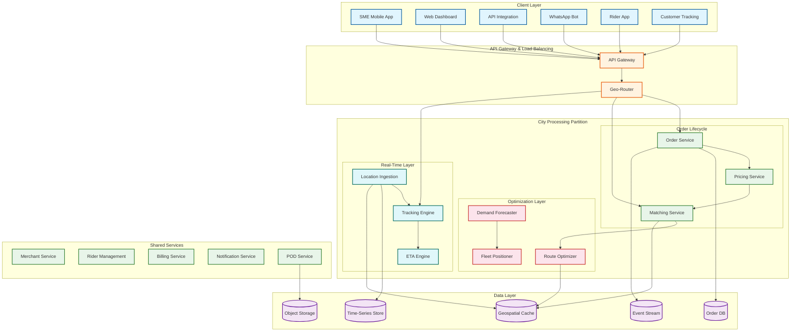
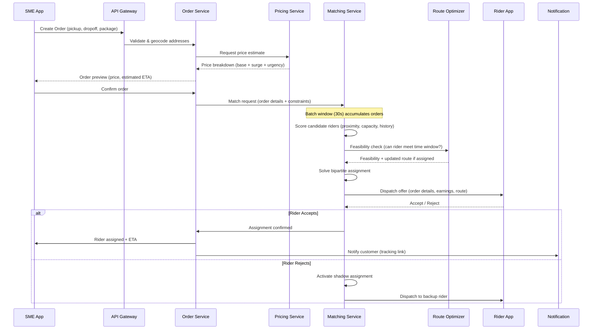
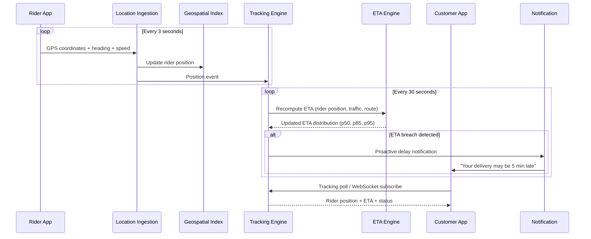
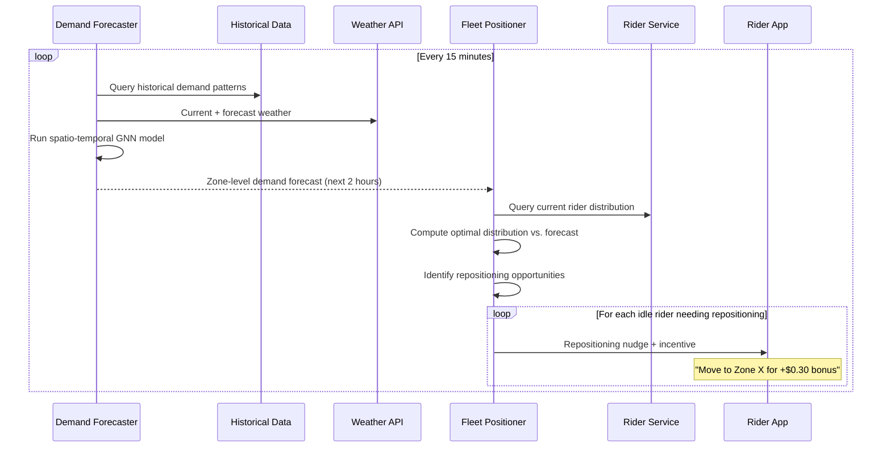

# 14.15 AI-Native Hyperlocal Logistics & Delivery Platform for SMEs — High-Level Design

## Architecture Overview

The platform follows an event-driven, geo-partitioned microservices architecture where each city operates as an independent processing unit with its own matching engine, route optimizer, and demand forecaster. Cross-city concerns (merchant accounts, billing, analytics aggregation) run on shared services. The design principle is "optimize locally, aggregate globally"—latency-critical operations (matching, tracking, routing) execute within a city partition, while business intelligence and platform analytics span all cities.

---

## Core Data Flows

### Flow 1: Order Creation → Rider Assignment

### Flow 2: Real-Time Tracking and ETA Updates

### Flow 3: Demand Forecasting → Fleet Pre-Positioning

---

## Key Design Decisions

### Decision 1: Geo-Partitioned Processing (City as Unit of Deployment)

**Choice**: Each city runs its own matching engine, route optimizer, and demand forecaster as independent processing units. Cross-city state is not shared for real-time operations.

**Rationale**: Hyperlocal delivery is inherently bounded by geography—a rider in Mumbai is never relevant to an order in Delhi. Geo-partitioning eliminates cross-city coordination overhead, allows independent scaling (larger cities get more compute), enables city-specific model tuning (traffic patterns in Bangalore differ fundamentally from Hyderabad), and provides blast radius isolation (a failure in one city's matching engine does not affect other cities).

**Trade-off**: Platform-level analytics (total orders across all cities, fleet utilization comparison) requires asynchronous aggregation from city partitions, adding 5-15 minute lag to platform-wide dashboards.

### Decision 2: Batch Matching with 30-Second Windows (Not Greedy Dispatch)

**Choice**: Orders are accumulated over 30-second windows and assigned to riders via global bipartite optimization, rather than immediately dispatching each order to the nearest available rider.

**Rationale**: Greedy dispatch (assign each order to nearest rider as it arrives) produces locally optimal but globally suboptimal assignments. Consider: Order A arrives at time T, and Rider 1 (1 km away) is assigned. Order B arrives at T+5s, and the only available rider is Rider 2 (4 km away). If the system had waited 5 seconds, it could have assigned Rider 1 to Order B (which was closer to Rider 1's eventual position) and Rider 2 to Order A, reducing total dead miles by 40%. Batch matching consistently reduces total fleet dead miles by 15-25% vs. greedy dispatch.

**Trade-off**: 30-second batch window adds latency to rider assignment. For express orders, the window is reduced to 10 seconds with a smaller candidate pool.

### Decision 3: CQRS for Order Lifecycle

**Choice**: Separate write path (order creation, state transitions, assignments) from read path (tracking queries, status checks, analytics).

**Rationale**: Write operations are bursty and require strong consistency (an order cannot be assigned to two riders). Read operations are 100× more frequent (thousands of tracking polls per minute per city) and can tolerate 1-3 second staleness. CQRS allows the write path to use a transactional database optimized for consistency, while the read path uses a geospatially-indexed cache optimized for low-latency location queries.

### Decision 4: Event-Sourced Order Log as Source of Truth

**Choice**: Every order state change is recorded as an immutable event in an append-only log. The current order state is a materialized view derived from replaying events.

**Rationale**: Delivery orders pass through 10+ state transitions (created → priced → confirmed → matching → assigned → pickup_en_route → at_pickup → picked_up → in_transit → near_dropoff → delivered/failed). Each transition carries metadata (timestamps, rider location, decision context). Event sourcing provides: complete audit trail for dispute resolution, ability to replay events for analytics and model training, natural integration with stream processing for real-time tracking, and crash recovery by replaying from the last checkpoint.

### Decision 5: Probabilistic ETAs (Distribution, Not Point Estimate)

**Choice**: The ETA engine produces a probability distribution (p50, p85, p95) rather than a single time estimate. Customer-facing ETA uses p85; rider-facing target uses p50; SLO monitoring uses p95.

**Rationale**: Point-estimate ETAs create a false sense of precision. A delivery predicted at "32 minutes" could realistically take 28-40 minutes due to traffic variance, building access time, and rider speed differences. By maintaining the full distribution, the system can make calibrated promises (p85 for customers), set realistic targets (p50 for riders), and detect systemic issues (when p95 - p50 spread widens, something is degrading route predictability).

---

## Component Responsibilities

| Component | Responsibility | Key Interfaces |
|---|---|---|
| **Order Service** | Order lifecycle management, state machine, validation | Receives from API Gateway; emits events to Event Stream; calls Pricing and Matching |
| **Pricing Service** | Dynamic price computation per zone per urgency tier | Reads supply-demand state from Geospatial Cache; returns price breakdown to Order Service |
| **Matching Service** | Batch rider-order assignment, shadow assignment computation | Reads rider positions from Geospatial Index; calls Route Optimizer for feasibility; sends dispatch offers to Rider App |
| **Route Optimizer** | CVRPTW solver for multi-stop routes, insertion feasibility | Reads road network graph from Geospatial Cache; returns optimized visit sequence and estimated times |
| **Demand Forecaster** | Spatio-temporal demand prediction per micro-zone | Reads from Historical Data and Weather API; outputs zone-level forecasts to Fleet Positioner |
| **Fleet Positioner** | Optimal rider distribution computation, repositioning nudges | Reads forecasts from Demand Forecaster, current positions from Geospatial Index; sends nudges via Rider App |
| **Location Ingestion** | High-throughput GPS stream processing, geofencing | Receives from Rider App; writes to Time-Series Store and Geospatial Index; emits geofence events |
| **Tracking Engine** | Real-time delivery tracking state, WebSocket management | Reads from Geospatial Index; serves tracking clients; triggers ETA recomputation |
| **ETA Engine** | Probabilistic ETA computation using ensemble model | Reads rider position, route, traffic state; outputs ETA distributions |
| **POD Service** | Proof of delivery capture, validation, storage | Receives photos and OTP confirmations from Rider App; validates via AI; stores in Object Storage |
| **Notification Service** | Multi-channel notifications (push, SMS, WhatsApp) | Triggered by order state changes; rate-limited per recipient |
| **Billing Service** | Delivery fee calculation, rider payouts, merchant billing | Processes completed delivery events; handles settlement cycles |

---

## Technology Mapping

| Concern | Technology Choice | Rationale |
|---|---|---|
| **Geospatial Index** | In-memory geohash-partitioned index with R-tree per partition | Sub-millisecond spatial queries for rider proximity; custom-built for update frequency |
| **Order Database** | Relational database with event-sourcing overlay | ACID transactions for order state; event log for audit and replay |
| **Time-Series Store** | Column-oriented time-series database | Optimized for GPS trail storage and temporal range queries; high write throughput |
| **Event Stream** | Distributed log with topic-per-city partitioning | Decouples services; enables replay; city-level partitioning for locality |
| **Cache Layer** | In-memory key-value store with geospatial commands | Sub-millisecond reads for tracking queries; built-in geo-radius search |
| **Object Storage** | Distributed object store | POD photos, route snapshots; cost-effective for large binary data |
| **Road Network Graph** | Pre-processed contraction hierarchy graph in shared memory | Fast shortest-path queries (< 1ms for city-scale); updated hourly from traffic feeds |
| **ML Model Serving** | Containerized model servers with GPU for batch inference | Demand forecasting GNN and ETA ensemble models; separate from latency-critical path |
