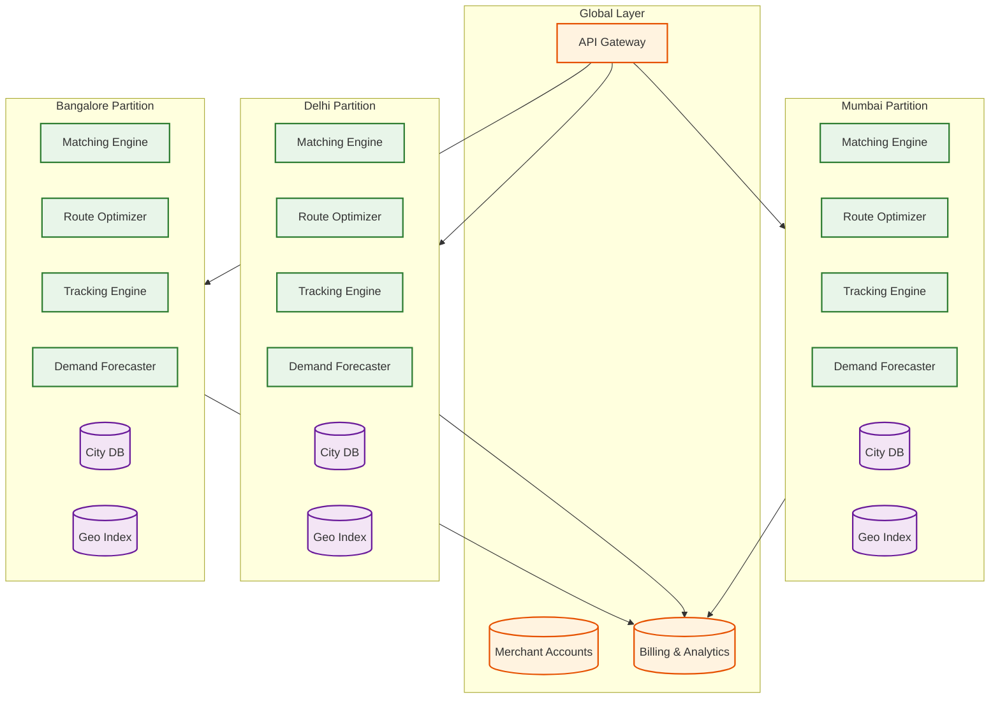

# 14.15 AI-Native Hyperlocal Logistics & Delivery Platform for SMEs — Scalability & Reliability

## Scaling Strategy

### Geo-Partitioned Architecture

The platform scales by treating each city as an independent processing partition. This is the natural scaling boundary because hyperlocal delivery is geographically bounded—no cross-city state is needed for real-time operations.



**Scaling characteristics**:
- Adding a new city is a deployment operation, not an architecture change
- Each city partition scales independently based on its order volume
- City-level failures are isolated—Mumbai outage does not affect Bangalore
- Platform-wide analytics aggregates asynchronously (5-15 min lag acceptable)

### Within-City Scaling

For large metros (Mumbai, Delhi) where single-partition processing hits limits, the system supports sub-city partitioning by zone clusters:

| Component | Scaling Mechanism | Trigger |
|---|---|---|
| **Location Ingestion** | Horizontal partitioning by rider_id hash | > 10,000 updates/sec per ingestion instance |
| **Matching Engine** | Zone-cluster partitioning (group of adjacent zones) | > 100 orders/sec in a single batch window |
| **Route Optimizer** | Worker pool with task queue; each optimization is independent | > 500 solver invocations/min |
| **Tracking Engine** | WebSocket connection sharding by order_id hash | > 50,000 concurrent tracking sessions |
| **Demand Forecaster** | Single instance per city (lightweight computation) | Not a bottleneck—runs every 15 min |
| **Geospatial Index** | Geohash-partitioned shards with read replicas | > 100,000 spatial queries/sec |

### Location Ingestion Scaling

The location pipeline is the highest-throughput component. Scaling strategy:

```
Tier 1: Ingestion Gateway (stateless, auto-scaled)
  - Receives GPS from rider apps
  - Validates, deduplicates, batches
  - Routes to correct city partition
  - Scale: 1 instance per 5,000 riders

Tier 2: Stream Processor (partitioned by rider_id)
  - Kalman filtering, map matching
  - Geofence evaluation
  - Writes to geospatial index and time-series store
  - Scale: 1 partition per 1,000 riders

Tier 3: Geospatial Index (in-memory, replicated)
  - Primary: receives writes from stream processor
  - Replicas: serve reads for matching and tracking
  - Scale: 1 replica per 20,000 concurrent read queries/sec
```

---

## Reliability Patterns

### Matching Engine Resilience

The matching engine is the single most critical component—if it fails, no new orders can be assigned. Reliability strategy:

**Active-passive redundancy**: Two matching engine instances per city. The active instance processes batch windows. The passive instance receives the same input stream and maintains shadow state. If the active fails, the passive promotes within 5 seconds (1 missed batch window).

**Degraded matching mode**: If both matching instances fail, the system falls back to greedy nearest-rider dispatch (no batching, no optimization). This produces 20% worse assignments but maintains service availability. Orders placed during degraded mode are flagged for potential rebate if delivery is significantly delayed.

**Matching timeout circuit breaker**: If a batch window's solver takes > 45 seconds (solver hung or thrashing), the circuit breaker triggers, returns the best solution found so far (construction heuristic without improvement phase), and alerts operations.

### Order Durability

Every confirmed order must be persisted before acknowledgment. The system uses a write-ahead pattern:

```
1. SME confirms order
2. Order Service writes to event log (synchronous, durable)
3. Event log acknowledged → confirmation returned to SME
4. Asynchronous: event consumed by matching engine, tracking engine, etc.
```

If the Order Service crashes after step 2 but before step 3, the event is in the log but the SME did not receive confirmation. On restart, the service replays uncommitted events, detects the unacknowledged order, and sends the confirmation. The SME may see a brief delay but the order is never lost.

### Location Pipeline Resilience

Location data is critical but inherently ephemeral—a 3-second-old GPS reading has no value for real-time matching. Reliability strategy:

**At-most-once delivery for real-time path**: The geospatial index receives location updates with at-most-once semantics. A missed update means the rider's position is 6 seconds stale instead of 3—acceptable for matching and tracking. No retry logic, no exactly-once overhead.

**At-least-once delivery for historical path**: The time-series store receives updates with at-least-once delivery via the stream processor. Duplicates are deduplicated by (rider_id, timestamp) composite key. Historical data must be complete for model training accuracy.

### Tracking Engine Availability

Tracking is the most user-visible system—customers watch the map constantly. Outages generate immediate support escalation. Strategy:

**Multi-tier fallback**:
1. Primary: WebSocket push from tracking engine (real-time, 3-second updates)
2. Fallback 1: Client polling via REST API every 5 seconds (if WebSocket connection drops)
3. Fallback 2: Cached last-known-position with interpolation (if tracking engine is down, serve from CDN-cached position with client-side dead-reckoning using last known speed and heading)

**Connection draining**: During deployments, new connections go to new instances while existing connections drain gracefully over 60 seconds. No tracking disruption during rolling updates.

---

## Disaster Recovery

### Failure Modes and Recovery

| Failure | Impact | Detection | Recovery | RTO |
|---|---|---|---|---|
| **Matching engine crash** | New orders queue up | Health check miss (5s) | Passive instance promotes | < 10 seconds |
| **Route optimizer overload** | Routes not re-optimized | Solver latency > 5s | Shed load, return best heuristic solution | Immediate |
| **Geospatial index corruption** | Stale rider positions | Position freshness alert | Rebuild from stream replay (last 60s) | < 30 seconds |
| **Order DB failure** | Cannot create/update orders | Connection error rate spike | Failover to read replica, promote to primary | < 60 seconds |
| **Time-series store failure** | No historical GPS data | Write error rate spike | Buffer in ingestion gateway (5 min ring buffer); replay on recovery | < 5 minutes |
| **City partition network split** | City completely offline | Cross-partition heartbeat miss | Rider apps cache last route; resume on reconnection | Depends on split duration |
| **Event stream failure** | No async processing | Consumer lag spike | Order Service falls back to synchronous calls to matching engine | Immediate (degraded) |

### Data Backup Strategy

| Data | Backup Frequency | Retention | Recovery Method |
|---|---|---|---|
| **Order database** | Continuous replication + hourly snapshots | 90 days (active), 2 years (archived) | Point-in-time recovery from replica |
| **Event log** | Continuous replication | 30 days (hot), 1 year (cold) | Replay from checkpoint |
| **GPS trail** | Daily export to cold storage | 90 days (hot), 1 year (cold for training) | Restore from cold storage |
| **POD artifacts** | Cross-region replication | 180 days | Restore from secondary region |
| **ML models** | Versioned in model registry | All versions retained | Roll back to previous model version |
| **Road network graph** | Hourly snapshot | 7 days | Rebuild from latest snapshot |

---

## Load Management

### Traffic Shaping

| Mechanism | Trigger | Action |
|---|---|---|
| **Order rate limiting** | > 50 orders/sec from single merchant | Queue excess, process at capped rate |
| **Tracking poll throttling** | > 2 polls/sec from single client | Increase poll interval to 10s |
| **Location update throttling** | Network congestion detected | Increase rider report interval to 5s |
| **Solver time budget reduction** | Queue depth > 100 pending optimizations | Reduce ALNS time budget from 2s to 500ms |
| **Batch window expansion** | Matching latency > 40s at p95 | Expand batch window from 30s to 45s |

### Graceful Degradation Hierarchy

```
LEVEL 0: Full Operation
  All AI models active, full optimization, real-time tracking

LEVEL 1: Optimization Degradation
  Route optimizer: heuristic only (no ALNS improvement phase)
  Demand forecaster: use yesterday's pattern instead of real-time model
  Matching: reduce candidate pool from 50 to 20 riders

LEVEL 2: Matching Degradation
  Switch from batch matching to greedy dispatch
  Disable batching (single-order assignments only)
  Fixed pricing (disable surge computation)

LEVEL 3: Core-Only Mode
  Order creation and rider assignment only
  Tracking: last-known position (no real-time updates)
  No route optimization (rider uses own navigation)
  SMS-only notifications (disable push and WebSocket)
```

---

## Capacity Planning

### Growth Model

| Metric | Year 1 | Year 2 | Year 3 |
|---|---|---|---|
| Cities | 5 | 15 | 30 |
| Daily orders (total) | 500K | 3M | 10M |
| Peak orders/second | 50 | 300 | 1,000 |
| Active riders (peak) | 15K | 80K | 250K |
| Location updates/sec | 5K | 27K | 83K |
| Tracking sessions (concurrent) | 25K | 150K | 500K |
| Storage (monthly) | 5 TB | 30 TB | 100 TB |

### Scaling Triggers

| Component | Current Capacity | Scale Trigger | Scale Action |
|---|---|---|---|
| **Ingestion Gateway** | 10K updates/sec | CPU > 60% sustained | Add instance (auto-scale) |
| **Matching Engine** | 200 orders/batch | Batch solve time > 20s | Partition city into zone clusters |
| **Geospatial Index** | 50K queries/sec | Read latency p99 > 5ms | Add read replica |
| **Order Database** | 100 writes/sec | Write latency p99 > 50ms | Vertical scale, then horizontal shard by date |
| **Tracking WebSockets** | 25K connections/instance | Memory > 70% | Add instance, rebalance connections |
