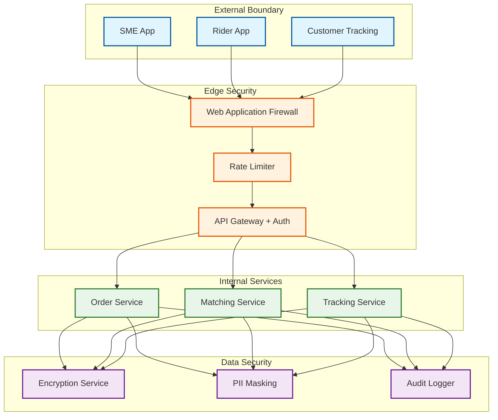

# 14.15 AI-Native Hyperlocal Logistics & Delivery Platform for SMEs — Security & Compliance

## Threat Model

### Attack Surface

| Surface | Threats | Impact |
|---|---|---|
| **Rider App** | GPS spoofing (fake location to claim deliveries), account takeover, fake proof-of-delivery | Fraudulent deliveries, lost packages, inflated earnings |
| **SME App / API** | Order injection (fake orders to manipulate pricing), credential stuffing, scraping rider fleet data | Pricing manipulation, data theft, competitive intelligence |
| **Customer Tracking** | Tracking link enumeration (guessing order IDs to stalk riders), session hijacking | Rider safety, privacy violation |
| **Location Pipeline** | Man-in-the-middle on GPS stream, replay attacks (resubmitting old locations) | Stale tracking, incorrect matching, fraudulent route claims |
| **Payment Flow** | Fare manipulation (exploiting surge pricing transitions), refund fraud, rider payout manipulation | Financial loss, trust erosion |
| **Internal Systems** | Insider threat (support agents accessing rider/customer data), model poisoning (injecting training data to bias matching) | Privacy breach, biased algorithms |

---

## Authentication and Authorization

### Multi-Tier Access Control

```
TIER 1: Public (no auth)
  - Service area check (is this address serviceable?)
  - Price estimate (non-binding, no user context)

TIER 2: Authenticated SME
  - Order creation, confirmation, cancellation
  - Own order tracking and history
  - Analytics dashboard (own data only)
  - API key management for integrations

TIER 3: Authenticated Rider
  - Dispatch acceptance/rejection
  - Location reporting
  - POD submission
  - Earnings and payout history

TIER 4: Authenticated Customer (via tracking link)
  - Track specific order (token-scoped to single order)
  - Rate delivery
  - No PII exposure (rider first name + masked phone only)

TIER 5: Internal Operations
  - Cross-merchant order visibility
  - Rider performance dashboards
  - Manual dispatch override
  - Pricing rule configuration
  - Audit-logged, role-based, time-bounded access

TIER 6: Platform Admin
  - City configuration, zone management
  - ML model deployment
  - Financial reconciliation
  - Full audit log access
```

### Tracking Link Security

Customer tracking links must balance convenience (no login required) with security (cannot enumerate orders or stalk riders).

**Design**: Tracking URLs contain a cryptographically random token (128-bit), not the order ID. The token is generated at order creation, sent to the customer via SMS/WhatsApp, and maps to the order in a lookup table. Token properties:
- Non-guessable: 128 bits of entropy; brute-force enumeration infeasible
- Time-scoped: token expires 2 hours after delivery completion
- Rate-limited: > 10 requests/minute from same IP triggers CAPTCHA
- Information-limited: returns rider first name (no last name), masked phone (last 4 digits), approximate position (snapped to nearest 100m grid, not exact GPS)

---

## Data Privacy

### PII Classification and Handling

| Data Element | Classification | Storage | Access | Retention |
|---|---|---|---|---|
| **Customer phone number** | Sensitive PII | Encrypted at rest (AES-256) | Masked in UI; full number only for active delivery SMS/call | Deleted 30 days after delivery |
| **Customer address** | Sensitive PII | Encrypted at rest | Full address to assigned rider only during active delivery; geocoded coordinates (not address text) for analytics | Address text: 90 days; geocodes: 1 year |
| **Rider GPS trail** | Sensitive PII | Encrypted at rest | Real-time: matching and tracking engines; Historical: anonymized for model training after 7 days | Raw: 90 days; anonymized: 1 year |
| **Rider photo and ID** | Sensitive PII | Encrypted, separate storage | Onboarding verification only; not accessible to merchants or customers | Duration of rider account + 1 year |
| **SME business address** | Business data | Standard encryption | Public (used in tracking UI as pickup location) | Account lifetime |
| **Order contents description** | Business data | Standard encryption | Rider (during delivery), SME (always) | 1 year |
| **POD photos** | Evidence | Encrypted, immutable storage | SME, support agents (for disputes); auto-deleted after retention | 180 days |

### Phone Number Masking

Riders and customers communicate during active deliveries without exposing phone numbers:

```
WHEN rider needs to contact customer:
  1. Rider taps "Call Customer" in app
  2. App calls platform's virtual number service
  3. Service routes call to customer's actual number
  4. Caller ID shows platform's number, not rider's
  5. Call recording stored for dispute resolution (30 days)
  6. Virtual number recycled after delivery completes

WHEN customer needs to contact rider:
  Same flow via tracking page "Call Rider" button
```

### Location Data Anonymization for Model Training

Rider GPS trails are valuable for training ETA and speed profile models but contain sensitive movement patterns. Anonymization pipeline:

1. **Temporal aggregation**: Individual GPS points aggregated into road-segment-level speed observations (segment_id, speed, time_of_day). Individual rider identity removed.
2. **K-anonymity**: Speed observations only retained for road segments with ≥ 5 distinct riders in the time window. Segments with fewer riders (rural roads, late night) are excluded to prevent re-identification.
3. **Differential privacy**: Gaussian noise (calibrated to privacy budget ε = 1.0) added to speed aggregates before model training. Ensures no individual rider's specific route can be reconstructed from the trained model.

---

## Rider Safety

### Real-Time Safety Monitoring

```
SAFETY SIGNALS MONITORED:
  1. Prolonged stop in unusual location
     - Rider stationary > 10 min outside pickup/dropoff geofence
     - Action: Send "Are you OK?" push notification
     - Escalation: If no response in 5 min, alert operations

  2. Route deviation
     - Rider deviates > 500m from planned route for > 3 minutes
     - Action: Log deviation, check for known road closures
     - Escalation: If no known cause, trigger safety check

  3. Speed anomaly
     - Rider speed > 80 km/h (bikes) or sudden deceleration pattern
     - Action: Alert operations, potential accident detection
     - Escalation: Contact rider, then emergency services if unresponsive

  4. Late-night deliveries
     - Deliveries between 10 PM and 6 AM
     - Action: Auto-share rider trip with emergency contact
     - Continuous monitoring with lower anomaly thresholds

  5. SOS trigger
     - Rider activates panic button in app
     - Action: Immediately share live location with emergency contacts
       and platform safety team; record audio for 5 minutes
```

### Rider Identity Verification

- **At onboarding**: Government ID verification, photo match, background check, vehicle registration verification
- **Daily login**: Face match against onboarding photo (anti-account-sharing measure)
- **Random spot checks**: Periodic re-verification during active shifts (face match prompt at random intervals)
- **Device binding**: Rider account bound to specific device; device change requires re-verification

---

## Fraud Prevention

### GPS Spoofing Detection

Riders may spoof GPS to claim deliveries without actually performing them. Detection layers:

1. **Consistency checks**: GPS speed vs. accelerometer data from phone. A rider "moving" at 30 km/h but with zero accelerometer activity is likely spoofing.
2. **Cell tower triangulation**: Compare GPS coordinates with approximate position from cell tower data. Significant discrepancy flags spoofing.
3. **Photo geolocation**: POD photos contain EXIF GPS data (from a separate sensor path than navigation GPS). Mismatch between POD photo GPS and reported rider GPS indicates spoofing.
4. **Pattern analysis**: Riders completing deliveries significantly faster than the road-network minimum travel time, or completing deliveries during hours their phone's battery sensor shows the device as stationary.

### Order Injection and Price Manipulation

Attackers might create fake orders during low-demand periods, then cancel them as real orders arrive during induced-surge pricing. Detection:

- Order creation rate limits per merchant (50/hour)
- Cancellation pattern monitoring: merchants with > 30% cancellation rate flagged for review
- Surge pricing computation ignores orders from accounts with high cancellation history
- Price lock: once an order receives a price estimate, the price is locked for 5 minutes regardless of surge changes

---

## Gig Worker Regulatory Compliance

### Earnings Transparency

- Riders see per-delivery earnings breakdown before accepting: base pay, distance bonus, surge bonus, batch bonus, tip
- Weekly earnings summary with comparison to minimum wage equivalent
- No algorithmic penalties for order rejection (rejection affects matching priority slightly but does not reduce base pay)

### Working Hours Monitoring

- Platform tracks cumulative active hours per day and per week
- Mandatory 30-minute break nudge after 4 continuous hours
- Hard cap: rider app disables dispatch after 12 hours in a 24-hour period
- Weekly hour visibility for riders and regulatory reporting

### Insurance and Benefits

- Per-delivery accident insurance automatically active during delivery window (from pickup acceptance to delivery completion)
- Coverage includes medical expenses, vehicle damage, and third-party liability
- Insurance activation and deactivation triggered automatically by order lifecycle events (no rider action needed)

---

## Compliance Matrix

| Regulation | Applicability | Implementation |
|---|---|---|
| **Data Protection Laws** | Customer and rider PII | Encryption at rest and in transit; purpose limitation; data minimization; deletion schedules; consent management |
| **Gig Worker Laws** | Rider classification, earnings, hours | Earnings transparency; hour tracking; no hidden penalties; insurance; benefits information |
| **Geolocation Privacy** | Rider GPS tracking | Clear consent at onboarding; location collected only during active shifts; anonymization for analytics; rider can see their own data |
| **Consumer Protection** | SME delivery promises | Clear pricing before confirmation; ETA accuracy monitoring; refund policy for failures; complaint resolution SLA |
| **Vehicle and Road Safety** | Rider vehicles, speed | Vehicle registration verification; speed monitoring; accident detection; mandatory safety training |
| **Financial Compliance** | Rider payouts, merchant billing | KYC for merchant onboarding; rider identity verification; transaction audit trail; tax reporting support |
| **Accessibility** | App and tracking UI | Screen reader support; high-contrast mode; voice-guided navigation for riders; multilingual support |

---

## Security Architecture


