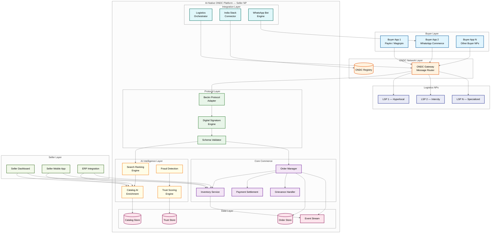
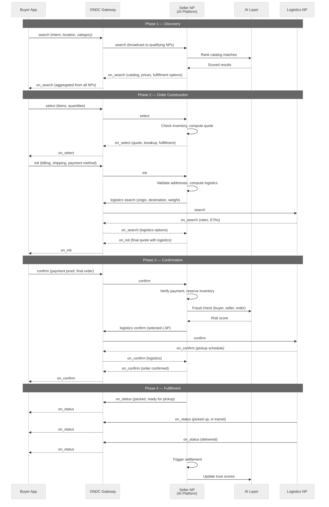
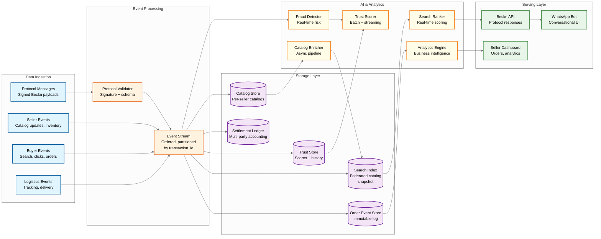

# 14.16 AI-Native ONDC Commerce Platform — High-Level Design

## System Context

The ONDC commerce platform operates as a network participant (NP) within the broader ONDC ecosystem. Unlike a monolithic e-commerce system, the platform must interoperate with independent buyer apps, seller apps, logistics providers, and payment gateways through the Beckn protocol. The high-level design reflects this federated architecture: the system is a protocol-speaking node that adds AI intelligence at every layer while maintaining full interoperability with other NPs.

---

## Network Topology

---

## Beckn Transaction Lifecycle Flow

---

## Key Design Decisions

### Decision 1: Protocol Adapter as the Single Entry/Exit Point

**Context:** Every interaction with the ONDC network happens via Beckn protocol messages. The system could either (a) distribute protocol handling across services (each service speaks Beckn directly) or (b) centralize protocol handling in a dedicated adapter that translates between Beckn and internal representations.

**Decision:** Centralized protocol adapter. All inbound Beckn messages enter through a single protocol adapter that validates signatures, checks schema compliance, deserializes the Beckn payload into internal domain objects, and routes to the appropriate internal service. All outbound messages pass through the same adapter for signing, schema validation, and serialization.

**Rationale:** (1) Digital signature verification and schema validation are cross-cutting concerns that should not be duplicated across services. (2) Protocol version changes (ONDC releases new schema versions monthly) require updates in one place rather than across every service. (3) The adapter provides a natural point for protocol compliance monitoring and audit logging. (4) Internal services can evolve independently of protocol changes—the adapter handles translation.

**Trade-off:** The adapter is a potential bottleneck and single point of failure. Mitigated by deploying it as a stateless, horizontally scalable service behind a load balancer with health-check-based routing.

### Decision 2: Catalog Snapshot Index for Search (Not Pure Protocol Fan-out)

**Context:** The Beckn protocol's search model broadcasts the search intent to all qualifying NPs, each of which returns matching catalog items. Pure fan-out search means the buyer app waits for all NPs to respond (or timeout), making latency dependent on the slowest NP. ONDC's gateway already performs this fan-out for the full network.

**Decision:** Maintain a local catalog snapshot index (refreshed every 4 hours and incrementally updated via catalog change events) for approximate search. Use this index for initial ranking and relevance scoring. When operating as a buyer NP, issue the Beckn search via the gateway but augment responses with pre-indexed relevance signals.

**Rationale:** (1) Pure fan-out search with 100+ seller NPs produces 2-5 second latencies for every search, which is unacceptable for the browsing UX. (2) Pre-indexing allows semantic search capabilities (cross-lingual matching, fuzzy matching, category inference from natural language) that pure fan-out cannot provide. (3) The index is supplementary, not authoritative—actual prices, availability, and fulfillment options are always confirmed via the live protocol flow (select/on_select).

**Trade-off:** Index staleness means some search results may show outdated prices or out-of-stock items. Mitigated by (1) showing "price may vary" indicators for items not refreshed in the last hour, (2) real-time validation during the select step, and (3) user education that prices are confirmed at checkout.

### Decision 3: Event-Sourced Order State with Protocol Message Log

**Context:** Order state must survive across multiple asynchronous protocol exchanges between independent NPs. Each protocol message (confirm, on_confirm, on_status, etc.) represents a state transition authored by a different entity.

**Decision:** Event-source the order state from signed Beckn protocol messages. Each inbound/outbound protocol message is stored as an immutable event. The current order state is derived by replaying the event log. Materialized views for querying are maintained as projections updated by event consumers.

**Rationale:** (1) The signed protocol message log is the source of truth for disputes—storing it as the event source eliminates the risk of order state diverging from the protocol record. (2) Replay capability enables debugging and auditing. (3) Different consumers can build different projections (buyer-facing order status, seller-facing fulfillment queue, settlement engine's financial view) from the same event stream. (4) Protocol messages already represent state transitions by design (on_confirm = confirmed, on_status with fulfillment state = shipped/delivered).

### Decision 4: Trust Scoring as a Separate Analytical Service

**Context:** Trust scores influence search ranking, logistics partner selection, payment risk assessment, and dispute resolution. The scoring system could be embedded in each consuming service or operated as a centralized service.

**Decision:** Centralized trust scoring service that computes and caches trust scores, exposes them via internal API, and publishes score change events. Consuming services (search ranking, fraud detection, logistics selection) read cached scores rather than computing their own.

**Rationale:** (1) Trust scores are derived from cross-cutting signals (fulfillment, payment, grievance, protocol compliance) that no single service owns. (2) Centralized computation ensures consistency—the search ranker and fraud detector use the same trust score for a given seller. (3) The scoring algorithm can evolve independently of consumers. (4) Trust scores are expensive to compute (require aggregating historical transaction data across multiple NPs) and should be computed once and cached.

### Decision 5: WhatsApp as a Protocol-Compliant Buyer App

**Context:** WhatsApp integration could be implemented as (a) a notification/communication channel (send order updates, respond to queries) or (b) a full buyer app that conducts transactions via Beckn protocol.

**Decision:** WhatsApp operates as a full Beckn-compliant buyer app. The WhatsApp bot engine translates conversational interactions into Beckn protocol flows: natural language queries → search API calls, product selection via interactive buttons → select/init calls, payment via UPI links → confirm calls. The bot maintains session state mapping WhatsApp conversation threads to Beckn transaction contexts.

**Rationale:** (1) Making WhatsApp a full buyer app means orders placed via WhatsApp are first-class ONDC transactions with the same guarantees (digital signatures, settlement, grievance redressal) as any other buyer app. (2) Sellers see WhatsApp orders in the same flow as orders from other buyer apps—no special handling. (3) The conversational interface serves Tier 2/3 city users and the 500M+ WhatsApp users in India who may never install a dedicated buyer app.

---

## Data Flow Architecture

---

## Cross-Cutting Concerns

### Digital Signature Pipeline

Every outbound Beckn message passes through the signature pipeline:

1. **Serialize** — Canonicalize the message body (sorted keys, consistent encoding)
2. **Hash** — Compute digest of the canonical body
3. **Sign** — Sign the digest with the NP's private key (registered in ONDC registry)
4. **Attach** — Add signature header per Beckn authorization specification
5. **Log** — Store the signed message in the immutable protocol message log

Every inbound message passes through verification:

1. **Extract** — Parse signature header from the request
2. **Lookup** — Fetch the sender NP's public key from ONDC registry (cached with TTL)
3. **Verify** — Verify the signature against the message body
4. **Reject/Accept** — Drop messages with invalid signatures; log verification failure as a protocol compliance event

### Protocol Version Management

ONDC releases minor protocol updates (~monthly) and major versions (~quarterly). The platform handles version differences through:

1. **Version negotiation** — Declare supported versions in registry; negotiate during first exchange
2. **Multi-version adapter** — Protocol adapter maintains serializers/deserializers for current and N-1 major versions
3. **Schema migration** — When a new version adds required fields, the adapter auto-populates defaults for backward compatibility
4. **Deprecation alerts** — Monitor for NPs using deprecated protocol features; alert platform operators when sunset dates approach
