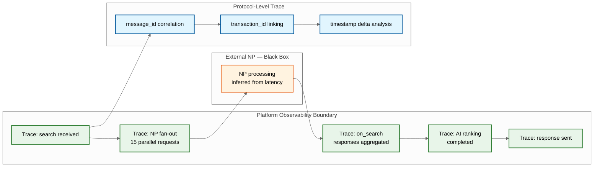

# 14.16 AI-Native ONDC Commerce Platform — Observability

## Observability Challenges in a Federated System

Unlike monolithic systems where a single distributed tracing system captures the full request lifecycle, ONDC transactions span multiple independent organizations, each with their own infrastructure, logging, and monitoring. The platform can only observe its own portion of the transaction; the rest must be inferred from protocol messages. This creates unique observability challenges:

1. **Partial visibility** — The platform sees its own internal processing but not the seller NP's or logistics NP's internal handling.
2. **Asynchronous gaps** — Between sending a Beckn request and receiving the callback, the transaction is in a "black box" owned by another NP.
3. **Cross-NP correlation** — A single buyer's order may involve messages to/from 3-4 independent NPs; correlating these requires `transaction_id` as the global trace identifier.

---

## Distributed Tracing Architecture

### Cross-Network Transaction Tracing



### Trace Structure

```
TransactionTrace:
  trace_id:           string          # Platform-internal trace ID
  transaction_id:     string          # Beckn transaction_id (cross-NP correlation)

  spans:
    span_1:
      name:           "beckn.search.receive"
      timestamp:      ISO8601
      duration_ms:    15
      attributes:
        domain:       "ONDC:RET10"
        city:         "std:080"
        query:        "organic rice 5kg"
        buyer_np:     "buyer-app-xyz"

    span_2:
      name:           "beckn.search.fanout"
      timestamp:      ISO8601
      duration_ms:    1200
      attributes:
        np_count:     18            # Number of NPs queried
        responded:    15            # Number that responded within timeout
        timed_out:    3             # Number that timed out
        fastest_np:   "seller-np-a" # 120ms
        slowest_np:   "seller-np-q" # 1180ms
        total_items:  342           # Total catalog items received

    span_3:
      name:           "ai.search.ranking"
      timestamp:      ISO8601
      duration_ms:    180
      attributes:
        input_items:  342
        output_items: 20            # Page size
        model_version: "v2.3"
        cross_lingual: true
        query_language: "hi"

    span_4:
      name:           "beckn.on_search.send"
      timestamp:      ISO8601
      duration_ms:    25
      attributes:
        result_count: 20
        response_size_bytes: 45000

  # Cross-NP correlation metadata
  protocol_timeline:
    search_sent:      "2026-03-10T14:30:00.000Z"
    on_search_received: "2026-03-10T14:30:01.200Z"
    # External NP processing time inferred: 1200ms - our processing time
```

---

## Key Metrics

### Protocol Health Metrics

| Metric | Description | Alert Threshold |
|---|---|---|
| `beckn.message.throughput` | Beckn messages processed per second (by action type) | Drop > 30% from rolling 1-hour average |
| `beckn.message.latency.p95` | Processing latency per message type (ms) | > 200ms for any action type |
| `beckn.signature.verification.failure_rate` | % of inbound messages failing signature verification | > 1% over 5-minute window |
| `beckn.schema.validation.failure_rate` | % of messages failing schema validation | > 5% over 5-minute window |
| `beckn.callback.missing_rate` | % of sent requests that never received a callback | > 2% over 15-minute window |
| `beckn.callback.timeout_rate` | % of callbacks received after TTL expiry | > 5% over 15-minute window |
| `beckn.np.response_latency.p95` | Per-NP callback response latency (ms) | > 2000ms for any NP over 1-hour window |

### Transaction Metrics

| Metric | Description | Alert Threshold |
|---|---|---|
| `order.creation_rate` | Orders confirmed per minute | Drop > 40% from same hour previous week |
| `order.completion_rate` | Orders reaching DELIVERED / total CONFIRMED | < 85% over 24-hour window |
| `order.cancellation_rate` | Seller-initiated cancellations / total CONFIRMED | > 10% over 24-hour window |
| `order.e2e_latency.p95` | Time from search to order confirmation (seconds) | > 30s (indicates protocol delays) |
| `search.result_count.avg` | Average number of results returned per search | < 5 (indicates index or NP issues) |
| `search.zero_result_rate` | % of searches returning zero results | > 15% |
| `payment.success_rate` | Successful payments / attempted payments | < 95% over 5-minute window |
| `settlement.discrepancy_rate` | % of orders with settlement amount mismatches | > 0.1% over daily batch |

### AI Pipeline Metrics

| Metric | Description | Alert Threshold |
|---|---|---|
| `ai.catalog.enrichment_latency.p95` | Time to enrich a single catalog item (ms) | > 5000ms |
| `ai.catalog.category_accuracy` | % of items correctly mapped to ONDC taxonomy | < 90% over daily batch |
| `ai.search.ranking_latency.p95` | Time to rank search results (ms) | > 200ms |
| `ai.trust.computation_duration` | Time for full network trust score recomputation | > 30 minutes |
| `ai.fraud.detection_latency.p95` | Time to compute fraud risk score for an order | > 500ms |
| `ai.whatsapp.intent_accuracy` | % of WhatsApp queries correctly mapped to search intent | < 75% |

### NP Performance Scoreboard

```
NPPerformanceDashboard:

  Computed every 15 minutes for each active NP:

  np_metrics:
    np_id:                  string
    message_throughput:     float   # Messages/sec handled
    avg_response_latency:   float   # ms
    p95_response_latency:   float   # ms
    timeout_rate:           float   # % of requests timing out
    schema_error_rate:      float   # % of messages with schema violations
    callback_missing_rate:  float   # % of requests with no callback
    order_completion_rate:  float   # % of confirmed orders reaching delivered
    trust_score:            float   # Composite trust score
    protocol_version:       string  # Current protocol version

  Display:
    - Sorted by composite health score (descending)
    - Color coding: Green (healthy), Yellow (degraded), Red (critical)
    - Trend arrows: Improving ↑, Stable →, Degrading ↓
    - Drill-down: Click NP to see per-action-type latency breakdown
```

---

## Logging Strategy

### Structured Log Format

```
LogFormat:
  timestamp:          ISO8601 (nanosecond precision)
  level:              INFO | WARN | ERROR | CRITICAL
  service:            string          # "protocol-adapter", "search-ranker", "order-manager"
  trace_id:           string          # Platform trace ID
  transaction_id:     string          # Beckn transaction ID
  message_id:         string          # Beckn message ID (nullable)
  np_id:              string          # Counterparty NP ID (nullable)
  action:             string          # Beckn action (search, select, etc.)
  event:              string          # Specific event name
  duration_ms:        integer         # Operation duration (nullable)
  attributes:         Map<string, string>  # Event-specific key-value pairs
  error:              ErrorInfo       # { code, message, stack_trace } (nullable)

  # PII masking rules applied at log emission:
  # - Phone numbers: "98XXXX4321"
  # - Email: "r***@gmail.com"
  # - Aadhaar: NEVER logged
  # - Address: Only city/pincode logged, not full address
  # - Names: Logged only in SENSITIVE-tagged services (identity verification)
```

### Log Categories and Retention

| Category | Examples | Retention | Volume |
|---|---|---|---|
| **Protocol messages** | Signed Beckn message bodies (request + callback) | 7 years (regulatory) | ~24 TB/year |
| **Transaction logs** | Order state transitions, payment events | 3 years | ~5 TB/year |
| **Application logs** | Service-level events, errors, debug info | 90 days | ~10 TB/year |
| **Access logs** | API calls to seller dashboard, admin panel | 1 year | ~2 TB/year |
| **AI pipeline logs** | Model predictions, enrichment results, ranking scores | 180 days | ~3 TB/year |
| **Security logs** | Auth failures, signature verification, rate limit events | 2 years | ~1 TB/year |

---

## Alerting Framework

### Alert Severity Levels

```
AlertSeverityDefinition:

  P1 — CRITICAL (Pager, immediate response):
    - Payment processing availability < 99% for > 2 minutes
    - Protocol message delivery failure rate > 5% for > 5 minutes
    - ONDC gateway connectivity lost for > 1 minute
    - Data breach indicator triggered (bulk PII access, unauthorized export)
    Response SLA: Acknowledge within 5 minutes, mitigate within 30 minutes

  P2 — HIGH (Pager during business hours, notification off-hours):
    - Search latency p95 > 3 seconds for > 10 minutes
    - Order completion rate < 80% for > 1 hour
    - Settlement reconciliation discrepancy > 0.5% in daily batch
    - Any NP with trust score < 20 still active in the network
    Response SLA: Acknowledge within 15 minutes, mitigate within 2 hours

  P3 — MEDIUM (Notification only):
    - AI pipeline degradation (catalog enrichment latency > 10s, ranking model fallback)
    - WhatsApp bot error rate > 5% for > 30 minutes
    - Event stream consumer lag > 30 minutes
    - Individual NP timeout rate > 30% for > 1 hour
    Response SLA: Investigate within 4 hours, resolve within 24 hours

  P4 — LOW (Dashboard only):
    - Search index freshness > 6 hours for any domain partition
    - Trust score computation taking > 45 minutes
    - Protocol version deprecation warnings
    - Storage utilization > 70% on any tier
    Response SLA: Address within 1 business week
```

### Anomaly Detection

```
AnomalyDetectionRules:

  Rule 1: Order Volume Anomaly
    baseline: Rolling 7-day same-hour average
    detection: Current hour volume deviates > 3 standard deviations from baseline
    action: Alert P3 if decrease (potential system issue); P4 if increase (potential sale/organic growth)
    exception: Pre-registered sale events exempt from increase alerts

  Rule 2: NP Behavior Change
    baseline: Per-NP 30-day rolling metrics (latency, error rate, completion rate)
    detection: Any metric moves > 2 standard deviations from baseline
    action: Alert P3; auto-adjust trust score if degradation sustained > 4 hours

  Rule 3: Payment Success Rate Shift
    baseline: Per-gateway 1-hour rolling success rate
    detection: Success rate drops > 5 percentage points from baseline
    action: Alert P1; trigger canary payment verification; prepare gateway failover

  Rule 4: Catalog Poisoning Detection
    baseline: Per-seller catalog change frequency (monthly average)
    detection: Seller makes > 10× their average catalog changes in a day
    action: Alert P3; queue catalog changes for review; temporarily serve cached catalog version

  Rule 5: Cross-NP Latency Spike
    baseline: Per-NP-pair communication latency (our platform ↔ each NP)
    detection: Latency to a specific NP increases > 3× from 1-hour baseline
    action: Alert P3; increase timeout for that NP; reduce NP's search fan-out priority
```

---

## Health Check System

```
HealthCheckConfiguration:

  Internal Health Checks (every 10 seconds):
    protocol_adapter:
      check: Process Beckn NOOP message end-to-end
      healthy_threshold: < 100ms
      unhealthy_action: Remove from load balancer pool

    search_index:
      check: Execute known query against each domain partition
      healthy_threshold: Results returned in < 500ms
      unhealthy_action: Failover to replica; alert for rebuild

    order_database:
      check: Read/write test record
      healthy_threshold: < 50ms
      unhealthy_action: Failover to replica

    event_stream:
      check: Produce and consume test event
      healthy_threshold: < 200ms round-trip
      unhealthy_action: Alert P1; activate synchronous bypass for critical paths

  External Health Checks (every 60 seconds):
    ondc_gateway:
      check: HTTPS GET to gateway health endpoint
      healthy_threshold: HTTP 200 in < 2 seconds
      unhealthy_action: Alert P1; queue outbound messages for retry

    payment_gateways:
      check: ₹1 canary payment (immediate refund)
      healthy_threshold: Payment success in < 5 seconds
      unhealthy_action: Alert P1; route traffic to healthy gateway

    aadhaar_ekyc_provider:
      check: Test OTP request (sandbox mode)
      healthy_threshold: Response in < 3 seconds
      unhealthy_action: Alert P3; suspend new seller onboarding; queue requests

  Status Page:
    public_facing: Overall ONDC integration status (operational/degraded/outage)
    seller_facing: Detailed per-service status (orders, catalog, payments, logistics)
    internal: Full component-level dashboard with real-time metrics
```
