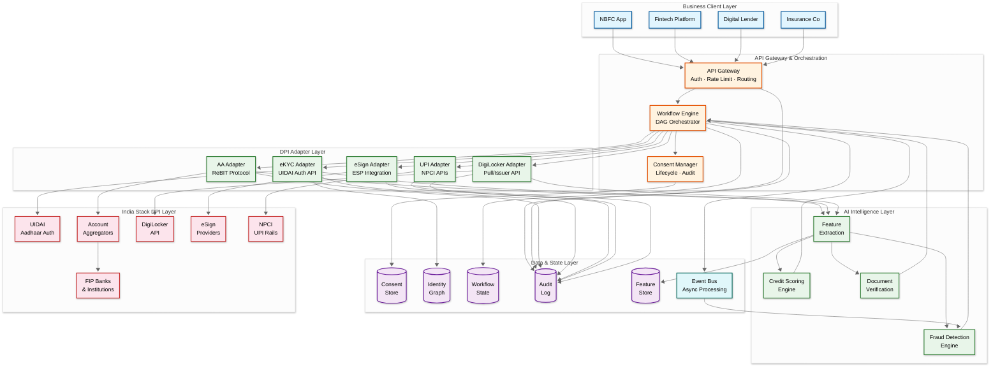

# High-Level Design — AI-Native India Stack Integration Platform

## System Context

The AI-Native India Stack Integration Platform operates as an intelligent middleware between business clients (NBFCs, fintechs, banks, digital lenders) and India's Digital Public Infrastructure. Business clients interact through a unified REST API, shielded from the complexity of individual DPI integrations. Internally, the platform orchestrates consent flows, manages data pipelines through DPI adapters, runs AI models on fetched data, and maintains regulatory audit trails. The system must handle the fundamental asymmetry that its upstream dependencies (UIDAI, NPCI, DigiLocker, AAs, FIPs) have different availability characteristics, authentication mechanisms, data formats, and regulatory requirements—while presenting a consistent, reliable, and auditable interface to downstream business clients.

---

## Architecture Diagram



---

## Component Descriptions

### 1. API Gateway

**Purpose:** Single entry point for all business client interactions with the platform.

**Key Responsibilities:**
- Authenticate business clients via API keys and mTLS certificates
- Enforce per-tenant rate limits (prevent a single client from exhausting DPI quotas)
- Route requests to the appropriate workflow or direct DPI adapter
- Transform between the platform's unified API schema and internal service schemas
- Provide sandbox mode with mock DPI responses for integration testing
- Meter API usage for billing (per-eKYC, per-AA-fetch, per-eSign pricing)

### 2. Workflow Engine

**Purpose:** Orchestrate multi-step India Stack workflows as configurable directed acyclic graphs (DAGs).

**Key Responsibilities:**
- Define workflow templates for common business processes (loan origination, MSME onboarding, insurance underwriting)
- Execute workflow steps with dependency management (eKYC must complete before AA consent can be created)
- Manage workflow state with saga-pattern compensation (if step N fails, compensate steps 1..N-1)
- Support pause/resume at consent gates (workflow pauses while waiting for user to approve AA consent)
- Handle timeout and expiry of intermediate results (eKYC result valid for 30 minutes, AA data valid for consent duration)
- Emit workflow events to the event bus for async processing (fraud detection, analytics)

### 3. Consent Manager

**Purpose:** Manage the full lifecycle of consents across all DPI components with regulatory compliance.

**Key Responsibilities:**
- Create and track AA consent artefacts per ReBIT specifications (ConsentMode, fetchType, FIDataRange, DataLife, Frequency)
- Map between platform-level "business consent" (user authorizes loan assessment) and DPI-level technical consents (AA consent for bank data, DigiLocker consent for GST certificate)
- Track consent state machine: PENDING → APPROVED → ACTIVE → PAUSED → REVOKED → EXPIRED
- Enforce consent scope validation: ensure data fetches stay within consented parameters
- Generate consent audit trail for regulatory inspection
- Handle consent revocation cascading: when user revokes AA consent, trigger data deletion for all downstream derived data

### 4. DPI Adapter Layer (AA, eKYC, DigiLocker, eSign, UPI)

**Purpose:** Encapsulate the specific protocol, encryption, and error semantics of each India Stack component.

**Key Responsibilities per Adapter:**

| Adapter | Protocol | Encryption | Key Challenge |
|---|---|---|---|
| **AA Adapter** | ReBIT REST API via licensed AA entities | Curve25519 DH key exchange; AES-256 for FIData encryption | FIP responsiveness variance (2-90 seconds); must handle per-FIP timeout tuning |
| **eKYC Adapter** | UIDAI Auth/eKYC XML API | 2048-bit RSA session key; AES-256 for PID block | OTP delivery latency (2-30 seconds); biometric device compatibility; must never store raw biometric data |
| **DigiLocker Adapter** | REST Pull API + Issuer API via API Setu | HTTPS with OAuth 2.0 tokens | Issuer availability varies; document format varies (XML vs PDF); must validate digital signatures |
| **eSign Adapter** | ESP REST API (CDAC or licensed ESP) | Document hash signing with PKI certificates | Per-signature Aadhaar OTP required; must handle signing certificate embedding in PDF |
| **UPI Adapter** | NPCI UPI API via sponsoring bank | HTTPS with digital certificate-based auth | Callback-driven (async payment confirmation); must handle timeout vs. pending vs. declined states |

### 5. AI Intelligence Layer

**Purpose:** Transform raw DPI data into actionable business intelligence.

**Key Responsibilities:**
- **Feature Extraction:** Parse AA bank statement data into 200+ features (income regularity index, expense volatility, GST filing correlation, EMI discipline score, seasonal patterns)
- **Credit Scoring:** Run gradient-boosted models on extracted features to produce MSME credit scores; generate SHAP-based explanations for regulatory compliance
- **Fraud Detection:** Cross-DPI anomaly detection (synthetic identity detection, consent stuffing detection, velocity attack identification, device fingerprint clustering)
- **Document Verification:** AI-based validation of DigiLocker documents (OCR extraction, cross-referencing with eKYC data, detecting tampered uploads for non-DigiLocker documents)

### 6. Data & State Layer

**Purpose:** Persist consent state, identity graphs, workflow state, and audit logs with appropriate durability and retention policies.

**Key Responsibilities:**
- **Consent Store:** Strongly consistent storage for consent artefacts with full lifecycle tracking; replicated across 3 AZs; encrypted at rest
- **Identity Graph:** Cross-DPI identity resolution with graph-based storage; links Aadhaar, AA identifiers, DigiLocker account, UPI VPAs, PAN
- **Workflow State:** Durable workflow execution state with exactly-once semantics; supports crash recovery and resume
- **Audit Log:** Append-only, tamper-evident log of all DPI interactions, consent events, and AI decisions; hash-chained for integrity
- **Feature Store:** Versioned ML feature storage; supports point-in-time feature retrieval for model retraining
- **Event Bus:** Asynchronous event distribution for decoupled processing (fraud detection, analytics, billing)

---

## Key Data Flows

### Flow 1: MSME Loan Origination (End-to-End)

```
1. Business client initiates loan workflow via API: POST /v1/workflows/loan-origination
   - Payload includes: applicant mobile number, loan amount, business type

2. Workflow Engine creates workflow instance, starts Step 1: eKYC
   - eKYC Adapter sends OTP request to UIDAI
   - Platform returns OTP challenge to client → client collects OTP from user
   - Client submits OTP → eKYC Adapter submits to UIDAI → receives encrypted KYC response
   - Identity Graph updated with verified Aadhaar-linked identity

3. Workflow Engine proceeds to Step 2: AA Consent
   - Consent Manager creates AA consent request: DEPOSIT data, last 12 months, ONE-TIME fetch
   - Platform returns consent redirect URL → client redirects user to AA consent screen
   - User approves consent on AA's interface → AA notifies platform via callback
   - Consent Manager updates consent state: PENDING → APPROVED → ACTIVE

4. Workflow Engine proceeds to Step 3: Financial Data Fetch
   - AA Adapter initiates FI data fetch for all FIPs listed in consent
   - Per-FIP parallel fetch with adaptive timeouts (5s for large banks, 60s for small banks)
   - Encrypted FIData received → decrypted using session keys → parsed into normalized format
   - Feature Extraction pipeline runs: 200+ features computed from 12-month transaction history

5. Workflow Engine proceeds to Step 4: DigiLocker Document Fetch
   - DigiLocker Adapter fetches GST certificate and Udyam registration
   - Document Verification AI validates document authenticity and cross-references with eKYC data
   - Business name, address, and GSTIN extracted and verified

6. Workflow Engine proceeds to Step 5: AI Credit Assessment
   - Credit Scoring Engine receives extracted features + verified documents
   - Model produces: credit score, recommended loan amount, interest rate band, risk flags
   - Fraud Detection Engine runs cross-DPI checks (identity consistency, financial pattern analysis)
   - Explainability module generates human-readable score justification

7. Workflow Engine proceeds to Step 6: Offer Generation & eSign
   - Business client's rules engine (external) generates loan offer based on platform's credit assessment
   - Platform generates loan agreement document
   - eSign Adapter initiates Aadhaar-based signing → user receives OTP → signs document
   - Signed document stored with signing certificate embedded

8. Workflow Engine proceeds to Step 7: Disbursement
   - UPI Adapter initiates payment to applicant's verified bank account
   - UPI callback confirms successful transfer
   - Workflow marked COMPLETED; audit trail finalized
```

### Flow 2: AA Consent Lifecycle with Periodic Data Refresh

```
1. FIU (business client) requests periodic AA consent: DEPOSIT + MUTUAL_FUNDS, 12-month window,
   PERIODIC fetchType, monthly frequency, 1-year DataLife

2. Consent Manager creates consent artefact with full ReBIT-compliant parameters
   - ConsentStart: current date
   - ConsentExpiry: current date + 1 year
   - FIDataRange: last 12 months (rolling)
   - Frequency: {unit: MONTH, value: 1}
   - DataLife: {unit: YEAR, value: 1}

3. User approves consent → state transitions: PENDING → ACTIVE

4. Platform performs initial data fetch (same as Flow 1, Step 4)

5. Scheduler triggers monthly data refresh:
   - Checks consent is still ACTIVE and not expired
   - Initiates new FI data fetch session under existing consent
   - Fetches incremental data (last month's transactions)
   - Feature Extraction runs on updated dataset
   - Credit score refreshed; business client notified via webhook

6. If user revokes consent:
   - AA notifies platform of revocation
   - Consent state: ACTIVE → REVOKED
   - Platform deletes raw financial data associated with this consent
   - Derived features marked for deletion per DataLife policy
   - Business client notified of revocation; no further fetches allowed

7. If consent expires naturally:
   - Scheduler detects ConsentExpiry reached
   - Consent state: ACTIVE → EXPIRED
   - Same data cleanup as revocation
   - Business client can request new consent if needed
```

### Flow 3: Cross-DPI Fraud Detection

```
1. eKYC completed for user → Fraud Engine receives eKYC event
   - Checks: Is this Aadhaar number seen in multiple eKYC requests across tenants in last 24 hours?
   - Checks: Does the device fingerprint match known fraud device clusters?
   - Result: identity_risk_score computed

2. AA data fetched → Fraud Engine receives financial data event
   - Checks: Does the account have realistic transaction patterns? (empty accounts with sudden large deposits = red flag)
   - Checks: Is there circular money flow between linked accounts?
   - Checks: Do UPI transaction patterns correlate with declared income?
   - Result: financial_risk_score computed

3. DigiLocker documents fetched → Fraud Engine receives document event
   - Checks: Does the GST certificate's business name match eKYC name?
   - Checks: Is the GSTIN active on GST portal?
   - Checks: Does the registered address correlate with eKYC address?
   - Result: document_risk_score computed

4. Composite fraud score = f(identity_risk, financial_risk, document_risk)
   - If score > threshold: workflow paused for manual review
   - If score in gray zone: additional verification steps injected into workflow
   - If score < threshold: workflow proceeds normally
   - All signals logged to fraud audit trail for model retraining
```

---

## Key Design Decisions

| Decision | Choice | Trade-off |
|---|---|---|
| **Adapter pattern per DPI** | Each DPI has a dedicated adapter with its own encryption, protocol, and error handling logic | More code to maintain (5 adapters) vs. unified interface; chosen because DPI protocols are fundamentally different and a generic abstraction would leak complexity |
| **Saga pattern for workflows** | Long-running workflows use saga pattern with compensation actions rather than distributed transactions | No atomic cross-DPI transactions possible (can't rollback an Aadhaar OTP); saga provides eventual consistency with explicit compensation (delete fetched data if consent is revoked) |
| **Licensed AA integration (not becoming AA)** | Integrate with existing licensed AAs rather than applying for NBFC-AA license | Dependency on third-party AAs (latency, availability, fees) vs. 12-18 month licensing process and ₹2 crore net worth requirement; chosen for speed to market |
| **Feature store over raw data retention** | Store extracted ML features rather than raw AA financial data | Lose ability to re-extract features from raw data after consent expires; chosen because RBI guidelines discourage raw data retention beyond consent period, and features are sufficient for scoring |
| **Multi-AA routing** | Integrate with 3+ AAs and route based on FIP coverage and reliability | Additional integration cost and complexity vs. single-AA dependency risk; chosen because different AAs have different FIP coverage (AA1 may cover Bank X but not Bank Y) |
| **Synchronous eKYC, async AA** | eKYC is synchronous (user waiting for OTP); AA data fetch is asynchronous (webhook on completion) | Mixed async model adds workflow complexity; chosen because eKYC requires real-time user interaction while AA fetch can take 90+ seconds |
| **Per-tenant DPI quota allocation** | Each business client gets a configurable share of the platform's DPI API quota | Complex quota management vs. one large client exhausting shared quotas; chosen to prevent noisy-neighbor problems |
| **Append-only audit log** | Hash-chained, append-only audit log for all DPI interactions | Storage cost and write amplification vs. tamper-evident regulatory compliance; chosen because multiple regulators require non-repudiable audit trails |
