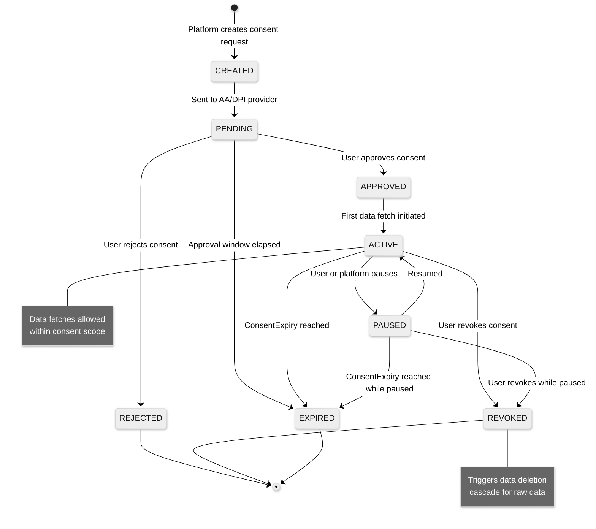
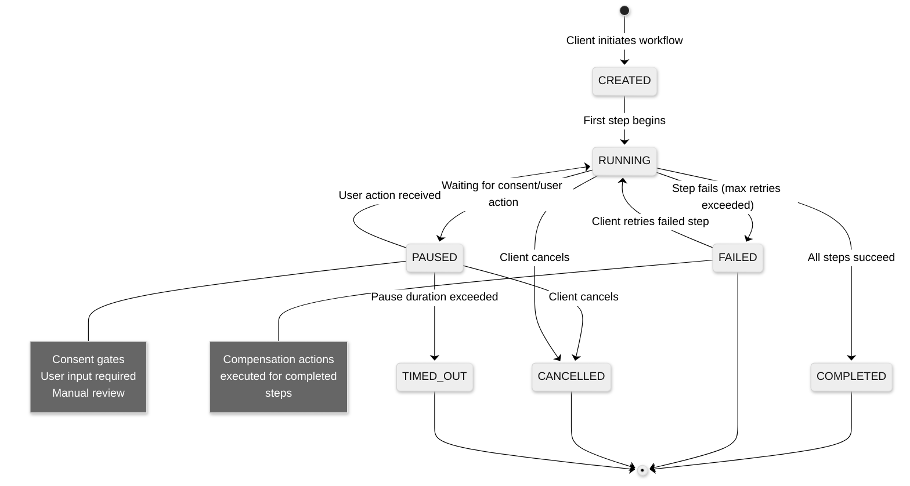

# Low-Level Design — AI-Native India Stack Integration Platform

## Core Data Models

### 1. Consent Artefact

```
ConsentArtefact:
  consent_id:          UUID                    // Platform-generated unique identifier
  aa_consent_id:       String                  // AA-assigned consent handle (for AA consents)
  tenant_id:           UUID                    // Business client that requested the consent
  user_id:             UUID                    // Platform user identifier
  dpi_type:            Enum[AA, EKYC, DIGILOCKER, ESIGN, UPI]
  consent_type:        Enum[ONE_TIME, PERIODIC]
  status:              Enum[CREATED, PENDING, APPROVED, ACTIVE, PAUSED, REVOKED, EXPIRED, REJECTED]

  // AA-specific fields (populated for dpi_type = AA)
  aa_provider:         String                  // Which AA entity (e.g., "finvu", "onemoney")
  fi_types:            List[String]            // ["DEPOSIT", "MUTUAL_FUNDS", "INSURANCE", ...]
  fip_ids:             List[String]            // Target FIP identifiers
  consent_start:       Timestamp               // Start of consent validity
  consent_expiry:      Timestamp               // Consent expiration
  fi_data_from:        Timestamp               // Financial data range start
  fi_data_to:          Timestamp               // Financial data range end
  data_life_unit:      Enum[MONTH, YEAR, INF]  // How long fetched data can be retained
  data_life_value:     Integer
  frequency_unit:      Enum[HOUR, DAY, MONTH, YEAR]
  frequency_value:     Integer                 // How often data can be fetched
  fetch_type:          Enum[ONETIME, PERIODIC]
  purpose_code:        Integer                 // ReBIT-defined purpose (101=Wealth Mgmt, 102=Lending, etc.)
  purpose_text:        String                  // Human-readable purpose description

  // DigiLocker-specific fields
  document_uri:        String                  // IssuerId-DocType-DocId format
  document_type:       String                  // PAN, DL, GST_CERT, UDYAM, etc.

  // Metadata
  created_at:          Timestamp
  updated_at:          Timestamp
  status_history:      List[StatusTransition]  // Full state machine history
  audit_hash:          String                  // SHA-256 hash chain for tamper detection
```

### 2. Identity Node

```
IdentityNode:
  user_id:             UUID                    // Platform-generated primary identifier
  tenant_id:           UUID                    // Tenant that created this identity

  // Verified identifiers (each with verification metadata)
  aadhaar_hash:        String                  // SHA-256 hash of Aadhaar number (never store raw Aadhaar)
  aadhaar_ref_id:      String                  // UIDAI reference ID from last successful auth
  aadhaar_last_verified: Timestamp

  pan:                 String                  // Encrypted PAN number
  pan_verified:        Boolean
  pan_verified_at:     Timestamp

  mobile_number:       String                  // Encrypted; Aadhaar-linked mobile
  mobile_verified_at:  Timestamp

  // AA identity mappings
  aa_identifiers:      List[AAIdentifier]      // One per FIP-AA combination
    - fip_id:          String
    - aa_provider:     String
    - customer_id:     String                  // FIP-specific customer identifier
    - linked_accounts: List[String]            // Account numbers linked at this FIP

  // DigiLocker identity
  digilocker_id:       String                  // DigiLocker user reference

  // UPI identity
  upi_vpas:            List[UPIIdentifier]
    - vpa:             String                  // user@bank format
    - verified_at:     Timestamp
    - bank_account:    String                  // Encrypted linked bank account

  // eKYC-derived demographics (encrypted at rest)
  name:                String
  date_of_birth:       Date
  gender:              Enum[M, F, T]
  address:             Address                 // Structured: house, street, locality, district, state, pincode
  photo_hash:          String                  // Hash of Aadhaar photo (not stored)

  // Fraud signals
  identity_risk_score: Float                   // 0.0 - 1.0
  last_risk_assessed:  Timestamp
  risk_flags:          List[String]            // ["velocity_alert", "device_anomaly", etc.]

  // Metadata
  created_at:          Timestamp
  updated_at:          Timestamp
  verification_level:  Enum[BASIC, STANDARD, ENHANCED]  // Based on number of verified signals
```

### 3. Workflow Instance

```
WorkflowInstance:
  workflow_id:         UUID
  template_id:         String                  // "loan_origination_v2", "msme_onboarding_v1"
  tenant_id:           UUID
  user_id:             UUID

  status:              Enum[CREATED, RUNNING, PAUSED, COMPLETED, FAILED, CANCELLED, TIMED_OUT]
  current_step:        String                  // Step identifier within the DAG

  // Step execution state
  steps:               Map[String, StepState]
    - step_id:         String                  // "ekyc", "aa_consent", "data_fetch", etc.
    - status:          Enum[PENDING, RUNNING, COMPLETED, FAILED, SKIPPED, COMPENSATED]
    - started_at:      Timestamp
    - completed_at:    Timestamp
    - attempt_count:   Integer
    - last_error:      String
    - output:          JSON                    // Step-specific output (eKYC result, consent ID, etc.)
    - compensation:    CompensationAction      // What to do if this step needs to be undone

  // Cross-step context
  context:             Map[String, Any]        // Accumulated data from completed steps
    // Example context after step 3:
    // "ekyc_result": {name, dob, address, aadhaar_ref_id}
    // "consent_id": "aa-consent-uuid"
    // "credit_score": 742

  // Timeout configuration
  workflow_timeout:    Duration                // Max total workflow duration (e.g., 72 hours)
  step_timeouts:       Map[String, Duration]   // Per-step timeouts

  // Metadata
  created_at:          Timestamp
  updated_at:          Timestamp
  completed_at:        Timestamp

  // Linked entities
  consent_ids:         List[UUID]              // All consents created during this workflow
  identity_node_id:    UUID                    // Resolved identity
```

### 4. AA Data Fetch Session

```
FIDataFetchSession:
  session_id:          UUID
  consent_id:          UUID                    // Parent consent artefact
  workflow_id:         UUID                    // Parent workflow (if any)

  // Fetch parameters
  aa_provider:         String
  fip_id:              String
  fi_types:            List[String]
  data_range_from:     Timestamp
  data_range_to:       Timestamp

  // Encryption keys (ephemeral, per-session)
  dh_public_key:       String                 // Platform's Diffie-Hellman public key (curve25519)
  key_nonce:           String                 // Nonce for key derivation
  // (Private key stored in HSM, never in database)

  // Fetch status
  status:              Enum[INITIATED, KEY_EXCHANGED, DATA_REQUESTED, DATA_RECEIVED,
                            DECRYPTED, PARSED, FEATURES_EXTRACTED, FAILED, TIMED_OUT]

  // Per-account fetch tracking
  account_fetches:     List[AccountFetch]
    - account_link_ref: String                // FIP's account reference
    - fi_type:          String                // DEPOSIT, CREDIT_CARD, etc.
    - status:           Enum[PENDING, FETCHED, DECRYPTION_FAILED, PARSE_ERROR]
    - raw_data_hash:    String                // Hash of encrypted payload (for audit)
    - record_count:     Integer               // Number of transactions fetched
    - fetch_latency_ms: Integer               // Time taken for this account's fetch

  // Timing
  initiated_at:        Timestamp
  data_received_at:    Timestamp
  processing_completed_at: Timestamp
  total_latency_ms:    Integer

  // Feature extraction output
  feature_set_id:      UUID                   // Reference to extracted features in feature store
```

### 5. Credit Assessment

```
CreditAssessment:
  assessment_id:       UUID
  workflow_id:         UUID
  user_id:             UUID
  tenant_id:           UUID

  // Input references
  feature_set_ids:     List[UUID]             // Feature sets used for scoring
  consent_ids:         List[UUID]             // Consents that authorized data access
  document_ids:        List[UUID]             // DigiLocker documents used

  // Scoring output
  credit_score:        Integer                // 300-900 range (normalized)
  score_band:          Enum[VERY_HIGH_RISK, HIGH_RISK, MEDIUM_RISK, LOW_RISK, VERY_LOW_RISK]
  confidence:          Float                  // Model confidence (0.0-1.0)

  // Lending recommendation
  recommended_amount:  Decimal                // In INR
  recommended_tenure:  Integer                // In months
  recommended_rate_band: String               // "12.5%-15.0%"

  // Explainability (required by RBI for lending decisions)
  score_components:    List[ScoreComponent]
    - feature_name:    String                 // "income_regularity_index"
    - feature_value:   Float                  // 0.87
    - contribution:    Float                  // SHAP value: +45 points
    - direction:       Enum[POSITIVE, NEGATIVE]
    - explanation:     String                 // "Consistent monthly salary credits over 12 months"

  // Risk flags
  risk_flags:          List[RiskFlag]
    - flag_type:       String                 // "high_emi_burden", "seasonal_income"
    - severity:        Enum[INFO, WARNING, CRITICAL]
    - description:     String

  // Fraud assessment
  fraud_score:         Float                  // 0.0-1.0
  fraud_signals:       List[String]           // Triggered fraud detection rules

  // Model metadata
  model_id:            String                 // Version of scoring model used
  model_version:       String
  scored_at:           Timestamp
```

### 6. Audit Event

```
AuditEvent:
  event_id:            UUID
  sequence_number:     Long                   // Monotonically increasing per tenant

  // Event classification
  event_type:          Enum[DPI_REQUEST, DPI_RESPONSE, CONSENT_LIFECYCLE, WORKFLOW_TRANSITION,
                            AI_DECISION, DATA_ACCESS, DATA_DELETION, ADMIN_ACTION]
  dpi_component:       Enum[AA, EKYC, DIGILOCKER, ESIGN, UPI, PLATFORM]
  action:              String                 // "ekyc_otp_request", "aa_consent_created", etc.

  // Actor
  tenant_id:           UUID
  user_id:             UUID                   // End-user (if applicable)
  api_client_id:       String                 // Business client's API key identifier

  // Context
  workflow_id:         UUID
  consent_id:          UUID
  session_id:          String                 // Request session/correlation ID

  // Event details
  request_summary:     JSON                   // Sanitized request (no PII, no raw Aadhaar)
  response_summary:    JSON                   // Sanitized response (status, latency, error code)
  outcome:             Enum[SUCCESS, FAILURE, TIMEOUT, REJECTED]
  error_code:          String                 // DPI-specific error code (e.g., UIDAI error 300 = OTP expired)
  latency_ms:          Integer

  // Integrity
  timestamp:           Timestamp              // High-precision event time
  previous_hash:       String                 // Hash of previous audit event (hash chain)
  event_hash:          String                 // SHA-256(previous_hash + event_data)

  // Regulatory tagging
  regulatory_tags:     List[String]           // ["RBI_AA", "UIDAI_AUDIT", "DPDP_CONSENT"]
  retention_policy:    String                 // "7_years", "deleted_after_use"
```

---

## API Design

### 1. Initiate eKYC

```
POST /v1/ekyc/initiate
Headers:
  X-Tenant-ID: {tenant_uuid}
  Authorization: Bearer {api_key}

Request:
{
  "aadhaar_number": "encrypted_base64",        // RSA-encrypted with platform's public key
  "auth_type": "OTP",                          // OTP | BIOMETRIC
  "purpose": "loan_application",
  "workflow_id": "wf-uuid-123"                 // Optional: link to existing workflow
}

Response (202 Accepted):
{
  "ekyc_session_id": "ekyc-uuid-456",
  "status": "OTP_SENT",
  "otp_ref_id": "uidai-ref-789",              // For OTP verification step
  "expires_at": "2026-03-10T12:15:00Z",       // OTP validity (10 minutes)
  "message": "OTP sent to Aadhaar-linked mobile"
}
```

### 2. Verify eKYC OTP

```
POST /v1/ekyc/{ekyc_session_id}/verify
Headers:
  X-Tenant-ID: {tenant_uuid}
  Authorization: Bearer {api_key}

Request:
{
  "otp": "encrypted_base64",                   // RSA-encrypted OTP
  "otp_ref_id": "uidai-ref-789"
}

Response (200 OK):
{
  "ekyc_session_id": "ekyc-uuid-456",
  "status": "VERIFIED",
  "identity": {
    "name": "Rajesh Kumar",
    "date_of_birth": "1985-07-15",
    "gender": "M",
    "address": {
      "house": "42",
      "street": "MG Road",
      "locality": "Koramangala",
      "district": "Bangalore Urban",
      "state": "Karnataka",
      "pincode": "560034"
    },
    "photo_available": true                    // Photo can be fetched separately if needed
  },
  "aadhaar_ref_id": "uidai-auth-ref-101",     // UIDAI authentication reference
  "identity_node_id": "user-uuid-789",         // Platform identity graph reference
  "verified_at": "2026-03-10T12:11:30Z"
}
```

### 3. Create AA Consent

```
POST /v1/aa/consents
Headers:
  X-Tenant-ID: {tenant_uuid}
  Authorization: Bearer {api_key}

Request:
{
  "user_id": "user-uuid-789",
  "aa_provider": "finvu",                      // Or "onemoney", "anumati", etc.
  "purpose": {
    "code": 102,                               // ReBIT purpose code: Lending
    "text": "Credit assessment for business loan application"
  },
  "fi_types": ["DEPOSIT", "TERM_DEPOSIT"],
  "fip_ids": ["HDFC-FIP", "ICICI-FIP"],       // Specific FIPs or empty for all
  "consent_mode": "STORE",                     // VIEW | STORE | QUERY
  "fetch_type": "ONETIME",                     // ONETIME | PERIODIC
  "consent_duration": {
    "from": "2026-03-10T00:00:00Z",
    "to": "2026-06-10T00:00:00Z"               // 3-month consent validity
  },
  "fi_data_range": {
    "from": "2025-03-10T00:00:00Z",            // 12 months of historical data
    "to": "2026-03-10T00:00:00Z"
  },
  "data_life": {
    "unit": "MONTH",
    "value": 6                                  // Retain fetched data for 6 months
  },
  "frequency": {                               // Only for PERIODIC
    "unit": "MONTH",
    "value": 1
  },
  "workflow_id": "wf-uuid-123"
}

Response (201 Created):
{
  "consent_id": "consent-uuid-456",
  "aa_consent_handle": "aa-handle-789",
  "status": "PENDING",
  "redirect_url": "https://aa-provider.in/consent/aa-handle-789",  // Redirect user here
  "expires_at": "2026-03-10T12:30:00Z",       // User must approve within this window
  "webhook_registered": true                    // Platform will receive approval callback
}
```

### 4. Fetch AA Financial Data

```
POST /v1/aa/data-fetch
Headers:
  X-Tenant-ID: {tenant_uuid}
  Authorization: Bearer {api_key}

Request:
{
  "consent_id": "consent-uuid-456",
  "data_range": {                              // Must be within consented FIDataRange
    "from": "2025-03-10T00:00:00Z",
    "to": "2026-03-10T00:00:00Z"
  },
  "callback_url": "https://client.example.com/webhook/aa-data"  // Async notification
}

Response (202 Accepted):
{
  "fetch_session_id": "fetch-uuid-789",
  "status": "INITIATED",
  "estimated_completion_seconds": 15,          // Based on historical FIP latency
  "fip_statuses": [
    {"fip_id": "HDFC-FIP", "status": "PENDING", "estimated_seconds": 5},
    {"fip_id": "ICICI-FIP", "status": "PENDING", "estimated_seconds": 8}
  ]
}

// Webhook callback to client when data is ready:
POST {callback_url}
{
  "fetch_session_id": "fetch-uuid-789",
  "status": "COMPLETED",
  "accounts_fetched": 3,
  "summary": {
    "total_transactions": 4287,
    "date_range": {"from": "2025-03-10", "to": "2026-03-10"},
    "accounts": [
      {"fip": "HDFC-FIP", "type": "DEPOSIT", "transactions": 2891},
      {"fip": "HDFC-FIP", "type": "TERM_DEPOSIT", "transactions": 12},
      {"fip": "ICICI-FIP", "type": "DEPOSIT", "transactions": 1384}
    ]
  },
  "feature_set_id": "fs-uuid-101",            // Pre-extracted features available
  "credit_score_available": true               // If auto-scoring was enabled
}
```

### 5. Get Credit Assessment

```
POST /v1/credit/assess
Headers:
  X-Tenant-ID: {tenant_uuid}
  Authorization: Bearer {api_key}

Request:
{
  "user_id": "user-uuid-789",
  "feature_set_ids": ["fs-uuid-101"],
  "document_ids": ["doc-uuid-201"],            // DigiLocker document references
  "loan_context": {
    "requested_amount": 500000,
    "tenure_months": 12,
    "business_type": "retail_trade"
  }
}

Response (200 OK):
{
  "assessment_id": "assess-uuid-301",
  "credit_score": 742,
  "score_band": "LOW_RISK",
  "confidence": 0.89,
  "recommendation": {
    "approved": true,
    "max_amount": 450000,
    "recommended_tenure": 12,
    "rate_band": "14.0% - 16.5%",
    "conditions": ["GST filing current", "No existing defaults"]
  },
  "score_breakdown": [
    {
      "factor": "Income Regularity",
      "value": 0.91,
      "contribution": "+85 points",
      "explanation": "Consistent monthly inflows averaging ₹1.2L over 12 months"
    },
    {
      "factor": "Expense Stability",
      "value": 0.78,
      "contribution": "+52 points",
      "explanation": "Predictable monthly outflows with low volatility (CV=0.18)"
    },
    {
      "factor": "EMI Discipline",
      "value": 0.95,
      "contribution": "+68 points",
      "explanation": "Zero EMI bounces across 3 active loans in 12 months"
    },
    {
      "factor": "Business Health",
      "value": 0.72,
      "contribution": "+37 points",
      "explanation": "GST filing regular; slight seasonal dip in Q3 consistent with retail trade"
    }
  ],
  "risk_flags": [
    {
      "type": "seasonal_income",
      "severity": "INFO",
      "description": "Revenue drops 25% in Jul-Sep; normal for retail trade sector"
    }
  ],
  "fraud_assessment": {
    "fraud_score": 0.05,
    "signals": [],
    "status": "CLEAR"
  },
  "model_metadata": {
    "model_id": "msme_credit_v3",
    "model_version": "3.2.1",
    "scored_at": "2026-03-10T12:15:00Z"
  }
}
```

### 6. Initiate eSign

```
POST /v1/esign/initiate
Headers:
  X-Tenant-ID: {tenant_uuid}
  Authorization: Bearer {api_key}

Request:
{
  "user_id": "user-uuid-789",
  "document": {
    "document_id": "loan-agreement-uuid",
    "document_hash": "sha256-hash-of-document",  // Hash of the document to be signed
    "document_type": "LOAN_AGREEMENT",
    "page_count": 8
  },
  "signer": {
    "name": "Rajesh Kumar",
    "aadhaar_ref_id": "uidai-auth-ref-101"     // From prior eKYC
  },
  "signing_reason": "Loan agreement execution",
  "signing_location": "Bangalore",
  "esp_provider": "cdac",                       // CDAC or other licensed ESP
  "workflow_id": "wf-uuid-123"
}

Response (202 Accepted):
{
  "esign_session_id": "esign-uuid-456",
  "status": "OTP_SENT",
  "otp_ref_id": "esp-otp-ref-789",
  "expires_at": "2026-03-10T12:25:00Z",
  "message": "OTP sent for document signing"
}
```

### 7. Execute Workflow

```
POST /v1/workflows/execute
Headers:
  X-Tenant-ID: {tenant_uuid}
  Authorization: Bearer {api_key}

Request:
{
  "template_id": "loan_origination_v2",
  "applicant": {
    "mobile": "+91-9876543210",
    "name": "Rajesh Kumar"                     // Pre-filled; verified during eKYC
  },
  "parameters": {
    "loan_amount": 500000,
    "business_type": "retail_trade",
    "aa_provider_preference": "finvu",
    "fi_types": ["DEPOSIT"],
    "fi_data_months": 12
  },
  "callbacks": {
    "on_step_complete": "https://client.example.com/webhook/workflow-step",
    "on_workflow_complete": "https://client.example.com/webhook/workflow-done",
    "on_consent_required": "https://client.example.com/webhook/consent-redirect"
  }
}

Response (201 Created):
{
  "workflow_id": "wf-uuid-123",
  "template_id": "loan_origination_v2",
  "status": "RUNNING",
  "current_step": "ekyc",
  "steps": [
    {"id": "ekyc", "status": "RUNNING", "order": 1},
    {"id": "aa_consent", "status": "PENDING", "order": 2, "depends_on": ["ekyc"]},
    {"id": "data_fetch", "status": "PENDING", "order": 3, "depends_on": ["aa_consent"]},
    {"id": "digilocker_fetch", "status": "PENDING", "order": 3, "depends_on": ["ekyc"]},
    {"id": "credit_assessment", "status": "PENDING", "order": 4, "depends_on": ["data_fetch", "digilocker_fetch"]},
    {"id": "esign", "status": "PENDING", "order": 5, "depends_on": ["credit_assessment"]},
    {"id": "disbursement", "status": "PENDING", "order": 6, "depends_on": ["esign"]}
  ],
  "estimated_completion": "2026-03-10T12:30:00Z"
}
```

### 8. Fetch DigiLocker Document

```
POST /v1/digilocker/fetch
Headers:
  X-Tenant-ID: {tenant_uuid}
  Authorization: Bearer {api_key}

Request:
{
  "user_id": "user-uuid-789",
  "document_type": "GST_CERTIFICATE",          // GST_CERT, PAN, DL, UDYAM, etc.
  "issuer_id": "GSTN",                        // DigiLocker issuer code
  "identifier": "29ABCDE1234F1Z5",            // GSTIN for GST certificate
  "workflow_id": "wf-uuid-123"
}

Response (200 OK):
{
  "document_id": "doc-uuid-201",
  "document_type": "GST_CERTIFICATE",
  "issuer": "GSTN",
  "document_uri": "GSTN-GSTCER-29ABCDE1234F1Z5",
  "format": "XML",
  "digital_signature_valid": true,
  "signature_issuer": "NIC",
  "issued_date": "2024-06-15",
  "extracted_data": {
    "gstin": "29ABCDE1234F1Z5",
    "business_name": "Rajesh Trading Co",
    "registration_date": "2019-01-15",
    "status": "ACTIVE",
    "business_type": "Regular",
    "principal_place": "Bangalore, Karnataka"
  },
  "verification": {
    "cross_reference_ekyc": true,              // Name matches eKYC record
    "address_match_score": 0.87,               // Fuzzy match with eKYC address
    "active_on_portal": true                   // Live verification with GST portal
  }
}
```

---

## Key Algorithms

### Algorithm 1: Cash Flow Credit Scoring

```
FUNCTION compute_credit_score(bank_transactions, loan_context):
    // Phase 1: Transaction Categorization
    categorized = []
    FOR EACH txn IN bank_transactions:
        category = classify_transaction(txn.narration, txn.amount, txn.counterparty)
        // Categories: SALARY, BUSINESS_INCOME, GST_REFUND, RENT, EMI, UTILITY,
        //             TRANSFER_IN, TRANSFER_OUT, CASH_DEPOSIT, CASH_WITHDRAWAL, UPI_MERCHANT
        categorized.append({...txn, category: category})

    // Phase 2: Feature Extraction (200+ features)
    features = {}

    // Income features
    monthly_inflows = group_by_month(categorized.filter(type=CREDIT))
    features.avg_monthly_income = mean(monthly_inflows.values())
    features.income_regularity = 1 - coefficient_of_variation(monthly_inflows.values())
    features.income_trend = linear_regression_slope(monthly_inflows)  // Growing or declining
    features.salary_detected = any(c.category == SALARY for c in categorized)
    features.business_income_ratio = sum_business_income / sum_all_income
    features.income_source_diversity = count_unique_income_sources / total_months

    // Expense features
    monthly_outflows = group_by_month(categorized.filter(type=DEBIT))
    features.avg_monthly_expense = mean(monthly_outflows.values())
    features.expense_volatility = coefficient_of_variation(monthly_outflows.values())
    features.essential_expense_ratio = sum_essential / sum_all_expense  // Rent + EMI + utility

    // Cash flow features
    monthly_net = monthly_inflows - monthly_outflows (per month)
    features.avg_net_cash_flow = mean(monthly_net.values())
    features.months_negative_cash_flow = count(monthly_net < 0)
    features.min_balance_before_salary = min(daily_balances on salary_date - 1)
    features.cash_flow_coverage_ratio = avg_net_cash_flow / proposed_emi

    // EMI discipline features
    emi_transactions = categorized.filter(category=EMI)
    features.active_emi_count = count_unique_emi_series(emi_transactions)
    features.emi_bounce_count = count_bounced_emis(emi_transactions)
    features.total_emi_burden = sum_monthly_emis / avg_monthly_income
    features.emi_to_income_with_proposed = (sum_monthly_emis + proposed_emi) / avg_monthly_income

    // UPI behavior features
    upi_txns = categorized.filter(mode=UPI)
    features.upi_merchant_diversity = count_unique_merchants(upi_txns)
    features.upi_avg_transaction = mean(upi_txns.amounts())
    features.upi_regularity = regularity_score(upi_txns)  // Regular payments suggest stable business

    // GST correlation features
    gst_payments = categorized.filter(narration MATCHES "GST|CGST|SGST|IGST")
    features.gst_filing_regularity = count_gst_months / expected_gst_months
    features.gst_amount_trend = linear_regression_slope(gst_payments)
    features.revenue_gst_correlation = correlation(monthly_income, gst_payments)

    // Seasonal pattern features
    features.seasonal_index = seasonal_decomposition(monthly_inflows)
    features.worst_quarter_ratio = min_quarter_income / avg_quarter_income

    // Phase 3: Model Inference
    score_raw = gradient_boosted_model.predict(features)  // Returns 0.0-1.0
    score_normalized = 300 + (score_raw * 600)            // Map to 300-900 range

    // Phase 4: Explainability (SHAP values)
    shap_values = tree_shap.explain(gradient_boosted_model, features)
    top_factors = rank_by_absolute_shap(shap_values, top_k=6)

    // Phase 5: Risk Flag Generation
    risk_flags = []
    IF features.emi_to_income_with_proposed > 0.5:
        risk_flags.append(HIGH_EMI_BURDEN)
    IF features.months_negative_cash_flow > 3:
        risk_flags.append(CASH_FLOW_STRESS)
    IF features.income_trend < -0.05:
        risk_flags.append(DECLINING_INCOME)
    IF features.seasonal_index.amplitude > 0.4:
        risk_flags.append(HIGH_SEASONALITY)

    RETURN CreditAssessment(
        score: score_normalized,
        confidence: model_confidence,
        factors: top_factors,
        risk_flags: risk_flags,
        features: features  // Stored for audit and retraining
    )
```

### Algorithm 2: Cross-DPI Fraud Detection

```
FUNCTION detect_cross_dpi_fraud(ekyc_result, aa_data, documents, device_info):
    signals = []

    // Signal 1: Synthetic Identity Detection
    // eKYC passes but financial footprint is inconsistent
    IF ekyc_result.status == VERIFIED:
        aa_account_age = min(account.opening_date for account in aa_data.accounts)
        IF aa_account_age < 90_DAYS AND ekyc_result.age > 25:
            signals.append(Signal(
                type: "THIN_FILE_ANOMALY",
                score: 0.6,
                detail: "Verified identity with no bank accounts older than 90 days"
            ))

        IF aa_data.total_transactions < 10 AND ekyc_result.age > 30:
            signals.append(Signal(
                type: "DORMANT_FINANCIAL_IDENTITY",
                score: 0.7,
                detail: "Active Aadhaar but near-zero financial activity"
            ))

    // Signal 2: Velocity Check
    recent_ekyc_count = count_ekyc_for_aadhaar(
        ekyc_result.aadhaar_hash, window=24_HOURS
    )
    IF recent_ekyc_count > 3:  // Same Aadhaar verified at 3+ tenants in 24 hours
        signals.append(Signal(
            type: "VELOCITY_ALERT",
            score: 0.8,
            detail: "Aadhaar authenticated {count} times across tenants in 24 hours"
        ))

    // Signal 3: Device Fingerprint Anomaly
    device_cluster = lookup_device_cluster(device_info.fingerprint)
    IF device_cluster.fraud_association_score > 0.5:
        signals.append(Signal(
            type: "DEVICE_FRAUD_CLUSTER",
            score: device_cluster.fraud_association_score,
            detail: "Device associated with {count} previous fraud cases"
        ))

    IF device_info.is_emulator OR device_info.is_rooted:
        signals.append(Signal(
            type: "SUSPICIOUS_DEVICE",
            score: 0.5,
            detail: "eKYC attempted from emulator or rooted device"
        ))

    // Signal 4: Cross-Document Consistency
    IF documents.gst_certificate AND ekyc_result:
        name_similarity = fuzzy_match(
            documents.gst_certificate.business_name,
            ekyc_result.name
        )
        IF name_similarity < 0.6:
            signals.append(Signal(
                type: "NAME_MISMATCH",
                score: 0.7,
                detail: "GST certificate name does not match eKYC identity"
            ))

        address_similarity = address_match(
            documents.gst_certificate.address,
            ekyc_result.address
        )
        IF address_similarity < 0.4:
            signals.append(Signal(
                type: "ADDRESS_MISMATCH",
                score: 0.5,
                detail: "Business address significantly differs from residential address"
            ))

    // Signal 5: Financial Round-Tripping
    IF aa_data:
        circular_flows = detect_circular_transfers(aa_data.transactions)
        // Look for A→B→C→A patterns within 48-hour windows
        IF circular_flows.count > 0:
            signals.append(Signal(
                type: "CIRCULAR_TRANSFER",
                score: 0.9,
                detail: "{count} circular money flows detected suggesting round-tripping"
            ))

    // Signal 6: Consent Stuffing Detection
    consent_scope = get_active_consent_scope(ekyc_result.aadhaar_hash)
    IF consent_scope.fi_type_count > 5 AND consent_scope.data_life > 2_YEARS:
        signals.append(Signal(
            type: "CONSENT_STUFFING",
            score: 0.6,
            detail: "Overly broad consent scope relative to stated purpose"
        ))

    // Composite fraud score
    IF signals.is_empty():
        RETURN FraudAssessment(score: 0.0, status: "CLEAR", signals: [])

    composite_score = weighted_average(
        [s.score for s in signals],
        weights=[SIGNAL_WEIGHTS[s.type] for s in signals]
    )

    status = CASE
        WHEN composite_score > 0.8 THEN "BLOCKED"
        WHEN composite_score > 0.5 THEN "REVIEW_REQUIRED"
        WHEN composite_score > 0.3 THEN "ELEVATED_RISK"
        ELSE "LOW_RISK"

    RETURN FraudAssessment(
        score: composite_score,
        status: status,
        signals: signals,
        recommended_action: determine_action(status)
    )
```

### Algorithm 3: Adaptive FIP Timeout Routing

```
FUNCTION compute_fip_timeout_and_route(fip_id, fi_type, data_range_months):
    // Maintain per-FIP performance statistics (updated after every fetch)
    stats = fip_performance_store.get(fip_id, fi_type)

    // Exponentially weighted moving average of recent latencies
    recent_p50 = stats.ewma_p50_ms      // e.g., 3,200 ms for a large private bank
    recent_p95 = stats.ewma_p95_ms      // e.g., 12,800 ms
    recent_p99 = stats.ewma_p99_ms      // e.g., 45,000 ms
    success_rate = stats.ewma_success_rate  // e.g., 0.94

    // Adjust timeout based on data volume
    // More months of data = more records = longer processing at FIP
    volume_multiplier = CASE
        WHEN data_range_months <= 3 THEN 1.0
        WHEN data_range_months <= 6 THEN 1.3
        WHEN data_range_months <= 12 THEN 1.8
        WHEN data_range_months <= 24 THEN 2.5
        ELSE 3.0

    // Set timeout at p95 + buffer, scaled by data volume
    computed_timeout = min(
        recent_p95 * volume_multiplier * 1.2,   // 20% buffer over p95
        90_000                                    // Hard cap: 90 seconds
    )
    computed_timeout = max(computed_timeout, 5_000)  // Floor: 5 seconds

    // AA routing: if multiple AAs support this FIP, choose the best-performing one
    available_aas = get_aas_supporting_fip(fip_id)
    IF available_aas.length > 1:
        best_aa = available_aas.sort_by(
            lambda aa: aa.stats_for_fip(fip_id).ewma_p50_ms * (1 / aa.success_rate)
        ).first()
    ELSE:
        best_aa = available_aas.first()

    // If FIP has been unreliable recently, add retry configuration
    retry_config = CASE
        WHEN success_rate > 0.95 THEN RetryConfig(max_retries: 1, backoff: 2_000)
        WHEN success_rate > 0.85 THEN RetryConfig(max_retries: 2, backoff: 5_000)
        WHEN success_rate > 0.70 THEN RetryConfig(max_retries: 3, backoff: 10_000)
        ELSE RetryConfig(max_retries: 3, backoff: 15_000, circuit_breaker: true)

    RETURN FIPRouteConfig(
        fip_id: fip_id,
        aa_provider: best_aa.id,
        timeout_ms: computed_timeout,
        retry_config: retry_config,
        expected_latency_ms: recent_p50 * volume_multiplier,
        success_probability: success_rate
    )
```

---

## State Machines

### Consent Lifecycle State Machine



### Workflow Execution State Machine


