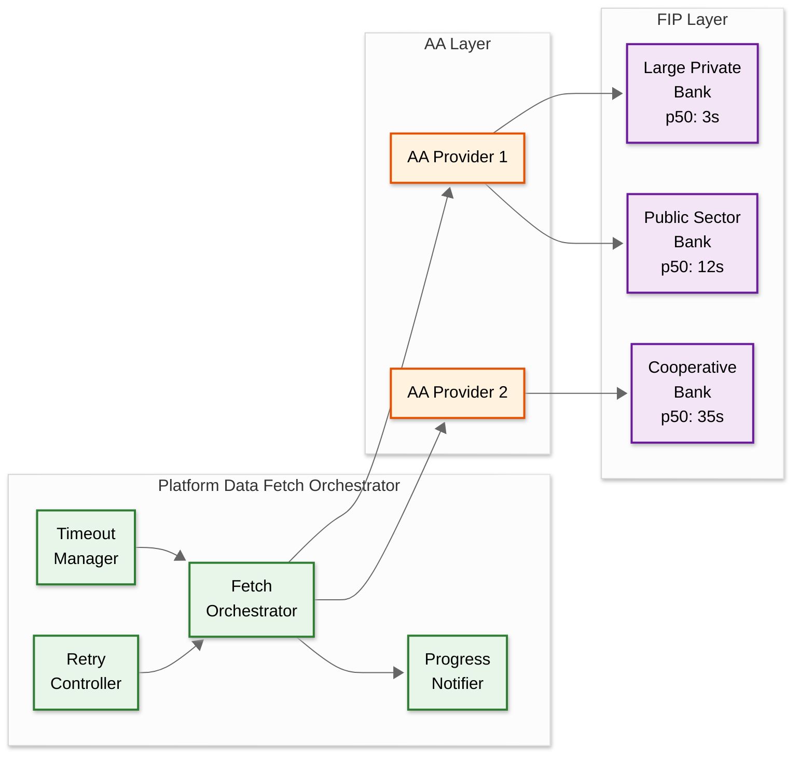

# Deep Dives & Bottlenecks — AI-Native India Stack Integration Platform

## Deep Dive 1: AA Data Fetch Latency — The FIP Responsiveness Problem

### The Challenge

Account Aggregator data fetch is the critical path for credit assessment workflows, and its latency is dominated by FIP (Financial Information Provider) response time—which the platform cannot control. In production:

- **Large private banks** (top 5 by assets): 2-5 second p50, 10-15 second p95
- **Public sector banks**: 5-15 second p50, 30-60 second p95
- **Small cooperative banks/NBFCs**: 15-45 second p50, 60-90 second p95 (some timeout entirely)
- **Mutual fund depositories**: 3-8 second p50 (fewer records, simpler queries)
- **Insurance repositories**: 5-12 second p50 (complex policy data serialization)

For a typical MSME applicant with accounts at 2-3 banks, the end-to-end data fetch latency is determined by the slowest FIP.

### Architecture



### Mitigation Strategies

**1. Parallel Multi-FIP Fetch with Progressive Completion**

Instead of waiting for all FIPs to respond before proceeding, the platform uses progressive completion:

- Initiate parallel fetch requests to all consented FIPs simultaneously
- As each FIP responds, immediately begin feature extraction on the received data
- If 2 of 3 FIPs respond within 15 seconds, compute a preliminary credit score using available data
- Continue waiting for the slow FIP up to its adaptive timeout
- If the slow FIP's data arrives, recompute the credit score with the full dataset
- If the slow FIP times out, proceed with partial data and flag the assessment as "partial_coverage"

This reduces the effective p95 latency from "slowest FIP" to "second-slowest FIP" in 3-FIP scenarios.

**2. Adaptive Per-FIP Timeout Tuning**

The platform maintains exponentially weighted moving averages (EWMA) of each FIP's response latency and success rate, updated after every fetch. Timeout for FIP X is set at:

```
timeout = min(p95_ewma * volume_multiplier * 1.2, 90_seconds)
```

This prevents the platform from waiting 90 seconds for a FIP that always responds in 5 seconds (wasting resources and degrading user experience) while giving legitimately slow FIPs sufficient time.

**3. Multi-AA Routing**

If the same FIP is accessible through multiple AAs (e.g., both Finvu and OneMoney can reach SBI), the platform routes through the AA with the best historical performance for that FIP. This adds resilience (if one AA is down, route through another) and performance (different AAs may have different connection quality to different FIPs).

**4. Stale Data Acceptance**

For periodic consent workflows, if a scheduled monthly data refresh fails, the platform can use the previous month's data (marked as stale) rather than blocking the business workflow. The credit score is recomputed with a "data_freshness_penalty" factor that degrades the score proportionally to data age.

### Bottleneck Analysis

| Bottleneck | Impact | Mitigation |
|---|---|---|
| Slow FIP blocks entire workflow | User waits 60+ seconds; abandonment rate increases | Progressive completion; proceed with partial data |
| FIP-side rate limiting | Burst traffic during business hours gets throttled | Request queuing with priority; spread non-urgent fetches to off-peak |
| AA downtime | All fetches through that AA fail | Multi-AA routing; circuit breaker with automatic failover |
| Encryption overhead | Curve25519 key exchange + AES decryption per session | HSM-accelerated crypto; key pair pre-generation |
| Large data volumes | 24-month statement = 10,000+ transactions; serialization/parsing takes 2-3 seconds | Streaming parser; parallel per-account parsing |

---

## Deep Dive 2: eKYC Failure Handling and Fallback Strategies

### The Challenge

Aadhaar eKYC has a first-attempt success rate of approximately 85-92% depending on the authentication method:

- **OTP-based eKYC**: ~90-95% first-attempt success (failures: OTP delivery delay, wrong OTP, expired OTP, telecom network issues)
- **Biometric eKYC**: ~80-90% first-attempt success (failures: poor fingerprint quality, environmental factors, device compatibility, biometric mismatch for elderly/manual labor users)
- **Offline eKYC (Paperless)**: ~98% success (XML-based, no real-time UIDAI dependency; but provides less data)

For a platform processing 80 million eKYC transactions per month, even a 5% failure rate means 4 million failed attempts requiring retry or fallback.

### Failure Taxonomy and Handling

```
eKYC Failure Taxonomy:
├── Transient Failures (auto-retry)
│   ├── OTP_DELIVERY_DELAYED: Telecom network congestion (retry after 60s)
│   ├── UIDAI_TIMEOUT: UIDAI server busy (retry after 30s, max 2 retries)
│   ├── NETWORK_ERROR: Connectivity issue between platform and UIDAI (immediate retry)
│   └── SESSION_EXPIRED: eKYC session timed out (create new session)
│
├── User-Correctable Failures (guide user)
│   ├── INVALID_OTP: Wrong OTP entered (allow 2 more attempts)
│   ├── OTP_EXPIRED: User took too long (resend OTP)
│   ├── BIOMETRIC_QUALITY_LOW: Poor fingerprint capture (suggest re-scan with guidance)
│   └── BIOMETRIC_MISMATCH: Biometric doesn't match (suggest OTP fallback)
│
├── Permanent Failures (escalate or fallback)
│   ├── AADHAAR_DEACTIVATED: Aadhaar number deactivated by UIDAI (halt; manual verification)
│   ├── AADHAAR_NOT_FOUND: Invalid Aadhaar number (halt; check input)
│   ├── MOBILE_NOT_LINKED: No mobile linked to Aadhaar (biometric only; or manual KYC)
│   └── UIDAI_SUSPENSION: UIDAI has suspended auth for this Aadhaar (halt; legal/compliance)
│
└── Platform Failures (internal)
    ├── ENCRYPTION_ERROR: PID block encryption failed (retry with new session key)
    ├── SIGNATURE_ERROR: XML-DSIG signing failed (check certificate validity)
    └── DECRYPTION_ERROR: Cannot decrypt KYC response (key mismatch; retry)
```

### Fallback Strategy

```
Priority order for identity verification:
1. OTP-based eKYC (fastest, best success rate)
2. Biometric eKYC (fallback if OTP fails due to mobile issues)
3. Offline Paperless eKYC (XML-based; lower data but no real-time UIDAI dependency)
4. DigiLocker + PAN verification (non-Aadhaar; verify identity from PAN + address proof)
5. Manual KYC with AI-assisted document verification (uploaded documents + face match)
```

For each fallback, the workflow engine adjusts the verification confidence level. OTP-based eKYC produces "AADHAAR_VERIFIED" confidence; manual KYC produces "DOCUMENT_VERIFIED" confidence. Business clients configure minimum confidence levels for their use cases (lending typically requires AADHAAR_VERIFIED; onboarding may accept DOCUMENT_VERIFIED).

---

## Deep Dive 3: Cross-DPI Identity Resolution

### The Challenge

India Stack has no unified identity layer. Each DPI component identifies users differently:

| DPI Component | Identifier | Nature |
|---|---|---|
| Aadhaar eKYC | 12-digit Aadhaar number | Permanent; unique per person |
| Account Aggregator | Customer ID per FIP | Different at each bank; no standard format |
| DigiLocker | DigiLocker account (linked via Aadhaar or mobile) | One per person; session-based access |
| eSign | Aadhaar number (for authentication) | Same as eKYC |
| UPI | Virtual Payment Address (VPA) | Multiple per person; can change |
| PAN | 10-character alphanumeric | Unique per taxpayer; different from Aadhaar |

When a business workflow spans multiple DPI components, the platform must confidently establish that the Aadhaar-verified identity, the AA consent grantor, the DigiLocker document owner, and the UPI payment recipient are the same person.

### Resolution Strategy

**Layer 1: Aadhaar as the Anchor**

Aadhaar is the strongest identity signal because it's biometrically or OTP-verified. When eKYC succeeds, the platform creates an identity node anchored to the Aadhaar hash (never the raw number).

**Layer 2: AA Identity Linking**

AA consent approval includes the user's customer identifiers at each FIP. The platform links these to the identity node:
- Match mobile number from eKYC with mobile number registered at FIPs
- Verify name fuzzy match between eKYC name and FIP account holder name
- Store the FIP → customer_id → account_number mapping for this identity node

**Layer 3: DigiLocker Cross-Reference**

DigiLocker documents contain the user's Aadhaar-linked identity. When fetching a document:
- Extract the owner identity from the DigiLocker document's digital signature
- Cross-reference with the eKYC-verified name and address
- Flag discrepancies for manual review (e.g., document issued to a different name)

**Layer 4: UPI Verification**

Before disbursing funds via UPI:
- Validate the VPA using NPCI's VPA verification API
- Cross-reference the VPA's linked bank account with AA-discovered accounts
- If the VPA's bank account matches an AA-linked account, high confidence
- If no match, flag for additional verification (user may have accounts at banks not in AA)

**Layer 5: Confidence Scoring**

```
identity_confidence = weighted_sum(
    aadhaar_verified * 0.35,        // Strongest: government-issued, biometric/OTP
    aa_name_match * 0.20,           // Bank-verified name matches Aadhaar name
    digilocker_doc_match * 0.15,    // Document identity matches Aadhaar
    pan_aadhaar_link * 0.15,        // PAN-Aadhaar linkage confirmed
    upi_account_match * 0.10,       // UPI VPA links to known bank account
    mobile_consistency * 0.05       // Same mobile across all DPI interactions
)
```

### Edge Cases

| Edge Case | Challenge | Resolution |
|---|---|---|
| **Name transliteration** | Aadhaar has "Rajesh" but bank has "RAJESH KUMAR" and GST has "Rajesh K" | Fuzzy matching with transliteration-aware comparison; confidence adjusted based on match quality |
| **Address change** | User moved after Aadhaar issued; bank address updated but Aadhaar address is old | Use DigiLocker address proof (recent utility bill) as tiebreaker; flag but don't block |
| **Mobile number change** | User changed mobile; Aadhaar OTP goes to new number but old number registered at bank | Bank FIP may still use old mobile as identifier; AA handles this through account discovery |
| **Joint accounts** | AA data includes joint accounts where user is second holder | Match primary holder name with eKYC; joint accounts flagged with ownership type |
| **Business vs. personal identity** | GST certificate in business name; eKYC in personal name; bank accounts may be either | Support "proprietor" mapping where personal identity owns business identity |

---

## Deep Dive 4: Consent Cascade and Data Lifecycle Management

### The Challenge

When a user revokes an AA consent, the platform must cascade this revocation through all downstream data and derived artifacts. The challenge is that data from a single consent may have been used across multiple systems:

- Raw financial data (must be deleted per consent terms)
- Extracted ML features (derived data; retention policy may differ)
- Credit scores (derived from features; may have been shared with business client)
- Fraud signals (may be needed for regulatory compliance even after consent revocation)
- Audit logs (must be retained regardless of consent status for regulatory compliance)

### Cascade Design

```
Consent Revocation Cascade:

1. Receive consent revocation notification from AA
   → Update consent state: ACTIVE → REVOKED
   → Record revocation in audit log (this log entry is never deleted)

2. Identify all FI data fetch sessions under this consent
   → For each fetch session:
      a. Delete raw FIData (encrypted bank transactions)
      b. Delete decrypted/parsed transaction data
      c. Mark feature_set as "consent_revoked" (but don't delete yet)

3. Check DataLife policy from original consent artefact
   → If DataLife has expired: delete feature sets immediately
   → If DataLife still active: schedule deletion at DataLife expiry
   → (Some consents allow derived data retention beyond raw data)

4. Identify credit assessments that used these feature sets
   → Mark assessments as "partial_data" (consent for source data revoked)
   → Do NOT delete the assessment result (business client may have
      already acted on it; audit trail must show what decision was made)
   → Do NOT delete SHAP explanations (needed for regulatory audit)

5. Notify business client of consent revocation via webhook
   → Client must stop using the credit score for new decisions
   → Client's own data retention policy governs their copy

6. Fraud signals: retain if they relate to platform-level fraud detection
   → Anonymize: replace user_id with hash, remove PII
   → Retain: fraud pattern (circular transfers, velocity) without raw data
   → Justification: fraud detection is a legitimate interest under DPDP Act
```

### Data Retention Matrix

| Data Type | On Consent Active | On Consent Revoked | On Consent Expired | Regulatory Override |
|---|---|---|---|---|
| Raw FIData (transactions) | Retained (encrypted) | **Deleted immediately** | **Deleted immediately** | None; must delete |
| Extracted features | Retained | Retained until DataLife expiry, then deleted | Retained until DataLife expiry | None |
| Credit score + explanation | Retained | Marked "revoked_source"; retained for audit | Retained for audit | 7-year retention for lending decisions |
| Consent artefact | Active | Updated to REVOKED; retained | Updated to EXPIRED; retained | 7-year retention (RBI) |
| Audit log entries | Active | **Never deleted** | **Never deleted** | Minimum 7 years; some regulators require 10 |
| Fraud signals | Active | Anonymized; retained | Anonymized; retained | Indefinite for pattern detection |

---

## Deep Dive 5: Real-Time AI Feature Extraction at Scale

### The Challenge

When AA financial data arrives (potentially 5,000-10,000 transactions for a 12-month bank statement), the platform must extract 200+ features within the 3-second credit scoring SLO. This is a compute-intensive operation that must happen inline with the workflow—features cannot be pre-computed because the data arrives dynamically via the AA consent channel.

### Pipeline Design

```
Feature Extraction Pipeline:

Stage 1: Transaction Parsing (target: < 500ms)
  Input: Raw FIData (JSON/XML from FIP)
  - Parse transaction records into normalized format
  - Standardize date formats (FIPs use different formats)
  - Normalize amount formats (some FIPs use paise, some use rupees)
  - Extract transaction mode (UPI, NEFT, IMPS, cash, cheque)
  Output: List[NormalizedTransaction]

Stage 2: Transaction Categorization (target: < 800ms)
  Input: List[NormalizedTransaction]
  - Run ML-based narration classifier (lightweight model, ~2ms per transaction)
  - Classify into 25 categories: SALARY, RENT, EMI, UTILITY, GST, TRANSFER, etc.
  - Use counterparty matching for known entities (utility companies, banks, government)
  - Apply rule-based overrides for common patterns (e.g., "NEFT-SALARY" → SALARY)
  Output: List[CategorizedTransaction]

Stage 3: Aggregation & Feature Computation (target: < 500ms)
  Input: List[CategorizedTransaction]
  - Compute monthly aggregates (income, expense, net flow per month)
  - Compute rolling averages (3-month, 6-month, 12-month windows)
  - Compute statistical features (mean, median, std dev, CV, trend)
  - Compute behavioral features (min balance timing, salary-expense gap)
  - Compute UPI-specific features (merchant diversity, transaction regularity)
  - Compute GST features (filing regularity, amount trend)
  Output: FeatureVector (200+ features)

Stage 4: Feature Validation & Storage (target: < 200ms)
  Input: FeatureVector
  - Validate feature ranges (no negative incomes, no future dates)
  - Check for data quality flags (too few transactions, missing months)
  - Store in feature store with version tag and consent reference
  - Publish feature_ready event for downstream consumers
  Output: FeatureSetID
```

### Performance Optimization

| Optimization | Technique | Impact |
|---|---|---|
| **Streaming parser** | Parse transactions as they arrive from FIP, don't wait for complete dataset | Reduces parsing latency by 40% for large datasets |
| **Batch categorization** | Run narration classifier on batches of 100 transactions with GPU inference | 5x throughput vs. one-at-a-time inference |
| **Pre-computed counterparty lookup** | Maintain hash map of 50,000 known counterparties (utilities, banks, government) | 60% of transactions categorized by lookup instead of ML inference |
| **Vectorized aggregation** | Use columnar data format for monthly aggregation (SIMD-friendly) | 3x faster than row-by-row aggregation |
| **Feature computation cache** | For periodic consents, only recompute features for new transactions | 70% reduction in compute for monthly refreshes |

### Capacity Planning

At 620 QPS peak for credit scoring:
- Each request processes ~4,000 transactions average
- Transaction categorization: 4,000 × 2ms = 8 seconds (single-threaded); batched: 40 batches × 20ms = 800ms
- Feature computation: ~500ms per request
- Total: ~1.5 seconds per request
- Required parallelism: 620 QPS × 1.5s = 930 concurrent executions
- With 16-core machines: ~60 machines for feature extraction at peak
- GPU for narration classifier: 8 GPUs can handle the batched inference load

---

## Cross-Cutting Bottleneck Analysis

### Bottleneck 1: Consent Approval Wait Time

**Problem:** AA consent requires user to open their AA app, review consent details, and approve. This takes 30 seconds to several minutes (if the user is not immediately available). The workflow is paused during this time.

**Impact:** Workflow completion rate drops significantly if consent approval takes > 5 minutes. 40% of users who receive a consent request but don't approve within 10 minutes never return to complete it.

**Mitigation:**
- Send push notifications and SMS reminders at 2, 5, and 10-minute intervals
- Pre-populate consent screen with minimal required scope to reduce cognitive load
- Support "pre-approved consent" for returning users (new consent using same scope as previously approved)
- Track consent approval funnel metrics per AA provider (some AAs have better UX than others; route to the higher-conversion AA)

### Bottleneck 2: Encryption Key Management at Scale

**Problem:** Every AA data fetch session requires a unique Diffie-Hellman key pair (curve25519). At 930 QPS peak, the platform must generate 930 key pairs per second, perform DH key exchange, derive AES session keys, and then decrypt potentially large payloads.

**Impact:** Key generation and cryptographic operations can become CPU-bound bottlenecks.

**Mitigation:**
- Pre-generate key pairs in batches (generate 10,000 key pairs during off-peak, consume during peak)
- Use HSM (Hardware Security Module) for key generation and storage
- Parallelize decryption across multiple cores (AES-256-GCM is parallelizable)
- Key pair rotation every 24 hours; never reuse across sessions

### Bottleneck 3: Multi-Tenant DPI Quota Contention

**Problem:** The platform has a finite API quota with each DPI provider (UIDAI, AAs, DigiLocker). If one large tenant launches a marketing campaign that spikes eKYC volume, it could exhaust the shared quota and block other tenants.

**Impact:** Noisy-neighbor problem; one tenant's burst traffic degrades service for all tenants.

**Mitigation:**
- Per-tenant quota allocation (configurable, based on their contract)
- Priority queuing: critical workflows (active user waiting) get priority over batch operations
- Burst allowance with token bucket: tenants can burst to 2x their allocated quota for 5 minutes
- Dynamic quota redistribution: unused quota from low-traffic tenants is temporarily allocated to high-traffic tenants
- Separate DPI API credentials per tenant tier (premium tenants get dedicated API keys with higher limits)

### Bottleneck 4: Audit Log Write Throughput

**Problem:** Every DPI interaction generates an audit event. At 5,500 peak QPS across all DPI components, with 3-5 audit events per interaction (request, response, processing steps), the audit log receives 15,000-25,000 writes per second.

**Impact:** Audit log writes must be durable (regulatory requirement) but must not block the critical path.

**Mitigation:**
- Asynchronous audit log writes via a durable event bus (events persisted to durable queue before acknowledgment)
- Batch writes to audit storage (accumulate 100 events or 1-second window, whichever is first)
- Hash chain computed asynchronously (lag of up to 5 seconds acceptable; sequential hash is integrity feature, not latency feature)
- Separate audit storage cluster from operational databases (audit writes don't compete with consent/workflow reads)
- Tiered audit storage: last 90 days in hot storage (indexed, queryable); older in compressed cold storage
