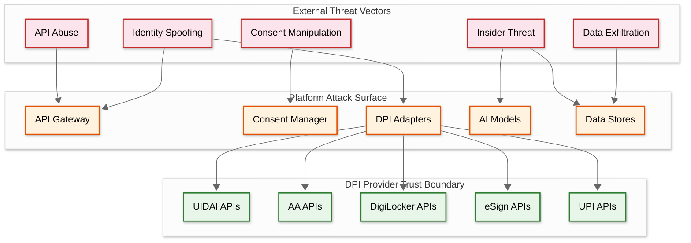

# Security & Compliance — AI-Native India Stack Integration Platform

## Threat Model

### Attack Surface Analysis

The India Stack integration platform has a uniquely large attack surface because it sits at the intersection of five different DPI systems, each with its own security model:



### Threat Catalog

| # | Threat | Vector | Impact | Likelihood | Mitigation |
|---|---|---|---|---|---|
| T1 | **Consent Stuffing** | Malicious FIU (business client) creates overly broad AA consent requests to harvest maximum financial data | Mass data collection beyond legitimate business need; violation of data minimization principle | Medium | Consent scope validation against declared purpose; Fair Use templates (enforced by AAs since June 2025); anomaly detection on consent patterns per tenant |
| T2 | **Synthetic Identity** | Attacker creates fake identity using stolen Aadhaar details and deepfake biometrics for eKYC | Fraudulent loan disbursement; identity theft at scale | High | Cross-DPI identity correlation (eKYC identity vs. AA financial history vs. DigiLocker documents); device fingerprinting; liveness detection for biometric eKYC |
| T3 | **eKYC Replay Attack** | Attacker captures encrypted eKYC response and replays it to impersonate the user | Unauthorized identity verification; bypasses authentication | Low (UIDAI uses session-bound responses) | Verify UIDAI response timestamp freshness (< 5 minutes); unique transaction ID per session; nonce-based replay prevention |
| T4 | **AA Data Interception** | Man-in-the-middle attack on AA ↔ FIP data transfer | Financial data exposure; privacy breach | Low (encrypted channel) | End-to-end encryption (curve25519 key exchange + AES-256); certificate pinning for AA connections; key pair uniqueness per session |
| T5 | **Consent Artefact Forgery** | Attacker forges AA consent artefact to fetch data without user authorization | Unauthorized data access | Very Low (digitally signed by AA) | Verify AA's digital signature on every consent artefact; validate consent handle with AA's API; reject unsigned or expired artefacts |
| T6 | **Malicious Tenant** | Compromised or rogue business client uses platform APIs to mass-harvest user data | Large-scale data breach affecting thousands of users | Medium | Per-tenant rate limiting; consent purpose validation; anomaly detection on tenant data access patterns; tenant audit logging |
| T7 | **Model Poisoning** | Attacker manipulates training data to degrade credit scoring model accuracy | Incorrect lending decisions; systematic bias introduction | Low | Feature validation pipelines; training data quality checks; model performance monitoring with drift detection; human-in-the-loop for model updates |
| T8 | **Insider Data Exfiltration** | Platform employee accesses PII or financial data without authorization | Data breach; regulatory violation | Medium | Role-based access control with principle of least privilege; all data access logged; PII masked in all non-production environments; background checks for employees with data access |
| T9 | **Aadhaar Number Exposure** | Platform accidentally logs or stores raw Aadhaar numbers | UIDAI regulation violation; ₹1 crore penalty per instance | Medium | Aadhaar numbers encrypted at API boundary; stored only as SHA-256 hash internally; log sanitization that strips 12-digit patterns; automated scanning for raw Aadhaar in logs/databases |
| T10 | **UPI Transaction Manipulation** | Attacker intercepts UPI disbursement and redirects funds | Financial loss; fraudulent disbursement | Low (UPI has its own security) | VPA verification before disbursement; cross-reference VPA bank account with AA-discovered accounts; transaction amount limits; dual-approval for large disbursements |

---

## Authentication & Authorization

### Multi-Layer Authentication Architecture

```
Layer 1: Business Client Authentication (API Gateway)
  - API Key + mTLS certificate for all API calls
  - JWT tokens for session management (15-minute expiry, refresh via token rotation)
  - IP allowlisting for production API keys
  - Separate credentials for sandbox vs. production
  - Rate limiting tied to API key (prevents credential stuffing)

Layer 2: End-User Authentication (DPI-Level)
  - Aadhaar OTP: delegated to UIDAI; platform never sees the OTP directly
  - Aadhaar Biometric: delegated to UIDAI via registered biometric devices
  - AA Consent: delegated to AA's consent approval interface
  - eSign OTP: delegated to ESP (CDAC) via Aadhaar authentication
  - Platform does NOT store end-user passwords/credentials

Layer 3: Internal Service Authentication
  - Service mesh with mTLS between all internal services
  - Service identity certificates rotated every 24 hours
  - No plaintext internal communication
  - Service-to-service authorization via RBAC policies

Layer 4: Data Access Authorization
  - Consent-gated: every data access must reference a valid, active consent
  - Purpose-bound: data access limited to the declared purpose in consent
  - Time-bound: data access only within consent validity window
  - Scope-bound: only consented FI types / document types accessible
```

### Role-Based Access Control

```
Roles and Permissions:

TENANT_ADMIN:
  - Create/manage API keys
  - Configure workflows
  - View consent analytics for their tenant
  - Cannot access individual user data

TENANT_OPERATOR:
  - Initiate workflows via API
  - View workflow status
  - Receive credit assessment results
  - Cannot modify tenant configuration

PLATFORM_ADMIN:
  - Manage tenant onboarding
  - Configure DPI adapter settings
  - View platform-level metrics
  - Cannot access user PII (data is masked)

PLATFORM_SECURITY:
  - Review audit logs
  - Investigate fraud alerts
  - Access encrypted PII with break-glass procedure (logged, requires justification)
  - Manage security policies

COMPLIANCE_AUDITOR:
  - Read-only access to audit logs
  - Generate regulatory reports
  - View consent lifecycle data (anonymized)
  - Cannot modify any data

AI_ENGINEER:
  - Access anonymized training datasets
  - Deploy model updates (requires peer review + approval)
  - View model performance metrics
  - Cannot access individual user data
```

---

## Data Protection

### PII Classification and Handling

| Data Element | Classification | Storage | Access | Retention |
|---|---|---|---|---|
| **Aadhaar Number** | **RESTRICTED** — Never stored in plaintext | SHA-256 hash only; raw number encrypted in transit only | No human access; automated processes only | Hash: account lifetime; raw: deleted after eKYC session |
| **Biometric Data** | **PROHIBITED** — Never stored on platform | Not stored; passed through to UIDAI in encrypted PID block | Zero access; transient in-memory only | Deleted immediately after UIDAI auth response |
| **Bank Transaction Data** | **CONFIDENTIAL** — Consent-gated | Encrypted at rest (AES-256); access tied to consent ID | Automated feature extraction; no human access to raw data | Consent DataLife duration; deleted on revocation |
| **eKYC Demographics** | **CONFIDENTIAL** | Encrypted at rest; PII fields individually encrypted | Consent-bound access; masked in logs and dashboards | Per UIDAI guidelines: deleted after verification purpose fulfilled |
| **DigiLocker Documents** | **CONFIDENTIAL** | Encrypted at rest; document content encrypted separately from metadata | Automated verification; human access requires break-glass | Consent duration; deleted on revocation |
| **Credit Scores** | **INTERNAL** | Standard encryption at rest | Business client access; anonymized for analytics | 3 years (model audit requirement) |
| **Consent Artefacts** | **REGULATORY** | Encrypted at rest; tamper-evident storage | Audit access; read-only after creation | 7 years (RBI requirement) |
| **Audit Logs** | **REGULATORY** | Hash-chained, append-only, encrypted at rest | Compliance team; regulatory auditors | 7 years minimum |

### Encryption Architecture

```
Encryption Layers:

1. Transport Encryption
   - All external APIs: TLS 1.3 (minimum TLS 1.2)
   - DPI provider communication: TLS 1.2+ with certificate pinning
   - Internal service mesh: mTLS with service certificates

2. Application-Level Encryption
   - Aadhaar eKYC: 2048-bit RSA session key + AES-256 for PID block (UIDAI specification)
   - AA Data: Curve25519 DH key exchange + AES-256-GCM for FIData (ReBIT specification)
   - eSign: PKI-based document hash signing (SHA-256 + RSA-2048)
   - Platform API: RSA-2048 for encrypting Aadhaar numbers in API payloads

3. Storage Encryption
   - Database: AES-256 encryption at rest (managed by database service)
   - PII fields: Application-level encryption with per-tenant keys
   - Key hierarchy: Master Key (HSM) → Tenant Key → Data Encryption Key (DEK)
   - Key rotation: DEKs rotated monthly; Tenant Keys rotated quarterly; Master Key rotated annually

4. Key Management
   - Master keys stored in HSM (FIPS 140-2 Level 3)
   - HSM clustered across 2 availability zones
   - Key access logged; all key operations require mutual authentication
   - AA session keys (curve25519 pairs): generated per fetch session, destroyed after use
   - eKYC session keys (RSA): generated per eKYC session, destroyed after use
```

### Consent Management Security

```
Consent Integrity Guarantees:

1. Consent Creation
   - Consent scope validated against Fair Use templates
   - Purpose code validated against ReBIT-approved purpose list
   - DataLife cannot exceed 5 years (platform policy, stricter than AA's max)
   - Consent request signed by platform's private key

2. Consent Approval Verification
   - Consent artefact's digital signature verified against AA's public key
   - Consent handle cross-verified with AA's consent status API
   - Timestamp freshness check (reject if >10 minutes old)
   - Approved scope matches requested scope (detect AA-level tampering)

3. Consent Enforcement
   - Every data fetch operation validates consent_id
   - Consent scope checked: FI types, FIP IDs, date range, frequency
   - Fetch rejected if consent is not ACTIVE
   - Fetch rejected if data range exceeds consented FIDataRange
   - Fetch rejected if frequency exceeds consented Frequency

4. Consent Revocation
   - Revocation processed within 30 seconds of AA notification
   - All in-flight fetches under this consent are immediately cancelled
   - Data deletion cascade triggered (see Deep Dive 4 in 04-deep-dive)
   - Revocation logged as irrefutable audit event
```

---

## Compliance Requirements

### Regulatory Landscape

| Regulator | Scope | Key Requirements | Platform Response |
|---|---|---|---|
| **RBI** (Reserve Bank of India) | Account Aggregator framework; digital lending guidelines | AA entities must be licensed NBFC-AAs; consent framework compliance; data retention per consent terms; digital lending guidelines (Sep 2022) mandate all loan data through regulated entities | Platform integrates with licensed AAs (not becoming one); enforces consent scope; data retention per consent DataLife; audit trails for all lending-related data flows |
| **UIDAI** (Unique Identification Authority of India) | Aadhaar authentication and eKYC | Aadhaar data cannot be stored (Section 29); biometric data never stored; authentication only through licensed ASAs/AUAs; ₹1 crore penalty per violation | Aadhaar stored as hash only; biometric data transient in-memory; platform operates as registered AUA through licensed ASA; automated Aadhaar number detection in logs |
| **MeitY** (Ministry of Electronics and IT) | DigiLocker; IT Act; DPDP Act 2023 | DigiLocker integration through approved channels; DPDP Act compliance (consent, data minimization, purpose limitation, right to erasure) | DigiLocker integration via API Setu; DPDP-compliant consent management; purpose-bound data access; erasure cascade on consent revocation |
| **CCA** (Controller of Certifying Authorities) | eSign; digital signature legal validity | eSign through licensed ESPs only; Section 3A IT Act compliance; signature certificate embedding | Integration with CDAC and licensed ESPs; signature certificates embedded per CCA specifications |
| **NPCI** (National Payments Corporation of India) | UPI operations | UPI operating circulars; transaction limits; settlement SLAs; fraud reporting | UPI integration via sponsoring bank; compliance with transaction limits; real-time fraud reporting via NPCI channels |
| **CERT-In** (Indian Computer Emergency Response Team) | Cybersecurity incident reporting | 6-hour incident reporting mandate; log retention for 180 days (minimum); vulnerability disclosure | Automated incident detection and reporting pipeline; 180-day log retention (exceeds minimum with 7-year audit logs); vulnerability management program |
| **DPDP Act 2023** | Personal data protection | Consent before collection; purpose limitation; data minimization; right to correction and erasure; data breach notification within 72 hours; significant data fiduciary obligations | Platform acts as data processor; consent managed per DPI-level requirements (stricter than DPDP baseline); data minimization enforced; erasure cascade on consent revocation; breach notification workflow |

### Compliance Automation

```
Automated Compliance Checks:

Daily:
  - Scan all databases for raw Aadhaar numbers (should find zero)
  - Verify all active consents have valid scope and non-expired validity
  - Check data retention compliance (flag data held beyond consent DataLife)
  - Validate audit log hash chain integrity (detect tampering)

Weekly:
  - Generate per-tenant consent compliance report
  - Review data access patterns for anomalies (potential insider threat)
  - Verify encryption key rotation is on schedule
  - Check DPI adapter certificate validity (alert 30 days before expiry)

Monthly:
  - Full consent lifecycle audit (every consent created, used, expired/revoked)
  - Data deletion verification (confirm deleted data is unrecoverable)
  - Penetration testing of API gateway and DPI adapter interfaces
  - Model bias audit (check credit scoring model for discriminatory patterns)

Quarterly:
  - Regulatory report generation (RBI, UIDAI, CERT-In)
  - Third-party security audit
  - DR drill (failover to standby region)
  - Consent scope analysis (are tenants requesting appropriate scopes?)
```

---

## Audit and Non-Repudiation

### Audit Trail Design

The platform maintains a comprehensive, tamper-evident audit trail that serves multiple regulatory purposes:

```
Audit Event Categories:

1. DPI Interaction Events
   - Every request to and response from a DPI provider
   - Includes: timestamp, DPI component, request type, response status, latency
   - Sanitized: no raw Aadhaar, no biometric data, no raw financial data
   - Contains: consent ID, workflow ID, tenant ID (for attribution)

2. Consent Lifecycle Events
   - Every state transition of every consent artefact
   - Includes: old state, new state, trigger (user action, timeout, revocation)
   - Contains: consent scope, purpose, DataLife parameters
   - Critical for proving consent was obtained before data access

3. Data Access Events
   - Every access to user financial data, identity data, or documents
   - Includes: accessor (service identity), consent ID, data type, data volume
   - Contains: purpose justification, output (what was derived, e.g., credit score)
   - Critical for DPDP Act compliance (purpose limitation proof)

4. AI Decision Events
   - Every credit score, fraud assessment, or automated decision
   - Includes: model ID, model version, input features (hashed), output decision
   - Contains: SHAP explanations (for lending decision explainability)
   - Critical for RBI lending guidelines (must explain rejection reasons)

5. Administrative Events
   - Tenant onboarding, API key creation/rotation, configuration changes
   - Includes: admin identity, action, old value, new value
   - Break-glass access events with justification text
```

### Hash Chain Integrity

```
Hash Chain Construction:

For each audit event:
  event_hash = SHA-256(
    previous_event_hash +
    event_id +
    timestamp +
    event_type +
    event_data_hash  // Hash of the sanitized event payload
  )

The hash chain provides:
  1. Ordering proof: events can be verified to be in chronological order
  2. Completeness proof: missing events break the chain
  3. Integrity proof: modified events produce different hashes
  4. Non-repudiation: chain anchored to daily root hash published
     to an append-only registry (blockchain or notarized timestamp)

Verification:
  - Automated hourly verification of chain integrity
  - Any break in chain triggers CRITICAL security alert
  - Regulatory auditors can verify chain independently
```

### Regulatory Report Generation

```
Report Types:

1. RBI AA Compliance Report (Quarterly)
   - Total consents created, approved, revoked, expired
   - Data fetch volumes by FI type
   - Consent scope distribution (are consents appropriately scoped?)
   - Data retention compliance (data deleted per consent terms?)

2. UIDAI Authentication Report (Monthly)
   - Total eKYC transactions (OTP, biometric, offline)
   - Authentication success/failure rates
   - Compliance attestation: no Aadhaar storage, no biometric storage
   - Error code distribution

3. DPDP Compliance Report (Quarterly)
   - Consent management statistics
   - Data subject requests (access, correction, erasure) and resolution times
   - Data breach incidents (if any) and notification timelines
   - Purpose limitation compliance metrics

4. CERT-In Security Report (On-demand)
   - Incident log for reporting period
   - Vulnerability assessment results
   - Log retention compliance
   - Security posture metrics
```
