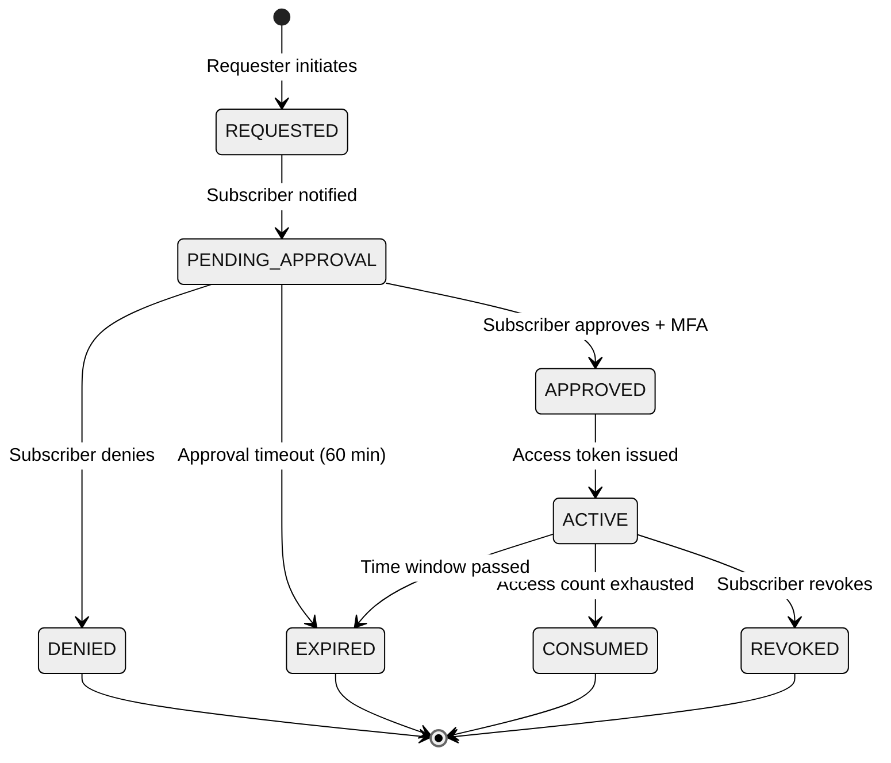
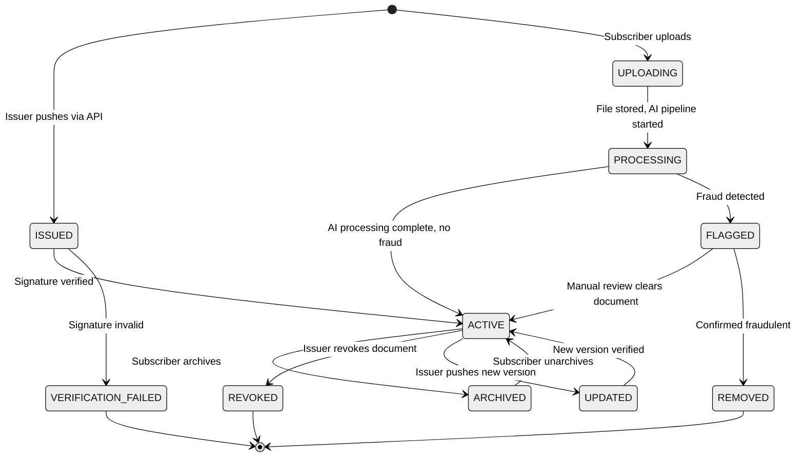

# Low-Level Design — Digital Document Vault Platform

## Core Data Models

### 1. Subscriber

```
Subscriber {
    subscriber_id       : UUID              // Primary key, globally unique
    national_id_hash    : String            // Hashed national identity number (never stored in plaintext)
    mobile_number_hash  : String            // Hashed mobile number for OTP-based auth
    display_name        : String            // Subscriber's name (from eKYC)
    email_encrypted     : String            // AES-256 encrypted email (optional)
    date_of_birth       : Date              // From eKYC, used for document matching
    registration_date   : Timestamp         // Account creation timestamp
    kyc_status          : Enum              // PENDING | VERIFIED | SUSPENDED | DEACTIVATED
    storage_used_bytes  : Long              // Current self-uploaded storage consumption
    storage_quota_bytes : Long              // Max allowed (default 1 GB)
    preferred_language  : String            // UI language preference (22 official languages)
    devices             : List<Device>      // Registered trusted devices
    last_login          : Timestamp
    mfa_config          : MFAConfig         // MFA method preferences
    created_at          : Timestamp
    updated_at          : Timestamp
}

Device {
    device_id           : UUID
    subscriber_id       : UUID              // FK to Subscriber
    device_fingerprint  : String            // Hashed device identifier
    device_type         : Enum              // ANDROID | IOS | WEB_BROWSER
    push_token          : String            // For push notifications
    is_trusted          : Boolean           // True after successful MFA on this device
    last_used           : Timestamp
    registered_at       : Timestamp
}
```

### 2. Document Reference

```
DocumentReference {
    document_id         : UUID              // Primary key
    subscriber_id       : UUID              // FK to Subscriber (vault owner)
    document_uri        : String            // Persistent URI: "issuer-id/doc-type/doc-id"
    issuer_id           : String            // Issuer organization identifier
    document_type       : String            // Standardized type code (e.g., "DRVLC", "PANCR", "EDCRT")
    document_title      : String            // Human-readable title
    source              : Enum              // ISSUER_PUSHED | PULL_URI | SELF_UPLOADED
    storage_type        : Enum              // URI_REFERENCE | OBJECT_STORAGE
    object_storage_key  : String            // Only for SELF_UPLOADED; key in object storage
    signature_hash      : String            // SHA-256 hash of the document's digital signature
    issuer_certificate  : String            // Issuer's signing certificate thumbprint
    issued_date         : Date              // When the original document was issued
    expiry_date         : Date              // Document expiry (e.g., license expiry), nullable
    metadata            : Map<String,String>// Extracted metadata (name, ID numbers, dates)
    ai_classification   : AIClassification  // AI-derived tags and category (for self-uploaded)
    fraud_score         : Float             // 0.0 (clean) to 1.0 (definitely tampered)
    status              : Enum              // ACTIVE | ARCHIVED | REVOKED | PROCESSING | FLAGGED
    ocr_text            : String            // Extracted text from OCR (for search indexing)
    cached_at           : Timestamp         // Last time document content was cached
    cache_ttl_seconds   : Integer           // Issuer-configured cache duration
    created_at          : Timestamp
    updated_at          : Timestamp
}

AIClassification {
    predicted_type      : String            // AI-predicted document type
    confidence          : Float             // 0.0 to 1.0
    extracted_fields    : Map<String,String> // {"name": "...", "id_number": "...", "date": "..."}
    tags                : List<String>       // Auto-generated tags for search
    processing_status   : Enum              // PENDING | COMPLETED | FAILED
    processed_at        : Timestamp
}
```

### 3. Consent Record

```
ConsentRecord {
    consent_id          : UUID              // Primary key
    subscriber_id       : UUID              // FK to Subscriber (consent grantor)
    requester_id        : String            // Organization requesting access
    requester_name      : String            // Human-readable requester name
    document_ids        : List<UUID>        // Specific documents covered by this consent
    purpose             : String            // Stated purpose (e.g., "KYC for loan application")
    purpose_code        : Enum              // IDENTITY_VERIFICATION | EMPLOYMENT | EDUCATION | FINANCIAL | LEGAL | OTHER
    access_type         : Enum              // FULL_DOCUMENT | FIELD_LEVEL
    permitted_fields    : List<String>      // If FIELD_LEVEL: specific fields accessible
    access_count_limit  : Integer           // Max number of times requester can access (0 = unlimited within window)
    access_count_used   : Integer           // Current access count
    granted_at          : Timestamp         // When subscriber approved
    expires_at          : Timestamp         // Consent expiry (max 1 year)
    revoked_at          : Timestamp         // Null if active; set when subscriber revokes
    revocation_reason   : String            // Optional reason for revocation
    status              : Enum              // REQUESTED | APPROVED | DENIED | EXPIRED | REVOKED
    access_token_hash   : String            // Hash of the access token issued to requester
    created_at          : Timestamp         // When requester initiated the request
}
```

### 4. Issuer

```
Issuer {
    issuer_id           : String            // Unique issuer code (e.g., "CBSE", "MCA", "RTO-DL")
    organization_name   : String            // Full legal name
    organization_type   : Enum              // CENTRAL_GOVT | STATE_GOVT | UNIVERSITY | REGULATORY | PSU
    api_endpoint        : String            // Pull URI base endpoint
    push_api_enabled    : Boolean           // Whether issuer supports Push API
    pull_api_enabled    : Boolean           // Whether issuer supports Pull URI
    signing_certificate : String            // Current PKI certificate for document signing
    certificate_chain   : List<String>      // Full chain to root CA
    certificate_expiry  : Date              // Certificate expiry date
    supported_doc_types : List<DocTypeConfig> // Document types this issuer can provide
    rate_limit          : Integer           // Max API calls per minute
    sla_latency_ms      : Integer           // Expected P99 response latency
    health_status       : Enum              // HEALTHY | DEGRADED | DOWN | UNKNOWN
    last_health_check   : Timestamp
    onboarded_at        : Timestamp
    status              : Enum              // ACTIVE | SUSPENDED | DEACTIVATED
}

DocTypeConfig {
    doc_type_code       : String            // e.g., "DRVLC" (Driving License)
    doc_type_name       : String            // e.g., "Driving License"
    schema_version      : String            // Response schema version
    pull_uri_template   : String            // URI template for Pull API
    identifier_type     : Enum              // NATIONAL_ID | REGISTRATION_NUMBER | CUSTOM
    supports_field_level: Boolean           // Whether field-level access is supported
}
```

### 5. Audit Event

```
AuditEvent {
    event_id            : UUID              // Primary key
    event_type          : Enum              // DOCUMENT_ISSUED | DOCUMENT_ACCESSED | CONSENT_REQUESTED
                                            // | CONSENT_GRANTED | CONSENT_DENIED | CONSENT_REVOKED
                                            // | DOCUMENT_UPLOADED | DOCUMENT_VERIFIED | LOGIN
                                            // | DOCUMENT_SHARED | FRAUD_DETECTED
    subscriber_id       : UUID              // Affected subscriber
    actor_id            : String            // Who performed the action (subscriber, issuer, or requester)
    actor_type          : Enum              // SUBSCRIBER | ISSUER | REQUESTER | SYSTEM
    document_id         : UUID              // Related document (nullable)
    consent_id          : UUID              // Related consent (nullable)
    ip_address          : String            // Anonymized IP (last octet masked)
    device_id           : UUID              // Device used (nullable)
    details             : Map<String,String> // Additional context
    timestamp           : Timestamp         // Event time (server clock, synchronized via NTP)
    signature           : String            // HMAC signature for tamper detection
}
```

### 6. Verification Result

```
VerificationResult {
    verification_id     : UUID              // Primary key
    document_id         : UUID              // Document that was verified
    document_uri        : String            // The URI that was verified
    signature_valid     : Boolean           // Whether digital signature is valid
    certificate_valid   : Boolean           // Whether signing certificate is valid and not revoked
    chain_valid         : Boolean           // Whether full certificate chain validates to root CA
    integrity_valid     : Boolean           // Whether document hash matches
    overall_status      : Enum              // VERIFIED | SIGNATURE_INVALID | CERT_REVOKED
                                            // | CERT_EXPIRED | CHAIN_BROKEN | TAMPERED | ERROR
    issuer_id           : String            // Issuer whose certificate was checked
    certificate_serial  : String            // Serial number of the signing certificate
    crl_check_time      : Timestamp         // When CRL was last checked
    verified_at         : Timestamp
    cached_until        : Timestamp         // Verification result cache expiry
}
```

---

## API Design

### 1. Subscriber Document Retrieval

```
GET /api/v1/subscriber/documents/{document_id}

Headers:
    Authorization: Bearer <subscriber_access_token>
    X-Device-ID: <registered_device_id>

Response 200:
{
    "document_id": "uuid",
    "document_uri": "issuer-id/doc-type/doc-id",
    "title": "Driving License",
    "document_type": "DRVLC",
    "issuer": {
        "id": "RTO-DL",
        "name": "Regional Transport Office - Delhi"
    },
    "issued_date": "2023-05-15",
    "expiry_date": "2043-05-14",
    "verification": {
        "status": "VERIFIED",
        "signature_valid": true,
        "verified_at": "2026-03-10T14:30:00Z"
    },
    "content_url": "https://vault.example.gov/docs/uuid/content",
    "content_type": "application/pdf",
    "source": "ISSUER_PUSHED",
    "metadata": {
        "holder_name": "...",
        "license_number": "DL-XXXXXXXXXX",
        "vehicle_class": "LMV"
    }
}

Response 202 (issuer temporarily unavailable, serving cached):
{
    "document_id": "uuid",
    ...
    "verification": {
        "status": "CACHED_PENDING_VERIFICATION",
        "last_verified_at": "2026-03-09T10:00:00Z",
        "reason": "Issuer API temporarily unavailable"
    }
}
```

### 2. Issuer Push API

```
POST /api/v1/issuer/documents/push

Headers:
    Authorization: Bearer <issuer_api_token>
    X-Issuer-ID: <issuer_id>
    Content-Type: application/json

Request:
{
    "subscriber_identifier": {
        "type": "NATIONAL_ID",
        "value_hash": "sha256_of_national_id"
    },
    "document": {
        "type": "EDCRT",
        "title": "Bachelor of Technology - Computer Science",
        "issued_date": "2026-06-15",
        "expiry_date": null,
        "uri": "IIT-D/EDCRT/2026/BTech/12345",
        "digital_signature": "<base64_encoded_signature>",
        "signing_certificate": "<base64_encoded_cert>",
        "content_hash": "sha256_of_document_content",
        "metadata": {
            "holder_name": "...",
            "roll_number": "...",
            "cgpa": "8.5",
            "year_of_passing": "2026"
        }
    }
}

Response 201:
{
    "document_id": "uuid",
    "document_uri": "IIT-D/EDCRT/2026/BTech/12345",
    "status": "ACCEPTED",
    "subscriber_notified": true,
    "received_at": "2026-06-15T10:30:00Z"
}

Response 400:
{
    "error": "SIGNATURE_VERIFICATION_FAILED",
    "message": "Document digital signature does not match the provided signing certificate",
    "details": { "expected_cert_thumbprint": "...", "provided_cert_thumbprint": "..." }
}
```

### 3. Consent Request (Requester-Initiated)

```
POST /api/v1/requester/consent/request

Headers:
    Authorization: Bearer <requester_api_token>

Request:
{
    "subscriber_identifier": {
        "type": "MOBILE_NUMBER_HASH",
        "value": "sha256_of_mobile"
    },
    "documents_requested": [
        {"type": "PANCR", "access_type": "FULL_DOCUMENT"},
        {"type": "ITRTN", "access_type": "FIELD_LEVEL", "fields": ["gross_income", "assessment_year"]}
    ],
    "purpose": "KYC verification for personal loan application",
    "purpose_code": "FINANCIAL",
    "duration_hours": 72,
    "access_count": 1,
    "callback_url": "https://requester.example.com/digilocker/callback"
}

Response 202:
{
    "consent_request_id": "uuid",
    "status": "PENDING_SUBSCRIBER_APPROVAL",
    "subscriber_notified": true,
    "expires_at": "2026-03-10T15:30:00Z",
    "approval_timeout_minutes": 60
}
```

### 4. Consent Approval (Subscriber Action)

```
POST /api/v1/subscriber/consent/{consent_request_id}/approve

Headers:
    Authorization: Bearer <subscriber_access_token>
    X-Device-ID: <device_id>
    X-MFA-Token: <step_up_mfa_token>

Request:
{
    "approved_documents": ["uuid-1", "uuid-2"],
    "modifications": {
        "duration_hours": 48,
        "access_count": 1
    }
}

Response 200:
{
    "consent_id": "uuid",
    "status": "APPROVED",
    "access_token_delivered": true,
    "requester_callback_invoked": true,
    "expires_at": "2026-03-12T14:30:00Z"
}
```

### 5. Document Fetch (Requester with Consent Token)

```
GET /api/v1/requester/documents/fetch

Headers:
    Authorization: Bearer <requester_api_token>
    X-Consent-Token: <consent_access_token>

Query Parameters:
    document_type=PANCR
    format=pdf

Response 200:
{
    "document": {
        "type": "PANCR",
        "content_base64": "<base64_encoded_pdf>",
        "content_type": "application/pdf",
        "verification": {
            "status": "VERIFIED",
            "issuer": "Income Tax Department",
            "signed_at": "2025-07-01T00:00:00Z",
            "verified_at": "2026-03-10T14:35:00Z"
        }
    },
    "consent": {
        "consent_id": "uuid",
        "purpose": "KYC verification for personal loan application",
        "remaining_access_count": 0,
        "expires_at": "2026-03-12T14:30:00Z"
    }
}

Response 403:
{
    "error": "CONSENT_EXPIRED",
    "message": "The consent token has expired. Please request new consent from the subscriber."
}
```

### 6. Document Verification (Public)

```
GET /api/v1/verify/{document_uri}

Query Parameters:
    qr_code=<encoded_qr_data>     // Alternative: verify via QR code scan

Response 200:
{
    "verification_status": "VERIFIED",
    "document_uri": "RTO-DL/DRVLC/DL-1234567890",
    "issuer": {
        "id": "RTO-DL",
        "name": "Regional Transport Office - Delhi",
        "certificate_valid": true
    },
    "signature": {
        "valid": true,
        "algorithm": "RSA-SHA256",
        "signed_at": "2023-05-15T00:00:00Z"
    },
    "certificate_chain": {
        "valid": true,
        "root_ca": "India PKI Root CA",
        "revocation_checked": true,
        "crl_last_updated": "2026-03-10T00:00:00Z"
    },
    "document_integrity": {
        "hash_algorithm": "SHA-256",
        "hash_match": true
    },
    "verified_at": "2026-03-10T14:40:00Z"
}
```

### 7. Self-Upload API

```
POST /api/v1/subscriber/documents/upload

Headers:
    Authorization: Bearer <subscriber_access_token>
    Content-Type: multipart/form-data

Form Data:
    file: <binary_file>
    title: "Property Tax Receipt 2025"
    category: "FINANCIAL"            // Optional; AI will auto-classify if omitted

Response 202:
{
    "document_id": "uuid",
    "status": "PROCESSING",
    "processing_stages": {
        "upload": "COMPLETED",
        "ocr": "IN_PROGRESS",
        "classification": "PENDING",
        "fraud_check": "PENDING"
    },
    "estimated_completion_seconds": 10,
    "storage_used_bytes": 245760,
    "storage_remaining_bytes": 1073496064
}
```

### 8. Search API

```
POST /api/v1/subscriber/documents/search

Headers:
    Authorization: Bearer <subscriber_access_token>

Request:
{
    "query": "my income tax return for 2024",
    "filters": {
        "document_types": [],
        "date_range": {"from": "2024-01-01", "to": "2024-12-31"},
        "source": null
    },
    "limit": 10,
    "offset": 0
}

Response 200:
{
    "results": [
        {
            "document_id": "uuid",
            "title": "Income Tax Return - AY 2024-25",
            "document_type": "ITRTN",
            "relevance_score": 0.95,
            "issuer": "Income Tax Department",
            "issued_date": "2024-09-15",
            "snippet": "Assessment Year 2024-25 | Gross Total Income: ₹..."
        }
    ],
    "total_count": 1,
    "suggestions": ["Did you also mean: Form 16 (2024)?"]
}
```

---

## Key Algorithms

### Algorithm 1: URI Resolution with Cascading Fallback

```
FUNCTION resolve_document(document_ref, subscriber_id):
    // Step 1: Check local cache
    cached = cache.get(document_ref.document_uri)
    IF cached AND cached.age < document_ref.cache_ttl_seconds:
        RETURN CachedResult(cached.content, cached.verification)

    // Step 2: Check circuit breaker for issuer
    issuer = issuer_registry.get(document_ref.issuer_id)
    IF circuit_breaker.is_open(issuer.issuer_id):
        // Issuer is known to be down; serve stale cache if available
        IF cached:
            RETURN DegradedResult(cached.content, "CACHED_PENDING_VERIFICATION")
        ELSE:
            RETURN Error("ISSUER_UNAVAILABLE", "Document cannot be retrieved at this time")

    // Step 3: Fetch from issuer via Pull URI
    TRY:
        pull_uri = build_pull_uri(issuer, document_ref)
        response = http_client.get(pull_uri, timeout=4000ms)

        // Step 4: Verify document signature
        verification = verify_document_signature(
            response.content,
            response.signature,
            issuer.signing_certificate,
            issuer.certificate_chain
        )

        IF verification.status != VERIFIED:
            audit_log.write(VERIFICATION_FAILED, document_ref, verification)
            RETURN Error("VERIFICATION_FAILED", verification.reason)

        // Step 5: Update cache and return
        cache.put(document_ref.document_uri, response.content, verification)
        circuit_breaker.record_success(issuer.issuer_id)
        RETURN VerifiedResult(response.content, verification)

    CATCH TimeoutException:
        circuit_breaker.record_failure(issuer.issuer_id)
        IF cached:
            RETURN DegradedResult(cached.content, "CACHED_PENDING_VERIFICATION")
        RETURN Error("ISSUER_TIMEOUT", "Issuer did not respond within 4 seconds")

    CATCH Exception as e:
        circuit_breaker.record_failure(issuer.issuer_id)
        log.error("URI resolution failed", document_ref, e)
        IF cached:
            RETURN DegradedResult(cached.content, "CACHED_PENDING_VERIFICATION")
        RETURN Error("RESOLUTION_FAILED", e.message)
```

### Algorithm 2: Consent Enforcement with Multi-Dimensional Validation

```
FUNCTION validate_consent_access(requester_id, consent_token, document_id):
    // Step 1: Decode and verify consent token
    consent = consent_db.find_by_token_hash(hash(consent_token))
    IF consent IS NULL:
        RETURN AccessDenied("INVALID_TOKEN", "Consent token not found")

    // Step 2: Multi-dimensional validation
    validations = [
        // Time check
        check_not_expired(consent.expires_at),
        // Revocation check
        check_not_revoked(consent.revoked_at),
        // Requester match
        check_requester_match(consent.requester_id, requester_id),
        // Document scope check
        check_document_in_scope(consent.document_ids, document_id),
        // Access count check
        check_access_count(consent.access_count_used, consent.access_count_limit),
    ]

    FOR validation IN validations:
        IF validation.failed:
            audit_log.write(CONSENT_VIOLATION, requester_id, consent.consent_id, validation.reason)
            RETURN AccessDenied(validation.error_code, validation.reason)

    // Step 3: Increment access count atomically
    updated = consent_db.atomic_increment_access_count(
        consent.consent_id,
        expected_count=consent.access_count_used
    )
    IF NOT updated:
        // Concurrent access race condition - retry
        RETURN validate_consent_access(requester_id, consent_token, document_id)

    // Step 4: Log successful access
    audit_log.write(DOCUMENT_ACCESSED_VIA_CONSENT, requester_id, document_id, consent.consent_id)

    RETURN AccessGranted(consent)
```

### Algorithm 3: AI Document Fraud Detection Pipeline

```
FUNCTION detect_document_fraud(uploaded_file, subscriber_id):
    fraud_signals = []
    overall_score = 0.0

    // Stage 1: Metadata Analysis
    metadata = extract_file_metadata(uploaded_file)
    IF metadata.creation_tool IN KNOWN_EDITING_TOOLS:
        fraud_signals.add("EDITED_WITH_IMAGE_EDITOR", weight=0.3)
    IF metadata.creation_date > metadata.modification_date:
        fraud_signals.add("TIMESTAMP_ANOMALY", weight=0.4)
    IF metadata.device_model != subscriber.known_devices:
        fraud_signals.add("UNKNOWN_DEVICE", weight=0.1)

    // Stage 2: Visual Forensics
    pixel_analysis = analyze_pixel_consistency(uploaded_file)
    IF pixel_analysis.has_copy_paste_artifacts:
        fraud_signals.add("COPY_PASTE_DETECTED", weight=0.6)
    IF pixel_analysis.has_font_inconsistency:
        fraud_signals.add("FONT_MISMATCH", weight=0.5)
    IF pixel_analysis.compression_level_varies_by_region:
        fraud_signals.add("SELECTIVE_RECOMPRESSION", weight=0.7)

    // Stage 3: OCR Cross-Validation
    ocr_result = ocr_engine.extract(uploaded_file)
    IF subscriber.verified_name AND ocr_result.extracted_name:
        name_similarity = fuzzy_match(subscriber.verified_name, ocr_result.extracted_name)
        IF name_similarity < 0.7:
            fraud_signals.add("NAME_MISMATCH", weight=0.8)

    // Stage 4: Cross-Reference with Issuer Data
    IF ocr_result.document_number:
        issuer_record = try_verify_with_issuer(ocr_result.document_type, ocr_result.document_number)
        IF issuer_record AND issuer_record.status == "NOT_FOUND":
            fraud_signals.add("DOCUMENT_NOT_IN_ISSUER_REGISTRY", weight=0.9)

    // Compute overall fraud score
    FOR signal IN fraud_signals:
        overall_score = max(overall_score, signal.weight)

    // Decision
    IF overall_score >= 0.7:
        flag_for_manual_review(uploaded_file, subscriber_id, fraud_signals)
        RETURN FraudResult("FLAGGED", overall_score, fraud_signals)
    ELSE IF overall_score >= 0.4:
        RETURN FraudResult("SUSPICIOUS", overall_score, fraud_signals)
    ELSE:
        RETURN FraudResult("CLEAN", overall_score, fraud_signals)
```

---

## State Machine: Consent Lifecycle



## State Machine: Document Lifecycle


