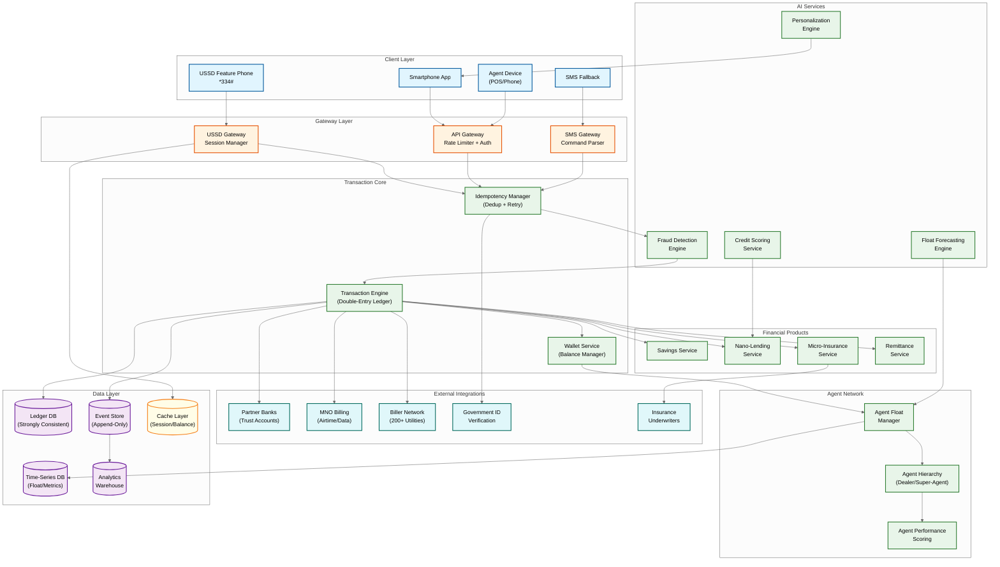

# High-Level Design — AI-Native Mobile Money Super App Platform

## System Context

The mobile money super app platform sits at the intersection of telecom infrastructure and financial services. It receives transaction requests through two primary channels: USSD sessions from feature phones routed via Mobile Network Operator (MNO) USSD gateways, and REST API calls from smartphone apps. Both channels converge on a unified transaction processing engine that maintains a double-entry ledger, enforces fraud checks, manages agent float, and orchestrates downstream integrations with partner banks (for trust account management), MNO billing systems (for airtime purchases), utility providers (for bill payments), insurance underwriters, and regulatory reporting systems. The platform operates across multiple countries, each with distinct regulatory requirements, currencies, and MNO partnerships, unified by a shared core ledger engine with country-specific configuration overlays.

---

## Architecture Diagram



---

## Component Descriptions

### 1. USSD Gateway & Session Manager

The USSD gateway terminates USSD sessions from MNO infrastructure and manages the stateful conversation flow. It maintains a server-side session store (keyed by USSD session ID and MSISDN) that tracks the user's position in the menu tree, accumulated input (recipient number, amount, etc.), and session expiry timer. The gateway translates multi-step financial transactions into sequential text menus, compressing each screen to ≤182 characters. It handles session drops gracefully: if a session terminates after the user confirmed a transaction but before the confirmation screen was rendered, the gateway marks the session as "orphaned-post-commit" and triggers an SMS confirmation as fallback. The gateway connects to MNOs via SS7/SIGTRAN or HTTP-based USSD aggregator APIs, with per-MNO adapters handling protocol differences.

### 2. API Gateway

The API gateway serves smartphone app traffic and agent device requests via REST/gRPC APIs. It handles authentication (JWT tokens for app users, API keys for agents and third-party developers), rate limiting (per-user, per-agent, per-developer-app), request validation, and TLS termination. For the Daraja-style developer API, it manages OAuth 2.0 flows, sandbox/production environment routing, and webhook delivery for asynchronous callbacks (STK push results, payment confirmations). The gateway implements circuit breakers for downstream service protection and maintains a request queue for burst absorption.

### 3. Transaction Engine (Double-Entry Ledger)

The heart of the platform: a strongly consistent, double-entry accounting engine where every financial operation is recorded as a balanced journal entry (total debits = total credits). A P2P transfer creates two entries: debit sender wallet + credit receiver wallet. An agent cash-in creates: debit agent float wallet + credit customer wallet. The engine enforces atomic balance updates with optimistic concurrency control, ensuring that concurrent transactions on the same wallet are serialized correctly. It integrates with the idempotency manager to prevent duplicate processing of retried USSD or API requests. All committed transactions produce an immutable event to the event store for downstream consumption.

### 4. Fraud Detection Engine

A real-time ML inference service that evaluates every transaction before ledger commit. The engine computes a risk score (0–100) from 200+ features including: behavioral biometrics (USSD navigation speed, time-of-day patterns), device signals (IMEI change, IMSI mismatch indicating SIM swap), transaction graph features (new recipient, unusual amount, velocity), geographic signals (transaction location vs. home location), and agent-specific patterns (uniform amounts suggesting structuring). Transactions scoring above threshold are either blocked (score >85), held for manual review (60–85), or flagged for async investigation (<60 but anomalous). The engine uses a two-phase architecture: a fast rule engine for known fraud patterns (<10ms) followed by an ML model ensemble for nuanced detection (<200ms).

### 5. Agent Float Manager

Manages the real-time liquidity position of 300,000+ agents. Each agent has an electronic float balance (e-value available for cash-in transactions) and the platform tracks implied physical cash position (derived from transaction history). The float manager maintains a hierarchical float distribution chain: head office → super-agent → dealer → retail agent. AI-driven forecasting predicts each agent's float needs for the next 24–72 hours based on historical patterns, location characteristics, and calendar events. When an agent's predicted float falls below the threshold for their expected transaction volume, the system alerts the agent's dealer to initiate rebalancing. The manager also enforces float limits (minimum and maximum per agent tier) and calculates commissions.

### 6. Credit Scoring & Nano-Lending Service

The credit scoring service maintains a continuously updated creditworthiness score for every active user, computed from mobile money behavioral data. The scoring model uses an ensemble of gradient-boosted trees (for structured features like transaction frequency and bill payment regularity) and embedding-based models (for sequential transaction patterns and social graph features). Scores are pre-computed and cached, with incremental updates triggered by significant transactions. The nano-lending service uses these scores to make instant loan offers: maximum loan amount, interest rate, and repayment period are all dynamically computed per user. Loan disbursement credits the user's wallet; repayment is automatically deducted from incoming transfers. The service manages the full loan lifecycle: origination, disbursement, repayment tracking, overdue handling, and collections.

---

## Data Flow: P2P Transfer via USSD

```
Step 1:  User dials *334# → MNO routes USSD session to platform's USSD gateway
Step 2:  USSD gateway creates server-side session, presents main menu:
         "1.Send Money 2.Withdraw 3.Buy Airtime 4.Pay Bill 5.My Account"
Step 3:  User selects "1" → Gateway presents: "Enter phone number:"
Step 4:  User enters recipient MSISDN → Gateway stores in session, presents: "Enter amount:"
Step 5:  User enters amount → Gateway stores in session, presents:
         "Send KES {amount} to {name}? Enter PIN to confirm:"
Step 6:  User enters PIN → Gateway sends transaction request to Idempotency Manager
Step 7:  Idempotency Manager generates idempotency key (hash of MSISDN + recipient + amount + timestamp window)
         Checks for duplicate → if new, forwards to Fraud Detection Engine
Step 8:  Fraud Detection Engine computes risk score:
         - Checks SIM swap status (IMSI consistency) → <10ms
         - Evaluates transaction features via ML model → <200ms
         - If score < threshold → APPROVE; else → BLOCK/HOLD
Step 9:  Transaction Engine executes double-entry ledger write:
         - BEGIN TRANSACTION
         - Debit sender wallet by (amount + fee)
         - Credit receiver wallet by amount
         - Credit fee collection wallet by fee
         - COMMIT (strongly consistent, synchronous replication)
Step 10: Transaction Engine publishes event to event store
Step 11: Notification service sends SMS to sender ("Confirmed. KES {amount} sent to {name}")
         and receiver ("You have received KES {amount} from {sender}")
Step 12: USSD gateway renders confirmation screen: "Sent! KES {amount} to {name}. Bal: KES {balance}"
Step 13: USSD session ends (total elapsed: 25–45 seconds including user input time)
```

---

## Data Flow: Agent Cash-Out

```
Step 1:  Customer visits agent, requests cash withdrawal of KES 5,000
Step 2:  Agent initiates transaction on agent device (app or USSD):
         enters customer's phone number and withdrawal amount
Step 3:  Customer receives USSD push or SMS: "Withdraw KES 5,000 from Agent {name}? Enter PIN:"
Step 4:  Customer enters PIN → Transaction request sent to platform
Step 5:  Fraud Detection: checks agent-customer pair, amount vs. usual pattern, agent daily volume
Step 6:  Float Manager: verifies agent has sufficient electronic float (≥ KES 5,000)
Step 7:  Transaction Engine executes:
         - Debit customer wallet by KES 5,000
         - Credit agent wallet by KES 5,000 (restoring electronic float)
         - Debit agent commission pool, credit agent wallet by commission
Step 8:  Agent physically hands KES 5,000 cash to customer
Step 9:  Both parties receive SMS confirmation
Step 10: Float Manager updates agent's float position and recalculates forecast
```

---

## Data Flow: Nano-Loan Disbursement

```
Step 1:  User accesses loan menu via USSD (*334*5#) or app
Step 2:  Credit Scoring Service retrieves cached score (or computes fresh if stale >24h)
Step 3:  Lending Service computes offer: max KES 2,000 at 7.5% facility fee, 30-day term
Step 4:  User reviews offer on USSD: "Borrow KES 2000. Fee KES 150. Repay KES 2150 in 30 days. 1.Accept 2.Cancel"
Step 5:  User accepts → PIN confirmation
Step 6:  Transaction Engine executes:
         - Credit user wallet by KES 2,000 (loan disbursement)
         - Debit lending pool wallet by KES 2,000
         - Create loan record: principal, fee, due date, repayment schedule
Step 7:  Automatic repayment hook installed: incoming transfers to user wallet are partially swept to repay loan
Step 8:  SMS confirmation: "Loan of KES 2,000 received. Repay KES 2,150 by {date}."
```

---

## Key Design Decisions

| Decision | Choice | Trade-off |
|---|---|---|
| **Ledger consistency model** | Strongly consistent (synchronous replication across AZs) | Higher write latency (~20ms replication overhead) but zero risk of money loss on failover; in financial systems, consistency trumps availability |
| **USSD session state storage** | In-memory distributed cache with TTL matching session timeout | Fast reads (<1ms) but session state lost on cache node failure; acceptable because USSD sessions are short-lived and user can re-dial |
| **Fraud detection placement** | Synchronous (inline) before ledger commit | Adds 100–200ms to every transaction but prevents fraudulent money movement; post-commit fraud detection only works for reversible transactions |
| **Agent float tracking** | Event-sourced from transaction stream, not separate float transactions | Eliminates dual-write risk (float balance always derivable from transaction ledger) but requires real-time stream processing for float dashboards |
| **Credit score computation** | Pre-computed and cached, refreshed incrementally per transaction | Instant loan approvals but scores may be slightly stale; acceptable because credit risk changes gradually, not per-transaction |
| **Multi-country architecture** | Shared core engine, country-specific configuration and data partitions | Reduces code duplication but increases configuration complexity; ledger data never crosses country boundaries for regulatory compliance |
| **SMS as receipt layer** | SMS for USSD users, push notification for app users | SMS has per-message cost and delivery uncertainty but is the only reliable receipt channel for feature phone users |
| **Double-entry vs. single-entry ledger** | Double-entry with balanced journal entries | More complex writes but enables real-time reconciliation: sum of all balances must be zero (or equal to trust account total); any imbalance immediately detectable |
