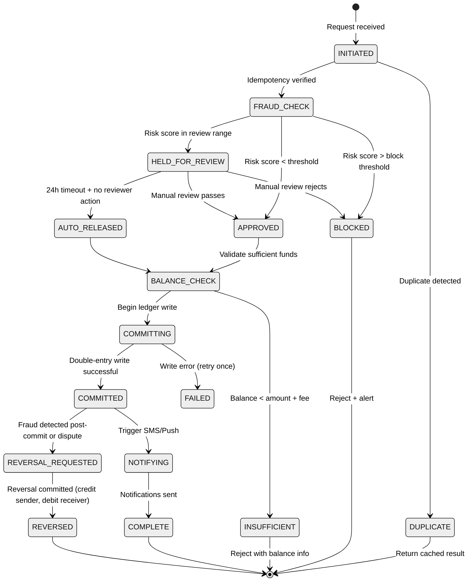
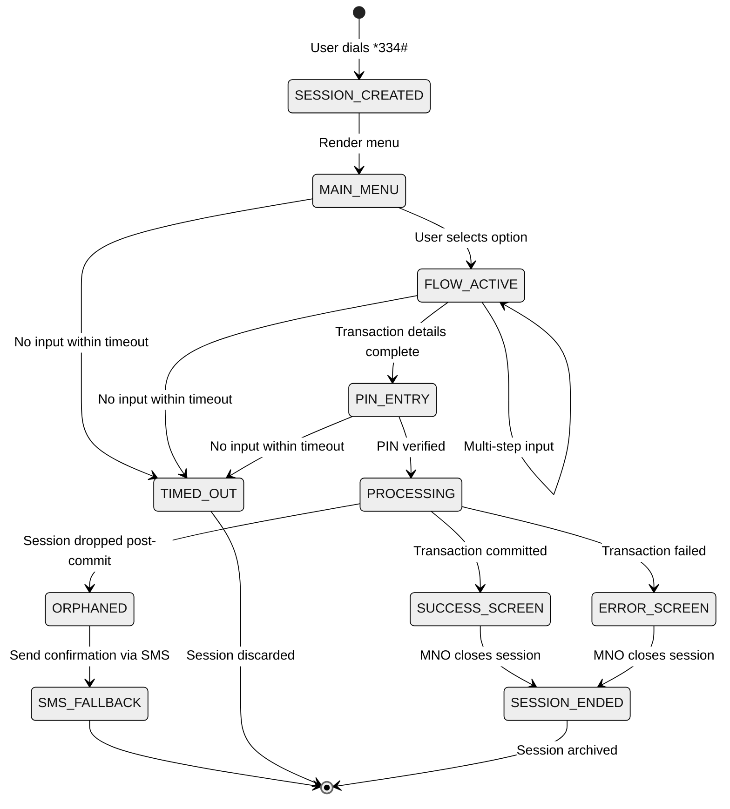

# Low-Level Design — AI-Native Mobile Money Super App Platform

## Core Data Models

### Wallet

```
Wallet {
    wallet_id:          UUID                    // Internal unique identifier
    msisdn:             String(15)              // Phone number (E.164 format: +254712345678)
    country_code:       String(2)               // ISO 3166-1 alpha-2 (KE, TZ, GH, etc.)
    wallet_type:        Enum[PERSONAL, MERCHANT, AGENT, DEALER, SUPER_AGENT,
                             SYSTEM_FEE, LENDING_POOL, INSURANCE_POOL, FLOAT_RESERVE]
    status:             Enum[ACTIVE, SUSPENDED, DORMANT, CLOSED, KYC_PENDING]
    kyc_tier:           Enum[TIER_1, TIER_2, TIER_3]
    balance_cents:      BigInteger              // Balance in smallest currency unit (cents/centimes)
    currency:           String(3)               // ISO 4217 (KES, TZS, GHS, NGN, etc.)
    daily_limit_cents:  BigInteger              // Per-tier transaction limit
    pin_hash:           String(256)             // Bcrypt hash of PIN
    pin_attempts:       Integer                 // Failed PIN attempts (reset on success)
    device_imei:        String(15)              // Last known IMEI (for SIM swap detection)
    device_imsi:        String(15)              // Last known IMSI
    last_active_at:     Timestamp
    created_at:         Timestamp
    updated_at:         Timestamp
    version:            BigInteger              // Optimistic concurrency control
}
Index: PRIMARY(wallet_id), UNIQUE(msisdn, country_code), INDEX(wallet_type, country_code)
Partitioning: By country_code (regulatory data separation)
```

### Transaction (Ledger Entry)

```
LedgerEntry {
    entry_id:           UUID
    journal_id:         UUID                    // Groups debit + credit entries for one transaction
    idempotency_key:    String(128)             // Deduplication key
    wallet_id:          UUID                    // FK → Wallet
    entry_type:         Enum[DEBIT, CREDIT]
    amount_cents:       BigInteger              // Always positive
    balance_before:     BigInteger              // Snapshot for audit trail
    balance_after:      BigInteger              // balance_before ± amount_cents
    transaction_type:   Enum[P2P_TRANSFER, CASH_IN, CASH_OUT, MERCHANT_PAYMENT,
                             BILL_PAYMENT, AIRTIME_PURCHASE, LOAN_DISBURSE,
                             LOAN_REPAY, INSURANCE_PREMIUM, INSURANCE_CLAIM,
                             FEE, COMMISSION, INTEREST, REVERSAL, SETTLEMENT]
    counterparty_id:    UUID                    // The other wallet in this journal entry
    channel:            Enum[USSD, APP, SMS, AGENT_POS, API, SYSTEM]
    reference:          String(64)              // Human-readable reference (e.g., "TXN-KE-20250315-ABCD1234")
    metadata:           JSON                    // Channel-specific data (USSD session ID, agent ID, bill reference, etc.)
    fraud_score:        Float                   // 0-100 risk score at time of transaction
    status:             Enum[COMMITTED, REVERSED, PENDING_REVERSAL]
    created_at:         Timestamp
    country_code:       String(2)
}
Index: PRIMARY(entry_id), INDEX(journal_id), INDEX(wallet_id, created_at DESC),
       UNIQUE(idempotency_key), INDEX(transaction_type, created_at),
       INDEX(counterparty_id, created_at)
Partitioning: By country_code, then by created_at (monthly)
```

### USSD Session

```
USSDSession {
    session_id:         String(64)              // MNO-assigned USSD session identifier
    msisdn:             String(15)
    mno_code:           String(10)              // Mobile network operator identifier
    menu_state:         String(50)              // Current position in menu tree (e.g., "SEND_MONEY.ENTER_AMOUNT")
    accumulated_input:  JSON                    // Data collected so far: {recipient: "+254...", amount: 5000}
    pin_verified:       Boolean                 // Whether PIN has been verified in this session
    transaction_id:     UUID                    // Set when transaction is initiated (null before)
    transaction_status: Enum[NOT_STARTED, SUBMITTED, COMMITTED, FAILED]
    started_at:         Timestamp
    last_activity_at:   Timestamp
    timeout_seconds:    Integer                 // MNO-specific timeout (60-180s)
    expires_at:         Timestamp               // Computed: last_activity_at + timeout_seconds
    channel_metadata:   JSON                    // MNO-specific routing info
}
Storage: In-memory distributed cache (not persisted to disk)
TTL: Matches session timeout (max 180 seconds)
Eviction: On session end, timeout, or explicit close
```

### Agent Profile

```
AgentProfile {
    agent_id:           UUID
    wallet_id:          UUID                    // FK → Wallet (agent's float wallet)
    agent_type:         Enum[RETAIL, DEALER, SUPER_AGENT, HEAD_OFFICE]
    parent_agent_id:    UUID                    // Hierarchy: retail → dealer → super_agent → head_office
    business_name:      String(200)
    location:           GeoPoint                // Latitude, longitude
    region:             String(100)             // Administrative region
    kyc_status:         Enum[VERIFIED, PENDING, SUSPENDED]
    commission_tier:    Enum[STANDARD, PREMIUM, ENTERPRISE]
    float_limit_max:    BigInteger              // Maximum electronic float allowed
    float_limit_min:    BigInteger              // Minimum float before alert
    daily_txn_limit:    BigInteger              // Regulatory daily transaction cap
    performance_score:  Float                   // 0-100 composite score
    status:             Enum[ACTIVE, SUSPENDED, DEACTIVATED]
    activated_at:       Timestamp
    country_code:       String(2)
}
Index: PRIMARY(agent_id), INDEX(wallet_id), INDEX(parent_agent_id),
       SPATIAL_INDEX(location), INDEX(region, agent_type)
```

### Credit Score

```
CreditScore {
    score_id:           UUID
    wallet_id:          UUID                    // FK → Wallet
    score_value:        Float                   // 0-1000 (higher = more creditworthy)
    score_band:         Enum[VERY_LOW, LOW, MEDIUM, HIGH, VERY_HIGH]
    max_loan_cents:     BigInteger              // Maximum approvable loan amount
    suggested_rate:     Float                   // Interest rate based on risk band
    feature_snapshot:   JSON                    // Key features at scoring time
    model_version:      String(20)              // ML model version used
    computed_at:        Timestamp
    valid_until:        Timestamp               // Score expires after 24-72 hours
    country_code:       String(2)
}
Index: PRIMARY(score_id), INDEX(wallet_id, computed_at DESC)
Cache: Latest score per wallet_id cached with TTL = valid_until
```

### Loan

```
Loan {
    loan_id:            UUID
    borrower_wallet_id: UUID                    // FK → Wallet
    pool_wallet_id:     UUID                    // FK → Wallet (lending pool)
    principal_cents:    BigInteger
    fee_cents:          BigInteger              // Facility fee
    total_due_cents:    BigInteger              // principal + fee
    amount_repaid:      BigInteger              // Running total of repayments
    status:             Enum[DISBURSED, PARTIALLY_REPAID, FULLY_REPAID, OVERDUE, DEFAULTED, WRITTEN_OFF]
    credit_score_at_origination: Float
    disbursed_at:       Timestamp
    due_date:           Timestamp
    repayment_method:   Enum[AUTO_SWEEP, MANUAL, SCHEDULED]
    sweep_percentage:   Float                   // % of incoming transfers auto-deducted (e.g., 10%)
    overdue_days:       Integer
    country_code:       String(2)
}
Index: PRIMARY(loan_id), INDEX(borrower_wallet_id, status),
       INDEX(status, due_date), INDEX(country_code, status)
```

### Insurance Policy

```
InsurancePolicy {
    policy_id:          UUID
    holder_wallet_id:   UUID                    // FK → Wallet
    product_type:       Enum[HOSPITAL_CASH, LIFE_COVER, CROP_INSURANCE, DEVICE_INSURANCE]
    underwriter_id:     String(50)              // External insurance partner
    premium_cents:      BigInteger              // Per-period premium
    premium_frequency:  Enum[DAILY, WEEKLY, MONTHLY]
    cover_amount_cents: BigInteger              // Maximum payout
    status:             Enum[ACTIVE, LAPSED, CLAIMED, CANCELLED]
    enrolled_at:        Timestamp
    next_premium_due:   Timestamp
    last_premium_paid:  Timestamp
    country_code:       String(2)
}
```

---

## API Design

### 1. Initiate P2P Transfer

```
POST /v1/transfers/p2p
Headers: Authorization: Bearer {token}, X-Idempotency-Key: {key}, X-Channel: {USSD|APP|API}

Request:
{
    "sender_msisdn":    "+254712345678",
    "receiver_msisdn":  "+254798765432",
    "amount_cents":     500000,             // KES 5,000
    "currency":         "KES",
    "pin":              "{encrypted_pin}",  // RSA-encrypted PIN
    "purpose":          "family_support"    // Optional categorization
}

Response (200 OK):
{
    "transaction_id":   "txn-ke-20250315-a1b2c3d4",
    "journal_id":       "jnl-xxxx-xxxx",
    "status":           "COMMITTED",
    "sender_balance":   1250000,            // New balance in cents
    "fee_cents":        3300,               // Transaction fee charged
    "timestamp":        "2025-03-15T10:30:45Z"
}

Error (402 Insufficient Funds):
{
    "error_code":       "INSUFFICIENT_BALANCE",
    "message":          "Balance KES 4,500 insufficient for KES 5,000 + KES 33 fee",
    "available_balance": 450000
}
```

### 2. Agent Cash-In

```
POST /v1/agent/cash-in
Headers: Authorization: Bearer {agent_token}, X-Idempotency-Key: {key}

Request:
{
    "agent_id":         "agt-xxxx-xxxx",
    "customer_msisdn":  "+254712345678",
    "amount_cents":     1000000,            // KES 10,000
    "customer_pin":     "{encrypted_pin}"
}

Response (200 OK):
{
    "transaction_id":   "txn-ke-20250315-e5f6g7h8",
    "agent_float_remaining": 15000000,      // Agent's remaining float
    "customer_new_balance":  2500000,
    "commission_earned":     2000            // Agent commission for this transaction
}
```

### 3. Check Balance (USSD-Optimized)

```
GET /v1/wallet/balance?msisdn={msisdn}&channel=USSD
Headers: X-USSD-Session-Id: {session_id}

Response (200 OK):
{
    "balance_cents":    1250000,
    "currency":         "KES",
    "display_text":     "Bal: KES 12,500.00",   // Pre-formatted for USSD screen
    "last_transaction": "Sent KES 5,000 to Jane"
}
```

### 4. Request Nano-Loan

```
POST /v1/loans/request
Headers: Authorization: Bearer {token}, X-Idempotency-Key: {key}

Request:
{
    "borrower_msisdn":  "+254712345678",
    "requested_amount":  200000,            // KES 2,000 (may be adjusted down)
    "pin":              "{encrypted_pin}"
}

Response (200 OK):
{
    "loan_id":          "loan-xxxx-xxxx",
    "approved_amount":  200000,
    "fee_cents":        15000,              // 7.5% facility fee
    "total_repayable":  215000,
    "due_date":         "2025-04-14",
    "auto_sweep_rate":  0.10,               // 10% of incoming transfers
    "disbursed":        true,
    "new_balance":      1450000
}
```

### 5. Agent Float Status

```
GET /v1/agent/float/{agent_id}
Headers: Authorization: Bearer {agent_token}

Response (200 OK):
{
    "agent_id":         "agt-xxxx-xxxx",
    "electronic_float": 15000000,
    "float_limit_max":  50000000,
    "float_limit_min":  5000000,
    "today_cash_in":    8500000,
    "today_cash_out":   12000000,
    "predicted_need_24h": 18000000,         // AI-predicted float need
    "rebalance_alert":  true,               // Float below predicted need
    "nearest_dealer":   {
        "dealer_id":    "dlr-xxxx",
        "name":         "Dealer X",
        "distance_km":  3.2,
        "phone":        "+254700000000"
    }
}
```

### 6. USSD Session Handler (Internal API)

```
POST /internal/ussd/callback
Headers: X-MNO-Id: {mno_code}

Request (from MNO USSD gateway):
{
    "session_id":       "ussd-session-12345",
    "msisdn":           "+254712345678",
    "input":            "1",                    // User's menu selection
    "service_code":     "*334#",
    "session_type":     "CONTINUE"              // NEW | CONTINUE | TIMEOUT | END
}

Response:
{
    "session_id":       "ussd-session-12345",
    "response_type":    "CONTINUE",             // CONTINUE (expect more input) | END (session done)
    "message":          "Send Money\n1.To M-Pesa User\n2.To Other Network\n3.To Bank"
}
```

### 7. Fraud Check (Internal Service API)

```
POST /internal/fraud/evaluate
Request:
{
    "transaction_id":   "txn-pending-xxxx",
    "sender_wallet_id": "wal-xxxx",
    "receiver_wallet_id": "wal-yyyy",
    "amount_cents":     500000,
    "channel":          "USSD",
    "device_imei":      "123456789012345",
    "device_imsi":      "639020000000000",
    "session_metadata": { "typing_speed_ms": [1200, 800, 1500, 900] }
}

Response:
{
    "risk_score":       23.5,
    "decision":         "APPROVE",              // APPROVE | HOLD | BLOCK
    "signals": [
        {"signal": "sim_swap_check", "result": "PASS", "detail": "IMSI consistent 90+ days"},
        {"signal": "velocity_check", "result": "PASS", "detail": "3 txns today, within normal"},
        {"signal": "amount_anomaly", "result": "LOW_RISK", "detail": "Within 1.5 stddev of mean"},
        {"signal": "recipient_trust", "result": "PASS", "detail": "Known recipient, 12 prior txns"}
    ],
    "latency_ms":       87
}
```

### 8. Developer API — STK Push (Daraja-Style)

```
POST /v1/mpesa/stkpush
Headers: Authorization: Bearer {developer_oauth_token}

Request:
{
    "business_short_code": "174379",
    "amount":              150000,              // KES 1,500
    "phone_number":        "254712345678",
    "callback_url":        "https://merchant.example.com/callback",
    "account_reference":   "Order-12345",
    "transaction_desc":    "Payment for groceries"
}

Response (200 OK):
{
    "merchant_request_id": "mrq-xxxx",
    "checkout_request_id": "chk-xxxx",
    "response_code":       "0",
    "response_description": "Success. Request accepted for processing",
    "customer_message":     "Lipa na M-Pesa request sent to +254712345678"
}

// Async callback to merchant's URL after customer confirms:
POST {callback_url}
{
    "result_code":      0,
    "result_desc":      "The service request is processed successfully.",
    "checkout_request_id": "chk-xxxx",
    "amount":           150000,
    "mpesa_receipt":    "TXN-KE-20250315-WXYZ",
    "transaction_date": "2025-03-15T14:22:33Z",
    "phone_number":     "254712345678"
}
```

---

## Key Algorithms

### Algorithm 1: USSD Session State Machine

```
USSD Session State Machine:

States:
  INIT            → Session just created, show main menu
  MENU_SELECT     → Awaiting user's menu choice
  SEND_RECIPIENT  → Awaiting recipient phone number
  SEND_AMOUNT     → Awaiting transfer amount
  SEND_CONFIRM    → Displaying confirmation, awaiting PIN
  PROCESSING      → Transaction submitted, awaiting result
  COMPLETE        → Success screen displayed
  ERROR           → Error screen displayed
  TIMEOUT         → Session expired (MNO terminated)
  ORPHANED        → Session dropped post-commit (send SMS fallback)

Transitions:
  INIT → MENU_SELECT:
    action: render_main_menu()
    output: "1.Send Money 2.Withdraw 3.Airtime 4.Pay Bill 5.My Account"

  MENU_SELECT → SEND_RECIPIENT [input == "1"]:
    action: set_flow("P2P_TRANSFER")
    output: "Enter phone number:"

  SEND_RECIPIENT → SEND_AMOUNT [valid_msisdn(input)]:
    action: store_recipient(input), lookup_name(input)
    output: "Enter amount (KES):"

  SEND_RECIPIENT → SEND_RECIPIENT [invalid_msisdn(input)]:
    output: "Invalid number. Enter phone number:"
    max_retries: 2 → then ERROR

  SEND_AMOUNT → SEND_CONFIRM [valid_amount(input)]:
    action: store_amount(input), compute_fee(input)
    output: "Send KES {amount} to {name}? Fee KES {fee}. Enter PIN:"

  SEND_CONFIRM → PROCESSING [valid_pin(input)]:
    action: submit_transaction(session.accumulated_input)
    output: <wait for transaction result>

  PROCESSING → COMPLETE [txn_success]:
    output: "Sent! KES {amount} to {name}. Bal: KES {balance}"
    session_type: END

  PROCESSING → ERROR [txn_failed]:
    output: "Failed: {reason}. Dial *334# to retry."
    session_type: END

  ANY_STATE → TIMEOUT [mno_session_expired]:
    if state == PROCESSING and txn_committed:
      → ORPHANED: trigger_sms_confirmation()
    else if state == PROCESSING and txn_pending:
      → cancel_pending_transaction()
    else:
      → discard_session()

Timeout Budget Calculation:
  total_budget = mno_timeout (e.g., 60 seconds)
  user_think_time_per_screen ≈ 8 seconds (empirical)
  screens_in_flow = 5 (menu → recipient → amount → confirm → result)
  user_time = 5 × 8 = 40 seconds
  system_time_budget = 60 - 40 = 20 seconds
  per_screen_system_budget = 20 / 5 = 4 seconds max per server round-trip
  target: < 500ms per server round-trip (leaving 3.5s buffer for network)
```

### Algorithm 2: Agent Float Rebalancing Forecast

```
Algorithm: PredictAgentFloatNeed(agent_id, forecast_horizon_hours)

Input:
  agent_id: target agent
  forecast_horizon_hours: 24 or 72

Steps:
  1. LOAD historical transaction data for agent:
     cash_in_history[]  = daily cash-in totals, last 90 days
     cash_out_history[] = daily cash-out totals, last 90 days

  2. EXTRACT temporal features:
     day_of_week        = target_date.weekday()         // Mon=0, Sun=6
     day_of_month       = target_date.day()              // 1-31 (payday detection)
     is_month_end       = day_of_month >= 25
     is_holiday         = check_holiday_calendar(target_date, agent.country_code)
     season             = get_season(target_date, agent.region)  // harvest, dry, etc.

  3. EXTRACT location features:
     agent_type_cluster = classify_agent(agent.location)  // urban_commercial, rural_agricultural,
                                                           // peri_urban_residential, transport_hub
     nearby_events      = check_events(agent.location, target_date)  // market day, festival

  4. COMPUTE base forecast using exponential weighted moving average:
     FOR each hour h in forecast_horizon:
       predicted_cash_in[h]  = EWMA(cash_in_history, alpha=0.3, day_of_week, hour=h)
       predicted_cash_out[h] = EWMA(cash_out_history, alpha=0.3, day_of_week, hour=h)

  5. APPLY adjustment factors:
     IF is_month_end:
       predicted_cash_out *= 1.8    // Payday withdrawal spike
     IF is_holiday:
       predicted_cash_in  *= 1.5    // Remittance receiving spike
       predicted_cash_out *= 1.3    // Spending spike
     IF agent_type_cluster == "rural_agricultural" AND season == "harvest":
       predicted_cash_in  *= 2.0    // Farmers depositing harvest income

  6. COMPUTE net float change per hour:
     FOR each hour h:
       net_change[h] = predicted_cash_in[h] - predicted_cash_out[h]

  7. PROJECT float position:
     current_float = get_current_float(agent_id)
     projected_float[0] = current_float
     FOR each hour h from 1 to forecast_horizon:
       projected_float[h] = projected_float[h-1] + net_change[h]

  8. DETECT rebalancing need:
     min_projected = MIN(projected_float[])
     IF min_projected < agent.float_limit_min:
       shortfall = agent.float_limit_min - min_projected
       hours_until_shortfall = first h where projected_float[h] < float_limit_min
       TRIGGER rebalancing_alert(agent_id, shortfall, hours_until_shortfall)
       RECOMMEND dealer: find_nearest_dealer_with_capacity(agent.location, shortfall)

  9. RETURN {
       projected_float: projected_float[],
       rebalance_needed: min_projected < float_limit_min,
       shortfall_amount: MAX(0, float_limit_min - min_projected),
       recommended_action: "Request {shortfall} from {dealer.name} before {hour}h",
       confidence: model_confidence_score
     }
```

### Algorithm 3: Alternative Credit Scoring for the Unbanked

```
Algorithm: ComputeCreditScore(wallet_id)

Input: wallet_id of user requesting credit

Steps:
  1. EXTRACT behavioral features (last 6 months of transaction history):

     // Income stability features
     income_regularity     = coefficient_of_variation(monthly_income_amounts)
     income_sources_count  = count_distinct(credit_counterparties with amount > threshold)
     income_growth_trend   = linear_regression_slope(monthly_income)

     // Spending discipline features
     bill_payment_rate     = bills_paid_on_time / total_bills_due
     airtime_consistency   = stddev(weekly_airtime_spend) / mean(weekly_airtime_spend)
     expense_to_income     = total_debits / total_credits

     // Savings behavior features
     savings_rate          = amount_in_savings / total_income
     savings_consistency   = months_with_savings_deposit / 6
     max_balance_held      = max(daily_closing_balances)

     // Transaction pattern features
     txn_frequency         = total_transactions / days_active
     unique_recipients     = count_distinct(debit_counterparties)
     unique_senders        = count_distinct(credit_counterparties)
     weekend_activity      = weekend_txns / total_txns
     nighttime_activity    = night_txns / total_txns (proxy for business type)

     // Social graph features
     top_contacts_score    = average(credit_scores of top 5 transacting contacts)
     reciprocity_ratio     = bidirectional_relationships / total_relationships
     network_diversity     = entropy(transaction_amounts_by_contact)

     // Digital literacy proxy
     ussd_session_speed    = average(time_between_menu_selections)
     feature_adoption      = count(distinct_services_used) / total_available_services
     app_vs_ussd_ratio     = app_transactions / total_transactions

  2. HANDLE missing data:
     FOR each feature:
       IF data_points < minimum_threshold:
         use_population_median(feature, agent.region, kyc_tier)
         SET feature_confidence = LOW

  3. COMPUTE score using ensemble model:
     // Gradient Boosted Trees (structured features)
     gbt_score = GBTModel.predict(structured_features)   // 0-1000

     // Neural embedding (sequential transaction patterns)
     txn_sequence = last_100_transactions as embedding vectors
     nn_score  = SequenceModel.predict(txn_sequence)      // 0-1000

     // Ensemble
     final_score = 0.65 * gbt_score + 0.35 * nn_score

  4. APPLY policy adjustments:
     IF first_time_borrower:
       max_loan = MIN(calculated_max, FIRST_LOAN_CAP)     // Conservative first loan
     IF previous_loan_defaulted:
       final_score *= 0.5                                   // Heavy penalty
       cooldown_check(last_default_date, minimum_cooldown_days)
     IF account_age < 90_days:
       final_score *= 0.7                                   // Insufficient history discount

  5. MAP score to loan parameters:
     score_band = classify(final_score, [0-200: VERY_LOW, 201-400: LOW,
                                         401-600: MEDIUM, 601-800: HIGH, 801-1000: VERY_HIGH])
     max_loan   = LOAN_LIMIT_TABLE[score_band][kyc_tier]
     rate       = RATE_TABLE[score_band]                    // Higher risk = higher rate
     term_days  = TERM_TABLE[score_band]                    // Lower risk = longer term option

  6. RETURN {
       score: final_score,
       band: score_band,
       max_loan_cents: max_loan,
       suggested_rate: rate,
       max_term_days: term_days,
       model_version: "v3.2.1",
       feature_importances: top_10_contributing_features,
       valid_until: now() + 24_hours
     }
```

---

## State Machine: Transaction Lifecycle



---

## State Machine: USSD Session Lifecycle


