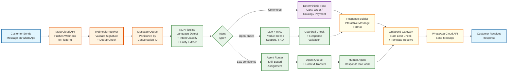
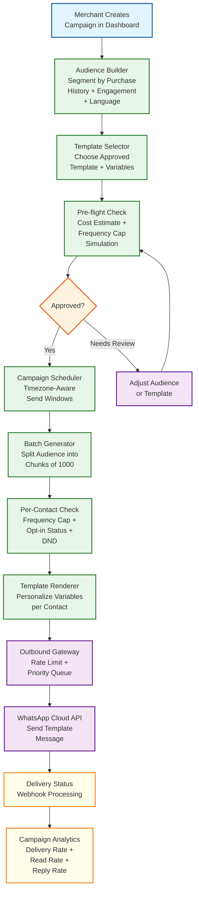
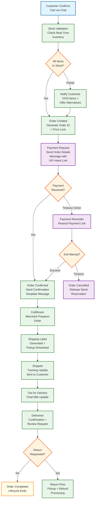

# 14.2 AI-Native Conversational Commerce Platform (WhatsApp-First) — High-Level Design

## System Architecture

```mermaid
flowchart TB
    subgraph External["External Systems"]
        WA[WhatsApp Cloud API\nMeta Platform]
        PG[Payment Gateway\nUPI + Cards + Wallets]
        SH[Shipping Aggregator\nTracking + Labels]
        CM[Commerce Manager\nMeta Catalog API]
    end

    subgraph Ingestion["Ingestion Layer"]
        WH[Webhook Receiver\nSignature Validation\n+ Deduplication]
        MQ[Message Queue\nDurable + Ordered]
        OB[Outbound Gateway\nRate Limiter\n+ Template Resolver]
    end

    subgraph AI["Conversational AI Layer"]
        LD[Language Detector\n+ Code-Mix Normalizer]
        IC[Intent Classifier\n12+ Languages]
        EE[Entity Extractor\nProducts + Quantities\n+ Attributes]
        CR[Context Manager\nConversation State\n+ Coreference]
        RG[Response Generator\nTemplate + LLM Hybrid]
    end

    subgraph Commerce["Commerce Services"]
        CAT[Catalog Service\nProducts + Variants\n+ Search]
        CART[Cart Manager\nPer-Customer State\n+ Pricing]
        ORD[Order Orchestrator\nState Machine\n+ Lifecycle]
        PAY[Payment Service\nUPI Intent + Gateway\n+ Reconciliation]
        INV[Inventory Sync\nStock Tracker\n+ Reservation]
    end

    subgraph Campaign["Campaign & CRM"]
        BC[Broadcast Engine\nSegmentation\n+ Scheduling]
        TM[Template Manager\nApproval Workflow\n+ Versioning]
        CRM[Customer Profiles\nSegmentation\n+ Engagement Score]
        FC[Frequency Cap\nEnforcer\n+ Quality Monitor]
    end

    subgraph Routing["Agent Routing"]
        RT[Router\nSkill-Based\n+ Load-Balanced]
        AQ[Agent Queue\nPriority + SLA Timer]
        AP[Agent Portal\nConversation UI\n+ Tools]
    end

    subgraph Data["Data Layer"]
        CONV[(Conversation Store\nMessage History)]
        CUST[(Customer DB\nProfiles + Preferences)]
        ORDB[(Order Database\nLifecycle + Payments)]
        CATDB[(Catalog Store\nProducts + Images)]
        ANDB[(Analytics Warehouse\nFunnels + Metrics)]
        CACHE[(Distributed Cache\nSession + Cart + Dedup)]
    end

    subgraph Merchant["Merchant Layer"]
        DASH[Merchant Dashboard\nOrders + Analytics]
        API[Merchant API\nIntegrations + Webhooks]
        CFG[Configuration\nBot Flows + Settings]
    end

    WA -->|webhooks| WH
    WH --> MQ
    MQ --> LD --> IC --> EE
    EE --> CR
    CR --> RG
    RG --> OB --> WA

    IC -->|browse/search| CAT
    IC -->|add/remove| CART
    IC -->|checkout/pay| ORD
    IC -->|order status| ORD
    IC -->|escalate| RT

    CART --> INV
    ORD --> PAY --> PG
    ORD --> SH
    INV --> CM

    BC --> TM --> FC --> OB
    CRM --> BC

    RT --> AQ --> AP
    AP --> OB

    CR --> CACHE
    CART --> CACHE
    RG --> CONV
    CRM --> CUST
    ORD --> ORDB
    CAT --> CATDB
    BC --> ANDB

    DASH --> ORDB
    DASH --> ANDB
    API --> ORD
    CFG --> CR

    classDef external fill:#e1f5fe,stroke:#01579b,stroke-width:2px
    classDef ingestion fill:#fff3e0,stroke:#e65100,stroke-width:2px
    classDef ai fill:#e8f5e9,stroke:#2e7d32,stroke-width:2px
    classDef commerce fill:#f3e5f5,stroke:#6a1b9a,stroke-width:2px
    classDef campaign fill:#fffde7,stroke:#f57f17,stroke-width:2px
    classDef routing fill:#e0f7fa,stroke:#00695c,stroke-width:2px
    classDef data fill:#fce4ec,stroke:#880e4f,stroke-width:2px
    classDef merchant fill:#f1f8e9,stroke:#33691e,stroke-width:2px

    class WA,PG,SH,CM external
    class WH,MQ,OB ingestion
    class LD,IC,EE,CR,RG ai
    class CAT,CART,ORD,PAY,INV commerce
    class BC,TM,CRM,FC campaign
    class RT,AQ,AP routing
    class CONV,CUST,ORDB,CATDB,ANDB,CACHE data
    class DASH,API,CFG merchant
```

---

## Key Design Decisions

### Decision 1: Asynchronous Webhook Processing with Durable Message Queue

The platform's entire inbound message path is built around a strict separation between webhook acknowledgment and message processing. The webhook receiver is a stateless, horizontally scalable HTTP service whose only job is to: (1) validate the X-Hub-Signature-256 header to confirm the payload is from Meta, (2) extract the message ID and check against a Redis-based deduplication set (6-hour TTL), (3) if not a duplicate, enqueue the raw webhook payload to a durable message queue partitioned by conversation ID, and (4) respond HTTP 200. The receiver does zero business logic—no NLP, no database queries, no API calls. This ensures the webhook response time stays under 5 seconds even during traffic spikes.

**Implication:** The message queue becomes the most critical piece of infrastructure. It must be durable (message loss = silent customer message loss with no recovery), ordered per partition (messages within a conversation must be processed in sequence to maintain conversational context), and high-throughput (22,500+ messages/second during peak). The queue is partitioned by `{tenant_id}:{conversation_id}` to ensure per-conversation ordering while distributing load across partitions. Consumer groups process different partitions independently, with exactly-once semantics implemented at the application level via idempotent message handlers (check message_id before processing). If the queue itself fails, the webhook receiver switches to a secondary queue cluster with a brief increase in processing latency but no message loss.

### Decision 2: Hybrid Conversational AI — Deterministic Flows for Commerce, LLM for Open-Ended Queries

The conversational AI uses a two-tier architecture: a fast intent classifier routes messages to either deterministic flow handlers (for structured commerce operations) or an LLM-based response generator (for open-ended queries). Commerce operations—add to cart, remove from cart, checkout, check order status, track shipment—are handled by deterministic state machine flows because they require transactional guarantees (adding an item to cart must reliably update the cart state, not approximately update it). Open-ended queries—product recommendations ("which phone is best under 15000"), complaint handling, negotiation ("can you give 10% discount"), and general questions—are handled by an LLM with retrieval-augmented generation (RAG) over the merchant's catalog, return policy, and FAQ knowledge base.

**Implication:** The intent classifier is the critical routing decision and must be highly accurate (>92% precision). Misrouting an "add to cart" intent to the LLM path produces a chatty, unreliable response instead of a deterministic cart update. Misrouting an open-ended query to a deterministic flow produces a "I didn't understand" error. The classifier is trained on conversational commerce-specific corpora across 12+ Indian languages with regular retraining from human agent correction data. Classification confidence scores drive routing: confidence >0.85 → deterministic flow, 0.7-0.85 → LLM with flow-aware context, <0.7 → escalate to human agent. The LLM responses are constrained by guardrails: it cannot promise delivery dates not supported by shipping data, cannot offer discounts beyond merchant-configured limits, cannot fabricate product specifications, and cannot share other customers' information. These guardrails are implemented as post-generation validation rules that reject and regenerate non-compliant responses.

### Decision 3: Tenant-Isolated Multi-Tenant Architecture with Shared Compute

The platform serves 100,000+ merchants as tenants on shared infrastructure. Each merchant has logically isolated data (conversations, orders, catalog, customer profiles) but shares compute resources (message processing workers, AI inference, broadcast infrastructure). Tenant isolation is enforced at the data layer: every database query includes a mandatory `tenant_id` filter (enforced via middleware that injects the tenant context from the authenticated session), and cross-tenant data access is architecturally prevented (no API endpoint accepts a tenant_id parameter—it is always derived from the authentication token).

**Implication:** Multi-tenancy creates noisy-neighbor risks: a merchant running a 1M-contact broadcast campaign can saturate the outbound message pipeline, delaying other merchants' conversational responses. The platform mitigates this with per-tenant rate limiting at the outbound gateway: each merchant gets a message-per-second quota (based on their plan tier), and broadcast messages are deprioritized below conversational messages. A global priority queue ensures that a customer's reply to a merchant always takes precedence over that merchant's broadcast to other customers. The outbound gateway implements a weighted fair queuing algorithm: conversational messages get 80% of bandwidth, broadcast messages get 20%, with dynamic rebalancing based on queue depths.

### Decision 4: Event-Sourced Order State Machine with Compensating Transactions

Orders follow an event-sourced state machine where every state transition (created, payment_requested, payment_confirmed, confirmed, shipped, delivered, return_requested, refunded, completed) is recorded as an immutable event. The current order state is a projection of these events. This design serves three purposes: (1) dispute resolution—the complete, tamper-evident history of every order can be reconstructed for merchant-customer disputes; (2) analytics—conversion funnel analysis replays event streams to identify drop-off points; (3) reliability—if the order service crashes mid-transition, recovery replays events from the last checkpoint to reconstruct state.

**Implication:** The event-sourced design requires compensating transactions for failure scenarios. If payment confirmation arrives but the shipping service fails to generate a label, the system cannot simply "roll back" the payment. Instead, it records a "shipping_failed" event, notifies the merchant, and initiates either a retry or a refund flow. The order state machine defines legal transitions and compensating actions for every failure mode. Illegal state transitions (e.g., "shipped" before "paid") are rejected at the state machine level, even if the underlying event would have been valid in isolation. This prevents inconsistent order states that could arise from out-of-order event processing.

### Decision 5: Conversation-Aware Rate Limiting for WhatsApp API Compliance

WhatsApp's Business Platform enforces multiple overlapping rate limits: per-phone-number message throughput (80 messages/second), portfolio-level messaging limits (aggregate across all numbers), template message frequency caps (max 2 marketing messages per user per 24 hours), and quality-based throttling (reduced sending capacity when quality rating drops). The platform must track and enforce all these limits simultaneously, as violations result in progressive penalties: warnings, template rejections, sending blocks, and ultimately business number suspension.

**Implication:** The outbound gateway maintains a multi-dimensional rate limiter: (1) a token bucket per phone number (80 tokens/second refill rate), (2) a sliding window counter per {user, template_category} pair (max 2 marketing per 24 hours), (3) a portfolio-level message counter per 24-hour period (shared across all numbers in the business portfolio), and (4) a quality-score-aware throttle that reduces sending rate when the quality rating drops below "Medium." These rate limiters are implemented in a distributed cache (not locally per worker) because multiple workers send messages through different phone numbers in the same portfolio. The broadcast engine pre-checks all rate limits before queueing a campaign batch, and dynamically adjusts send rate during campaign execution based on real-time rate limit headroom.

---

## Data Flow: Customer Message — From WhatsApp to Response

---

## Data Flow: Broadcast Campaign — From Creation to Delivery

---

## Data Flow: Order Lifecycle — From Cart to Delivery

---

## Component Responsibilities Summary

| Component | Primary Responsibility | Key Interface |
|---|---|---|
| **Webhook Receiver** | Accept inbound webhooks from WhatsApp Cloud API; validate X-Hub-Signature-256; deduplicate using message ID + Redis; enqueue to message queue; respond HTTP 200 within 5 seconds | Receives HTTPS POST from Meta; writes to message queue; reads/writes deduplication cache |
| **Message Queue** | Buffer inbound messages with durability and per-conversation ordering guarantees; decouple ingestion throughput from processing throughput; handle backpressure during traffic spikes | Receives from webhook receiver; consumed by NLP pipeline workers; partitioned by tenant:conversation |
| **NLP Pipeline (Language Detector + Intent Classifier + Entity Extractor)** | Detect message language (including code-mixed); classify intent into commerce operations or open-ended categories; extract entities (product names, quantities, attributes, price ranges); resolve coreferences from conversation context | Reads from message queue; reads conversation state from cache; outputs classified intent + entities to flow router |
| **Context Manager** | Maintain per-conversation state: active product context, cart reference, pending decisions, conversation stage, language preference; implement sliding context window for coreference resolution; persist state across sessions | Reads/writes distributed cache; reads conversation history store; provides context to intent classifier and response generator |
| **Catalog Service** | Manage merchant product catalog with full-text and semantic search; support vernacular queries with transliteration matching; generate interactive WhatsApp message formats (single-product, multi-product, catalog browse); manage variants, categories, and pricing | Reads/writes catalog database; reads search index; syncs with WhatsApp Commerce Manager via Meta Catalog API |
| **Cart Manager** | Maintain per-customer shopping cart with add/remove/update operations; apply pricing rules, discount codes, and promotions; calculate totals with tax and shipping; persist cart across sessions with 7-day TTL | Reads/writes cart state in distributed cache; reads catalog for pricing; feeds into order orchestrator at checkout |
| **Order Orchestrator** | Manage order state machine from creation through delivery/return; coordinate with payment service, inventory, and shipping; send automated status update messages at each transition; handle cancellations and refunds | Reads/writes order database (event-sourced); calls payment service, shipping aggregator; triggers outbound messages |
| **Payment Service** | Generate UPI intent links and payment gateway checkout sessions; process payment confirmations via webhooks; reconcile payments with orders; handle refunds and partial payments | Integrates with payment gateways; receives payment webhooks; updates order state; writes to reconciliation ledger |
| **Inventory Sync** | Track real-time stock levels per SKU per merchant; reserve stock at checkout (not at cart-add); sync stock changes to WhatsApp Commerce Manager; detect and handle overselling scenarios | Reads/writes inventory database; calls Meta Catalog API for sync; provides stock validation to cart and order services |
| **Broadcast Engine** | Build audience segments from CRM data; schedule and execute template message campaigns; enforce frequency caps and quality rating limits; track delivery, read, and reply metrics; support A/B testing of template variants | Reads from CRM/customer profiles; uses template manager; feeds outbound gateway; writes campaign analytics |
| **Template Manager** | Manage library of WhatsApp message templates; submit for Meta approval via API; track approval status and version history; classify templates by category (marketing, utility, authentication, service); provide template rendering with dynamic variable insertion | Calls Meta Template API; stores templates in database; provides rendering to broadcast engine and outbound gateway |
| **Multi-Agent Router** | Route conversations from AI to human agents based on confidence score, query complexity, customer priority, and required skills; balance load across available agents; manage SLA timers and escalation rules | Reads agent availability and skills; writes to agent queue; transfers conversation context to agent portal |
| **Outbound Gateway** | Send messages via WhatsApp Cloud API with multi-dimensional rate limiting (per-number, per-portfolio, per-user frequency cap); prioritize conversational messages over broadcast; handle API errors and retries | Calls WhatsApp Cloud API; reads rate limit state from distributed cache; receives messages from response generator, broadcast engine, and agent portal |
| **Merchant Dashboard** | Provide web-based UI for catalog management, order management, broadcast campaign creation, analytics, team management, and chatbot flow configuration | Reads from all backend services; renders real-time dashboards; provides merchant-facing API |
