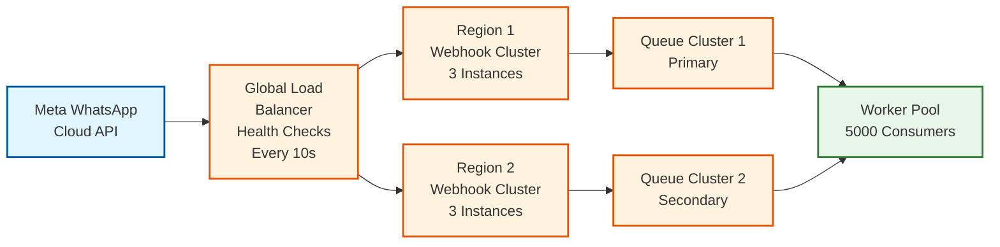
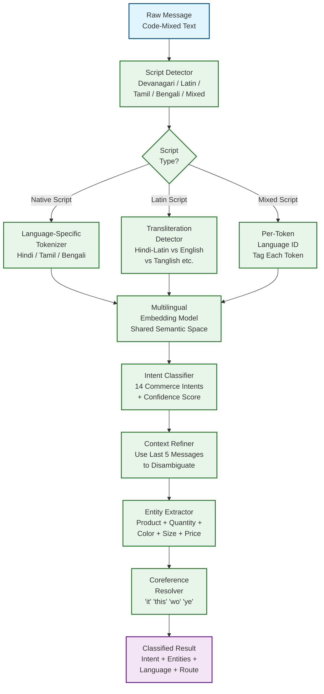

# 14.2 AI-Native Conversational Commerce Platform (WhatsApp-First) — Deep Dives & Bottlenecks

## Deep Dive 1: Webhook Ingestion at Scale — Processing 22,500 Messages/Second

### The At-Least-Once Delivery Problem

WhatsApp Cloud API delivers webhooks with at-least-once semantics: if the platform doesn't respond within 20 seconds, Meta retries. If the network drops the platform's 200 response, Meta retries even though the message was processed. If Meta's internal systems experience transient errors, the same webhook may be delivered 2-3 times. This means every webhook handler must be idempotent—processing the same message twice must produce the same result as processing it once.

**Deduplication Architecture:**

The deduplication layer uses a two-tier approach optimized for different failure modes:

1. **Hot dedup (Redis set with 6-hour TTL):** Every incoming message ID (the `wamid.xxx` field) is checked against a Redis set. If present, the webhook is acknowledged and dropped. If absent, the ID is added with a 6-hour TTL (sufficient to cover Meta's retry window, which is typically 1-2 hours). The Redis check-and-set is atomic using `SETNX` to prevent race conditions where two webhook deliveries arrive simultaneously.

2. **Cold dedup (database unique constraint):** When the message processing worker picks up a message from the queue, it attempts to insert a record into the message table with a unique constraint on `message_id`. If the insert fails with a duplicate key violation, the message is silently dropped. This catches the rare case where a message passes the Redis dedup (e.g., Redis key expired between retry 1 and retry 2) but was already processed.

**Bottleneck:** During broadcast campaigns, a merchant sending 100K messages generates ~50K delivery status webhooks and ~30K read receipt webhooks within a 2-hour window, in addition to regular inbound customer messages. The webhook receiver must distinguish between high-priority inbound messages (customer is waiting for a response) and lower-priority status updates (delivery/read confirmations that can be batched). The platform implements priority-based routing at the webhook receiver level: messages with `"messages"` field are routed to the high-priority queue, while messages with `"statuses"` field are routed to the bulk-status queue processed by separate workers with lower priority.

### Webhook Signature Validation Performance

Every webhook must be validated by computing HMAC-SHA256 over the raw request body using the app secret key. At 22,500 webhooks/second, this is 22,500 HMAC computations/second. HMAC-SHA256 on a 4KB payload takes ~2 microseconds on modern hardware, so the total compute is ~45 milliseconds per second—negligible. However, the validation must happen before any deserialization (to prevent processing unsigned payloads), which means the raw body must be buffered and hashed before JSON parsing. The webhook receiver is designed as a streaming pipeline: receive raw bytes → compute HMAC → compare with header → parse JSON → extract message → enqueue. Any step failure results in immediate response (401 for invalid signature, 400 for malformed JSON, 200 for valid-and-enqueued).

### Message Queue Partitioning Strategy

The message queue is partitioned by `{tenant_id}:{customer_phone_hash}` to ensure per-conversation ordering. This is critical because messages within a conversation must be processed in sequence—if a customer sends "add blue kurta" followed by "actually, make it red," processing the second message before the first would result in only adding the blue kurta.

**Partition count calculation:**

```
Target: handle 22,500 messages/sec with per-conversation ordering
Active conversations: 500,000
Messages per conversation per second: ~0.05 (1 message per 20 seconds average)
Consumer processing time per message: ~500 ms
Consumers needed: 22,500 × 0.5 = 11,250 consumer threads

Partition strategy:
  Too few partitions → hot partitions (a viral merchant's traffic concentrates)
  Too many partitions → overhead and rebalancing complexity
  Optimal: 10,000 partitions with consistent hashing
  Each partition handles ~2.25 messages/sec average
  Hot partition (viral merchant): ~100 messages/sec (handled by one consumer)
  Consumer group: 5,000 consumers, each handling 2 partitions on average
```

**Edge case:** A merchant running a flash sale might receive 10,000 customer messages in 60 seconds. All these messages hash to different partitions (different customer phones), so they distribute across the queue naturally. The bottleneck is not the queue but the downstream services (catalog search, cart operations) that all serve the same merchant's data. The platform mitigates this with per-tenant connection pooling and circuit breakers that shed load for a tenant approaching its resource limits without affecting other tenants.

### Webhook Endpoint Availability

If the webhook endpoint is down, Meta queues webhooks for up to 7 days but eventually drops them. During an outage, customer messages are silently lost from the platform's perspective—the customer sees their message as "sent" (single checkmark) but never gets a response. This makes webhook endpoint availability the single most critical reliability requirement.

**High-availability design:**



The webhook URL registered with Meta points to a global load balancer with health checks every 10 seconds. If the primary region's webhook cluster fails health checks, traffic automatically routes to the secondary region. Both regions write to independent queue clusters, and the worker pool consumes from both. The deduplication layer (shared Redis) prevents a message received by both regions (during failover transition) from being processed twice.

---

## Deep Dive 2: Conversational AI — Intent Classification in Code-Mixed Vernacular

### The Code-Mixing Challenge

In India's linguistic landscape, 30-40% of WhatsApp messages from MSME customers are code-mixed: they combine two or more languages within a single message, often within a single sentence. "Mujhe wo red wala kurta send karo jo 500 se kam hai" mixes Hindi, English, and uses informal chat abbreviations. Standard NLP models fail on code-mixed input for three reasons:

1. **Vocabulary mismatch:** A model trained on English doesn't recognize "mujhe" (Hindi for "for me"). A model trained on Hindi doesn't recognize "red" (English) or "kurta" spelled in Latin script.

2. **Grammar fragmentation:** Code-mixed sentences don't follow the grammar of either language. "wo wala" (that one) follows Hindi grammar, while "red kurta" follows English noun-adjective order (reversed from Hindi's "lal kurta").

3. **Transliteration ambiguity:** Hindi typed in Latin script ("mujhe") must be distinguished from English words. "Sari" could be the English word "sorry" misspelled or the Hindi/English word for a traditional garment (saree/sari).

### Multi-Language Intent Classification Architecture



**Training data strategy:**

The intent classifier is trained on a corpus specifically curated for conversational commerce in Indian languages:

1. **Production conversation logs:** 500K labeled conversations from human agent interactions, where the agent's action (searched catalog, added to cart, checked order) provides the ground truth intent label. These cover natural code-mixing patterns because they're real customer messages.

2. **Synthetic code-mixing augmentation:** For each Hindi-only or English-only training sample, generate 3-5 code-mixed variants by randomly substituting words with their cross-language equivalents. "Show me blue shirts under 1000" → "blue shirts dikhao 1000 se kam" → "mujhe blue wali shirts dikhao under 1000."

3. **Active learning from agent corrections:** When the AI misclassifies an intent and a human agent corrects it, the (message, correct_intent) pair is added to the retraining queue. This creates a feedback loop that continuously improves classification on the distribution of messages the model currently fails on.

**Bottleneck: Entity extraction in informal chat language:**

Entity extraction from formal text ("I'd like to order 2 blue cotton kurtas in size large") is straightforward with named entity recognition. Extraction from chat-style text ("2 blue cotton L size wale do" or "ye kitne ka hai" where "ye" refers to a previously shown product) requires:

- **Numeral detection across scripts:** "2", "दो" (Hindi for two), "do" (Hindi numeral in Latin script) all mean quantity=2
- **Implicit entities:** "ye" (this), "wo" (that), "pehle wala" (the earlier one) require coreference resolution against the conversation context
- **Negation handling:** "red nahi, blue wala" (not red, blue one) requires detecting negation to avoid extracting "red" as the desired color

The entity extractor uses a sequence-labeling model (BIO tagging) trained on the same code-mixed corpus, with a post-processing step that validates extracted entities against the merchant's catalog (if "blue kurta" is extracted but the merchant only sells "navy" and "sky blue" kurtas, the system asks for clarification rather than returning no results).

---

## Deep Dive 3: Catalog Sync Consistency — The Overselling Problem

### The Eventual Consistency Gap

The merchant's inventory exists in three places simultaneously: (1) the platform's catalog database, (2) WhatsApp's Commerce Manager (Meta's servers), and (3) the merchant's physical inventory or external ERP. Changes to inventory propagate through this chain with different latencies:

```
Merchant updates stock in dashboard
  → Platform catalog DB updated (immediate)
  → Meta Catalog API called to update Commerce Manager (5-60 seconds)
  → Commerce Manager reflects update (up to 5 minutes)
  → Customer sees updated catalog in WhatsApp (next catalog refresh)
```

During the sync gap, a customer browsing the WhatsApp catalog may see products as "in stock" that have actually been sold out. If the customer adds an out-of-stock item to their cart and proceeds to checkout, the platform faces a dilemma:

- **Option A: Reject at checkout** — Bad UX. Customer found the product, added it to cart, confirmed the order, and only then learns it's unavailable. In conversational commerce, this feels like the merchant "lied."
- **Option B: Accept and hope for restock** — Risky. The merchant may not be able to fulfill, leading to cancellation and potential negative quality signals.
- **Option C: Real-time stock validation at every interaction** — Expensive and slow. Every product display would require a live stock check, adding 200-500ms latency to catalog browsing.

### Production Solution: Optimistic Display with Pessimistic Checkout

The platform uses a tiered stock validation strategy:

1. **Catalog browsing (optimistic):** Show products based on the last-synced stock status. Display "Limited stock" for items with stock < low_stock_threshold. This uses cached data with no real-time check.

2. **Cart addition (soft check):** When a customer adds an item to cart, perform a quick stock check against the platform's catalog DB (not Meta's Commerce Manager). If stock is 0, inform the customer immediately. If stock is >0 but <5, add with a "subject to availability" note.

3. **Checkout initiation (hard check + reservation):** When the customer initiates checkout, perform a real-time stock validation against the source of truth (platform DB, updated by the latest sync). If stock is available, create a time-limited reservation (15 minutes). The reservation decrements available stock atomically using a compare-and-swap operation:

```
Stock reservation (atomic operation):
  current_stock = catalog_db.get_stock(product_id, variant_id)
  IF current_stock >= requested_quantity:
    new_stock = current_stock - requested_quantity
    success = catalog_db.compare_and_swap(
      product_id, variant_id,
      expected=current_stock,
      new_value=new_stock
    )
    IF success:
      create_reservation(order_id, product_id, quantity, expires=15min)
      RETURN RESERVED
    ELSE:
      // Concurrent modification - retry
      RETURN retry()
  ELSE:
    RETURN OUT_OF_STOCK
```

4. **Payment timeout (reservation release):** If the customer doesn't complete payment within 15 minutes, the reservation expires and stock is released automatically. A background job sweeps expired reservations every minute.

5. **Post-payment (reservation conversion):** When payment is confirmed, the reservation is converted to a committed deduction. The stock update is synced to WhatsApp Commerce Manager to update the customer-facing catalog.

### Bottleneck: Meta Catalog API Rate Limits

Meta's Catalog API has rate limits that constrain how fast the platform can sync stock updates. During a flash sale where 200 products sell out within minutes, the platform needs to push 200 stock-to-zero updates to Commerce Manager, but may be limited to 60 API calls per minute. During this gap, new customers continue seeing in-stock products.

**Mitigation:**

- **Prioritized sync queue:** Stock-to-zero updates (product sold out) are prioritized over stock quantity changes. A product going from 100→95 can wait; a product going from 1→0 is urgent.
- **Batch updates:** The Catalog API supports batch operations (up to 20 products per request). The sync engine batches pending updates and sends in bulk, reducing API call count.
- **Proactive "Limited Stock" overlay:** For products with stock <5, the response message includes "Hurry! Only {n} left" text, setting customer expectations even if the catalog hasn't synced yet.
- **Merchant-side flash sale mode:** For anticipated high-velocity events, the platform pre-reduces displayed stock in Commerce Manager to create artificial scarcity, preventing overselling during the sync lag.

---

## Deep Dive 4: Payment Reconciliation in Conversational Commerce

### The Asynchronous Payment Flow

Unlike web checkout where the user stays on the payment page until the transaction completes (synchronous feedback loop), WhatsApp payment is asynchronous: the platform sends a payment link, the customer taps it, switches to their UPI app, completes payment, returns to WhatsApp, and the platform receives a payment confirmation webhook from the payment gateway 5-30 seconds later. During this window, the customer might send messages like "I paid" or "payment done" before the platform receives the payment webhook.

**Race condition:** Customer sends "payment done" message → platform's NLP classifies as PAYMENT_QUERY intent → platform checks order status → payment webhook hasn't arrived yet → platform responds "Payment not received yet" → 5 seconds later, payment webhook arrives → platform sends "Payment confirmed!" → customer is confused by the contradictory messages.

**Solution: Payment Confirmation State Machine with Grace Period**

```mermaid
flowchart TB
    A[Payment Link Sent\nOrder Status:\nPAYMENT_PENDING] --> B{Customer\nMessage?}
    B -->|"I paid" / "done"| C[Set Grace Period\n30 seconds\nRespond: 'Checking\nyour payment...']
    B -->|Other message| D[Process Normally\nPayment Still Pending]
    C --> E{Payment Webhook\nArrives Within\nGrace Period?}
    E -->|Yes| F[Confirm Payment\nSend Confirmation\nMessage]
    E -->|No, timeout| G[Send: 'Payment not\nreflected yet.\nPlease check your\nUPI app.']
    G --> H{Webhook\nArrives Later?}
    H -->|Yes| F
    H -->|Never| I[Payment Failed\nResend Link]

    classDef pending fill:#fff3e0,stroke:#e65100,stroke-width:2px
    classDef processing fill:#e8f5e9,stroke:#2e7d32,stroke-width:2px
    classDef result fill:#f3e5f5,stroke:#6a1b9a,stroke-width:2px

    class A,D pending
    class B,C,E,H processing
    class F,G,I result
```

When the platform detects a "payment done" message while an order is in PAYMENT_PENDING state, it enters a 30-second grace period where it delays the response, waiting for the payment webhook. If the webhook arrives within 30 seconds, the response is "Payment of ₹945 received! Your order ORD-xxx is confirmed." If not, the response is "We're checking your payment. This may take a moment." This avoids the contradictory message sequence.

### Payment Reconciliation Pipeline

The platform processes payments from multiple sources (UPI via payment gateways, WhatsApp Pay, COD confirmations from shipping partners) and must reconcile each payment with the corresponding order. Reconciliation challenges:

1. **Duplicate payment detection:** A customer might pay twice (tapped the UPI link, payment timed out, tapped again—both payments succeed). The reconciliation pipeline detects payments for the same order within 5 minutes and auto-initiates refund for the duplicate.

2. **Partial payment matching:** Some payment gateways send the payment amount in paise (integer), while others send in rupees (float). ₹945 might arrive as `94500` or `945.00`. The matching logic normalizes amounts before comparison.

3. **Orphan payment handling:** A payment webhook arrives for an order ID that doesn't exist (customer canceled before payment processed). The platform logs the orphan payment and initiates automatic refund.

4. **Settlement reconciliation:** Payment gateways settle funds to the merchant's bank account in T+1 or T+2 batches. The daily reconciliation job matches settled amounts with individual order payments to detect discrepancies (missing settlements, incorrect amounts).

```
Daily reconciliation pipeline:
  1. Fetch settlement report from payment gateway (T+1 batch)
  2. Match each settlement line item with platform order records
  3. Flag discrepancies:
     - Payment captured but not in settlement → escalate to gateway
     - Settlement amount ≠ captured amount → fee discrepancy
     - Settlement for unknown order → orphan payment investigation
  4. Generate reconciliation report for merchant dashboard
  5. Auto-resolve discrepancies within ₹10 tolerance (rounding)
```

---

## Deep Dive 5: Broadcast Campaign Throttling and Quality Management

### The Quality Rating Feedback Loop

WhatsApp assigns each business phone number a quality rating (Green, Yellow, Red) based on customer feedback signals: block rate, spam report rate, template message open rate, and reply rate. A declining quality rating triggers progressive penalties:

- **Green → Yellow:** Warning notification. No immediate impact, but the platform should reduce sending volume and review template content.
- **Yellow → Red:** Messaging tier downgrade. The phone number's daily sending limit is reduced (e.g., from 100K to 10K), and new template submissions may be rejected.
- **Red → Account restriction:** The phone number is temporarily blocked from sending marketing messages. Only utility and service messages are allowed.

This creates a feedback loop: aggressive broadcasting (high volume, untargeted) degrades quality rating → reduced sending capacity → merchant can't reach customers → merchant churns. The platform must monitor quality signals and proactively throttle campaigns to maintain quality rating.

### Intelligent Campaign Throttling

The broadcast engine implements a multi-level throttling system:

**Level 1: Pre-send audience quality filtering**

Before a campaign sends its first message, the audience is filtered by predicted engagement:

```
For each contact in audience:
  engagement_score = compute_engagement_score(contact)
  // Based on: historical open rate, reply rate, recency of last interaction,
  //           purchase history, previous block/report signals

  IF engagement_score < LOW_ENGAGEMENT_THRESHOLD (0.2):
    // Exclude from campaign — high risk of block/report
    exclude(contact, reason="LOW_ENGAGEMENT")
  ELSE IF engagement_score < MEDIUM_ENGAGEMENT_THRESHOLD (0.5):
    // Include but send later (after high-engagement contacts confirm positive signals)
    deprioritize(contact)
```

This pre-filtering typically removes 10-15% of the audience—contacts who are likely to report or block the message—which prevents the quality signals that would degrade the rating.

**Level 2: Progressive send with quality monitoring**

Rather than sending the full campaign at once, the broadcast engine sends in progressive waves:

```
Wave 1 (5% of audience): Send to highest-engagement contacts
  Wait 30 minutes. Check quality signals:
    - If delivery rate > 95% and no quality rating change → proceed
    - If delivery rate < 90% or quality rating drops → pause and alert

Wave 2 (15% of audience): Send to medium-high engagement contacts
  Wait 30 minutes. Check signals again.

Wave 3 (30% of audience): Send to medium engagement contacts
  Continuous monitoring. Pause if quality degrades.

Wave 4 (remaining 50%): Send to remaining eligible contacts
  This wave includes the deprioritized low-engagement contacts.
```

**Level 3: Real-time quality circuit breaker**

During campaign execution, a background monitor polls the phone number's quality rating every 5 minutes. If the rating drops from Green to Yellow, the campaign is automatically paused and the merchant is notified. The merchant can choose to resume (accepting the risk of further degradation) or cancel (preserving quality for future campaigns).

### Cost Optimization for MSME Merchants

WhatsApp's per-message pricing (approximately ₹0.80 per marketing message in India as of 2025) makes broadcast cost a significant concern for small merchants. A merchant with 50,000 contacts sending one campaign per week spends ₹1.6L/month on messaging alone. The platform implements several cost optimization strategies:

1. **Conversation window batching:** If a customer has an open service conversation (within the 24-hour window from their last inbound message), the broadcast message can be sent as a free-form message within that window instead of as a paid template message. The broadcast engine checks for open windows before sending templates.

2. **Template category optimization:** A message containing only an order update is "utility" (₹0.35) but adding a product recommendation makes it "marketing" (₹0.80). The template designer warns merchants when template content might be reclassified and suggests separating the utility and marketing components.

3. **Send-time optimization:** Rather than sending all messages at 10 AM (when every merchant sends, creating competition for attention), the platform analyzes per-contact engagement patterns and sends at the time each contact is most likely to read the message. This improves open rates (reducing waste on unread messages) and spreads load (reducing peak infrastructure cost).

4. **Smart template reuse:** Instead of creating a new template for every campaign (each requiring Meta approval), the platform encourages template reuse with dynamic variables: a single "sale_announcement" template with variables for {product_name}, {discount_percentage}, and {link} can power dozens of campaigns without new template submissions.

---

## Bottleneck Analysis Summary

| Bottleneck | Impact | Mitigation |
|---|---|---|
| **Webhook processing during broadcast reply storms** | Inbound message volume spikes 5-10x when broadcast recipients reply simultaneously | Priority queue separation: inbound messages → high-priority queue; delivery/read statuses → bulk queue; auto-scaling webhook receivers |
| **NLP latency for code-mixed languages** | Transliteration + multi-model inference adds 200-400ms to classification | Cached embeddings for common phrases; lightweight intent shortcuts for high-frequency patterns ("hi", "order status", "price"); batch inference on GPU |
| **Meta Catalog API rate limits during flash sales** | Stock-to-zero updates delayed by API throttling; customers order sold-out products | Priority sync queue; batch API calls; proactive "limited stock" display; merchant flash-sale mode |
| **Payment webhook race with customer messages** | Customer says "paid" before payment webhook arrives; platform sends contradictory responses | Grace period pattern; 30-second wait for payment webhook on payment-intent messages; deferred response |
| **Quality rating degradation during large campaigns** | Aggressive broadcasting triggers quality downgrade → reduced sending capacity | Progressive wave sending; pre-send audience quality filtering; real-time quality circuit breaker; engagement-based send-time optimization |
| **Cart state consistency across concurrent messages** | Customer sends "add blue shirt" and "add red pants" simultaneously; both workers read the same cart state | Per-conversation sequential processing (queue partitioning by conversation ID); optimistic locking on cart updates with retry |
| **Template approval latency blocking time-sensitive campaigns** | Template submission to Meta takes 1-24 hours; merchant creates campaign for today's sale but template isn't approved | Pre-approved template library; encourage template reuse with dynamic variables; template submission pipeline with approval status polling |
| **Agent routing hot spots during peak hours** | All conversations escalate to agents simultaneously; queue depths grow; SLA violations | Predictive agent staffing based on historical escalation patterns; AI confidence tuning (lower confidence threshold during off-peak to reduce agent load); overflow routing to backup agent pool |
