# 14.2 AI-Native Conversational Commerce Platform (WhatsApp-First) — Observability

## Key Metrics

### Message Processing Metrics

| Metric | Description | Target | Alert Threshold |
|---|---|---|---|
| `webhook.ingestion.rate` | Webhooks received per second | — (varies) | >30,000/s (capacity concern) |
| `webhook.acknowledgment.latency.p99` | Time to respond HTTP 200 | ≤ 5s | > 10s (risk of Meta retry) |
| `webhook.dedup.hit_rate` | Percentage of webhooks that are duplicates | <5% | > 15% (Meta retry storm) |
| `message.processing.latency.p95` | Time from webhook receipt to outbound response sent | ≤ 2s | > 3s (degraded UX) |
| `message.processing.latency.p99` | Time from webhook receipt to outbound response sent | ≤ 5s | > 8s (severe degradation) |
| `message.queue.depth` | Messages waiting in processing queue | <100 | > 1000 (processing backlog) |
| `message.queue.consumer_lag` | Gap between head and consumer position per partition | <50 | > 500 (consumer falling behind) |
| `outbound.send.success_rate` | Percentage of outbound messages accepted by WhatsApp API | >99% | < 97% (API issues or rate limiting) |
| `outbound.delivery.rate` | Percentage of sent messages that reach DELIVERED status | >95% | < 90% (delivery issues) |
| `outbound.read.rate` | Percentage of delivered messages that reach READ status | >60% | < 40% (content relevance concern) |

### Conversational AI Metrics

| Metric | Description | Target | Alert Threshold |
|---|---|---|---|
| `nlp.intent.classification.accuracy` | Accuracy of intent classification (vs human agent corrections) | >92% | < 88% (model drift) |
| `nlp.intent.classification.latency.p99` | Time for intent classification | ≤ 500ms | > 800ms |
| `nlp.intent.confidence.avg` | Average confidence score of classified intents | >0.80 | < 0.70 (ambiguous input trend) |
| `nlp.language.detection.accuracy` | Accuracy of language detection | >95% | < 90% |
| `nlp.entity.extraction.f1` | F1 score for entity extraction | >0.85 | < 0.78 |
| `bot.resolution.rate` | Percentage of conversations resolved by AI without human escalation | >70% | < 60% (bot effectiveness declining) |
| `bot.escalation.rate` | Percentage of conversations escalated to human agents | <30% | > 40% |
| `bot.false_positive.rate` | Rate of incorrect bot responses (flagged by agents or customers) | <5% | > 8% |
| `llm.guardrail.violation.rate` | Rate of LLM responses blocked by guardrails | <3% | > 5% (model behavior drift) |
| `llm.response.latency.p95` | LLM-based response generation time | ≤ 2s | > 4s |

### Commerce Metrics

| Metric | Description | Target | Alert Threshold |
|---|---|---|---|
| `catalog.search.latency.p99` | Product search response time | ≤ 300ms | > 500ms |
| `catalog.search.zero_results.rate` | Percentage of searches returning no results | <15% | > 25% (catalog gaps or search issues) |
| `catalog.sync.latency.p95` | Time from inventory change to WhatsApp catalog update | ≤ 5min | > 15min |
| `catalog.sync.failure.rate` | Percentage of catalog sync operations that fail | <2% | > 5% |
| `cart.creation.rate` | Carts created per hour | — | Drop >30% from baseline (funnel issue) |
| `cart.abandonment.rate` | Percentage of carts that don't convert to orders | — | — (track trend) |
| `cart.to_order.conversion.rate` | Percentage of carts that become orders | >25% | < 15% (checkout friction) |
| `order.creation.rate` | Orders created per hour | — | Drop >30% from baseline |
| `order.payment.success.rate` | Percentage of orders where payment completes | >80% | < 65% (payment issues) |
| `order.cancellation.rate` | Percentage of orders cancelled (by customer or merchant) | <10% | > 20% |
| `payment.reconciliation.mismatch.rate` | Percentage of payments that don't match order records | <0.1% | > 0.5% |

### Broadcast Campaign Metrics

| Metric | Description | Target | Alert Threshold |
|---|---|---|---|
| `broadcast.throughput` | Messages sent per second during campaign | — | < planned rate (throttling) |
| `broadcast.delivery.rate` | Percentage of broadcast messages delivered | >95% | < 85% |
| `broadcast.read.rate` | Percentage of broadcast messages read | >40% | < 20% (poor targeting or content) |
| `broadcast.reply.rate` | Percentage of broadcast messages that generate a reply | >5% | — (track trend) |
| `broadcast.opt_out.rate` | Percentage of recipients who opt out after receiving | <0.5% | > 1% (content quality issue) |
| `broadcast.frequency_cap.hit.rate` | Percentage of audience excluded by frequency cap | <10% | > 25% (over-broadcasting) |
| `broadcast.cost.per_conversion` | Cost per order attributed to broadcast campaign | — | — (track trend, merchant-specific) |
| `quality.rating` | WhatsApp phone number quality rating | Green | Yellow (warning), Red (critical) |

### Agent Performance Metrics

| Metric | Description | Target | Alert Threshold |
|---|---|---|---|
| `agent.routing.latency.p99` | Time from escalation to agent assignment | ≤ 10s | > 30s |
| `agent.first_response.time.p95` | Time from assignment to agent's first response | ≤ 2min | > 5min |
| `agent.resolution.time.p95` | Time from assignment to conversation resolution | ≤ 15min | > 30min |
| `agent.conversations.concurrent.avg` | Average concurrent conversations per agent | 3-5 | > 8 (agent overloaded) |
| `agent.csat.score` | Customer satisfaction score (post-resolution survey) | >4.2/5 | < 3.5/5 |
| `agent.queue.depth` | Number of conversations waiting for agent assignment | <10 | > 30 (understaffed) |
| `agent.queue.wait.time.p95` | Time customers wait in agent queue | ≤ 2min | > 5min |

---

## Logging Strategy

### Log Categories and Retention

| Log Category | Content | Format | Retention | Storage |
|---|---|---|---|---|
| **Webhook access logs** | Incoming webhook metadata (timestamp, source IP, message type, tenant_id, latency) — no message content | Structured JSON | 30 days | Hot storage |
| **Message processing logs** | Intent classification, entity extraction, routing decision, response type — no message content | Structured JSON | 90 days | Warm storage |
| **Conversation content logs** | Full message content (encrypted), classification results, agent interactions | Encrypted JSON | 2 years | Encrypted cold storage |
| **Order lifecycle logs** | Every state transition with actor, timestamp, and metadata | Structured JSON | 7 years | Compliance archive |
| **Payment transaction logs** | Payment events with amounts, statuses, gateway references — no card data | Structured JSON | 7 years | Compliance archive |
| **API access logs** | All API calls with tenant_id, user_id, endpoint, parameters, response code, latency | Structured JSON | 90 days | Hot storage |
| **Security audit logs** | Authentication events, authorization checks, data access events | Structured JSON | 2 years | Immutable append-only |
| **NLP model logs** | Classification results, confidence scores, feature vectors (anonymized) | Structured JSON | 90 days (then aggregated) | Warm storage |
| **Broadcast campaign logs** | Campaign execution progress, per-batch delivery metrics, quality signals | Structured JSON | 1 year | Warm storage |

### Log Sampling Strategy

At 130M messages/day, logging every message processing step produces ~50 GB of logs daily. The platform uses intelligent sampling:

```
Sampling rules:
  - Webhook access logs: 100% (lightweight, critical for debugging)
  - Successful message processing: 10% sample (routine operations)
  - Failed message processing: 100% (every failure is logged)
  - Slow processing (>2s): 100% (latency investigation)
  - Agent escalations: 100% (quality monitoring)
  - Payment events: 100% (financial compliance)
  - Broadcast delivery events: 100% per batch (but aggregated, not per-message)
  - NLP low-confidence classifications (<0.7): 100% (model improvement)
  - Security events: 100% (compliance requirement)
```

### Structured Log Format

```
{
  "timestamp": "2026-03-10T10:05:30.123Z",
  "level": "INFO",
  "service": "message-processor",
  "instance_id": "mp-worker-42",
  "trace_id": "abc123def456",
  "span_id": "span_789",
  "tenant_id": "tenant_merchant_xyz",
  "conversation_id": "conv_abc123",
  "message_id": "wamid.xxx",
  "event": "intent_classified",
  "data": {
    "intent": "SEARCH",
    "confidence": 0.89,
    "language": "hi",
    "is_code_mixed": true,
    "entities": {"product_category": "kurta", "price_max": 500},
    "processing_latency_ms": 87,
    "handler": "BOT_DETERMINISTIC"
  }
}
```

---

## Distributed Tracing

### Trace Architecture

Every inbound message generates a trace that spans the entire processing pipeline:

```mermaid
flowchart LR
    A[Trace Start\nWebhook Received] --> B[Span: Signature\nValidation\n~2ms]
    B --> C[Span: Dedup\nCheck\n~5ms]
    C --> D[Span: Queue\nEnqueue\n~10ms]
    D --> E[Span: Queue\nConsume\n~50ms wait]
    E --> F[Span: NLP\nPipeline\n~150ms]
    F --> G[Span: Business\nLogic\n~200ms]
    G --> H[Span: Response\nGeneration\n~150ms]
    H --> I[Span: Outbound\nSend\n~300ms]
    I --> J[Trace End\nResponse Sent]

    classDef fast fill:#e8f5e9,stroke:#2e7d32,stroke-width:2px
    classDef medium fill:#fff3e0,stroke:#e65100,stroke-width:2px
    classDef slow fill:#fce4ec,stroke:#880e4f,stroke-width:2px

    class A,B,C,D fast
    class E,F,H medium
    class G,I slow
```



**Trace context propagation:**

The trace ID is generated at the webhook receiver and propagated through every service call:
1. Webhook receiver → Message queue (trace_id as message header)
2. Message queue → NLP service (trace_id in gRPC metadata)
3. NLP service → Catalog service / Cart service / Order service (trace_id in HTTP header)
4. Any service → Outbound gateway (trace_id in message metadata)

This allows end-to-end latency analysis: for a specific message, the trace shows exactly how long each step took, which service calls were made, and where bottlenecks occurred.

### Cross-Service Trace Correlation

For complex operations like order creation (which involves catalog lookup, stock reservation, payment link generation, and message sending), the trace spans multiple services:

```
Trace: Order Creation (trace_id: abc123)
├── Span: Cart Validation (50ms)
│   ├── Span: Catalog Lookup - product_1 (15ms)
│   └── Span: Catalog Lookup - product_2 (18ms)  [parallel]
├── Span: Stock Reservation (120ms)
│   ├── Span: Check Stock - product_1 (30ms)
│   ├── Span: Check Stock - product_2 (25ms)  [parallel]
│   └── Span: Reserve Stock - atomic (65ms)
├── Span: Order Record Creation (45ms)
│   └── Span: Event Store Append (40ms)
├── Span: Payment Link Generation (200ms)
│   └── Span: Payment Gateway API (180ms)
├── Span: Send Payment Request Message (350ms)
│   ├── Span: Template Rendering (20ms)
│   ├── Span: Rate Limit Check (5ms)
│   └── Span: WhatsApp API Call (300ms)
└── Total: 765ms
```

---

## Alerting Rules

### Critical Alerts (Immediate Response Required)

| Alert | Condition | Notification | Runbook |
|---|---|---|---|
| **Webhook endpoint down** | Health check failures for >30 seconds | PagerDuty P1 + Slack | Verify LB health; check instance status; failover to secondary region |
| **Message processing stalled** | Queue consumer lag >5000 for >2 minutes | PagerDuty P1 | Check consumer health; restart stalled consumers; scale up workers |
| **WhatsApp API authentication failure** | Outbound send returns 401 for >1 minute | PagerDuty P1 + merchant notification | Check access token validity; refresh token; escalate to Meta if token refresh fails |
| **Quality rating dropped to Red** | Quality rating API returns RED | PagerDuty P2 + merchant notification | Pause all broadcasts; review recent campaign metrics; investigate block/spam signals |
| **Payment reconciliation mismatch** | Mismatch rate >0.5% for 1 hour | PagerDuty P2 + finance alert | Run reconciliation check; compare gateway records with order records |
| **Database primary failover** | Primary database unreachable | PagerDuty P1 | Verify replica promotion; redirect write traffic; check data consistency |

### Warning Alerts (Investigate Within 1 Hour)

| Alert | Condition | Notification |
|---|---|---|
| **NLP accuracy degradation** | Intent classification accuracy drops >5% from baseline over 24 hours | Slack + email to ML team |
| **Catalog sync backlog** | Pending sync operations >1000 for >15 minutes | Slack + merchant dashboard notification |
| **Agent queue growing** | Agent queue depth >20 for >10 minutes | Slack to ops team |
| **Broadcast delivery rate drop** | Delivery rate <85% for any active campaign | Slack + campaign auto-pause |
| **Cache hit rate decline** | Cache hit rate drops below 80% | Slack to infrastructure team |
| **Outbound rate limiting** | >10% of outbound messages delayed by rate limiter | Slack to ops team |

### Business-Level Alerts (Daily Review)

| Alert | Condition | Notification |
|---|---|---|
| **Conversion rate decline** | Cart-to-order conversion drops >20% week-over-week | Email to product team |
| **Bot resolution rate decline** | Bot resolution rate drops >10% week-over-week | Email to AI team |
| **Merchant churn signal** | Merchant's daily message volume drops >50% for 3 consecutive days | Email to customer success team |
| **Order cancellation spike** | Cancellation rate >20% for any merchant for 2 consecutive days | Email to ops team |

---

## Dashboard Design

### Operations Dashboard (Real-Time)

```
┌─────────────────────────────────────────────────────────────┐
│ OPERATIONS DASHBOARD — Real-Time                            │
├─────────────────┬───────────────────┬───────────────────────┤
│ Messages/sec    │ Queue Depth       │ Processing Latency    │
│ ████████ 7,542  │ ██ 234            │ p50: 450ms            │
│ In: 2,891       │ High-pri: 45      │ p95: 1.2s             │
│ Out: 4,651      │ Bulk: 189         │ p99: 2.8s             │
├─────────────────┼───────────────────┼───────────────────────┤
│ Webhook Health  │ Outbound Success  │ AI Classification     │
│ ✅ 99.99%       │ ✅ 99.4%          │ Accuracy: 93.2%       │
│ Latency: 8ms    │ Delivery: 96.1%   │ Confidence: 0.84      │
│ Dedup: 2.1%     │ Read: 64.3%       │ Escalation: 22%       │
├─────────────────┴───────────────────┴───────────────────────┤
│ ACTIVE CAMPAIGNS                                            │
│ ┌──────────────────────┬────────┬──────────┬──────────────┐ │
│ │ Campaign             │ Status │ Sent     │ Quality      │ │
│ ├──────────────────────┼────────┼──────────┼──────────────┤ │
│ │ Merchant A - Sale    │ ██ 67% │ 34K/50K  │ 🟢 Green    │ │
│ │ Merchant B - Restock │ ██ 23% │ 4.6K/20K │ 🟢 Green    │ │
│ │ Merchant C - Promo   │ PAUSED │ 8K/100K  │ 🟡 Yellow   │ │
│ └──────────────────────┴────────┴──────────┴──────────────┘ │
├─────────────────────────────────────────────────────────────┤
│ AGENT STATUS                                                │
│ Online: 1,234 │ In conversation: 987 │ Queue: 12 waiting    │
│ Avg handle time: 8.2min │ CSAT today: 4.3/5                │
└─────────────────────────────────────────────────────────────┘
```

### Merchant Analytics Dashboard

```
┌─────────────────────────────────────────────────────────────┐
│ MERCHANT DASHBOARD — StoreName (Today)                      │
├─────────────────┬───────────────────┬───────────────────────┤
│ Conversations   │ Orders            │ Revenue               │
│ Total: 342      │ New: 28           │ Today: ₹45,600        │
│ Bot handled: 78%│ Pending pay: 5    │ Month: ₹12.4L         │
│ Agent: 22%      │ Shipped: 12       │ AOV: ₹1,628           │
├─────────────────┼───────────────────┼───────────────────────┤
│ CONVERSION FUNNEL                                           │
│ Messages received   ████████████████████████  342           │
│ Product viewed      ██████████████████        256 (74.9%)   │
│ Added to cart       █████████████             189 (55.3%)   │
│ Checkout started    ████████                  98  (28.7%)   │
│ Payment completed   ██████                    72  (21.1%)   │
│ Order delivered     ████                      45  (13.2%)   │
├─────────────────┴───────────────────┴───────────────────────┤
│ BROADCAST PERFORMANCE (Last 7 Days)                         │
│ ┌──────────────────┬──────┬──────┬──────┬─────┬──────────┐ │
│ │ Campaign         │ Sent │ Read │Reply │ Opt  │ Revenue  │ │
│ │                  │      │ Rate │Rate  │ Out  │ Attr.    │ │
│ ├──────────────────┼──────┼──────┼──────┼─────┼──────────┤ │
│ │ Weekend Sale     │ 5.2K │ 68%  │ 12%  │ 0.2%│ ₹1.2L    │ │
│ │ New Arrivals     │ 3.1K │ 72%  │ 8%   │ 0.1%│ ₹85K     │ │
│ │ Festive Announce │ 8.4K │ 45%  │ 3%   │ 0.8%│ ₹45K     │ │
│ └──────────────────┴──────┴──────┴──────┴─────┴──────────┘ │
│ Quality Rating: 🟢 Green │ Messages sent today: 1,245      │
└─────────────────────────────────────────────────────────────┘
```

### AI/NLP Performance Dashboard

```
┌─────────────────────────────────────────────────────────────┐
│ AI/NLP PERFORMANCE — Rolling 24 Hours                       │
├─────────────────┬───────────────────┬───────────────────────┤
│ Classification  │ Entity Extraction │ Language Detection     │
│ Accuracy: 93.2% │ F1: 0.87          │ Accuracy: 96.1%       │
│ Trend: ↑ 0.3%   │ Trend: ↓ 0.1%     │ Code-mixed: 34.2%    │
├─────────────────┴───────────────────┴───────────────────────┤
│ INTENT DISTRIBUTION (Top 10)                                │
│ SEARCH          ████████████████████  28.3%                 │
│ ORDER_STATUS    ████████████████      22.1%                 │
│ ADD_TO_CART     ██████████████        19.4%                 │
│ GREETING        ████████████          16.2%                 │
│ PRODUCT_QUESTION██████████            13.8%                 │
│ CHECKOUT        ████████              11.2%                 │
│ COMPLAINT       ██████                8.4%                  │
│ TRACK_ORDER     █████                 7.1%                  │
│ PAYMENT_QUERY   ████                  5.6%                  │
│ VIEW_CART       ███                   4.2%                  │
├─────────────────────────────────────────────────────────────┤
│ AGENT CORRECTION ANALYSIS                                   │
│ Most corrected intents:                                     │
│   SEARCH → PRODUCT_QUESTION (34 corrections today)          │
│   ADD_TO_CART → GENERAL_QUERY (21 corrections today)        │
│   CHECKOUT → PAYMENT_QUERY (15 corrections today)           │
│ Agent corrections queued for retraining: 247 samples        │
├─────────────────────────────────────────────────────────────┤
│ LANGUAGE BREAKDOWN                                          │
│ Hindi: 38.2% │ English: 24.1% │ Hinglish: 22.4%            │
│ Tamil: 5.3%  │ Bengali: 4.1%  │ Telugu: 3.2% │ Other: 2.7% │
└─────────────────────────────────────────────────────────────┘
```

---

## Health Check Architecture

### Component Health Checks

| Component | Health Check Method | Frequency | Failure Action |
|---|---|---|---|
| Webhook Receiver | HTTP GET /health (checks queue connectivity) | 10 seconds | Remove from LB pool; auto-restart |
| Message Queue | Producer write test + consumer read test | 30 seconds | Alert; failover to secondary cluster |
| NLP Service | Classification test with known input/output pair | 30 seconds | Circuit breaker to fallback classifier |
| Catalog Service | Query test with known product | 60 seconds | Serve from cache; alert |
| Payment Service | Payment gateway ping | 60 seconds | Alert; queue payment requests for retry |
| Cache Cluster | SET/GET test with TTL | 15 seconds | Alert; fallback to database reads |
| Database Primary | Write test (insert test record, delete) | 30 seconds | Promote replica; redirect writes |
| Outbound Gateway | WhatsApp API test message to internal number | 5 minutes | Alert; buffer outbound messages |
| Meta API Token | Token validation check | 1 hour | Refresh token; alert if refresh fails |

### Synthetic Monitoring

The platform runs synthetic conversations every 5 minutes to validate end-to-end functionality:

1. **Synthetic customer message:** Sends a known test message ("test search kurta") to the platform via a test WhatsApp number
2. **Expected response validation:** Verifies the response contains expected product results within 5 seconds
3. **Order flow test:** Every 30 minutes, runs a full order flow (search → add to cart → checkout → simulated payment → order confirmation) using test products
4. **Broadcast test:** Every hour, sends a test broadcast to 10 internal numbers and verifies delivery within 5 minutes

Synthetic test failures trigger immediate investigation—they indicate end-to-end functionality degradation that individual component health checks might miss.
