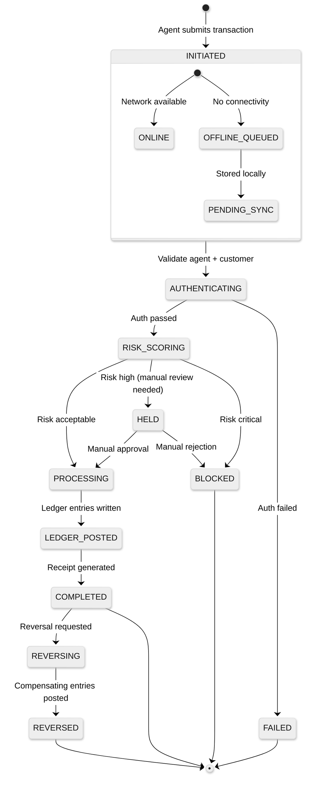
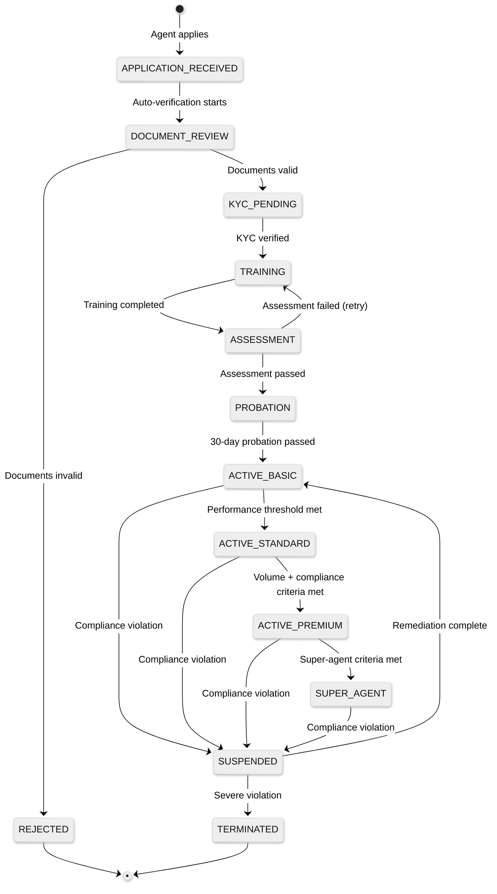
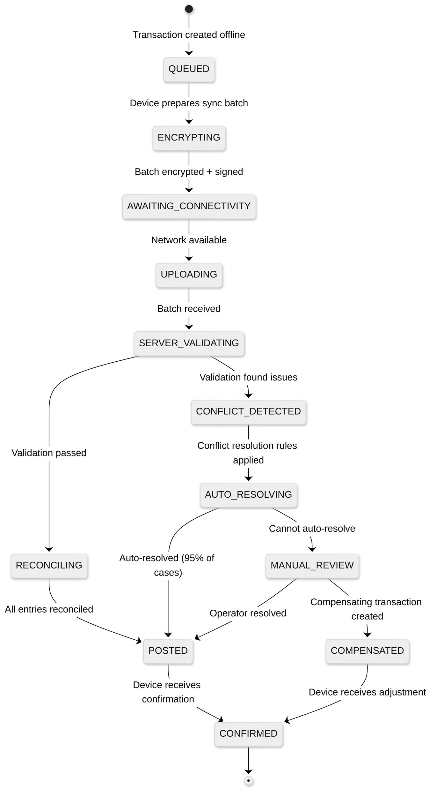

# Low-Level Design — AI-Native Agent Banking Platform for Africa

## Core Data Models

### Agent Model

```
Agent {
    agent_id:           UUID                    // Primary identifier
    principal_id:       UUID                    // Financial institution (enforces exclusivity)
    super_agent_id:     UUID (nullable)         // Parent super-agent in hierarchy
    tier:               ENUM [BASIC, STANDARD, PREMIUM, SUPER_AGENT]
    status:             ENUM [PENDING, ACTIVE, SUSPENDED, TERMINATED]

    // Identity
    full_name:          String
    business_name:      String
    phone_primary:      String
    phone_secondary:    String (nullable)
    national_id_number: String
    business_reg_number: String (nullable)

    // Location (geo-fenced)
    registered_address: Address
    geo_coordinates:    {latitude, longitude}
    geo_fence_radius_m: Integer                 // Allowed operating radius (default: 200m)
    region_code:        String                  // Regional partition key
    country_code:       String                  // ISO 3166-1 alpha-2

    // Device Binding
    device_id:          String                  // IMEI or serial number
    device_type:        ENUM [POS_TERMINAL, SMARTPHONE, FEATURE_PHONE]
    device_fingerprint: String                  // Hardware attestation hash

    // Float
    e_float_balance:    Decimal(18,2)           // Current electronic float
    e_float_limit:      Decimal(18,2)           // Maximum e-float allocation
    cash_balance_est:   Decimal(18,2)           // Estimated cash on hand (AI-derived)
    currency_code:      String                  // ISO 4217

    // Performance
    performance_score:  Decimal(5,2)            // 0-100 composite score
    fraud_risk_score:   Decimal(5,2)            // 0-100, higher = riskier
    total_transactions: BigInteger
    active_since:       Timestamp
    last_transaction_at: Timestamp
    last_float_rebalance_at: Timestamp

    // Compliance
    kyc_verified:       Boolean
    training_completed: Boolean
    license_expiry:     Date
    compliance_flags:   List<String>            // Active compliance issues

    // Metadata
    created_at:         Timestamp
    updated_at:         Timestamp
    version:            Integer                 // Optimistic concurrency control
}
```

### Float Ledger Entry

```
FloatLedgerEntry {
    entry_id:           UUID
    agent_id:           UUID
    entry_type:         ENUM [CREDIT, DEBIT]
    float_type:         ENUM [E_FLOAT, CASH_ESTIMATE]
    amount:             Decimal(18,2)
    currency_code:      String
    balance_after:      Decimal(18,2)           // Running balance
    source:             ENUM [TRANSACTION, REBALANCE, TOP_UP, ADJUSTMENT, COMMISSION]
    reference_id:       UUID                    // Transaction or rebalance request ID
    description:        String
    created_at:         Timestamp
}
```

### Transaction Model

```
Transaction {
    txn_id:             UUID                    // Globally unique
    idempotency_key:    String                  // Client-generated for retry safety
    sequence_number:    BigInteger              // Monotonically increasing per agent
    agent_id:           UUID
    customer_id:        UUID (nullable)         // Null for some bill payments
    txn_type:           ENUM [CASH_IN, CASH_OUT, TRANSFER, BILL_PAYMENT,
                              AIRTIME, ACCOUNT_OPENING, FLOAT_REBALANCE]
    status:             ENUM [INITIATED, PROCESSING, COMPLETED, FAILED,
                              REVERSED, PENDING_SYNC]

    // Financials
    amount:             Decimal(18,2)
    fee:                Decimal(18,2)
    commission:         Decimal(18,2)           // Agent's earning
    currency_code:      String
    exchange_rate:      Decimal(10,6) (nullable)// For cross-currency txns

    // Ledger References
    debit_account:      String                  // Account debited
    credit_account:     String                  // Account credited
    ledger_entry_ids:   List<UUID>              // Double-entry ledger references

    // Authentication
    auth_method:        ENUM [BIOMETRIC, PIN, OTP, NONE]
    biometric_score:    Decimal(5,2) (nullable) // Match confidence
    auth_device_id:     String

    // Risk
    fraud_score:        Decimal(5,2)            // 0-1, ML-assigned
    risk_flags:         List<String>            // Triggered risk rules
    compliance_checks:  List<ComplianceResult>

    // Offline Handling
    originated_offline: Boolean
    offline_timestamp:  Timestamp (nullable)    // When created on device
    sync_timestamp:     Timestamp (nullable)    // When synced to server
    conflict_resolved:  Boolean

    // Location
    device_latitude:    Decimal(9,6)
    device_longitude:   Decimal(9,6)
    geo_fence_compliant: Boolean

    // Metadata
    channel:            ENUM [POS, MOBILE_APP, USSD, SMS]
    created_at:         Timestamp
    updated_at:         Timestamp
    receipt_number:     String                  // Human-readable receipt ID
}
```

### Biometric Template Model

```
BiometricTemplate {
    template_id:        UUID
    customer_id:        UUID
    modality:           ENUM [FINGERPRINT_RIGHT_INDEX, FINGERPRINT_RIGHT_THUMB,
                              FINGERPRINT_LEFT_INDEX, FINGERPRINT_LEFT_THUMB,
                              FACIAL]
    template_data:      Binary                  // Extracted feature vector
    template_format:    String                  // Algorithm version/format
    quality_score:      Integer                 // 0-100
    capture_device:     String                  // Device model/manufacturer
    capture_conditions: {
        lighting:       ENUM [GOOD, FAIR, POOR]
        finger_moisture: ENUM [DRY, NORMAL, WET] (nullable)
        retry_count:    Integer                 // Number of capture attempts
    }
    enrolled_at:        Timestamp
    enrolled_by_agent:  UUID
    last_matched_at:    Timestamp (nullable)
    match_count:        Integer                 // Number of successful matches
    is_active:          Boolean
    superseded_by:      UUID (nullable)         // If re-enrolled with better quality
}
```

### KYC Record

```
KYCRecord {
    kyc_id:             UUID
    customer_id:        UUID
    kyc_tier:           ENUM [TIER_1, TIER_2, TIER_3]
    status:             ENUM [PENDING, VERIFIED, REJECTED, EXPIRED, UPGRADE_PENDING]

    // Tier 1: Phone number only
    phone_number:       String
    phone_verified:     Boolean

    // Tier 2: Biometrics
    biometric_template_ids: List<UUID>
    biometric_verified: Boolean

    // Tier 3: Government ID
    id_type:            ENUM [NATIONAL_ID, PASSPORT, VOTERS_CARD, DRIVERS_LICENSE]
    id_number:          String (nullable)
    id_verified:        Boolean
    id_verification_source: String              // National database name

    // Deduplication
    dedup_status:       ENUM [UNIQUE, POTENTIAL_DUPLICATE, CONFIRMED_DUPLICATE]
    dedup_confidence:   Decimal(5,2)
    dedup_match_ids:    List<UUID>              // Matched customer IDs if duplicate

    // Compliance
    pep_screening_result: ENUM [CLEAR, MATCH, PENDING]
    sanctions_screening: ENUM [CLEAR, MATCH, PENDING]
    risk_category:      ENUM [LOW, MEDIUM, HIGH]

    // Limits derived from tier
    daily_transaction_limit: Decimal(18,2)
    single_transaction_limit: Decimal(18,2)

    verified_at:        Timestamp
    expires_at:         Timestamp               // KYC refresh required
    verified_by_agent:  UUID
    country_code:       String
}
```

---

## API Design

### Transaction APIs

```
POST /v1/transactions/cash-in
Headers:
    X-Agent-ID: {agent_id}
    X-Device-ID: {device_id}
    X-Idempotency-Key: {unique_key}
    X-Channel: POS | MOBILE_APP | USSD
Body:
{
    "customer_id": "uuid",
    "amount": 5000.00,
    "currency": "NGN",
    "auth": {
        "method": "BIOMETRIC",
        "fingerprint_template": "base64_encoded",
        "pin": "encrypted_pin"        // Optional: dual-factor for high amounts
    },
    "location": {
        "latitude": 6.5244,
        "longitude": 3.3792
    },
    "offline_context": {               // Present only for offline-originated txns
        "offline_timestamp": "2026-03-10T14:30:00Z",
        "sequence_number": 1247,
        "device_signature": "signed_hash"
    }
}
Response 200:
{
    "txn_id": "uuid",
    "status": "COMPLETED",
    "receipt_number": "RCT-2026-0310-A4F2K9",
    "amount": 5000.00,
    "fee": 50.00,
    "agent_commission": 25.00,
    "customer_balance": 45000.00,       // Only for account holders
    "agent_e_float_remaining": 350000.00,
    "timestamp": "2026-03-10T14:30:05Z"
}
```

```
POST /v1/transactions/cash-out
Headers: (same as cash-in)
Body:
{
    "customer_id": "uuid",
    "amount": 10000.00,
    "currency": "NGN",
    "auth": {
        "method": "BIOMETRIC",
        "fingerprint_template": "base64_encoded"
    },
    "location": {...}
}
Response 200:
{
    "txn_id": "uuid",
    "status": "COMPLETED",
    "receipt_number": "RCT-2026-0310-B7H3M2",
    "amount": 10000.00,
    "fee": 100.00,
    "agent_commission": 50.00,
    "customer_balance": 35000.00,
    "agent_e_float_remaining": 360000.00,
    "timestamp": "2026-03-10T14:31:22Z"
}
```

### Float Management APIs

```
GET /v1/agents/{agent_id}/float
Response 200:
{
    "agent_id": "uuid",
    "e_float": {
        "balance": 350000.00,
        "limit": 500000.00,
        "utilization_pct": 70.0
    },
    "cash_estimate": {
        "balance": 180000.00,           // AI-estimated from transaction flow
        "confidence": 0.82
    },
    "health_status": "HEALTHY",         // HEALTHY | WARNING | CRITICAL
    "predicted_depletion": {
        "e_float_hours": 18.5,          // Hours until e-float reaches minimum
        "cash_hours": 24.2              // Hours until cash reaches minimum
    },
    "rebalance_recommendation": {
        "needed": true,
        "type": "E_FLOAT_TOP_UP",
        "amount": 150000.00,
        "nearest_rebalance_point": {
            "type": "SUPER_AGENT",
            "name": "Adekunle Super Agency",
            "distance_km": 2.4
        },
        "urgency": "MEDIUM"             // LOW | MEDIUM | HIGH | CRITICAL
    }
}
```

```
POST /v1/float/rebalance
Body:
{
    "agent_id": "uuid",
    "rebalance_type": "E_FLOAT_TOP_UP", // E_FLOAT_TOP_UP | CASH_DEPOSIT | SWAP
    "amount": 150000.00,
    "source": "SUPER_AGENT",            // SUPER_AGENT | BANK_BRANCH | BANK_TRANSFER
    "source_agent_id": "uuid"           // If source is SUPER_AGENT
}
Response 200:
{
    "rebalance_id": "uuid",
    "status": "COMPLETED",
    "agent_e_float_after": 500000.00,
    "timestamp": "2026-03-10T08:15:00Z"
}
```

### KYC & Biometric APIs

```
POST /v1/kyc/enroll
Body:
{
    "demographics": {
        "full_name": "Amina Okafor",
        "phone_number": "+2348012345678",
        "date_of_birth": "1990-05-15",
        "gender": "F",
        "address": "12 Market Road, Onitsha, Anambra"
    },
    "biometrics": {
        "fingerprints": [
            {
                "finger": "RIGHT_INDEX",
                "image": "base64_encoded",
                "quality_score": 78
            }
        ],
        "facial": {
            "image": "base64_encoded",
            "liveness_score": 0.95,
            "quality_score": 65
        }
    },
    "government_id": {                  // Optional for Tier 3
        "type": "NATIONAL_ID",
        "number": "12345678901"
    },
    "agent_id": "uuid",
    "consent_given": true
}
Response 201:
{
    "customer_id": "uuid",
    "kyc_tier": "TIER_2",
    "daily_limit": 200000.00,
    "dedup_result": "UNIQUE",
    "enrollment_id": "uuid"
}
```

```
POST /v1/kyc/verify
Body:
{
    "customer_id": "uuid",
    "biometric": {
        "modality": "FINGERPRINT_RIGHT_INDEX",
        "template": "base64_encoded"
    }
}
Response 200:
{
    "verified": true,
    "match_score": 0.94,
    "customer_name": "Amina Okafor",
    "kyc_tier": "TIER_2",
    "daily_limit": 200000.00,
    "daily_used": 55000.00
}
```

---

## Key Algorithms

### Float Rebalancing Prediction

```
ALGORITHM PredictFloatNeeds(agent_id, forecast_horizon_hours)
    // Step 1: Gather historical transaction data
    history ← GetTransactionHistory(agent_id, lookback_days=90)

    // Step 2: Extract temporal features
    day_of_week ← CurrentDayOfWeek()
    is_market_day ← CheckMarketCalendar(agent.region, today)
    is_salary_period ← CheckSalaryCalendar(today)  // 25th-5th of month
    is_festival ← CheckFestivalCalendar(agent.region, today)

    // Step 3: Compute hourly transaction projections
    hourly_model ← LoadTimeSeriesModel(agent_id)
    features ← {
        historical_hourly_volumes: AggregateByHour(history),
        day_type: ClassifyDay(day_of_week, is_market_day, is_salary_period),
        weather_factor: GetWeatherImpactScore(agent.geo_coordinates),
        trend_factor: ComputeRecentTrend(history, days=14)
    }

    projected_txns ← hourly_model.Predict(features, horizon=forecast_horizon_hours)

    // Step 4: Simulate float balance trajectory
    current_e_float ← agent.e_float_balance
    current_cash_est ← agent.cash_balance_est

    FOR each hour h in projected_txns:
        cash_in_volume ← projected_txns[h].cash_in_amount
        cash_out_volume ← projected_txns[h].cash_out_amount

        // Cash-in: customer gives cash, agent gives e-float
        current_cash_est ← current_cash_est + cash_in_volume
        current_e_float ← current_e_float - cash_in_volume

        // Cash-out: customer gets cash, agent gets e-float
        current_cash_est ← current_cash_est - cash_out_volume
        current_e_float ← current_e_float + cash_out_volume

        IF current_e_float < agent.e_float_limit * 0.15:  // Critical threshold
            RETURN RebalanceRecommendation(
                type: "E_FLOAT_TOP_UP",
                urgency: "HIGH",
                amount: agent.e_float_limit * 0.7 - current_e_float,
                deadline: NOW + h hours,
                nearest_point: FindNearestRebalancePoint(agent, "E_FLOAT")
            )

        IF current_cash_est < MinCashThreshold(agent.tier):
            RETURN RebalanceRecommendation(
                type: "CASH_DEPOSIT",
                urgency: "HIGH",
                amount: current_cash_est - TargetCash(agent),
                deadline: NOW + h hours,
                nearest_point: FindNearestRebalancePoint(agent, "CASH")
            )

    RETURN RebalanceRecommendation(urgency: "NONE")
```

### Agent Fraud Scoring

```
ALGORITHM ComputeAgentFraudScore(agent_id, transaction)
    score ← 0.0
    flags ← []

    // Rule 1: Transaction velocity anomaly
    recent_count ← CountTransactions(agent_id, window=1_hour)
    baseline ← GetBaselineVelocity(agent_id, same_hour_same_day_type)
    IF recent_count > baseline * 2.5:
        score ← score + 0.2
        flags.Add("VELOCITY_SPIKE")

    // Rule 2: Geographic anomaly (geo-fence violation)
    distance ← HaversineDistance(
        transaction.device_location,
        agent.registered_location
    )
    IF distance > agent.geo_fence_radius_m:
        score ← score + 0.3
        flags.Add("GEO_FENCE_VIOLATION")

    // Rule 3: Round number pattern (phantom transaction indicator)
    recent_txns ← GetRecentTransactions(agent_id, count=20)
    round_pct ← CountRoundNumbers(recent_txns) / 20
    IF round_pct > 0.8:  // 80%+ transactions are round numbers
        score ← score + 0.15
        flags.Add("ROUND_NUMBER_PATTERN")

    // Rule 4: Float utilization anomaly
    float_util ← agent.e_float_balance / agent.e_float_limit
    txn_volume_today ← SumTransactionVolume(agent_id, today)
    expected_util ← PredictFloatUtilization(agent_id, txn_volume_today)
    IF ABS(float_util - expected_util) > 0.3:
        score ← score + 0.15
        flags.Add("FLOAT_MISMATCH")

    // Rule 5: Unusual operating hours
    IF transaction.timestamp.hour NOT IN agent.typical_operating_hours:
        score ← score + 0.1
        flags.Add("OFF_HOURS")

    // Rule 6: ML model score (trained on historical fraud cases)
    ml_features ← ExtractMLFeatures(agent_id, transaction)
    ml_score ← FraudModel.Predict(ml_features)
    score ← score * 0.4 + ml_score * 0.6  // ML model gets 60% weight

    // Rule 7: Social graph risk (collusion detection)
    customer_agent_pairs ← GetFrequentPairs(agent_id, window=30_days)
    FOR each pair in customer_agent_pairs:
        IF pair.frequency > NormalThreshold(agent.tier) AND pair.is_circular:
            score ← MIN(score + 0.25, 1.0)
            flags.Add("COLLUSION_PATTERN:" + pair.customer_id)

    RETURN FraudAssessment(
        score: CLAMP(score, 0.0, 1.0),
        risk_level: ClassifyRisk(score),  // LOW < 0.3, MEDIUM < 0.6, HIGH < 0.8, CRITICAL >= 0.8
        flags: flags,
        action: DetermineAction(score)    // ALLOW | FLAG | HOLD | BLOCK
    )
```

### Biometric Matching with Quality Adaptation

```
ALGORITHM AdaptiveBiometricMatch(probe_template, candidate_id, modality)
    // Step 1: Retrieve stored templates for the candidate
    stored_templates ← GetTemplates(candidate_id, modality)

    IF stored_templates IS EMPTY:
        RETURN MatchResult(matched: false, reason: "NO_ENROLLED_TEMPLATE")

    // Step 2: Quality-adaptive threshold selection
    probe_quality ← AssessQuality(probe_template, modality)

    // Lower quality inputs need lower thresholds but compensate with
    // additional verification factors
    IF modality == FINGERPRINT:
        IF probe_quality >= 70:
            threshold ← 0.65       // High quality: standard threshold
            additional_factor ← NONE
        ELSE IF probe_quality >= 40:
            threshold ← 0.55       // Medium quality: relaxed threshold
            additional_factor ← PIN // Require supplementary PIN
        ELSE:
            threshold ← 0.45       // Low quality: very relaxed threshold
            additional_factor ← PIN + ALTERNATE_FINGER
    ELSE IF modality == FACIAL:
        IF probe_quality >= 60:
            threshold ← 0.70
            additional_factor ← NONE
        ELSE:
            threshold ← 0.55
            additional_factor ← PIN

    // Step 3: Match against all stored templates (best match wins)
    best_score ← 0.0
    best_template ← NULL

    FOR each template in stored_templates:
        score ← ComputeMatchScore(probe_template, template, modality)
        IF score > best_score:
            best_score ← score
            best_template ← template

    // Step 4: Decision
    IF best_score >= threshold:
        RETURN MatchResult(
            matched: true,
            score: best_score,
            additional_factor_required: additional_factor,
            template_used: best_template.template_id
        )
    ELSE:
        RETURN MatchResult(
            matched: false,
            score: best_score,
            suggestion: SuggestRecovery(probe_quality, modality)
            // e.g., "Clean finger and retry" or "Move to better lighting"
        )
```

---

## State Machines

### Transaction State Machine



### Agent Lifecycle State Machine



### Offline Sync State Machine


