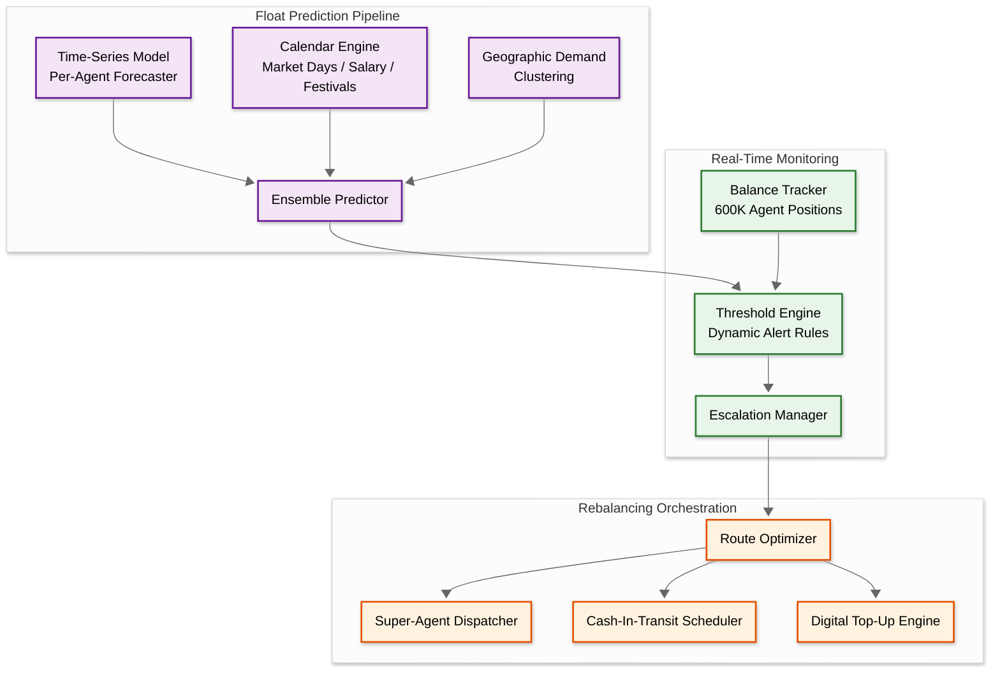
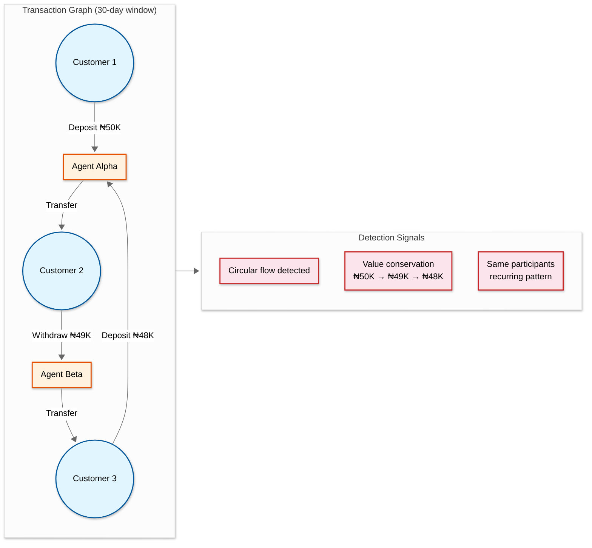

# Deep Dives & Bottlenecks — AI-Native Agent Banking Platform for Africa

## Deep Dive 1: Float Management and Rebalancing at Scale

### The Problem

Every agent banking transaction shifts the cash-to-e-float ratio at the agent's location. A cash-in (deposit) increases the agent's physical cash but decreases their e-float. A cash-out (withdrawal) does the opposite. When either side depletes, the agent cannot serve customers—a direct revenue loss for the agent and a service failure for the platform.

At 600,000 agents processing 35 million daily transactions, the platform must continuously monitor 600,000 individual float positions, predict when each will breach operational thresholds, and coordinate physical rebalancing logistics across geographies where the nearest super-agent or bank branch may be hours away.

### Why This Is Hard

**1. Two-sided depletion with asymmetric replenishment.** E-float can be replenished digitally (bank transfer, super-agent digital transfer) within minutes. Cash replenishment requires physical movement—the agent must travel to a bank, a super-agent, or wait for a cash-in-transit van. This asymmetry means e-float shortages are recoverable within minutes, but cash shortages cause hours of downtime.

**2. Transaction mix varies unpredictably.** An agent near a market might be deposit-heavy (merchants depositing cash earnings) while an agent near a salary-paying factory might be withdrawal-heavy (workers withdrawing salary). These patterns shift with day of week, time of month, and seasonal factors. The prediction model must capture all these cycles.

**3. Correlated demand spikes.** On salary payment days (typically 25th-28th of each month), cash-out demand spikes 5-7x across the entire network. This creates correlated float depletion across thousands of agents simultaneously, overwhelming the physical rebalancing network.

### Production Architecture



### Key Design Decisions

**Per-agent time-series models** rather than a single global model. Each agent has a distinct transaction pattern influenced by their specific location, customer base, and operating hours. A global model would smooth out these local patterns. The system trains lightweight per-agent models (gradient-boosted trees, not deep learning) that capture agent-specific seasonality while sharing structural parameters across agents in the same geographic cluster.

**The 1.5x rule as a starting heuristic.** New agents without historical data start with the 1.5x rule: maintain cash and e-float at 1.5x the previous day's transaction volume. As data accumulates (2+ weeks), the AI model gradually takes over, replacing the heuristic with learned predictions.

**Complementary rebalancing.** The route optimizer identifies pairs of agents with complementary imbalances—one has excess cash and needs e-float, the other has excess e-float and needs cash. By routing these agents to each other (or to a common super-agent), the system achieves rebalancing with minimal external cash injection.

### Bottleneck: Salary-Day Correlated Demand

When 200,000+ agents simultaneously experience withdrawal surges, the rebalancing network saturates. Mitigation strategies:

- **Pre-positioning**: 48-72 hours before predicted salary days, proactively push extra e-float to agents in salary-heavy regions and coordinate extra cash deliveries to super-agents
- **Dynamic pricing**: Temporarily increase cash-out fees during peak periods to smooth demand (regulatory permission required)
- **Staggered disbursement**: Work with employers to stagger salary payment dates across the month (partnership-level intervention)

---

## Deep Dive 2: Biometric KYC in Challenging Conditions

### The Problem

Biometric verification is the cornerstone of agent banking security—it authenticates customers who may not carry physical ID cards and prevents identity fraud in a system where the agent has financial incentive to process transactions regardless of identity certainty. However, field conditions systematically degrade biometric capture quality:

- **Fingerprints**: Manual laborers (farmers, construction workers, market traders) have worn ridges; dust, moisture, and dry skin reduce capture quality by 15-30%
- **Facial recognition**: Budget Android devices ($50-150) have low-resolution front cameras; outdoor kiosks have sun glare and harsh shadows; darker skin tones require algorithms specifically trained on diverse datasets
- **Device constraints**: Fingerprint scanners on POS terminals are capacitive sensors costing $3-5, far below the $2,000+ optical scanners used in lab testing

### Quality-Tiered Verification Architecture

```
                    Quality Score
                    ┌──────────────────────────────────────┐
                    │  HIGH (70-100)    │  Standard match   │
                    │                   │  Single factor    │
                    ├───────────────────┼───────────────────┤
                    │  MEDIUM (40-69)   │  Relaxed threshold│
                    │                   │  + PIN backup     │
                    ├───────────────────┼───────────────────┤
                    │  LOW (20-39)      │  Very relaxed     │
                    │                   │  + PIN + alt finger│
                    ├───────────────────┼───────────────────┤
                    │  UNUSABLE (<20)   │  Reject capture   │
                    │                   │  Guide retry      │
                    └───────────────────┴───────────────────┘
```

### Adaptive Capture Pipeline

The on-device capture pipeline guides the agent through quality improvement steps before transmitting:

1. **Capture** → immediate quality assessment (< 200ms on-device)
2. If quality < threshold → display specific guidance:
   - "Ask customer to wipe finger on cloth" (moisture/dust)
   - "Try the thumb instead" (worn ridges on index finger)
   - "Move to shaded area" (glare for facial)
   - "Hold device at arm's length" (too close for facial)
3. Allow up to 3 retry attempts with progressively relaxed quality thresholds
4. If all retries fail → fall back to alternative modality (fingerprint → facial, or vice versa)
5. If all modalities fail → document-based KYC with manual verification queue

### Multi-Modal Fusion for Degraded Inputs

When individual modalities produce medium-quality captures, combining them yields higher confidence than either alone:

```
ALGORITHM MultiModalFusion(fingerprint_score, facial_score, quality_weights)
    // Dempster-Shafer evidence combination
    fp_belief ← fingerprint_score * QualityWeight(fingerprint_quality)
    fa_belief ← facial_score * QualityWeight(facial_quality)

    // Combined belief (multiplicative for independence assumption)
    combined_belief ← 1 - (1 - fp_belief) * (1 - fa_belief)

    // Conflict detection: if modalities disagree significantly, flag for review
    IF ABS(fingerprint_score - facial_score) > 0.4:
        RETURN FusionResult(score: combined_belief, flag: "MODALITY_CONFLICT")

    RETURN FusionResult(score: combined_belief, flag: NONE)
```

A fingerprint match at 0.55 (below standalone threshold of 0.65) combined with a facial match at 0.60 (below standalone threshold of 0.70) produces a fused score of 0.82—above the multi-modal acceptance threshold of 0.75.

### Bottleneck: 1:N Deduplication at Scale

Deduplication requires comparing a new enrollment's biometric template against all 50+ million existing templates to detect duplicates. Brute-force comparison at 1ms per comparison would take 50,000 seconds (~14 hours).

**Solution**: Locality-sensitive hashing (LSH) with a multi-probe approach:
- Hash biometric templates into buckets using multiple hash functions
- New enrollment is compared only against templates in matching buckets (typically < 1,000 candidates from 50M)
- Full comparison on the candidate set takes < 1 second
- False negative rate (missed duplicates) < 0.1% with 20 hash functions
- GPU-accelerated batch dedup for enrollment surges (500+ enrollments/hour at a single region)

---

## Deep Dive 3: Offline Transaction Handling and Conflict Resolution

### The Problem

15-25% of daily transactions (5-9 million per day) occur when the agent device has no network connectivity. The system must:

1. Allow the agent to continue serving customers (cannot tell a customer "come back when the network is up")
2. Apply sufficient risk controls offline to prevent fraud
3. Reconcile offline transactions with the server when connectivity resumes
4. Resolve conflicts when the server's state has diverged from the device's local state during the offline period

### Offline Transaction Engine (On-Device)

```
ALGORITHM ProcessOfflineTransaction(transaction)
    // Step 1: Apply local risk rules
    local_state ← DeviceLocalLedger.GetState()

    // Balance check against last-known state
    IF transaction.type == CASH_IN:
        IF local_state.agent_e_float < transaction.amount:
            RETURN Reject("INSUFFICIENT_E_FLOAT")

    IF transaction.type == CASH_OUT:
        IF local_state.customer_balance < transaction.amount:
            RETURN Reject("INSUFFICIENT_BALANCE")

    // Per-transaction limit check
    IF transaction.amount > GetOfflineTransactionLimit(agent.tier):
        RETURN Reject("EXCEEDS_OFFLINE_LIMIT")

    // Daily cumulative limit check
    today_total ← SumOfflineTransactions(today)
    IF today_total + transaction.amount > GetOfflineDailyLimit(agent.tier):
        RETURN Reject("EXCEEDS_DAILY_OFFLINE_LIMIT")

    // Velocity check
    recent_count ← CountOfflineTransactions(last_hour)
    IF recent_count > GetOfflineVelocityLimit(agent.tier):
        RETURN Reject("VELOCITY_LIMIT_EXCEEDED")

    // Step 2: Create transaction record with cryptographic signature
    txn_record ← CreateTransactionRecord(transaction)
    txn_record.sequence_number ← local_state.next_sequence_number
    txn_record.offline_timestamp ← DeviceClock.Now()
    txn_record.device_signature ← Sign(txn_record, device_private_key)

    // Step 3: Update local ledger
    DeviceLocalLedger.Apply(txn_record)

    // Step 4: Queue for sync
    SyncQueue.Enqueue(txn_record)

    RETURN Success(txn_record.receipt)
```

### Conflict Resolution During Sync

When the device syncs, the server may find conflicts:

| Conflict Type | Example | Resolution Strategy |
|---|---|---|
| **Balance conflict** | Server shows customer balance of ₦10,000 but offline txn assumed ₦15,000 (another agent processed a withdrawal while this agent was offline) | Reject the offline transaction; generate compensating entry; notify agent |
| **Double spend** | Customer withdrew ₦10,000 at Agent A (online) and ₦10,000 at Agent B (offline) when balance was only ₦12,000 | Last-write-loses: the offline transaction is reversed; customer's account gets a compensating debit; agent bears the loss (incentivizes connectivity) |
| **Sequence gap** | Device sends sequence numbers 1245, 1246, 1248 (missing 1247) | Hold batch until missing transaction arrives (24-hour window); if not received, flag for investigation (possible tampering) |
| **Timestamp inconsistency** | Device clock drifted >5 minutes from server time | Accept transactions but flag for audit; recalibrate device clock on next sync |
| **Limit breach (aggregate)** | Agent processed ₦800,000 offline across all customers, exceeding ₦500,000 daily offline limit (each individual txn was within limits but cumulative wasn't) | Post transactions but flag agent for review; adjust future offline limits downward for this agent |

### Sync Wave Management

When connectivity is restored (especially in the morning), thousands of agents sync simultaneously, creating a "sync storm":

```
                Daily Sync Pattern
    TPS  │
    2000 │         ╭──╮
    1500 │        ╭╯  ╰╮
    1000 │   ╭───╯╯    ╰──╮
     500 │──╯              ╰───────────────
         └──────────────────────────────────
          00  04  08  12  16  20  24  Hour

         Morning sync wave peaks at 07:00-09:00
```

**Mitigation**: Jittered sync scheduling—each device has a random sync delay (0-30 minutes) after detecting connectivity, spreading the sync wave across a 30-minute window instead of a 5-minute spike.

---

## Deep Dive 4: Agent Fraud Detection

### Fraud Taxonomy

| Fraud Type | Description | Detection Signal | Prevalence |
|---|---|---|---|
| **Phantom Transactions** | Agent fabricates transactions (often using their own second phone) to earn commissions | Round-number dominance; self-referencing customer IDs; transaction timing patterns (evenly spaced, machine-like) | High |
| **Float Diversion** | Agent uses e-float for personal transactions (buying airtime, paying bills) then delays rebalancing | Float utilization doesn't match transaction volume; unexplained float dips between transactions | Medium |
| **Unauthorized Fee Charging** | Agent charges customer more than the authorized fee and pockets the difference | Customer complaints; discrepancy between recorded and actual fee; fee amount outliers compared to peers | Medium |
| **Collusion Ring** | Agent and group of "customers" create circular transactions to generate commissions | Graph analysis reveals closed loops: A→B→C→A; same customer appears at multiple agents in short time | Low but high-value |
| **Identity Fraud** | Agent enrolls fake identities to create accounts for money laundering | Biometric quality anomalies; multiple enrollments from same device with no legitimate customers in between; demographic inconsistencies | Low |
| **Split Transaction** | Agent splits a large transaction into multiple smaller ones to evade per-transaction limits or reporting thresholds | Sequence of same-amount transactions to same customer within short window; total exceeds single-transaction limit | Medium |

### Graph-Based Collusion Detection



The graph-based detection algorithm:

1. **Build transaction graph**: Nodes are agents and customers; edges are transactions with amount and timestamp
2. **Detect cycles**: Find closed loops of length 3-6 within a 72-hour window
3. **Score cycles**: Weight by value conservation (funds entering and leaving the cycle are similar amounts), participant repetition (same actors appearing in multiple cycles), and timing regularity (evenly spaced transactions suggest automation)
4. **Alert threshold**: Cycles scoring above 0.7 generate automated investigation cases

### Phantom Transaction Detection

Phantom transactions have distinctive statistical signatures:

- **Round number bias**: Legitimate transaction amounts follow a power-law distribution with natural clustering around common denominations (₦500, ₦1,000, ₦2,000, ₦5,000). Phantom transactions show >80% round numbers because agents mentally fabricate amounts
- **Uniform timing**: Legitimate transactions have irregular inter-arrival times (customers arrive randomly). Phantom transactions often show suspiciously regular spacing (every 2-3 minutes)
- **Low biometric diversity**: Legitimate agents serve diverse customers. Phantom transaction agents show <5 unique biometric templates across 50+ transactions (using a few cooperating individuals or their own family members)
- **Commission optimization**: Transaction amounts cluster just below commission tier breakpoints (e.g., many ₦4,999 transactions if the commission tier changes at ₦5,000)

---

## Deep Dive 5: Agent Network Optimization

### Placement Problem

Agent placement is a facility location problem with constraints: place agents to maximize population coverage while ensuring each agent location generates sufficient transaction revenue to sustain the agent's business (minimum ₦15,000/day commission to be viable).

### Demand Modeling

For areas without existing agent coverage, the system uses proxy signals:

| Signal | Source | Predictive Value |
|---|---|---|
| Population density | Census data + mobile network density | Primary demand indicator |
| Nighttime light intensity | Satellite imagery | Economic activity proxy |
| Mobile phone activity | Telecom partner data | Digital engagement level |
| Existing financial access points | Bank branches, ATMs, competitor agents | Competitive saturation |
| Market presence | Local market schedules | Transaction demand spikes |
| Road network density | Mapping data | Accessibility indicator |
| Agricultural output | Government statistics | Rural purchasing power |

### Territory Management

Each super-agent manages a territory of 50-200 agents. AI optimizes territories to balance:

- **Revenue fairness**: Each territory should generate similar total commission
- **Rebalancing efficiency**: Agents within a territory should be reachable by the super-agent within 2 hours for float rebalancing
- **Customer coverage**: No customer should be more than 5 km from the nearest agent in urban areas or 15 km in rural areas

### Bottleneck: Oversaturation in Urban Areas

In cities like Lagos, agent density exceeds customer demand—some areas have 3-4 agents within 100 meters competing for the same customers. Under the new CBN exclusivity rules (one financial institution per agent from April 2026), this competition intensifies. The platform must:

1. Identify oversaturated zones and discourage new agent onboarding
2. Offer relocation incentives for agents willing to move to underserved areas
3. Differentiate agent value through service diversity (not just CICO but also bill payments, account opening, micro-insurance)
4. Predict which agents in oversaturated zones are likely to churn and proactively intervene
