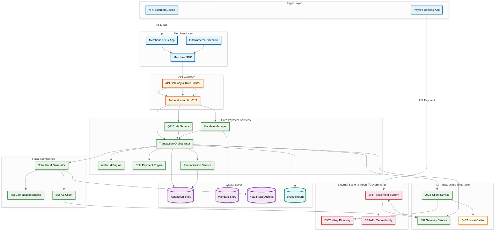
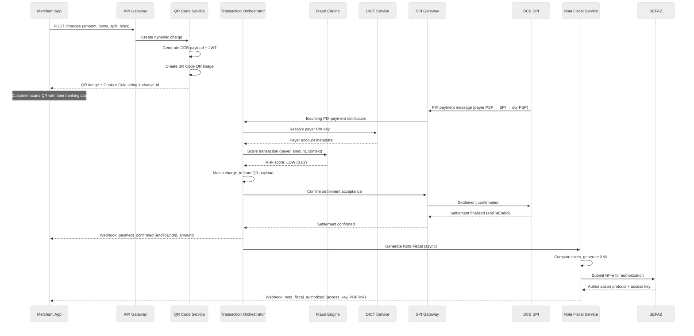
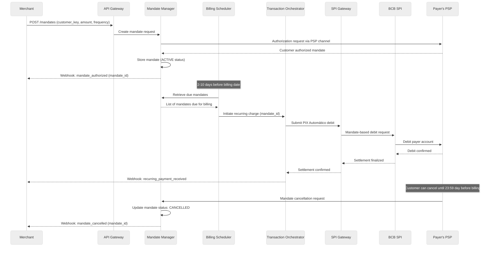
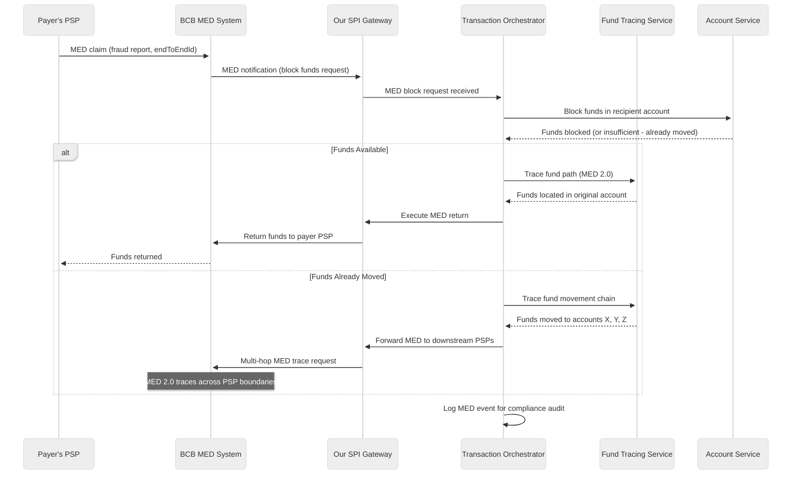

# High-Level Design — AI-Native PIX Commerce Platform

## System Context

The PIX Commerce Platform operates as a Payment Service Provider (PSP) within Brazil's Instant Payment ecosystem, connecting merchants to the BCB-operated SPI infrastructure. The platform sits between three external systems: (1) the SPI for real-time gross settlement of PIX transactions, (2) the DICT for PIX key-to-account resolution, and (3) SEFAZ state tax authority web services for Nota Fiscal authorization. Merchants interact via APIs and SDKs, while payers interact through their own PSP's banking app (the platform is on the receiving/payee side of the transaction).

---

## Architecture Overview

---

## Component Descriptions

### Merchant Layer

| Component | Responsibility |
|---|---|
| **Merchant POS / App** | Physical point-of-sale terminal or mobile app that generates payment requests; handles NFC reader for PIX por Aproximação; displays QR codes for customer scanning |
| **E-Commerce Checkout** | Web-based checkout flow that embeds PIX payment options (dynamic QR, Copia e Cola, PIX Automático enrollment) |
| **Merchant SDK** | Client library providing API abstraction, payload signing, webhook handling, and retry logic; available for major platforms |

### API Gateway

| Component | Responsibility |
|---|---|
| **API Gateway & Rate Limiter** | Routes merchant API calls, enforces rate limits (per-merchant and global), manages API versioning, and provides circuit breaking for downstream service protection |
| **Authentication & mTLS** | Mutual TLS for PSP-to-PSP communication; OAuth 2.0 + API key for merchant authentication; digital certificate management for SPI/DICT/SEFAZ communication |

### Core Payment Services

| Component | Responsibility |
|---|---|
| **QR Code Service** | Generates BR Code-compliant QR payloads (static and dynamic); hosts COB/COBV charge endpoints; manages QR expiration and single-use enforcement; embeds split rules and order metadata in payload |
| **Transaction Orchestrator** | Central coordinator for the PIX transaction lifecycle: receives payment initiation, triggers DICT lookup, invokes fraud scoring, submits to SPI, processes settlement confirmation, triggers Nota Fiscal generation, and publishes events; implements the saga pattern for distributed transaction management |
| **AI Fraud Engine** | Real-time fraud scoring (<200ms SLA): ingests device fingerprint, transaction context, DICT metadata, and behavioral signals; runs ensemble of ML models (gradient boosting for tabular features, graph neural network for transaction network analysis, sequence model for behavioral patterns); outputs risk score and recommended action (approve/decline/step-up authentication) |
| **Split Payment Engine** | Manages split rule configuration, validates split amounts sum to total, generates SPI split instructions, tracks per-participant settlement status, and handles split modification for partial refunds |
| **Mandate Manager** | PIX Automático lifecycle: processes customer authorization callbacks, registers mandates with billing parameters, schedules billing submissions (2-10 day advance window), handles cancellation requests (up to 23:59 day before billing), manages retry logic for failed debits, and tracks mandate health metrics |
| **Reconciliation Service** | Matches SPI settlement confirmations against transaction records using endToEndId; detects and flags discrepancies; generates settlement reports; triggers alerts for unreconciled transactions exceeding age thresholds |

### PIX Infrastructure Integration

| Component | Responsibility |
|---|---|
| **DICT Client Service** | Interfaces with BCB's DICT: key registration/portability/claim, key-to-account lookups, anti-fraud metadata retrieval (creation date, account holder info); manages the DICT synchronization protocol for local cache updates |
| **SPI Gateway Service** | Manages the SPI connection via RSFN: submits PIX payment messages (ISO 20022 format), receives settlement confirmations, handles SPI-initiated messages (incoming payments, MED requests); manages settlement account balance monitoring |
| **DICT Local Cache** | In-memory cache of DICT key mappings for fast lookups; updated via DICT's incremental sync protocol; handles cache invalidation for key portability events |

### Fiscal Compliance

| Component | Responsibility |
|---|---|
| **Nota Fiscal Generator** | Generates NF-e/NFS-e/NFC-e XML documents from transaction data; applies digital certificate signatures (A1/A3); manages document lifecycle (authorization, cancellation, correction letters) |
| **Tax Computation Engine** | Computes ICMS, ISS, PIS, COFINS, and other applicable taxes based on product NCM code, merchant tax regime (Simples Nacional, Lucro Presumido, Lucro Real), origin/destination states, and current tax tables; maintains a versioned tax rule database updated for legislative changes |
| **SEFAZ Client** | Communicates with state SEFAZ web services: NF-e authorization, status queries, event registration (cancellation, correction), and contingency mode (offline authorization when SEFAZ is unavailable) |

---

## Data Flows

### Flow 1: PIX QR Code Payment (Dynamic QR)

### Flow 2: PIX Automático Recurring Billing

### Flow 3: MED Fraud Return Flow

---

## Key Design Decisions

### Decision 1: RTGS Integration via Dedicated SPI Gateway

**Context:** The platform must interface with BCB's SPI for real-time settlement. Two approaches: (1) connect directly to SPI via RSFN, or (2) use an indirect participant model via a sponsor PSP.

**Decision:** Direct SPI connection for platforms with sufficient volume (>500K accounts mandate direct participation); indirect via sponsor PSP for smaller deployments.

**Rationale:** Direct connection provides lower latency (eliminates sponsor PSP hop), full control over settlement timing, and direct access to DICT. The trade-off is the operational overhead of maintaining RSFN connectivity, managing settlement account pre-funding, and meeting BCB's operational resilience requirements. For platforms processing millions of daily transactions, direct connectivity pays for itself through reduced per-transaction costs and lower latency.

### Decision 2: Local DICT Cache with Incremental Sync

**Context:** Every PIX transaction requires a DICT lookup to resolve the payee's PIX key to their account. At 5M+ daily transactions, querying DICT remotely for each creates latency and load.

**Decision:** Maintain a local DICT cache synchronized via BCB's incremental sync protocol, with fallback to direct DICT query for cache misses.

**Rationale:** Local cache provides single-digit millisecond lookups vs. 20-50ms for remote DICT queries. The cache covers ~800M keys (~50 GB), updated via incremental sync (500K changes/day). Cache miss rate is <0.1% because key registrations are write-infrequent relative to lookups. The trade-off is the operational cost of maintaining cache consistency, handled by the DICT sync protocol which provides guaranteed delivery of key changes with sequence numbering for gap detection.

### Decision 3: Asynchronous Nota Fiscal Generation

**Context:** Nota Fiscal generation involves SEFAZ API calls (2-8 second latency) and complex tax computation. Two approaches: (1) synchronous generation blocking payment confirmation, or (2) asynchronous generation after payment confirmation.

**Decision:** Asynchronous. Payment confirmation is sent to the merchant immediately upon SPI settlement. Nota Fiscal generation runs as an async workflow triggered by the settlement event.

**Rationale:** Blocking payment confirmation on SEFAZ availability would couple the payment SLO to the slowest, least reliable external dependency. SEFAZ has scheduled maintenance windows and occasional outages; the payment system must operate continuously. The trade-off is that the merchant receives the Nota Fiscal 2-10 seconds after payment confirmation rather than simultaneously. This is acceptable because Brazilian regulations require the Nota Fiscal to be generated "at the time of the commercial operation" but do not mandate sub-second coupling to payment settlement. Contingency mode (offline NF-e authorization) handles SEFAZ unavailability.

### Decision 4: Event-Driven Architecture with CQRS

**Context:** The system must support real-time transaction processing, async reconciliation, compliance reporting, and merchant analytics from the same transaction data.

**Decision:** CQRS with event sourcing: transaction state changes are written as immutable events; separate read models are materialized for reconciliation, merchant dashboards, compliance reporting, and fraud analytics.

**Rationale:** PIX transactions have strict correctness requirements (exactly-once settlement) but diverse read patterns (merchant wants real-time balance, compliance needs transaction history, fraud engine needs behavioral patterns). Event sourcing provides a complete audit trail (BCB compliance requirement), enables replay for reconciliation discrepancy investigation, and allows independent scaling of read and write paths. The write path (transaction processing) is optimized for latency; read paths (dashboards, reports) are optimized for query flexibility.

### Decision 5: Pre-Transaction Fraud Scoring (Not Post-Transaction)

**Context:** PIX settlement is irrevocable. Unlike card payments where fraud can be addressed via chargebacks, PIX fraud must be prevented before settlement.

**Decision:** Mandatory fraud scoring in the transaction critical path, with a strict 200ms latency budget and graceful fallback to rule-based scoring if ML models timeout.

**Rationale:** The irrevocability of PIX makes post-transaction fraud detection worthless for loss prevention—it can only inform future detection. The 200ms budget is derived from the end-to-end 10-second PIX SLO minus the time for other operations (DICT lookup, SPI messaging, payer authentication). The fallback to rule-based scoring ensures that fraud engine latency spikes don't block all transactions, accepting slightly higher false positive rates during degraded operation. The trade-off is increased transaction latency (adding 50-200ms to every transaction) for dramatically reduced fraud loss.
