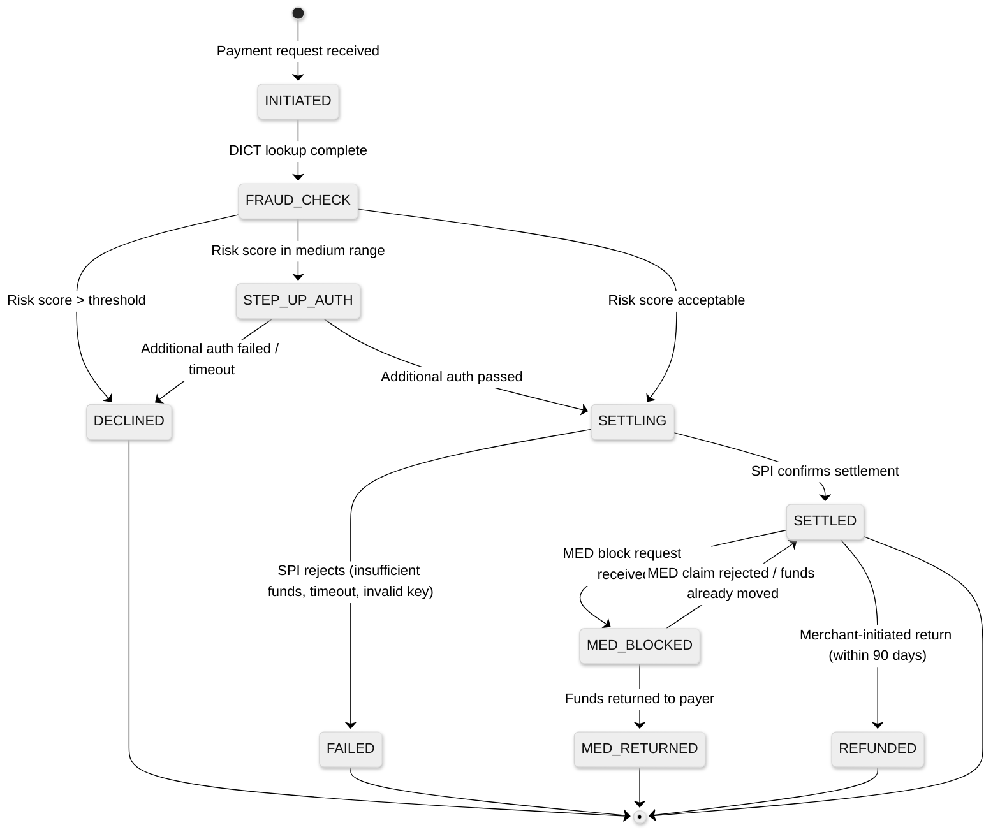
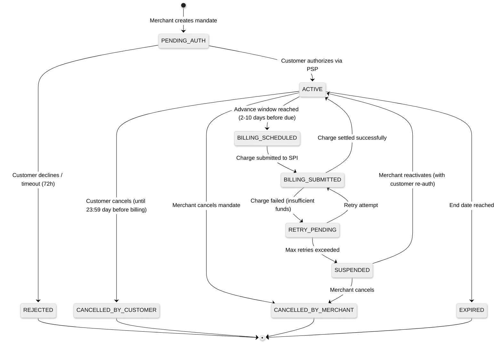
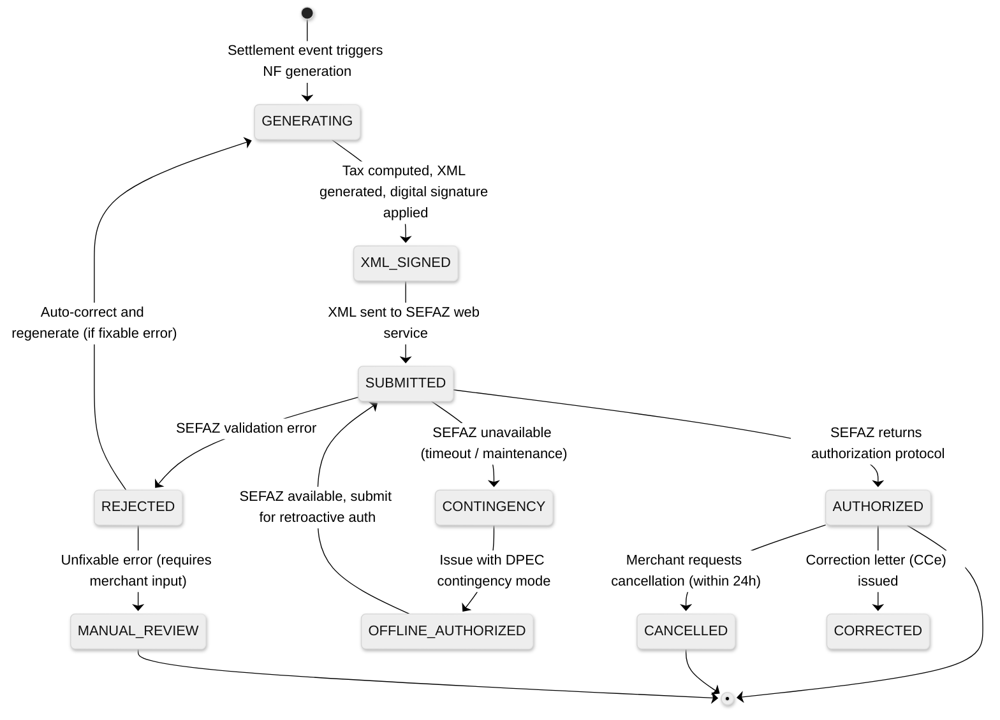

# Low-Level Design — AI-Native PIX Commerce Platform

## Core Data Models

### PIXKey

```
PIXKey {
    key_id:           UUID                    // Internal identifier
    key_type:         Enum[CPF, CNPJ, PHONE, EMAIL, EVP]  // PIX key type
    key_value:        String                  // The actual key (masked for PII compliance)
    key_hash:         String                  // SHA-256 hash for fast lookup
    account_id:       UUID                    // Internal merchant account reference
    ispb:             String                  // 8-digit PSP identifier in DICT
    branch:           String                  // Bank branch number
    account_number:   String                  // Account number at the PSP
    account_type:     Enum[CHECKING, SAVINGS, PAYMENT]
    holder_name:      String                  // Account holder name (from DICT)
    holder_doc_type:  Enum[CPF, CNPJ]        // Individual or business
    dict_status:      Enum[REGISTERED, PORTABILITY_PENDING, CLAIM_PENDING, DELETED]
    registration_date: Timestamp
    last_dict_sync:   Timestamp
    anti_fraud_flags: Integer                 // Bitfield from DICT anti-fraud metadata
    created_at:       Timestamp
    updated_at:       Timestamp
}
```

### Transaction

```
Transaction {
    transaction_id:     UUID                  // Internal transaction identifier
    end_to_end_id:      String                // SPI-assigned unique ID (E2EID format: E{ISPB}{DATE}{SEQUENCE})
    txn_id:             String                // Transaction ID from QR payload
    charge_id:          UUID                  // Reference to QR charge (if dynamic QR)
    mandate_id:         UUID                  // Reference to mandate (if PIX Automático)

    // Parties
    payer_key:          String                // Payer's PIX key (hashed)
    payer_ispb:         String                // Payer's PSP ISPB
    payer_name:         String                // Payer name (from DICT)
    payee_key:          String                // Merchant's PIX key
    payee_account_id:   UUID                  // Internal merchant account

    // Amount
    amount_cents:       BigInteger            // Transaction amount in centavos (BRL × 100)
    currency:           String                // "BRL" (always)

    // Initiation
    initiation_type:    Enum[STATIC_QR, DYNAMIC_QR, COPIA_COLA, NFC, AUTOMATICO, KEY_ENTRY]
    initiation_time:    Timestamp             // When the payment was initiated
    settlement_time:    Timestamp             // When SPI confirmed settlement

    // Fraud
    fraud_score:        Float                 // 0.0 to 1.0 risk score
    fraud_decision:     Enum[APPROVED, DECLINED, STEP_UP]
    fraud_model_version: String               // Model version for audit trail

    // Status
    status:             Enum[INITIATED, FRAUD_CHECK, SETTLING, SETTLED, FAILED, MED_BLOCKED, MED_RETURNED]
    failure_reason:     String                // Null unless FAILED

    // Split
    has_split:          Boolean
    split_rule_id:      UUID                  // Reference to split configuration

    // Fiscal
    nota_fiscal_id:     UUID                  // Reference to generated NF
    nota_fiscal_status: Enum[PENDING, AUTHORIZED, REJECTED, CANCELLED]

    // Metadata
    merchant_order_id:  String                // Merchant's own order reference
    description:        String                // Transaction description (max 140 chars per BCB)
    metadata:           Map<String, String>   // Merchant-defined key-value pairs
    created_at:         Timestamp
    updated_at:         Timestamp
}
```

### Mandate (PIX Automático)

```
Mandate {
    mandate_id:         UUID
    merchant_account_id: UUID                 // Merchant who receives payments
    customer_key:       String                // Customer's PIX key (hashed)
    customer_ispb:      String                // Customer's PSP

    // Billing Parameters
    amount_cents:       BigInteger            // Fixed billing amount
    amount_type:        Enum[FIXED, VARIABLE_UP_TO_MAX]
    max_amount_cents:   BigInteger            // Maximum for variable amounts
    frequency:          Enum[WEEKLY, BIWEEKLY, MONTHLY, QUARTERLY, ANNUAL]
    billing_day:        Integer               // Day of period (1-28 for monthly)
    start_date:         Date                  // First billing date
    end_date:           Date                  // Optional end date (null = indefinite)

    // Scheduling
    next_billing_date:  Date                  // Next scheduled billing
    advance_days:       Integer               // Days before billing to submit (2-10, BCB rule)
    submission_date:    Date                  // Calculated: billing_date - advance_days

    // Status
    status:             Enum[PENDING_AUTH, ACTIVE, SUSPENDED, CANCELLED, EXPIRED]
    cancellation_source: Enum[MERCHANT, CUSTOMER, SYSTEM]
    cancellation_date:  Timestamp

    // Billing History
    total_charges:      Integer               // Count of successful charges
    total_amount:       BigInteger            // Sum of all charges (centavos)
    last_charge_date:   Date
    last_charge_status: Enum[SUCCESS, FAILED, PENDING]
    consecutive_failures: Integer             // For retry/suspension logic

    // AI Predictions
    churn_risk_score:   Float                 // 0.0-1.0 probability of cancellation
    predicted_ltv:      BigInteger            // Predicted lifetime value

    created_at:         Timestamp
    updated_at:         Timestamp
}
```

### NotaFiscal

```
NotaFiscal {
    nota_fiscal_id:     UUID
    transaction_id:     UUID                  // Linked PIX transaction
    merchant_account_id: UUID

    // Document Type
    doc_type:           Enum[NFE, NFSE, NFCE] // Goods, Services, Consumer retail
    series:             Integer               // NF series number
    number:             Integer               // Sequential NF number
    access_key:         String                // 44-digit SEFAZ access key

    // Tax Details
    tax_regime:         Enum[SIMPLES_NACIONAL, LUCRO_PRESUMIDO, LUCRO_REAL]
    total_amount:       BigInteger            // Total in centavos
    tax_breakdown: {
        icms_base:      BigInteger
        icms_rate:      Float                 // State-dependent (7-25%)
        icms_amount:    BigInteger
        pis_rate:       Float                 // 0.65% or 1.65%
        pis_amount:     BigInteger
        cofins_rate:    Float                 // 3% or 7.6%
        cofins_amount:  BigInteger
        iss_rate:       Float                 // 2-5% (services only)
        iss_amount:     BigInteger
        total_tax:      BigInteger
    }

    // SEFAZ Integration
    xml_content:        Text                  // Signed XML document
    xml_hash:           String                // SHA-256 of submitted XML
    sefaz_status:       Enum[PENDING, AUTHORIZED, REJECTED, CANCELLED, CONTINGENCY]
    sefaz_protocol:     String                // Authorization protocol number
    sefaz_response_time: Integer              // Response time in ms
    rejection_reason:   String                // SEFAZ rejection code + message

    // Lifecycle
    cancellation_protocol: String             // If cancelled
    correction_letters: List<CorrectionLetter> // CCe documents

    created_at:         Timestamp
    authorized_at:      Timestamp
    retained_until:     Date                  // 5-year legal retention
}
```

### SplitRule

```
SplitRule {
    split_rule_id:      UUID
    merchant_account_id: UUID                 // Marketplace/platform account
    name:               String                // Human-readable rule name

    participants: List<SplitParticipant> {
        participant_id:  UUID
        pix_key:        String               // Recipient's PIX key
        split_type:     Enum[PERCENTAGE, FIXED_AMOUNT]
        value:          BigInteger            // Percentage basis points or fixed centavos
        description:    String               // "Platform commission", "Seller payout", etc.
    }

    // Validation
    total_percentage:   Integer               // Must equal 10000 (100.00%)
    is_valid:           Boolean               // Pre-validated for fast transaction processing

    // Tax Optimization
    withholding_applicable: Boolean           // Whether IR withholding applies
    withholding_rate:   Float                 // IR rate for the split category

    created_at:         Timestamp
    updated_at:         Timestamp
}
```

---

## API Design

### PIX Charge API (QR Code Generation)

```
POST /v1/charges
Request {
    amount_cents:       BigInteger            // Required for dynamic QR; omit for open-amount
    description:        String                // Max 140 chars (BCB limit)
    expiration_seconds: Integer               // QR validity period (default: 3600)
    merchant_order_id:  String                // Merchant's order reference
    payee_key:          String                // Merchant's PIX key to receive payment
    split_rule_id:      UUID                  // Optional: split payment configuration
    items: List<LineItem> {                   // Optional: for Nota Fiscal generation
        description:    String
        quantity:       Integer
        unit_price:     BigInteger
        ncm_code:       String               // Product tax classification
    }
    metadata:           Map<String, String>   // Custom merchant data
}

Response {
    charge_id:          UUID
    status:             "ACTIVE"
    qr_code_base64:     String               // PNG image, base64 encoded
    qr_code_text:       String               // BR Code payload (Copia e Cola)
    charge_url:         String               // Dynamic charge endpoint URL
    expires_at:         Timestamp
    created_at:         Timestamp
}
```

### PIX Automático Mandate API

```
POST /v1/mandates
Request {
    customer_key:       String                // Customer's PIX key
    amount_cents:       BigInteger            // Billing amount
    amount_type:        Enum[FIXED, VARIABLE]
    max_amount_cents:   BigInteger            // Required if VARIABLE
    frequency:          Enum[WEEKLY, BIWEEKLY, MONTHLY, QUARTERLY, ANNUAL]
    billing_day:        Integer               // 1-28
    start_date:         Date                  // First billing date
    end_date:           Date                  // Optional
    description:        String                // Shown to customer during authorization
    advance_days:       Integer               // 2-10 (BCB regulatory range)
}

Response {
    mandate_id:         UUID
    status:             "PENDING_AUTH"
    authorization_url:  String               // Deep-link to customer's PSP for authorization
    created_at:         Timestamp
}
```

```
DELETE /v1/mandates/{mandate_id}
Response {
    mandate_id:         UUID
    status:             "CANCELLED"
    cancellation_source: "MERCHANT"
    cancelled_at:       Timestamp
}
```

### DICT Key Management API

```
POST /v1/keys
Request {
    key_type:           Enum[CPF, CNPJ, PHONE, EMAIL, EVP]
    key_value:          String                // Omit for EVP (auto-generated)
    account_id:         UUID                  // Internal merchant account
}

Response {
    key_id:             UUID
    key_type:           String
    key_value:          String                // EVP: randomly generated 32-char UUID
    dict_status:        "REGISTERED"
    created_at:         Timestamp
}
```

```
GET /v1/keys/{key_value}/resolve
Response {
    key_type:           String
    holder_name:        String                // Masked: "J*** S****"
    holder_doc_type:    Enum[CPF, CNPJ]
    ispb:               String
    account_type:       String
    creation_date:      Timestamp             // Key registration date (anti-fraud signal)
}
```

### Settlement & Reconciliation API

```
GET /v1/settlements?date={YYYY-MM-DD}&status={status}
Response {
    settlements: List<Settlement> {
        end_to_end_id:  String
        transaction_id: UUID
        amount_cents:   BigInteger
        settlement_time: Timestamp
        reconciled:     Boolean
        merchant_order_id: String
        split_details: List<SplitSettlement> {
            participant_id: UUID
            amount_cents:   BigInteger
            settled:        Boolean
        }
    }
    summary: {
        total_settled:  BigInteger
        total_count:    Integer
        reconciled_pct: Float
    }
}
```

### Webhook Events

```
POST {merchant_webhook_url}
Headers: {
    X-Webhook-Signature: HMAC-SHA256(payload, merchant_secret)
    X-Event-Type:       String
    X-Idempotency-Key:  String               // For deduplication
}

Event Types:
    charge.paid         // PIX payment received for a charge
    charge.expired      // Dynamic QR expired without payment
    mandate.authorized  // Customer authorized PIX Automático mandate
    mandate.cancelled   // Mandate cancelled (by customer or merchant)
    mandate.charged     // Recurring charge successfully settled
    mandate.charge_failed // Recurring charge failed
    nota_fiscal.authorized // Nota Fiscal authorized by SEFAZ
    nota_fiscal.rejected   // Nota Fiscal rejected by SEFAZ
    med.block_requested    // MED fraud block request received
    med.funds_returned     // MED return completed
```

---

## Key Algorithms

### Algorithm 1: Pre-Transaction Fraud Scoring

```
FUNCTION score_transaction(txn_context):
    // Phase 1: Feature extraction (<20ms)
    device_features = extract_device_fingerprint(txn_context.device)
    behavioral_features = extract_behavioral_signals(txn_context.interaction_pattern)
    dict_features = lookup_dict_metadata(txn_context.payer_key)
        // Key age, account creation date, recent portability events
    velocity_features = compute_velocity(txn_context.payer_key, windows=[1h, 24h, 7d])
        // Transaction count, total amount, unique payees in each window
    graph_features = query_transaction_graph(txn_context.payer_key, txn_context.payee_key)
        // Shortest path, common neighbors, cluster membership

    feature_vector = concatenate(device_features, behavioral_features,
                                dict_features, velocity_features, graph_features)

    // Phase 2: Model ensemble (<100ms)
    tabular_score = gradient_boost_model.predict(feature_vector)
    graph_score = graph_neural_network.predict(graph_features)
    sequence_score = lstm_model.predict(txn_context.payer_history[-50:])

    // Weighted ensemble (weights from online calibration)
    risk_score = 0.45 * tabular_score + 0.30 * graph_score + 0.25 * sequence_score

    // Phase 3: Decision (<10ms)
    IF risk_score > HIGH_RISK_THRESHOLD (0.85):
        RETURN {score: risk_score, decision: DECLINED, reason: "high_risk"}
    ELSE IF risk_score > MEDIUM_RISK_THRESHOLD (0.55):
        RETURN {score: risk_score, decision: STEP_UP, reason: "elevated_risk"}
    ELSE:
        RETURN {score: risk_score, decision: APPROVED}

    // Phase 4: Async logging (non-blocking)
    ASYNC log_fraud_decision(txn_context, feature_vector, risk_score, decision)
```

### Algorithm 2: Dynamic Pricing QR Generation

```
FUNCTION generate_dynamic_qr(merchant, items, context):
    base_amount = SUM(item.price * item.quantity FOR item IN items)

    // AI pricing adjustments
    demand_factor = demand_model.predict(
        merchant.location, current_time, day_of_week, items.categories)
    // demand_factor: 0.9 (low demand discount) to 1.15 (high demand premium)

    loyalty_discount = loyalty_engine.compute_discount(
        context.payer_key, merchant.loyalty_program)

    surge_factor = IF merchant.surge_pricing_enabled:
        compute_surge(merchant.recent_txn_rate, merchant.avg_txn_rate)
    ELSE: 1.0

    final_amount = ROUND(base_amount * demand_factor * surge_factor - loyalty_discount)

    // Generate BR Code payload (EMVCo MPM format)
    payload = BRCode {
        payload_format:     "01"              // EMVCo version
        merchant_account:   {
            gui:            "br.gov.bcb.pix"
            key:            merchant.pix_key
            url:            generate_charge_url(charge_id)  // For dynamic QR
        }
        merchant_category:  merchant.mcc_code
        transaction_currency: "986"           // BRL
        transaction_amount: format_amount(final_amount)
        merchant_name:      merchant.legal_name[:25]
        merchant_city:      merchant.city[:15]
        additional_data:    { txn_id: generate_txn_id() }
    }

    // Compute CRC-16/CCITT-FALSE checksum
    payload.crc = crc16_ccitt(payload.serialize())

    qr_image = render_qr(payload.serialize())
    RETURN {qr_image, payload_text: payload.serialize(), charge_id, final_amount}
```

### Algorithm 3: Split Settlement Computation

```
FUNCTION compute_split_settlement(transaction, split_rule):
    total = transaction.amount_cents
    settlements = []
    allocated = 0

    // Sort participants: fixed amounts first, then percentages
    fixed_participants = filter(split_rule.participants, type == FIXED_AMOUNT)
    pct_participants = filter(split_rule.participants, type == PERCENTAGE)

    // Allocate fixed amounts
    FOR participant IN fixed_participants:
        amount = participant.value
        IF allocated + amount > total:
            RAISE InsufficientFundsForSplit
        settlements.append({participant.pix_key, amount})
        allocated += amount

    // Allocate percentages from remainder
    remainder = total - allocated
    pct_allocated = 0
    FOR i, participant IN enumerate(pct_participants):
        IF i == len(pct_participants) - 1:
            // Last participant gets remainder to avoid rounding errors
            amount = remainder - pct_allocated
        ELSE:
            amount = FLOOR(remainder * participant.value / 10000)
        settlements.append({participant.pix_key, amount})
        pct_allocated += amount

    // Compute withholding tax if applicable
    FOR settlement IN settlements:
        IF split_rule.withholding_applicable:
            withholding = compute_ir_withholding(settlement.amount, participant.doc_type)
            settlement.net_amount = settlement.amount - withholding
            settlement.withholding_amount = withholding

    RETURN settlements
```

---

## State Machines

### PIX Transaction Lifecycle



**State Transition Rules:**

| From | To | Trigger | Side Effects |
|---|---|---|---|
| INITIATED | FRAUD_CHECK | DICT lookup returns account metadata | Feature extraction begins; velocity counters updated |
| FRAUD_CHECK | SETTLING | Fraud score < threshold | SPI payment message submitted; settlement account debited |
| FRAUD_CHECK | DECLINED | Fraud score > threshold | Decline event published; merchant notified; payer's PSP informed |
| SETTLING | SETTLED | SPI confirmation received | endToEndId stored; reconciliation event published; Nota Fiscal generation triggered; merchant webhook fired |
| SETTLED | MED_BLOCKED | BCB MED notification | Funds blocked in merchant account; compliance team alerted |
| MED_BLOCKED | MED_RETURNED | Funds available and return executed | Return transaction created; merchant account debited; audit log updated |

### Mandate Lifecycle (PIX Automático)



### Nota Fiscal Lifecycle


