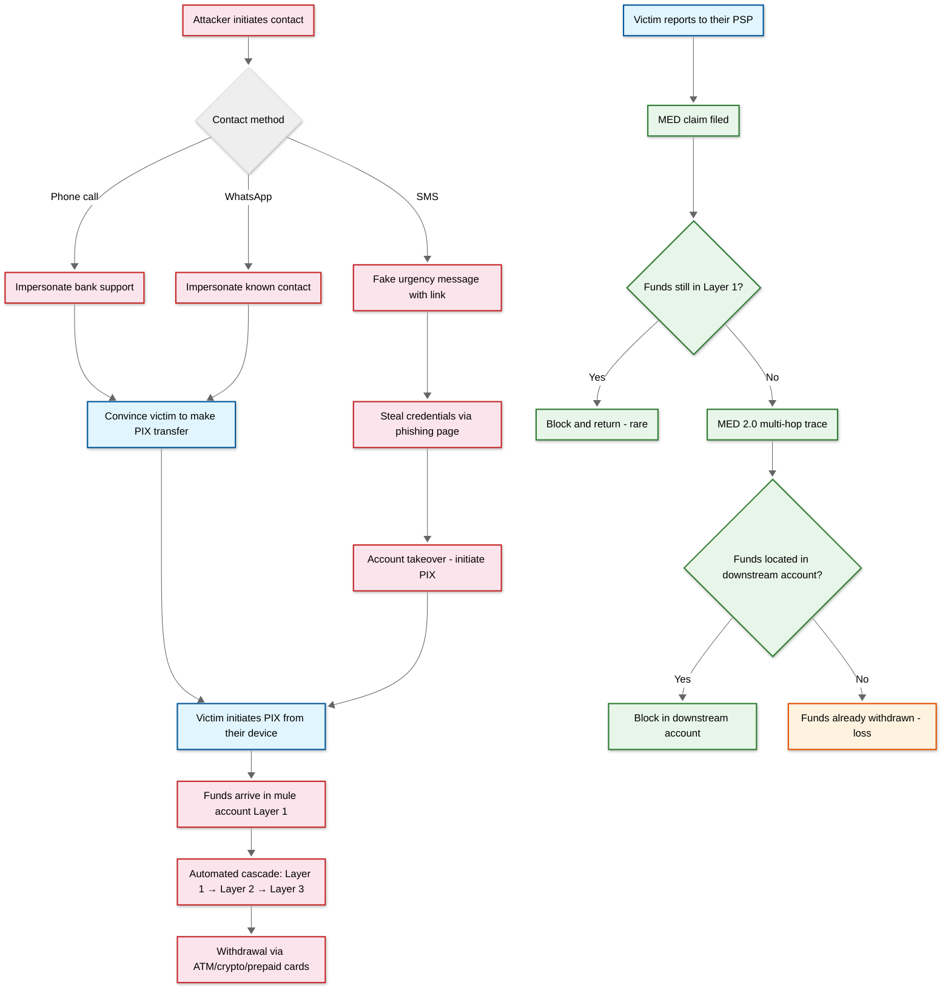
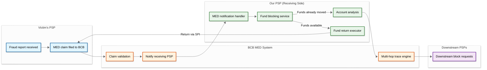

# Security & Compliance — AI-Native PIX Commerce Platform

## Threat Model

### PIX-Specific Threat Landscape

The PIX ecosystem's unique characteristics—instant irrevocable settlement, broad population adoption (178M+ users including financially unsophisticated populations), QR-code-based initiation, and zero-cost transfers—create a distinct threat landscape:

| Threat | Vector | Impact | Likelihood |
|---|---|---|---|
| **Social engineering (Golpe do PIX)** | Phone call, messaging, social media impersonation tricking victim into making a "legitimate" PIX transfer | Irrevocable fund loss; MED recovery rate <10% for moved funds | Very High — #1 PIX fraud vector in Brazil |
| **QR code substitution** | Physical: overlay fraudster's QR on merchant's printed QR. Digital: MITM replacing QR payload in e-commerce checkout | Funds directed to fraudster's account instead of merchant | High at small merchants with printed static QR |
| **Account takeover (ATO)** | SIM swap, credential phishing, malware on mobile device gaining access to banking app | Unauthorized PIX transfers from victim's account | High — exacerbated by mobile-first banking |
| **Mule account networks** | Organized networks of accounts opened solely to receive and quickly forward fraudulent funds, making MED tracing difficult | Laundering of fraud proceeds; obstruction of MED recovery | High — industrialized in Brazilian fraud ecosystem |
| **Insider threats at PSP** | Employees with access to transaction data, DICT queries, or settlement accounts | Data exfiltration, unauthorized transfers, manipulation of fraud scores | Medium |
| **DICT data harvesting** | Excessive DICT lookups to map PIX keys to personal information (name, CPF/CNPJ, bank) | Privacy violation; enables targeted social engineering | Medium — rate-limited by BCB but exploitable over time |
| **Dynamic QR payload tampering** | MITM attack on the charge endpoint URL embedded in dynamic QR, modifying amount or recipient | Altered payment amount or misdirected funds | Low — endpoint uses TLS + JWT signing |
| **PIX Automático mandate fraud** | Creating mandates using stolen customer PIX keys and forging authorization responses | Unauthorized recurring debits from victim accounts | Low — authorization requires customer's PSP app confirmation |

### Attack Trees

#### Social Engineering Attack Flow



---

## BCB Regulatory Compliance

### Regulatory Framework

| Regulation | Scope | Key Requirements |
|---|---|---|
| **BCB Resolution 1/2020** | PIX operational rules | PSP responsibilities, SPI connectivity, DICT participation, transaction processing SLAs |
| **BCB Resolution 493/2025** | MED enhancement | Multi-hop fund tracing, mandatory self-service dispute channels, 11-day resolution window |
| **BCB Resolution 541/2025** | PIX por Aproximação | NFC payment rules, R$500 limit, mandatory testing-in-production phase, April 2026 general availability |
| **BCB Circular 3978/2020** | AML/KYC | Know-your-customer procedures, suspicious transaction reporting, PEP screening |
| **LGPD (Lei 13.709/2018)** | Data protection | Brazilian GDPR equivalent; consent, purpose limitation, data subject rights |
| **BCB Resolution on PIX Automático** | Recurring payments | Mandate authorization flow, 2-10 day advance billing, customer cancellation rights |

### Compliance Implementation

#### Transaction Processing SLAs

BCB mandates specific SLAs for PSPs processing PIX:

| SLA | Requirement | Our Target | Implementation |
|---|---|---|---|
| **Payment processing** | Accept/reject within 10 seconds | 3 seconds avg | Fraud scoring optimized for <200ms; SPI messaging <1s |
| **DICT query response** | < 5 seconds | < 50ms (cached) | Local DICT cache with incremental sync |
| **MED fund blocking** | Within 30 minutes of notification | < 5 minutes | Automated MED handler with account blocking service |
| **Uptime** | 99.9% monthly | 99.99% | Multi-AZ deployment, dual SPI connectivity |
| **Dispute channel** | Self-service in-app by Oct 2025 | Launched Sept 2025 | In-app MED claim submission for merchants |

#### Mandatory Reporting

| Report | Frequency | Content | Destination |
|---|---|---|---|
| **Transaction statistics** | Daily | Volume, value, failure rates by initiation type | BCB automated feed |
| **Fraud reports** | Real-time + monthly | Suspicious transaction reports (STRs), MED statistics | BCB + COAF (financial intelligence unit) |
| **Operational metrics** | Monthly | Availability, latency percentiles, incident reports | BCB supervision |
| **AML reports** | As-needed + monthly | CTRs for transactions >R$50K, suspicious patterns | COAF |

---

## MED (Mecanismo Especial de Devolução) Implementation

### MED 2.0 Architecture

MED 2.0 (mandatory from February 2026) enhances the original MED with multi-hop fund tracing:



### MED Processing Logic

```
FUNCTION handle_med_notification(med_request):
    // Step 1: Validate MED claim
    txn = lookup_transaction(med_request.end_to_end_id)
    IF txn IS NULL:
        RETURN med_response(status: NOT_FOUND)

    // Step 2: Attempt fund blocking
    recipient_account = txn.payee_account_id
    available_balance = get_available_balance(recipient_account)
    block_amount = MIN(med_request.amount, available_balance)

    IF block_amount > 0:
        create_fund_block(recipient_account, block_amount, med_request.claim_id)
        log_med_event(FUNDS_BLOCKED, block_amount)

    // Step 3: Trace fund movement (MED 2.0)
    IF block_amount < med_request.amount:
        // Funds have been moved — trace the path
        outgoing_txns = find_outgoing_transactions(
            recipient_account,
            after: txn.settlement_time,
            amount_range: [med_request.amount * 0.5, med_request.amount * 1.5]
        )

        trace_results = []
        FOR out_txn IN outgoing_txns:
            trace_results.append({
                destination_ispb: out_txn.payee_ispb,
                amount: out_txn.amount,
                end_to_end_id: out_txn.end_to_end_id,
                timestamp: out_txn.settlement_time
            })

        // Report trace to BCB for downstream blocking
        report_fund_trace(med_request.claim_id, trace_results)

    // Step 4: Execute return (if funds blocked)
    IF block_amount > 0:
        schedule_med_return(
            from_account: recipient_account,
            to_ispb: med_request.payer_ispb,
            amount: block_amount,
            deadline: med_request.return_deadline  // 11 days from claim
        )

    RETURN med_response(
        status: PROCESSED,
        blocked_amount: block_amount,
        trace_count: len(trace_results)
    )
```

### MED Compliance Metrics

| Metric | BCB Requirement | Our Target |
|---|---|---|
| **Time to block funds** | Within business hours of notification | < 5 minutes (automated) |
| **Fund trace response** | Within 11 days | < 24 hours |
| **Return execution** | Within 11 days of claim | < 48 hours (if funds available) |
| **Self-service dispute channel** | Mandatory from Oct 2025 | In-app + API for merchants |
| **MED statistics reporting** | Monthly | Automated via BCB feed |

---

## LGPD (Lei Geral de Proteção de Dados) Compliance

### Data Classification

| Data Category | LGPD Classification | Protection Level |
|---|---|---|
| **PIX keys (CPF, phone, email)** | Personal data (dados pessoais) | Encrypted at rest and in transit; access logged; retention minimized |
| **CNPJ/business data** | Non-personal (legal entity) | Standard encryption; public registry data |
| **Transaction amounts/timestamps** | Personal data (financial) | Encrypted; access restricted to operational need |
| **Fraud scoring features** | Sensitive profiling data | Purpose-limited; not shared externally; deletion on request |
| **Biometric data (device)** | Sensitive personal data | Processed only for fraud detection; never stored raw; hashed representations only |
| **DICT metadata** | Shared personal data (BCB controller) | BCB dictates processing purposes; our processing limited to transaction execution |

### Data Subject Rights Implementation

| Right | Implementation |
|---|---|
| **Access** | API endpoint returns all data associated with a PIX key/CPF within 15 days |
| **Correction** | Merchant data correctable via API; payer data corrections routed to their PSP |
| **Deletion** | Transaction data has legal retention requirements (5-10 years); deletion applies after retention period; fraud scoring features deleted within 30 days of request |
| **Portability** | Transaction history exportable in structured format (JSON/CSV) |
| **Objection to profiling** | Customer can opt out of AI fraud scoring; falls back to rule-based scoring (may increase friction) |

### Consent Management

- PIX transaction processing: legitimate interest basis (legal obligation to process payments)
- Fraud scoring: legitimate interest basis (preventing financial crime)
- Marketing/analytics: explicit consent required; separate from payment processing
- Data sharing with BCB/COAF: legal obligation basis (regulatory reporting)

---

## Anti-Fraud Mechanisms

### Layered Defense

```
Layer 1: Prevention (before transaction initiation)
    ├── Merchant onboarding KYC/KYB (prevent mule merchants)
    ├── PIX key validation (check DICT anti-fraud flags)
    ├── Device binding (merchant terminal fingerprinting)
    └── QR code integrity (signed dynamic QR, tamper-evident static QR)

Layer 2: Detection (during transaction processing, <200ms)
    ├── AI fraud scoring (ensemble model)
    ├── Velocity checks (amount/frequency anomalies)
    ├── Graph analysis (mule network detection)
    ├── Behavioral biometrics (interaction pattern matching)
    └── Cross-reference with known fraud indicators

Layer 3: Response (post-detection)
    ├── Transaction decline (high-risk score)
    ├── Step-up authentication (medium-risk score)
    ├── Account suspension (pattern of fraud indicators)
    ├── MED processing (fund blocking and return)
    └── Law enforcement referral (organized fraud networks)

Layer 4: Recovery (post-fraud)
    ├── MED 2.0 multi-hop fund tracing
    ├── Account freezing across mule network
    ├── Insurance/liability management
    └── Victim support and dispute resolution
```

### QR Code Security

| Threat | Mitigation |
|---|---|
| **Physical QR overlay** | Dynamic QR (expires after single use or time limit); merchant education on QR placement security; periodic QR refresh for static merchants |
| **Digital QR MITM** | Charge endpoint served over TLS; payload signed with PSP's private key; JWT verification by payer's PSP |
| **QR replay attack** | Dynamic QR includes nonce and expiration; idempotency check prevents double settlement |
| **Amount manipulation** | Dynamic QR locks amount in server-side charge; payer's PSP validates amount against charge endpoint response |

### Mule Account Detection

```
FUNCTION detect_mule_patterns(account):
    signals = []

    // Signal 1: Fan-in pattern (many unique payers, quick withdrawal)
    unique_payers_7d = count_unique_payers(account, window=7_DAYS)
    IF unique_payers_7d > 50 AND account.age < 90_DAYS:
        signals.append(("fan_in_new_account", 0.8))

    // Signal 2: Pass-through pattern (receive and forward rapidly)
    avg_hold_time = average_fund_hold_time(account, window=7_DAYS)
    IF avg_hold_time < 30_MINUTES:
        signals.append(("rapid_pass_through", 0.7))

    // Signal 3: Round-amount transfers
    round_pct = percentage_round_amounts(account, window=7_DAYS)
    IF round_pct > 80%:
        signals.append(("round_amount_pattern", 0.5))

    // Signal 4: Network clustering
    cluster = transaction_graph.find_cluster(account)
    IF cluster.has_known_mule_accounts:
        signals.append(("mule_network_proximity", 0.9))

    // Signal 5: Account characteristics from DICT
    dict_data = lookup_dict_metadata(account.pix_key)
    IF dict_data.key_type == EVP AND dict_data.key_age < 30_DAYS:
        signals.append(("fresh_evp_key", 0.4))

    mule_score = weighted_combination(signals)
    IF mule_score > 0.75:
        flag_account_for_review(account, signals)
        restrict_outgoing_transfers(account)  // Prevent fund cascade

    RETURN mule_score
```

---

## Cryptographic Architecture

### Certificate Management

| Certificate | Purpose | Standard | Rotation |
|---|---|---|---|
| **SPI message signing** | Sign/verify PIX messages on RSFN | ICP-Brasil e-CNPJ A1 | Annual renewal |
| **DICT API authentication** | mTLS for DICT access | ICP-Brasil SSL | Annual renewal |
| **Nota Fiscal XML signing** | Digitally sign NF-e XML documents | ICP-Brasil e-CNPJ A1 | Annual renewal |
| **Merchant API TLS** | Encrypt merchant API traffic | Public CA TLS 1.3 | 90-day auto-renewal |
| **Webhook HMAC** | Authenticate webhook deliveries to merchants | HMAC-SHA256 with per-merchant secret | Merchant-initiated rotation |

### Encryption at Rest

| Data | Encryption | Key Management |
|---|---|---|
| **Transaction records** | AES-256-GCM | KMS-managed keys with automatic rotation |
| **PIX keys (PII)** | AES-256-GCM with additional field-level encryption | Separate key hierarchy for PII |
| **Nota Fiscal XML** | AES-256-GCM | Tax document keys (separate from transaction keys) |
| **Fraud scoring features** | AES-256-GCM | ML pipeline keys (restricted access) |
| **Backup/archive** | AES-256-GCM | Offline master keys in HSM |

### Network Security

- **RSFN segment:** Dedicated private network for BCB communication; no internet exposure; hardware-isolated network interface
- **Merchant API segment:** TLS 1.3 only; mutual TLS available for high-security merchants; WAF with PIX-specific rules
- **Internal service mesh:** mTLS between all microservices; network policies restrict service-to-service communication to declared dependencies
- **Database segment:** No direct internet access; accessible only from application layer via private endpoints
